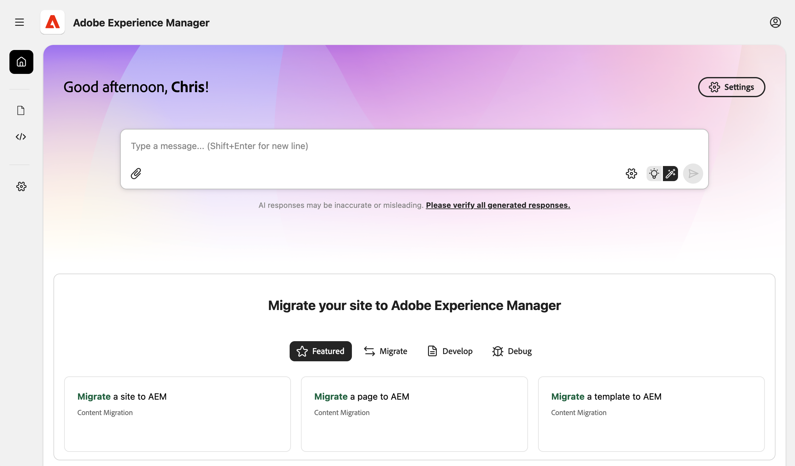
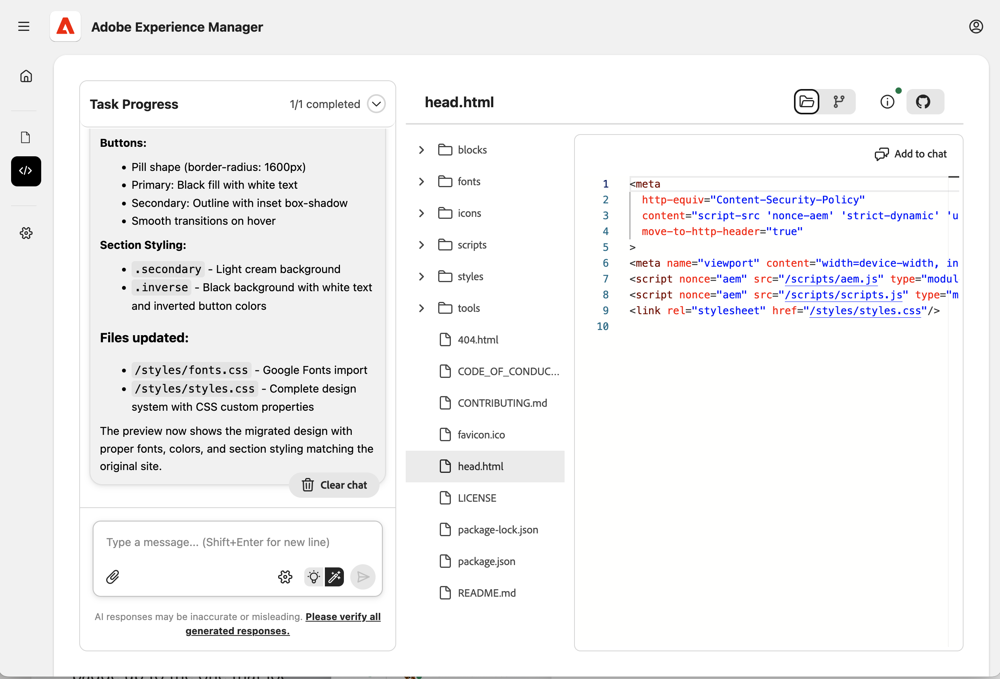

# Console di modernizzazione esperienza {#console-reference}

Guida di riferimento per l’interfaccia e le funzionalità della Console di modernizzazione esperienza

>[!NOTE]
>
>Se ti interessa utilizzare la console di modernizzazione esperienza, puoi richiedere l’accesso per garantire un’esperienza di onboarding fluida.

## Panoramica {#overview}

La console di modernizzazione esperienza è un ambiente di sviluppo ospitato e assistito da IA per Edge Delivery Services, esposto come interfaccia web in [`aemcoder.adobe.io`.](https://aemcoder.adobe.io) Dopo la connessione al progetto GitHub, è possibile iniziare immediatamente a richiedere le modifiche in lingua naturale senza ulteriori configurazioni o configurazioni dell&#39;ambiente locale.

>[!TIP]
>
>Se ti interessa iniziare subito a utilizzare la console, consulta il documento [Guida introduttiva all&#39;agente di modernizzazione esperienza.](/help/ai-in-aem/agents/brand-experience/modernization/getting-started.md)

## Funzionalità {#capabilities}

Funzionalità di base della console:

* Pannello di chat interattiva con l’agente e le sue competenze
* Anteprima live di AEM per un feedback visivo immediato sulle modifiche
* Browser dei file di contenuto e visualizzatore markdown
* Sincronizzazione contenuti con [Authoring documenti](https://da.live)
* Browser codici e visualizzatore differenze per rivedere le modifiche apportate
* Integrazione GitHub con possibilità di creare richieste pull da modifiche

Gli sviluppatori mantengono il pieno controllo sulle spedizioni. Tutte le modifiche apportate tramite la console richiedono revisione e approvazione prima dell’implementazione, garantendo governance, coerenza del brand e sicurezza.

## Navigazione {#navigation}

Dopo aver effettuato l&#39;accesso alla console alle [`aemcoder.adobe.io`,](https://aemcoder.adobe.io) si aprirà la schermata iniziale della console.

### Barra dei menu {#menu-bar}

La barra dei menu superiore fornisce:

* Un pulsante **Apri menu** a sinistra per espandere e comprimere i dettagli del pannello laterale sinistro
* Un pulsante **Account** a destra per passare alla modalità scura ed uscire dalla console

### Barra laterale a sinistra {#sidebar}

La barra laterale a sinistra consente di accedere rapidamente a importanti viste della console.

* **[Visualizzazione Home](#home-view)** (icona Home) - Punto di partenza per l&#39;utilizzo della console
* **[Visualizzazione contenuto](#content-view)** (icona file) - Contenuto importato
* **[Vista Codice](#code-view)** (`</>` icona) - Codice del sito su cui stai lavorando
* **[Visualizzazione impostazioni](#settings-view)** (icona ingranaggio) - Impostazioni della console

## Vista Home {#home-view}

La visualizzazione **Home** è il punto di partenza per l&#39;utilizzo della console.

* Nella parte superiore è presente un [prompt input](#prompt-input) per l&#39;esecuzione di richieste della console.
* Di seguito sono riportati i prompt suggeriti per iniziare a utilizzare il progetto.

### Input prompt {#prompt-input}

L’input del prompt fornisce i controlli per interagire con l’intelligenza artificiale.

* **Pianifica/Esegui modalità** (icone a forma di lampadina e bacchetta magica): consente di passare rispettivamente dalla modalità Pianificazione alla modalità Esecuzione.
   * **Modalità piano**: l&#39;intelligenza artificiale analizza le richieste e delinea un approccio senza apportare modifiche, utile per comprendere la strategia prima di eseguire il commit.
   * **Modalità di esecuzione**: IA esegue il piano e apporta le modifiche effettive al file.
* **Allega file** (icona a forma di graffetta): carica e allega i file alla richiesta di ulteriore contesto (ad esempio progettazioni di riferimento, schermate, specifiche)

## Vista contenuto {#content-view}

La **visualizzazione contenuto** fornisce gli strumenti per la visualizzazione e l&#39;anteprima del contenuto. Per impostazione predefinita, la vista è divisa in tre pannelli, da sinistra a destra:

* Pannello Prompt per interagire con la console e il progetto
* Browser file per una panoramica dei file di contenuto (attiva/disattiva la visualizzazione del pannello con l’icona a forma di freccia)
* Pannello Anteprima per la visualizzazione del contenuto selezionato nel browser dei file

### Pannello Chat {#chat-panel}

Il pannello chat ti consente di visualizzare e continuare la conversazione con l’agente di modernizzazione esperienza. Il pannello chat include la cronologia dei messaggi della chat e un [input di richiesta](#prompt-input) per l&#39;esecuzione di richieste aggiuntive della console.

* **Azioni chat**
   * **Cancella chat**: la conversazione verrà ripristinata e la finestra di contesto dell&#39;intelligenza artificiale verrà cancellata. Utilizzare questa opzione quando si avvia una nuova attività non correlata alla conversazione precedente.
   * **Scarica chat**: la cronologia delle conversazioni viene scaricata come file Markdown.

### Pannello Anteprima {#preview-panel}

Il pannello di anteprima offre fino a quattro modalità:

* **Anteprima** (documento con icona della lente di ingrandimento) per visualizzare il contenuto HTML sottoposto a rendering
   * **Visualizzazione reattiva** per visualizzare il contenuto HTML sottoposto a rendering in una visualizzazione desktop, tablet o mobile
   * **Modalità progettazione** (icona del pennello) per aggiungere elementi della pagina alla richiesta di ulteriore contesto
* **Visualizzazione documento** (icona documento) per visualizzare rispettivamente la struttura del contenuto di authoring del documento sottostante
* **Vista Markdown (authoring AEM)** (icona di codice) per visualizzare la struttura di contenuto markdown sottostante
* **Visualizzazione XML JCR (authoring AEM)** (icona dati) per visualizzare la struttura di contenuto XML JCR risultante

Puoi sempre fare clic sull&#39;icona **Aggiorna anteprima** per aggiornare il pannello di anteprima.

Il pulsante **Elimina** rimuove la pagina selezionata dall&#39;area di lavoro. Il contenuto visualizzato in anteprima o pubblicato non verrà eliminato.

Il pulsante **Errori** (authoring AEM) apre una finestra modale per visualizzare gli errori nella pagina selezionata.

Il pulsante **Carica contenuto** apre una finestra modale per caricare i file in AEM.

* Il campo **Organizzazione** e **Archivio** sono precompilati se il progetto contiene un file `fstab.yaml`
* La selezione dei file fornisce percorsi di destinazione modificabili
* Il caricamento in JCR (per l’editor universale) non è supportato

## Vista Codice {#code-view}

La **vista Codice** fornisce gli strumenti per sfogliare il codice e gestire le modifiche al codice. La vista è divisa in tre pannelli, da sinistra a destra:

* Pannello Chat per interagire con la console e il progetto
* Browser file per una panoramica dei file di codice o delle modifiche in base alle differenze
* Pannello Anteprima per la visualizzazione di un file di codice o delle modifiche selezionate nel browser di file

Il pannello di anteprima offre due modalità diverse:

* **File Workspace** per sfogliare i file di codice nell&#39;area di lavoro corrente
   * Utilizza il pulsante **Aggiungi alla chat** per aggiungere il file al pannello chat per il contesto.
* **Modifiche Git** per visualizzare le differenze delle modifiche ai file create dal lavoro sul progetto
   * Fai clic sull&#39;icona `+` per posizionare nell&#39;area intermedia il file modificato
   * Fare clic sull&#39;icona freccia per eliminare il file modificato

L&#39;icona **Informazioni** elenca l&#39;account e il progetto GitHub attualmente connessi.

Il menu **Azioni GitHub** (in alto a destra) fornisce le operazioni dell&#39;archivio.

* **Connetti / Riconnetti**: avvia OAuth GitHub
* **Cambia archivio**: sostituisce l&#39;area di lavoro con un altro archivio. Qualsiasi lavoro non impegnato andrà perso.
* **Cambia ramo**: cambia ramo all&#39;interno dello stesso archivio
* **Sincronizzazione**: richiama le modifiche più recenti dall&#39;origine remota
* **Push**: apre una finestra modale per inviare le modifiche dell&#39;area di lavoro a GitHub
* **Disconnessione**: disconnette da GitHub

Quando esegui il push delle modifiche, devi avere le prime modifiche di staging da includere nel push. Quando premi puoi scegliere di creare una nuova PR o di inviare messaggi push direttamente al ramo corrente

## Visualizzazione impostazioni {#settings-view}

La vista delle impostazioni consente di gestire le impostazioni di base della console ed è suddivisa nelle sezioni seguenti.

Se apporti una modifica a un valore in una sezione, fai clic su **Salva** per salvare le modifiche nella singola sezione.

* **Il progetto** ti consente di visualizzare e modificare le impostazioni del progetto, ad esempio personalizzando l&#39;URL della libreria.
   * **URL libreria** - Questo URL punta a un file library.json che definisce i blocchi disponibili, le relative varianti e il contenuto di esempio.
   * **URL di base sito** - URL di origine del sito Web di cui si sta eseguendo la migrazione
* **Autorizzazioni agente** - Consenti all&#39;agente di accedere alle opzioni di configurazione
   * **Consenti a LLM di accedere ad admin.hlx.page per conto mio** - Se abilitato, l&#39;assistente AI può recuperare le configurazioni del sito e i metadati da Adobe Experience Manager utilizzando le credenziali IMS.
   * **Token IMS personalizzato** - Puoi fornire un token IMS personalizzato da utilizzare al posto del token di sessione predefinito.
* **Credenziali** consente di specificare un token di accesso personale per Figma in modo che la console [possa accedere ai blocchi di progettazione per il progetto.](/help/ai-in-aem/agents/brand-experience/modernization/prompting-guide.md#figma-block-migration)
   * Il token richiede i seguenti ambiti di sola lettura:
      * `file_content:read`
      * `file_metadata:read`
      * `library_assets:read`
      * `library_content:read`
      * `team_library_content:read`
      * `file_dev_resources:read`
      * `projects:read`
   * [Consulta la documentazione di Figma](https://help.figma.com/hc/en-us/articles/8085703771159-Manage-personal-access-tokens) per ulteriori informazioni sulla configurazione dei token di accesso personali.
* **Supporto** riepiloga le informazioni condivise con il team di supporto di Adobe quando si effettua una richiesta di supporto.
   * **Richiedi supporto** - Fai clic su per avviare una richiesta di supporto da Adobe senza uscire dalla console.
* **L&#39;area di rischio** contiene impostazioni che possono ripristinare l&#39;area di lavoro.
   * **Ripristina area di lavoro** - Fare clic per ripristinare lo stato iniziale dell&#39;area di lavoro. Questa operazione non può essere annullata.
