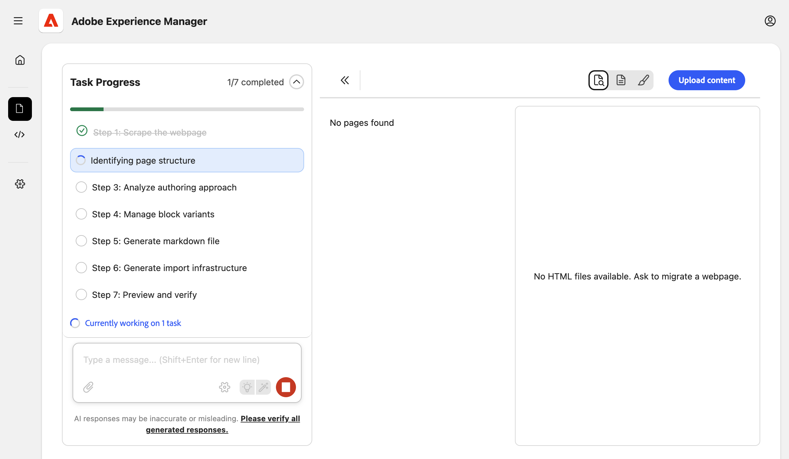
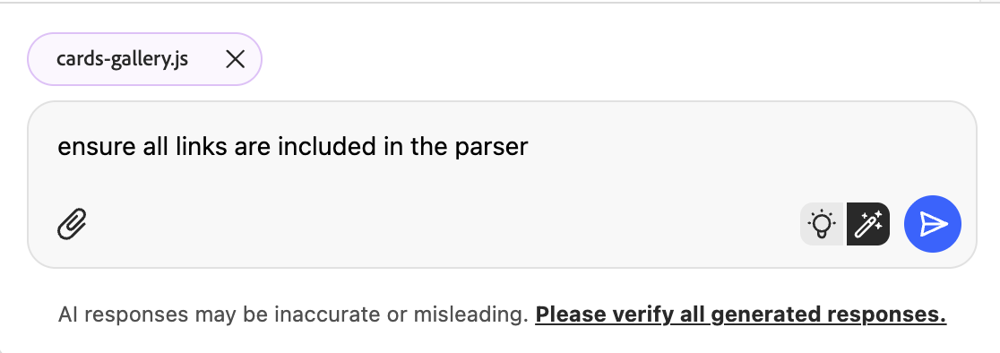
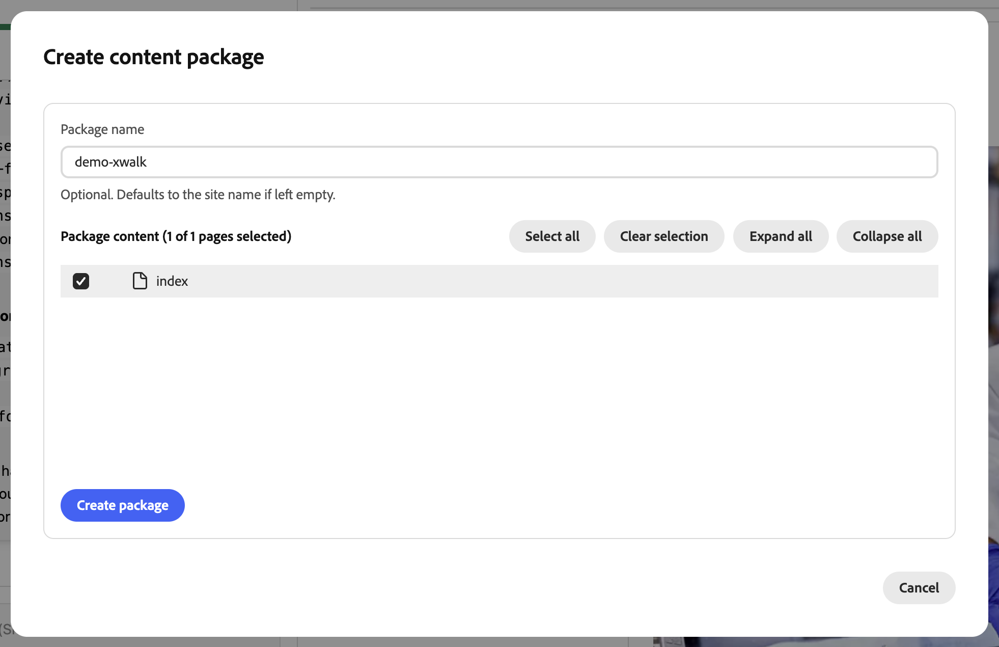

# Guida introduttiva all’agente di modernizzazione esperienza per i progetti di authoring di AEM {#getting-started-aem-authoring}

Per i progetti di authoring di AEM che utilizzano l’editor universale, la preparazione dell’agente di modernizzazione esperienza è diversa dal flusso standard di Edge Delivery. Questo documento illustra tali differenze di impostazione. Una volta completati i passaggi seguenti, segui la [Guida introduttiva all&#39;agente di modernizzazione esperienza](getting-started.md) principale.

## Creare l’archivio del progetto Edge Delivery Services {#create-repo}

1. Utilizza l&#39;archivio [`aem-block-collection-xwalk`](https://github.com/adobe-rnd/aem-block-collection-xwalk) come modello (non come standard di Edge Delivery Services).
1. Segui l&#39;[esercitazione sull&#39;editor universale](https://www.aem.live/developer/ue-tutorial) per configurare l&#39;archivio.
   * Interrompi quando ti viene richiesto di creare un sito in AEM.
1. Elimina `paths.json` e conferma questa modifica in `main`.
1. Aggiungi l&#39;app [Connettore codice AEM](https://github.com/apps/aem-code-connector/installations/select_target) al tuo archivio.
   * Questo consente alla console di controllare il codice.

## Creare un nuovo sito in AEM {#create-site}

1. Nella console AEM Sites, seleziona **Crea** > **Sito dal modello**.
1. Selezionare il **sito AEM con modello Edge Delivery Services**.
   * Non la vedi elencata? [Installa il modello.](https://github.com/adobe-rnd/aem-boilerplate-xwalk/releases)
1. Mantieni **name** del sito (non il titolo) come specificato.
   * Il nome del sito viene utilizzato come identificatore univoco.
   * Il titolo può essere modificato per la visualizzazione.
1. Fai clic su **Crea**.
   * Viene effettuato il reindirizzamento alla pagina Sites.
   * Aggiorna la pagina se il nuovo sito non viene visualizzato immediatamente.
1. Se non l&#39;hai già fatto durante [la configurazione dell&#39;archivio](#create-repo), aggiorna `fstab.yaml` in modo che punti all&#39;host AEM, al proprietario Git e all&#39;archivio Git e conferma le modifiche in `main`.
   * Per istruzioni, vedere [Configurare l&#39;origine di contenuto](/help/implementing/cloud-manager/edge-delivery/configure-content-source.md).

## Continua con i passaggi iniziali standard {#continue}

Una volta completati i passaggi precedenti, puoi continuare con la guida introduttiva standard per iniziare la migrazione dei contenuti.

Segui questi passaggi dalla guida standard.

1. [Preparare un archivio GitHub di Edge Delivery](/help/ai-in-aem/agents/brand-experience/modernization/getting-started.md#prepare-repo)
1. [Apri la console di modernizzazione esperienza](/help/ai-in-aem/agents/brand-experience/modernization/getting-started.md#open-console)
1. [Collegare l’archivio GitHub](/help/ai-in-aem/agents/brand-experience/modernization/getting-started.md#connect-repo)
1. [Avvia richiesta](/help/ai-in-aem/agents/brand-experience/modernization/getting-started.md#start-prompting)

Dopo aver completato questi passaggi per migrare il contenuto, continua con i passaggi seguenti.

## Convalida contenuto {#validate-content}

Convalida il contenuto della pagina selezionata nel pannello di anteprima. Per visualizzare eventuali errori, fare clic sul pulsante **Errori**.
Continua la conversazione con l&#39;agente per correggere gli errori. Utilizza la funzionalità **Aggiungi alla chat** per eseguire il targeting delle correzioni per elementi specifici della pagina, dei file parser o dei file di trasformazione.

## Caricare contenuti {#upload-content}

Per caricare i contenuti in AEM:

1. Verifica di essere nella visualizzazione **Contenuto** e fai clic sul pulsante **Carica contenuto** in alto a destra.
1. Nella finestra di dialogo **Crea pacchetto di contenuti**, scegli le pagine da includere nel pacchetto.
   * È possibile immettere un **nome pacchetto** (se non specificato, viene utilizzato automaticamente il nome del sito).
   * Utilizza **Seleziona tutto**, **Cancella selezione**, **Espandi tutto** o **Comprimi tutto** per gestire l&#39;elenco.
1. Fare clic su **Crea pacchetto**.

   

1. Dopo la creazione del pacchetto, la finestra di dialogo **Carica pacchetto di contenuto** indica che il pacchetto è pronto.
   1. È possibile **scaricare il pacchetto** per salvarlo localmente o procedere al caricamento.
   1. In **Carica in AEM**, conferma il **sito AEM** e il **host AEM** (precompilati dalle impostazioni del progetto).
      * Facoltativamente, lascia selezionata l&#39;opzione **Carica immagini** per includere le immagini.
   1. Fai clic su **Carica in AEM**.

   

1. La finestra di dialogo mostra l’avanzamento del caricamento quando pagine e risorse vengono inviate ad AEM. Al termine del caricamento, vengono visualizzati un messaggio di successo e il registro di caricamento. Fai clic su **Chiudi** per chiudere la finestra di dialogo.

   

Il contenuto importato è ora in AEM. Continua con [Modifiche al codice push](getting-started.md#push-code-changes) nella guida introduttiva principale.

## Risorse aggiuntive {#additional-resources}

* [Guida introduttiva all&#39;agente di modernizzazione esperienza](getting-started.md): flusso di lavoro completo che include console, prompt, caricamento e anteprima
* [Console di modernizzazione esperienze](console.md) - Riferimento console
* [Esercitazione sull&#39;editor universale](https://www.aem.live/developer/ue-tutorial) - Configura un progetto di authoring AEM e Universal Editor
* [`aem-block-collection-xwalk`](https://github.com/adobe-rnd/aem-block-collection-xwalk) - Archivio modelli per progetti di authoring AEM e Universal Editor
