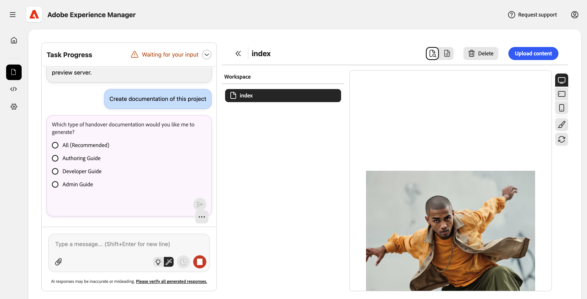
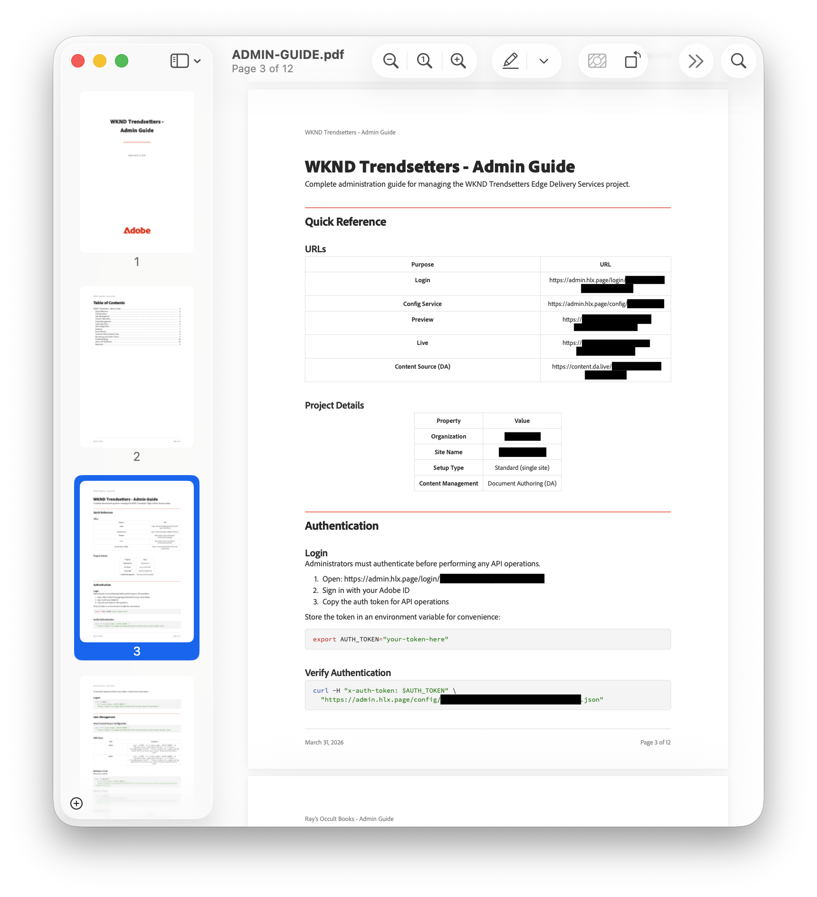

# Abilità nella documentazione del progetto {#project-documentation}

Scopri in che modo l’abilità nella documentazione dell’agente di modernizzazione dell’esperienza può aiutarti ad accelerare i passaggi di consegna dei progetti.

## Accelerazione dei passaggi di consegna dei progetti {#project-handovers}

[L&#39;agente di modernizzazione dell&#39;esperienza](/help/ai-in-aem/agents/brand-experience/modernization/overview.md) può generare automaticamente guide alla documentazione del progetto per progetti AEM Edge Delivery Services che includono:

* **Procedura dettagliata per il progetto** - Spiegazione della configurazione, della struttura e delle convenzioni del progetto, generata senza sforzo manuale
* **Organizzazione di moduli e componenti**: documentazione chiara dell&#39;organizzazione di blocchi, moduli e componenti e della loro relazione reciproca
* **Guide per ruolo**: documentazione mirata per autori, sviluppatori e amministratori, in modo che ogni membro del team ottenga esattamente ciò di cui ha bisogno

Questo semplifica i passaggi di gestione dei progetti per i progetti AEM Edge Delivery Services.

## Prerequisiti {#prerequisites}

Prima di utilizzare questa abilità, assicurati di quanto segue.

* Il progetto deve essere estratto nell&#39;area di lavoro nella console.
* Devi disporre delle autorizzazioni di amministratore per il progetto per il quale stai creando la documentazione.
* Le autorizzazioni dell’agente devono essere consentite nella console.
   * Selezionare l&#39;opzione **Consenti a LLM di accedere a admin.hlx.page per conto dell&#39;utente** [nelle impostazioni della console.](/help/ai-in-aem/agents/brand-experience/modernization/console.md#settings-view)
   * Se questa opzione non è abilitata, l’agente genera la documentazione in base alla base di codice accessibile.

## Creazione della documentazione del progetto {#creating-documentation}

Una volta soddisfatti i prerequisiti, è sufficiente chiedere all’agente di creare la documentazione per il progetto.

1. Nella chat chiedi &quot;Crea la documentazione di questo progetto&quot;.
1. Fornisci il nome dell’organizzazione del progetto, se l’agente lo richiede.
1. L’agente ti chiederà quale documentazione desideri creare. In genere, si selezionano **Tutti**.

   

1. Una volta create, le guide vengono inserite nell’area di lavoro. Selezionane una per visualizzare una descrizione e fai clic sul collegamento per scaricare il PDF completo.

   

Puoi salvare il PDF direttamente per fornirlo ai team o caricarlo come parte del resto del contenuto DA.

>[!NOTE]
>
>Se non si dispone dell&#39;autorizzazione per accedere all&#39;API di amministrazione di Edge Delivery Services o all&#39;opzione **Consenti a LLM di accedere ad admin.hlx.page per conto dell&#39;utente** [nelle impostazioni della console.](/help/ai-in-aem/agents/brand-experience/modernization/console.md#settings-view) non è abilitato, l&#39;agente genererà la documentazione in base alla base di codice a cui ha accesso.

## Risoluzione dei problemi {#troubleshooting}

Di seguito sono riportati i messaggi di errore più comuni che si verificano quando si utilizza l’abilità di documentazione del progetto e le modalità per risolverli.

### &quot;Accesso negato&quot; o &quot;Non autorizzato&quot; {#unauthorized}

* **Causa:** autorizzazioni amministratore o autorizzazioni agente mancanti non abilitate
* **Soluzione:**
   1. Verifica di disporre dell’accesso come amministratore al progetto
   1. Selezionare l&#39;opzione **Consenti a LLM di accedere a admin.hlx.page per conto dell&#39;utente** [nelle impostazioni della console.](/help/ai-in-aem/agents/brand-experience/modernization/console.md#settings-view)

### &quot;Progetto non trovato&quot; {#not-found}

* **Causa:** archivio non estratto nell&#39;area di lavoro
* **Soluzione:**
   1. Estrai l’archivio del progetto
   1. Assicurati di trovarti nell’area di lavoro corretta

### &quot;Errore API di configurazione&quot; {#api-error}

* **Causa:** impossibile accedere all&#39;API del servizio di configurazione di Edge Delivery Services
* **Soluzione:**
   1. Selezionare l&#39;opzione **Consenti a LLM di accedere a admin.hlx.page per conto dell&#39;utente** [nelle impostazioni della console.](/help/ai-in-aem/agents/brand-experience/modernization/console.md#settings-view)
   1. Verifica la connessione di rete/VPN
   1. Conferma l’accesso come amministratore al progetto
