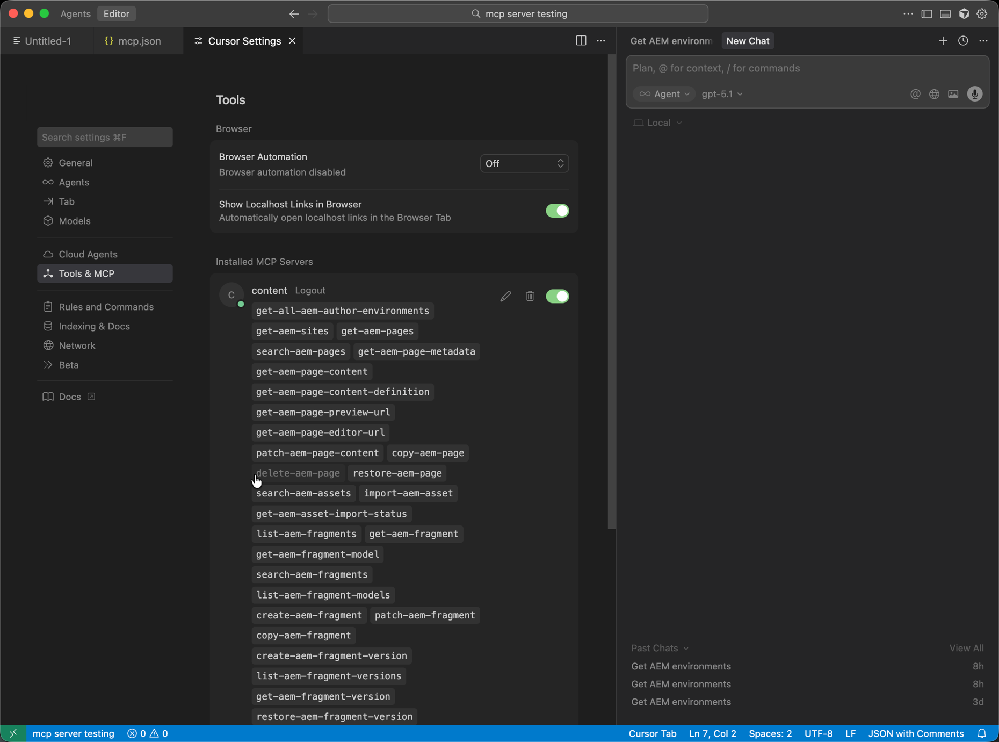

# Configurazione del cursore con AEM MCP {#setup-cursor}

Per collegare Cursore ai server MCP di AEM, segui la procedura riportata di seguito.

* Nelle impostazioni MCP del cursore, crea una nuova voce del server MCP con uno o più URL MCP di AEM.
* Quando richiesto, esegui l’autenticazione con il tuo Adobe ID.
* Se necessario, attivate o disattivate i singoli strumenti facendo clic sui relativi nomi. Tutti gli strumenti sono attivati per impostazione predefinita.
* Utilizza l’editor o la chat del cursore per richiamare gli strumenti di AEM come parte dei flussi di lavoro di sviluppo o di contenuti.

>[!NOTE]
>
>L’interfaccia utente del cursore è soggetta a modifiche e non è definitiva. Le presenti istruzioni sono a scopo illustrativo.

1. Apri **Impostazioni cursore** per configurare la connessione del cursore ai server MCP.

   

1. Apri **Strumenti e MCP**, quindi scegli **Aggiungi MCP personalizzato** per avviare una voce del server MCP personalizzata.

   

1. Nel modulo server MCP personalizzato, immetti **Name**, il tuo AEM MCP **URL** (o URL) ed eventuali altri campi obbligatori, quindi **Save**.

   

1. Quando viene visualizzata la finestra di dialogo della connessione, completare l&#39;accesso premendo **Connetti** in modo che il nuovo server MCP sia autorizzato.

   

1. In **Chat** o nell&#39;editor, scrivere prompt che richiamino **Strumenti AEM** in modo che il server MCP configurato partecipi al flusso di lavoro.

   
