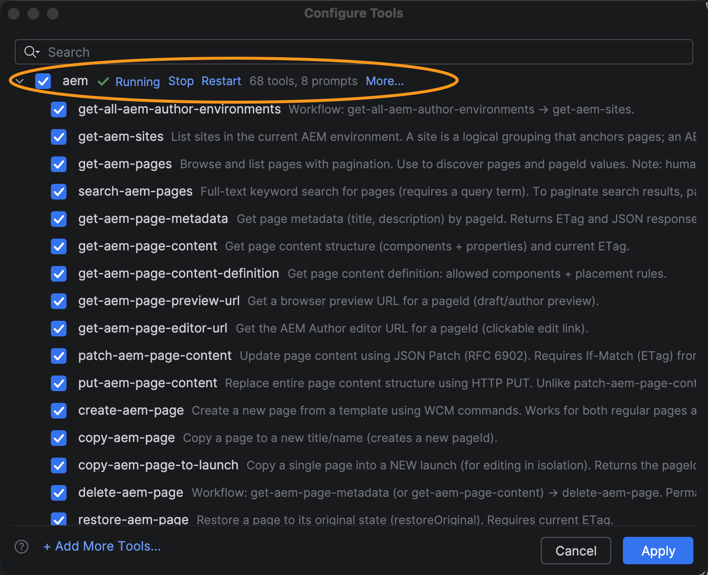

# Configurazione di JetBrains con GitHub Copilot e AEM MCP {#setup-jetbrains-copilot}

Segui questi passaggi per collegare GitHub Copilot in un IDE JetBrains (come IntelliJ IDEA, WebStorm o PyCharm) ai server MCP di AEM.

1. Apri GitHub Copilot Chat nell&#39;IDE JetBrains facendo clic sull&#39;icona **GitHub Copilot Chat** sul lato destro dell&#39;editor.

   

1. Fai clic sull&#39;icona **impostazioni** nel pannello Chat con copilot per aprire la configurazione MCP.

   

1. In **Impostazioni**, passa a **Strumenti > Copilota GitHub > MCP (Model Context Protocol)** e fai clic su **Configura** per aprire il file di configurazione `mcp.json`.

   

1. Aggiungere uno o più URL del server AEM MCP al file `mcp.json`. Ad esempio:

   ```json
   {
     "servers": {
       "aem": {
         "url": "https://mcp.adobeaemcloud.com/adobe/mcp/content"
       }
     }
   }
   ```


   


1. Salva il file. Il Copilot GitHub rileva automaticamente la nuova configurazione del server e mostra un&#39;azione **Avvia**.

   

1. Fai clic sull&#39;azione **Inizio** e, quando richiesto, accedi con il tuo Adobe ID per completare il flusso di autenticazione.

1. Puoi rivedere e gestire gli strumenti individuati facendo clic sull&#39;indicatore **strumenti** che viene visualizzato nel pannello Chat copilota. Se necessario, attivare o disattivare singoli strumenti.


   

1. Utilizza GitHub Copilot Chat per richiamare gli strumenti di AEM come parte dei flussi di lavoro di sviluppo o di contenuto.