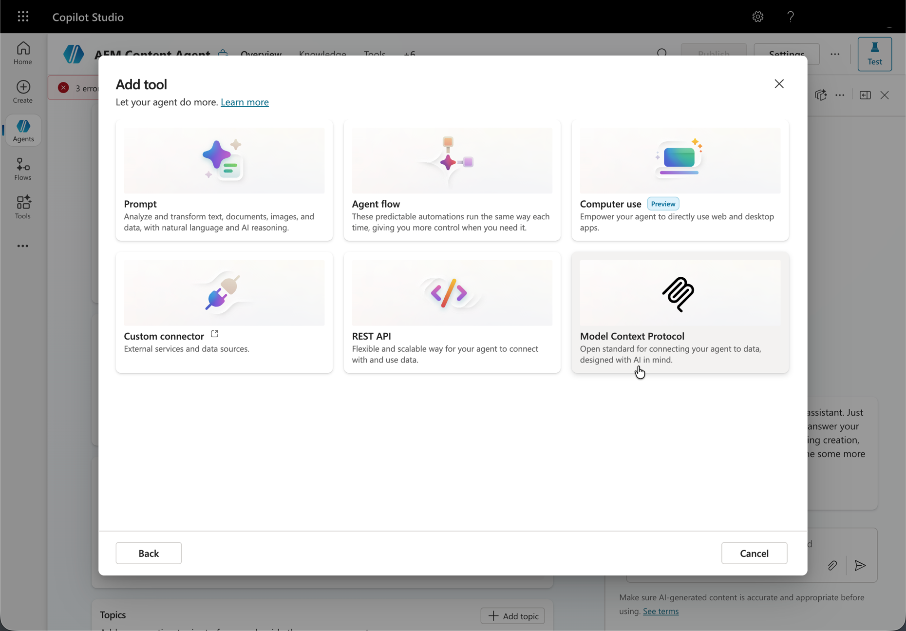
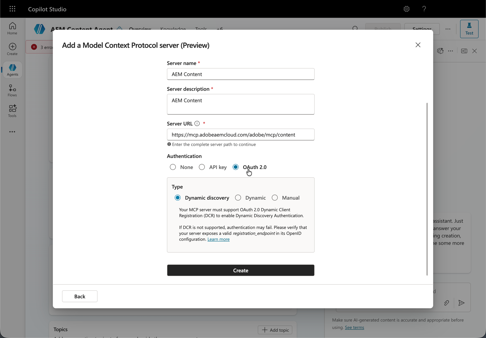

# Configurazione di Microsoft Copilot Studio con AEM MCP {#setup-microsoft-copilot-studio}

Segui questi passaggi per collegare Microsoft Copilot Studio ai server MCP di AEM.

* Crea un nuovo agente.
* Passare alla sezione dello strumento e fare clic su **Aggiungi strumento**.
* Selezionate uno strumento esistente o createne uno nuovo.
* Configura un nuovo strumento MCP che punta a uno o più URL del server AEM MCP.
* Stabilisci una connessione, che può essere condivisa o dedicata tra agenti.
* Accedi con il tuo Adobe ID quando viene reindirizzato.
* In alternativa, è possibile attivare la modalità di conferma automatica o richiedere la conferma dell&#39;utente finale per tutte le interazioni dello strumento.
* Durante il test dell&#39;agente, aprire prima la gestione connessione per assegnare una connessione alla sessione, quindi premere **Riprova**.

