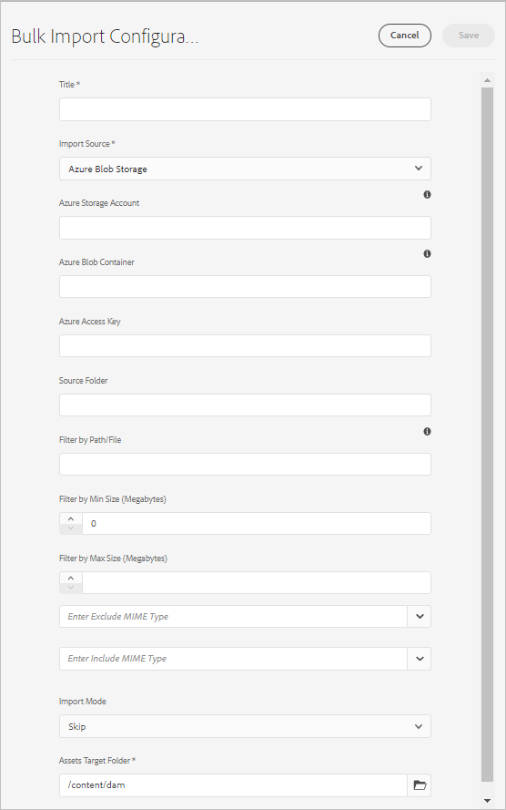

# Aggiungere risorse digitali a Adobe Experience Manager {#add-assets-to-experience-manager}

[!DNL Adobe Experience Manager] arricchisce il contenuto binario dei file digitali caricati con metadati avanzati, tag avanzati, rappresentazioni e altri servizi di Digital Asset Management (DAM). È possibile caricare vari tipi di file, ad esempio immagini, documenti e file immagine non elaborati, dalla cartella locale o da un&#39;unità di rete a [!DNL Experience Manager Assets].

Sono disponibili diversi metodi di caricamento. Oltre al caricamento del browser più comunemente utilizzato, esistono altri metodi per aggiungere risorse all’archivio [!DNL Experience Manager] , inclusi i client desktop, come Adobe Asset Link o [!DNL Experience Manager] app desktop, caricare e acquisire script che i clienti creerebbero, e integrazioni di acquisizione automatizzate aggiunte come estensioni [!DNL Experience Manager].

Ci concentreremo sui metodi di caricamento per gli utenti finali qui e forniremo collegamenti agli articoli che descrivono gli aspetti tecnici del caricamento e dell’acquisizione delle risorse utilizzando le API e gli SDK [!DNL Experience Manager].

Mentre puoi caricare e gestire qualsiasi file binario in [!DNL Experience Manager], i formati di file più comunemente utilizzati supportano servizi aggiuntivi, come l’estrazione dei metadati o la generazione di anteprime/rendering. Per ulteriori informazioni, fare riferimento a [formati di file supportati](file-format-support.md) .

Puoi anche scegliere di eseguire un’ulteriore elaborazione sulle risorse caricate. È possibile configurare diversi profili di elaborazione delle risorse nella cartella in cui vengono caricate le risorse per aggiungere metadati, rappresentazioni o servizi di elaborazione delle immagini specifici. Consulta [elaborare le risorse durante il caricamento](#process-when-uploaded).

>[!NOTE]
>
>[!DNL Experience Manager] as a  [!DNL Cloud Service] sfrutta un nuovo modo di caricare le risorse - caricamento binario diretto. È supportato per impostazione predefinita dalle funzionalità di prodotto e dai client predefiniti, come l’ [!DNL Experience Manager] interfaccia utente, [!DNL Adobe Asset Link], [!DNL Experience Manager] app desktop, e quindi trasparente per gli utenti finali.
>
>Per caricare il codice personalizzato o esteso dai clienti, i team tecnici devono utilizzare le nuove API e i nuovi protocolli di caricamento.

Assets as a [!DNL Cloud Service] fornisce i seguenti metodi di caricamento. L’Adobe consiglia di comprendere il caso d’uso e l’applicabilità di un’opzione di caricamento prima di utilizzarla.

| Metodo di caricamento | Quando utilizzare? | Persona principale |
|---------------------|----------------|-----------------|
| [Interfaccia utente della console Assets](#upload-assets) | Caricamento occasionale, facilità di pressione e trascinamento, caricamento del finder. Non utilizzare per caricare un numero elevato di risorse. | Tutti gli utenti |
| [Carica API](#upload-using-apis) | Per decisioni dinamiche durante il caricamento. | Developer (Sviluppatore) |
| App desktop [[!DNL Experience Manager]  ](https://experienceleague.adobe.com/docs/experience-manager-desktop-app/using/using.html) | Acquisizione di risorse a basso volume, ma non per la migrazione. | Amministratore, addetto al marketing |
| [[!DNL Adobe Asset Link]](https://helpx.adobe.com/enterprise/admin-guide.html/enterprise/using/adobe-asset-link.ug.html) | Utile quando creativi e professionisti del marketing lavorano sulle risorse dalle app [!DNL Creative Cloud] desktop supportate. | Creative, addetto al marketing |
| [Acquisizione in massa di risorse](#asset-bulk-ingestor) | Consigliato per migrazioni su larga scala e ingestioni di massa occasionali. Solo per i datastore supportati. | Amministratore, sviluppatore |

## Caricare risorse {#upload-assets}

<!-- #ENGCHECK do we support pausing? I couldn't get pause to show with 1.5GB upload.... If not, this should be removed#

   You can pause the uploading of large assets (greater than 500 MB) and resume it later from the same page. Tap the **[!UICONTROL Pause]** icon beside progress bar that appears when an upload starts.

   The size above which an asset is considered a large asset is configurable. For example, you can configure the system to consider assets above 1000 MB (instead of 500 MB) as large assets. In this case, **[!UICONTROL Pause]** appears on the progress bar when assets of size greater than 1000 MB are uploaded.

   The [!UICONTROL Pause] option does not show if a file greater than 1000 MB is uploaded with a file less than 1000 MB. However, if you cancel the less than 1000 MB file upload, the **[!UICONTROL Pause]** option appears.

   To modify the size limit, configure the `chunkUploadMinFileSize` property of the `fileupload` node in the CRX repository.

   When you click the **[!UICONTROL Pause]** icon, it toggles to a **[!UICONTROL Play]** icon. To resume uploading, click **[!UICONTROL Play]** option.
-->

<!-- #ENGCHECK do we support pausing? I couldn't get pause to show with 1.5GB upload.... If not, this should be removed#
   The ability to resume uploading is especially helpful in low-bandwidth scenarios and network glitches, where it takes a long time to upload a large asset. You can pause the upload operation and continue later when the situation improves. When you resume, uploading starts from the point where you paused it.
-->

<!-- #ENGCHECK assuming this is not relevant? remove after confirming#
   During the upload operation, [!DNL Experience Manager] saves the portions of the asset being uploaded as chunks of data in the CRX repository. When the upload completes, [!DNL Experience Manager] consolidates these chunks into a single block of data in the repository.

   To configure the cleanup task for the unfinished chunk upload jobs, go to `https://[aem_server]:[port]/system/console/configMgr/org.apache.sling.servlets.post.impl.helper.ChunkCleanUpTask`.
-->

Per caricare un file (o più file), puoi selezionarlo sul desktop e trascinarlo sull’interfaccia utente (browser web) nella cartella di destinazione. In alternativa, puoi avviare il caricamento da dall’interfaccia utente di .

1. Nell’interfaccia utente di [!DNL Assets] , individua il percorso in cui desideri aggiungere risorse digitali.
1. Per caricare le risorse, effettua una delle seguenti operazioni:

   * Sulla barra degli strumenti, fai clic su **[!UICONTROL Crea]** > **[!UICONTROL File]**. Se necessario, rinomina il file nella finestra di dialogo visualizzata.
   * In un browser che supporta HTML5, trascina le risorse direttamente sull’ interfaccia utente [!DNL Assets] . La finestra di dialogo per rinominare il file non viene visualizzata.

   

   Per selezionare più file, seleziona il tasto `Ctrl` o `Command` e seleziona le risorse nella finestra di dialogo del selettore file. Quando utilizzi un iPad, puoi selezionare un solo file alla volta.

1. Per annullare un caricamento in corso, fai clic su chiudi (`X`) accanto alla barra di avanzamento. Quando annulli l’operazione di caricamento, [!DNL Assets] elimina la parte parzialmente caricata della risorsa.
Se annulli un&#39;operazione di caricamento prima del caricamento dei file, [!DNL Assets] interrompe il caricamento del file corrente e aggiorna il contenuto. Tuttavia, i file già caricati non vengono eliminati.

1. La finestra di dialogo di avanzamento del caricamento in [!DNL Assets] visualizza il numero di file caricati correttamente e i file che non sono stati caricati.
Inoltre, l’interfaccia utente di [!DNL Assets] visualizza la risorsa più recente caricata o la cartella creata per prima.

>[!NOTE]
>
>Per caricare gerarchie di cartelle nidificate, consulta [caricare in massa le risorse](#bulk-upload).

<!-- #ENGCHECK I'm assuming this is no longer relevant.... If yes, this should be removed#

### Serial uploads {#serialuploads}

Uploading numerous assets in bulk consumes significant I/O resources, which may adversely impact the performance of [!DNL Assets]. In particular, if you have a slow internet connection, the time to upload drastically increases due to a spike in disk I/O. Moreover, your web browser may introduce additional restrictions to the number of POST requests [!DNL Assets] can handle for concurrent asset uploads. As a result, the upload operation fails or terminate prematurely. In other words, [!DNL Assets] may miss some files while ingesting a bunch of files or altogether fail to ingest any file.

To overcome this situation, [!DNL Assets] ingests one asset at a time (serial upload) during a bulk upload operation, instead of the concurrently ingesting all the assets.

Serial uploading of assets is enabled by default. To disable the feature and allow concurrent uploading, overlay the `fileupload` node in CRX-DE and set the value of the `parallelUploads` property to `true`.

### Streamed uploads {#streamed-uploads}

If you upload many assets to [!DNL Experience Manager], the I/O requests to server increase drastically, which reduces the upload efficiency and can even cause some upload task to time out. [!DNL Assets] supports streamed uploading of assets. Streamed uploading reduces the disk I/O during the upload operation by avoiding asset storage in a temporary folder on the server before copying it to the repository. Instead, the data is transferred directly to the repository. This way, the time to upload large assets and the possibility of timeouts is reduced. Streamed upload is enabled by default in [!DNL Assets].

>[!NOTE]
>
>Streaming upload is disabled for [!DNL Experience Manager] running on JEE server with servlet-api version lower than 3.1.
-->

### Gestione dei caricamenti quando la risorsa esiste già {#handling-upload-existing-file}

Puoi caricare una risorsa con lo stesso percorso (nome e posizione identici) di una risorsa esistente. Tuttavia, viene visualizzata una finestra di dialogo di avviso con le seguenti opzioni:

* Sostituisci la risorsa esistente: Se sostituisci una risorsa esistente, i metadati della risorsa e le eventuali modifiche precedenti (ad esempio annotazioni, ritaglio e così via) apportate alla risorsa esistente vengono eliminati.
* Crea un&#39;altra versione: Nella directory archivio viene creata una nuova versione della risorsa esistente. È possibile visualizzare le due versioni nella [!UICONTROL Timeline] e, se necessario, ripristinare la versione esistente precedente.
* Mantieni entrambi: Se scegli di mantenere entrambe le risorse, la nuova risorsa viene rinominata aggiungendo al nome il numero `1` .

>[!NOTE]
>
>Quando selezioni **[!UICONTROL Sostituisci]** nella finestra di dialogo [!UICONTROL Conflitto nome], l’ID risorsa viene rigenerato per la nuova risorsa. Questo ID è diverso dall’ID della risorsa precedente.
>
>Se Asset Insights è abilitato per tracciare impression o clic con [!DNL Adobe Analytics], l’ID risorsa rigenerato invalida i dati acquisiti per la risorsa su [!DNL Analytics].

Per mantenere la risorsa duplicata in [!DNL Assets], fai clic su **[!UICONTROL Mantieni]**. Per eliminare la risorsa duplicata caricata, fai clic su **[!UICONTROL Elimina]**.

### Gestione dei nomi dei file e caratteri non consentiti {#filename-handling}

[!DNL Experience Manager Assets] tenta di impedire il caricamento di risorse con i caratteri non consentiti nei nomi dei file. Se tenti di caricare una risorsa con un nome file contenente un carattere non consentito o più, [!DNL Assets] visualizza un messaggio di avviso e interrompe il caricamento fino a quando non rimuovi questi caratteri o lo carichi con un nome consentito. Alcuni metodi di caricamento non ti impediscono di caricare risorse con caratteri non consentiti nei nomi dei file, ma sostituiscono i caratteri con `-`.

Per soddisfare convenzioni di denominazione file specifiche per la tua organizzazione, la finestra di dialogo [!UICONTROL Carica risorse] consente di specificare nomi lunghi per i file caricati. I seguenti caratteri (elenco separato da spazi) non sono supportati:

* caratteri non validi per il nome del file risorsa `* / : [ \\ ] | # % { } ? &`
* caratteri non validi per il nome della cartella di risorse `* / : [ \\ ] | # % { } ? \" . ^ ; + & \t`

## Caricamento in blocco delle risorse {#bulk-upload}

Il gestore di risorse in blocco può gestire in modo efficiente un numero molto elevato di risorse. Tuttavia, un’acquisizione su larga scala non è solo un’immagine di file ampia o una migrazione casuale. Affinché un’acquisizione su larga scala sia un progetto significativo per il tuo scopo aziendale ed efficiente, pianifica la migrazione e cura l’organizzazione delle risorse. Tutte le acquisizioni sono diverse, quindi invece di generalizzare, sono fattori nella composizione dell’archivio e nelle esigenze aziendali più articolate. Di seguito sono riportati alcuni suggerimenti generali per pianificare ed eseguire un’acquisizione in blocco:

* Cura risorse: Rimuovi le risorse non necessarie nel DAM. È consigliabile rimuovere le risorse inutilizzate, obsolete o duplicate. Questo consente di ridurre i dati trasferiti e le risorse acquisite, con conseguente maggiore velocità di assimilazione.
* Organizzare le risorse: È consigliabile organizzare il contenuto in un ordine logico, ad esempio per dimensione del file, formato del file, caso d’uso o priorità. In generale, i file complessi di grandi dimensioni richiedono una maggiore elaborazione. Puoi anche considerare l’acquisizione separata di file di grandi dimensioni utilizzando l’opzione di filtro delle dimensioni del file (descritta di seguito).
* Acquisizioni scaglioni: È consigliabile suddividere l’acquisizione in più progetti di inserimento in blocco. Questo ti consente di visualizzare il contenuto prima e di aggiornarlo secondo necessità. Ad esempio, puoi acquisire risorse ad alta intensità di elaborazione nelle ore non di picco o gradualmente in più blocchi. Tuttavia, puoi acquisire risorse più piccole e semplici che non richiedono molta elaborazione contemporaneamente.

Per caricare un numero maggiore di file, utilizza uno dei seguenti approcci. Inoltre, consulta i [casi d’uso e metodi](#upload-methods-comparison)

* [API](developer-reference-material-apis.md#asset-upload-technical) di caricamento risorse: Utilizza uno script o uno strumento di caricamento personalizzato che sfrutta le API per aggiungere ulteriore gestione delle risorse (ad esempio, tradurre metadati o rinominare file), se necessario.
* [[!DNL Experience Manager] app](https://experienceleague.adobe.com/docs/experience-manager-desktop-app/using/using.html) desktop: Utile per i creativi professionisti e gli esperti di marketing che caricano le risorse dal loro file system locale. Utilizzalo per caricare le cartelle nidificate disponibili localmente.
* [Strumento](#asset-bulk-ingestor) per l’acquisizione in blocco: Da utilizzare per l’acquisizione di grandi quantità di risorse occasionalmente o inizialmente durante la distribuzione  [!DNL Experience Manager].

### Strumento per l’acquisizione in blocco delle risorse {#asset-bulk-ingestor}

Lo strumento viene fornito solo al gruppo di amministratori per utilizzare per l’acquisizione su larga scala di risorse dai datastore di Azure o S3. Guarda un video dettagliato sulla configurazione e l’acquisizione.

>[!VIDEO](https://video.tv.adobe.com/v/329680/?quality=12&learn=on)

Per configurare lo strumento, segui questi passaggi:

1. Passa a **[!UICONTROL Strumenti]** > **[!UICONTROL Risorse]** > **[!UICONTROL Importazione in blocco]**. Selezionare l&#39;opzione **[!UICONTROL Crea]**.

1. Nella pagina [!UICONTROL configurazione dell&#39;importazione in serie] , specifica i valori richiesti.

   * [!UICONTROL Titolo]: Titolo descrittivo.
   * [!UICONTROL Origine] importazione: Seleziona l’origine dati applicabile.
   * [!UICONTROL Filtra per dimensione] minima: Fornire la dimensione minima dei file delle risorse in MB.
   * [!UICONTROL Filtra per dimensione] massima: Fornire la dimensione massima dei file delle risorse in MB.
   * [!UICONTROL Escludi tipi] di MIME: Elenco di tipi MIME separati da virgole da escludere dall’acquisizione. Esempio, `image/jpeg, image/.*, video/mp4`.
   * [!UICONTROL Include Mime Types]: Elenco di tipi MIME separati da virgole da includere nell’acquisizione. Vedere [tutti i formati di file supportati](/help/assets/file-format-support.md).
   * [!UICONTROL Modalità] importazione: Selezionare Ignora, Sostituisci o Crea versione. La modalità Salta è l’impostazione predefinita e in questa modalità l’utente che esegue l’acquisizione salta per importare una risorsa, se esiste già. Vedere il significato di [sostituisci e crea opzioni di versione](#handling-upload-existing-file).
   * [!UICONTROL Cartella] di destinazione delle risorse: Importa la cartella in DAM in cui devono essere importate le risorse. Esempio, `/content/dam/imported_assets`

1. Puoi eliminare, modificare, eseguire ed eseguire ulteriori operazioni con le configurazioni di acquisizione create. Quando selezioni una configurazione per l’acquisizione in serie, nella barra degli strumenti sono disponibili le seguenti opzioni.

   * [!UICONTROL Modifica]: Modifica la configurazione selezionata.
   * [!UICONTROL Elimina]: Elimina la configurazione selezionata.
   * [!UICONTROL Controlla]: Convalida la connessione al datastore.
   * [!UICONTROL Prova] a secco: Richiama un&#39;esecuzione di test dell&#39;acquisizione in massa.
   * [!UICONTROL Esegui]: Esegui la configurazione selezionata.
   * [!UICONTROL Interrompi]: Termina una configurazione attiva.
   * [!UICONTROL Stato] del processo: Visualizza lo stato della configurazione quando viene utilizzata in un processo di importazione in corso o utilizzata per un processo completato.
   * [!UICONTROL Visualizzare le risorse]: Visualizza la cartella di destinazione se esiste.

## Caricare risorse utilizzando client desktop {#upload-assets-desktop-clients}

Oltre all&#39;interfaccia utente del browser Web, [!DNL Experience Manager] supporta altri client sul desktop. Forniscono anche un’esperienza di caricamento senza la necessità di andare al browser web.

* [[!DNL Adobe Asset Link]](https://helpx.adobe.com/it/enterprise/using/adobe-asset-link.html) consente di accedere alle risorse dalle applicazioni desktop Adobe Photoshop, Adobe Illustrator e Adobe InDesign  [!DNL Experience Manager] . Puoi caricare il documento attualmente aperto in [!DNL Experience Manager] direttamente dall’interfaccia utente di Adobe Asset Link dall’interno di queste applicazioni desktop.
* [[!DNL Experience Manager] l’applicazione desktop ](https://experienceleague.adobe.com/docs/experience-manager-desktop-app/using/using.html) semplifica l’utilizzo delle risorse sul desktop, indipendentemente dal tipo di file o dall’applicazione nativa che le gestisce. È particolarmente utile caricare file in gerarchie di cartelle nidificate dal file system locale, in quanto il caricamento del browser supporta solo il caricamento di elenchi di file flat.

## Elabora le risorse durante il caricamento di {#process-when-uploaded}

Per eseguire un’elaborazione aggiuntiva sulle risorse caricate, puoi applicare i profili di elaborazione sulle cartelle di caricamento. I profili sono disponibili nella pagina **[!UICONTROL Proprietà]** di una cartella in [!DNL Assets]. Una risorsa digitale senza estensione o con estensione errata non viene elaborata come desiderato. Ad esempio, durante il caricamento di tali risorse, non si verifica nulla o un profilo di elaborazione errato può essere applicato alla risorsa. Gli utenti possono comunque memorizzare i file binari nel DAM.

Sono disponibili le seguenti schede:

* [I ](metadata-profiles.md) profili metadati consentono di applicare le proprietà metadati predefinite alle risorse caricate in quella cartella.
* [I ](asset-microservices-configure-and-use.md) profili di elaborazione consentono di generare più rappresentazioni di quante siano possibili per impostazione predefinita.

Inoltre, se [!DNL Dynamic Media] è abilitato nella distribuzione, sono disponibili le seguenti schede:

* [[!DNL Dynamic Media] I ](dynamic-media/image-profiles.md) profili immagine consentono di applicare alle risorse caricate specifiche configurazioni di nitidezza e di ritaglio (ritaglio **[!UICONTROL avanzato e]** ritaglio pixel) e di ritaglio (ritaglio avanzato).
* [[!DNL Dynamic Media] I ](dynamic-media/video-profiles.md) profili video ti consentono di applicare profili di codifica video specifici (risoluzione, formato, parametri).

>[!NOTE]
>
>[!DNL Dynamic Media] le operazioni di ritaglio e altre operazioni sulle risorse non sono distruttive, ovvero le operazioni non modificano l’originale caricato. Fornisce invece parametri per ritagliare o trasformare le risorse durante la loro distribuzione.

Per le cartelle a cui è assegnato un profilo di elaborazione, il nome del profilo viene visualizzato sulla miniatura nella vista a schede. Nella vista a elenco, il nome del profilo viene visualizzato nella colonna **[!UICONTROL Profilo di elaborazione]** .

## Caricare o acquisire risorse utilizzando le API {#upload-using-apis}

I dettagli tecnici delle API e del protocollo di caricamento, nonché i collegamenti all’SDK open-source e ai client di esempio sono forniti nella sezione [caricamento delle risorse](developer-reference-material-apis.md#asset-upload-technical) del riferimento per sviluppatori.

>[!MORELIKETHIS]
>
>* App desktop [[!DNL Adobe Experience Manager]  ](https://experienceleague.adobe.com/docs/experience-manager-desktop-app/using/introduction.html)
>* [Informazioni [!DNL Adobe Asset Link]](https://www.adobe.com/creativecloud/business/enterprise/adobe-asset-link.html)
>* [[!DNL Adobe Asset Link] documentazione](https://helpx.adobe.com/enterprise/using/adobe-asset-link.html)
>* [Riferimento tecnico per il caricamento delle risorse](developer-reference-material-apis.md#asset-upload-technical)

