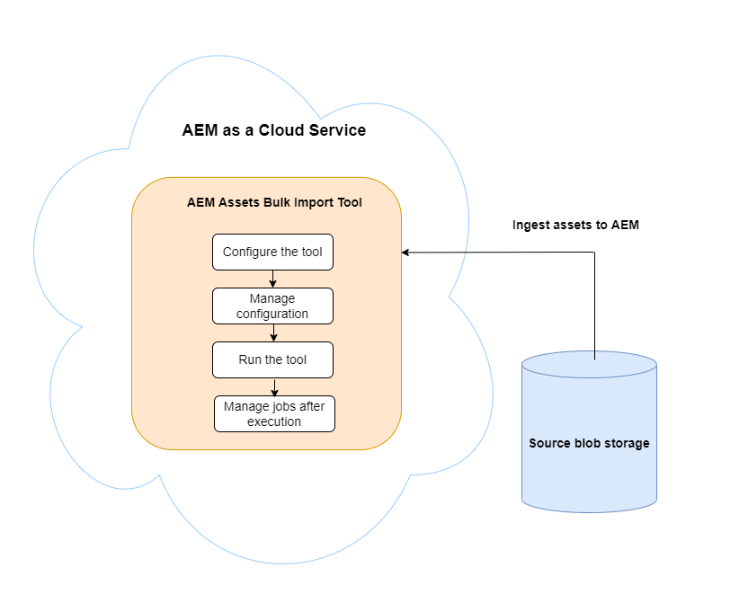

# Aggiungere risorse digitali a [!DNL Adobe Experience Manager] as a [!DNL Cloud Service] [!DNL Assets] {#add-assets-to-experience-manager}

[!DNL Adobe Experience Manager Assets] accetta numerosi tipi di risorse digitali da diverse sorgenti. Memorizza i file binari e le rappresentazioni create, può elaborare le risorse utilizzando vari flussi di lavoro e [!DNL Adobe Sensei] servizi, consente la distribuzione attraverso molti canali su molte superfici.

[!DNL Adobe Experience Manager] arricchisce il contenuto binario dei file digitali caricati con metadati avanzati, tag avanzati, rappresentazioni e altri servizi di gestione delle risorse digitali (DAM). È possibile caricare vari tipi di file, ad esempio immagini, documenti e file di immagini raw, dalla cartella locale o da un&#39;unità di rete in [!DNL Experience Manager Assets].

Oltre al caricamento del browser più comunemente utilizzato, sono disponibili altri metodi per aggiungere risorse alla [!DNL Experience Manager] archivio esistente. Questi altri metodi includono i client desktop, come Adobe Asset Link o [!DNL Experience Manager] l’app desktop, gli script di caricamento e acquisizione che i clienti creerebbero e le integrazioni di acquisizione automatizzata aggiunte come [!DNL Experience Manager] estensioni.

Mentre puoi caricare e gestire qualsiasi file binario in [!DNL Experience Manager], i formati di file più comunemente utilizzati supportano servizi aggiuntivi, come l’estrazione di metadati o la generazione di anteprime/rappresentazioni. Consulta [formati di file supportati](file-format-support.md) per i dettagli.

Puoi anche scegliere di eseguire un’elaborazione aggiuntiva sulle risorse caricate. Sulla cartella è possibile configurare diversi profili di elaborazione delle risorse, in cui vengono caricate le risorse, per aggiungere metadati specifici, rappresentazioni o servizi di elaborazione delle immagini. Consulta [elabora risorse quando caricato](#process-when-uploaded).

[!DNL Assets] fornisci i seguenti metodi di caricamento. L’Adobe consiglia di comprendere il caso d’uso e l’applicabilità di un’opzione di caricamento prima di utilizzarla.

| Metodo di caricamento | Quando utilizzare? | Persona primaria |
|---------------------|----------------|-----------------|
| [Interfaccia utente di Assets Console](#upload-assets) | Caricamento occasionale, facilità di pressione e trascinamento, caricamento del mirino. Non utilizzare per caricare più risorse. | Tutti gli utenti |
| [Carica API](#upload-using-apis) | Per decisioni dinamiche durante il caricamento. | Sviluppatore |
| [[!DNL Experience Manager] App desktop](https://experienceleague.adobe.com/docs/experience-manager-desktop-app/using/using.html) | Acquisizione di risorse di volume ridotto, ma non per la migrazione. | Amministratore, addetto marketing |
| [[!DNL Adobe Asset Link]](https://helpx.adobe.com/it/enterprise/using/adobe-asset-link.html) | Utile quando creativi e professionisti del marketing lavorano su risorse dall’interno del supportato [!DNL Creative Cloud] app desktop. | Creativo, addetto marketing |
| [Acquisizione in blocco delle risorse](#asset-bulk-ingestor) | Consigliato per migrazioni su larga scala e acquisizioni in blocco occasionali. Solo per gli archivi dati supportati. | Amministratore, sviluppatore |

## Caricare le risorse {#upload-assets}

<!-- #ENGCHECK do we support pausing? I couldn't get pause to show with 1.5GB upload.... If not, this should be removed#

   You can pause the uploading of large assets (greater than 500 MB) and resume it later from the same page. Select the **[!UICONTROL Pause]** icon beside progress bar that appears when an upload starts.

   The size above which an asset is considered a large asset is configurable. For example, you can configure the system to consider assets above 1000 MB (instead of 500 MB) as large assets. In this case, **[!UICONTROL Pause]** appears on the progress bar when assets of size greater than 1000 MB are uploaded.

   The [!UICONTROL Pause] option does not show if a file greater than 1000 MB is uploaded with a file less than 1000 MB. However, if you cancel the less than 1000 MB file upload, the **[!UICONTROL Pause]** option appears.

   To modify the size limit, configure the `chunkUploadMinFileSize` property of the `fileupload` node in the CRX repository.

   When you click the **[!UICONTROL Pause]** icon, it toggles to a **[!UICONTROL Play]** icon. To resume uploading, click **[!UICONTROL Play]** option.
-->

<!-- #ENGCHECK do we support pausing? I couldn't get pause to show with 1.5GB upload.... If not, this should be removed#
   The ability to resume uploading is especially helpful in low-bandwidth scenarios and network glitches, where it takes a long time to upload a large asset. You can pause the upload operation and continue later when the situation improves. When you resume, uploading starts from the point where you paused it.
-->

<!-- #ENGCHECK assuming this is not relevant? remove after confirming#
   During the upload operation, [!DNL Experience Manager] saves the portions of the asset being uploaded as chunks of data in the CRX repository. When the upload completes, [!DNL Experience Manager] consolidates these chunks into a single block of data in the repository.

   To configure the cleanup task for the unfinished chunk upload jobs, go to `https://[aem_server]:[port]/system/console/configMgr/org.apache.sling.servlets.post.impl.helper.ChunkCleanUpTask`.
-->

Per caricare uno o più file, selezionali sul desktop e trascinali sull&#39;interfaccia utente (browser Web) nella cartella di destinazione. In alternativa, puoi avviare il caricamento dall’interfaccia utente.

>[!IMPORTANT]
>
>Le risorse caricate in Experience Manager con un nome file superiore a 100 caratteri hanno un nome abbreviato quando vengono utilizzate in Dynamic Medie.
>
>I primi 100 caratteri nel nome del file vengono utilizzati così come sono; tutti i caratteri rimanenti vengono sostituiti da una stringa alfanumerica. Questo metodo di ridenominazione garantisce un nome univoco quando la risorsa viene utilizzata in Dynamic Medie. Inoltre, deve contenere la lunghezza massima consentita per il nome del file di risorse in Dynamic Medie.


1. In [!DNL Assets] nell’interfaccia utente, passa alla posizione in cui desideri aggiungere risorse digitali.
1. Per caricare le risorse, effettua una delle seguenti operazioni:

   * Sulla barra degli strumenti, fai clic su **[!UICONTROL Crea]** > **[!UICONTROL File]**. Se necessario, puoi rinominare il file nella finestra di dialogo visualizzata.
   * In un browser che supporta HTML5, trascina le risorse direttamente sul [!DNL Assets] dell&#39;utente. La finestra di dialogo per rinominare il file non viene visualizzata.

   

   Per selezionare più file, selezionare `Ctrl` o `Command` e seleziona le risorse nella finestra di dialogo del selettore file. Quando si utilizza un iPad, è possibile selezionare un solo file alla volta.

1. Per annullare un caricamento in corso, fai clic su Chiudi (`X`) accanto alla barra di avanzamento. Quando annulli l’operazione di caricamento, [!DNL Assets] elimina la parte parzialmente caricata della risorsa.
Se annulli un’operazione di caricamento prima che i file vengano caricati, [!DNL Assets] interrompe il caricamento del file corrente e aggiorna il contenuto. Tuttavia, i file già caricati non vengono eliminati.

1. Finestra di dialogo per l’avanzamento del caricamento in [!DNL Assets] visualizza il numero di file caricati correttamente e i file che non sono stati caricati correttamente.
Inoltre, la [!DNL Assets] L’interfaccia utente mostra la risorsa più recente caricata o la cartella creata per prima.

>[!NOTE]
>
>Per caricare le gerarchie di cartelle nidificate, consulta [risorse caricate in blocco](#bulk-upload).

<!-- #ENGCHECK I'm assuming this is no longer relevant.... If yes, this should be removed#

### Serial uploads {#serialuploads}

Uploading numerous assets in bulk consumes significant I/O resources, which may adversely impact the performance of [!DNL Assets]. In particular, if you have a slow internet connection, the time to upload drastically increases due to a spike in disk I/O. Moreover, your web browser may introduce additional restrictions to the number of POST requests [!DNL Assets] can handle for concurrent asset uploads. As a result, the upload operation fails or terminate prematurely. In other words, [!DNL Assets] may miss some files while ingesting a bunch of files or altogether fail to ingest any file.

To overcome this situation, [!DNL Assets] ingests one asset at a time (serial upload) during a bulk upload operation, instead of the concurrently ingesting all the assets.

Serial uploading of assets is enabled by default. To disable the feature and allow concurrent uploading, overlay the `fileupload` node in CRX-DE and set the value of the `parallelUploads` property to `true`.

### Streamed uploads {#streamed-uploads}

If you upload many assets to [!DNL Experience Manager], the I/O requests to server increase drastically, which reduces the upload efficiency and can even cause some upload task to time out. [!DNL Assets] supports streamed uploading of assets. Streamed uploading reduces the disk I/O during the upload operation by avoiding asset storage in a temporary folder on the server before copying it to the repository. Instead, the data is transferred directly to the repository. This way, the time to upload large assets and the possibility of timeouts is reduced. Streamed upload is enabled by default in [!DNL Assets].

>[!NOTE]
>
>Streaming upload is disabled for [!DNL Experience Manager] running on JEE server with servlet-api version lower than 3.1.
-->

### Gestione dei caricamenti per le risorse esistenti {#handling-upload-existing-file}

Puoi caricare una risorsa con lo stesso percorso (stesso nome e stessa posizione) di una risorsa esistente. Tuttavia, viene visualizzata una finestra di dialogo di avviso con le seguenti opzioni:

* Sostituisci cespite esistente: se sostituisci un cespite esistente, i metadati del cespite ed eventuali modifiche precedenti (ad esempio, annotazioni e ritagli) apportate al cespite esistente vengono eliminati.

  >[!NOTE]
  >
  >L&#39;opzione per la sostituzione delle risorse non è disponibile se la risorsa è bloccata o estratta.

* Crea un’altra versione: viene creata una nuova versione della risorsa esistente nell’archivio. È possibile visualizzare le due versioni in [!UICONTROL Timeline] e, se necessario, può ripristinare la versione precedente esistente.
* Mantieni entrambe: se scegli di mantenere entrambe le risorse, la nuova risorsa viene rinominata.

Per mantenere la risorsa duplicata in [!DNL Assets], fai clic su **[!UICONTROL Mantieni]**. Per eliminare la risorsa duplicata caricata, fai clic su **[!UICONTROL Elimina]**.

### Gestione del nome file e caratteri non consentiti {#filename-handling}

[!DNL Experience Manager Assets] impedisce il caricamento di risorse i cui nomi contengono i caratteri non consentiti. Se tenti di caricare una risorsa i cui nomi contengono uno o più caratteri non consentiti, [!DNL Assets] visualizza un messaggio di avviso e interrompe il caricamento finché non rimuovi questi caratteri o non carichi con un nome consentito.

Per adattarsi a specifiche convenzioni di denominazione dei file per la propria organizzazione, la [!UICONTROL Carica risorse] consente di specificare nomi lunghi per i file caricati. I seguenti caratteri (separati da spazi) non sono supportati:

* Caratteri non validi per il nome della risorsa: `* / : [ \\ ] | # % { } ? &`
* Caratteri non validi per il nome della cartella di risorse: `* / : [ \\ ] | # % { } ? \" . ^ ; + & \t`

## Caricare risorse in blocco {#bulk-upload}

L’inserimento in blocco delle risorse può gestire molte risorse in modo efficiente. Tuttavia, un’acquisizione su larga scala non è solo un’immagine di file ampia o una migrazione casuale. Affinché l’acquisizione su larga scala sia un progetto significativo, efficiente e rispondente alle esigenze del tuo business, pianifica la migrazione e cura l’organizzazione delle risorse. Tutte le acquisizioni sono diverse, quindi, invece di generalizzare, influiscono sulla composizione dell’archivio e sulle esigenze aziendali specifiche. Di seguito sono riportati alcuni suggerimenti generali per pianificare ed eseguire un’acquisizione in blocco:

* Cura risorse: rimuovi le risorse non necessarie in DAM. È consigliabile rimuovere le risorse non utilizzate, obsolete o duplicate. Tale gestione riduce i dati trasferiti e le risorse acquisite, consentendo acquisizioni più rapide.
* Organizzare le risorse: è consigliabile organizzare il contenuto in un ordine logico, ad esempio in base alla dimensione del file, al formato del file, al caso d’uso o alla priorità. In generale, i file complessi di grandi dimensioni richiedono una maggiore elaborazione. Puoi anche prendere in considerazione l’acquisizione separata di file di grandi dimensioni utilizzando l’opzione di filtro delle dimensioni del file (descritta di seguito).
* Acquisizioni scaglionate: prendi in considerazione di suddividere l’acquisizione in più progetti di acquisizione in blocco. q ti consente di visualizzare il contenuto prima e di aggiornare l’acquisizione in base alle esigenze. Ad esempio, è possibile acquisire le risorse con elaborazione intensiva nelle ore non di picco o gradualmente in più blocchi. Tuttavia, puoi acquisire risorse più piccole e semplici che non richiedono molta elaborazione in un’unica operazione.

Per caricare un numero maggiore di file, utilizza uno dei seguenti approcci. Inoltre, consulta [casi d’uso e metodi](#upload-methods-comparison)

* [API per il caricamento delle risorse](developer-reference-material-apis.md#asset-upload): se necessario, utilizza uno script o uno strumento di caricamento personalizzato che utilizza le API per aggiungere ulteriore gestione delle risorse (ad esempio, per tradurre i metadati o rinominare i file).
* [[!DNL Experience Manager] app desktop](https://experienceleague.adobe.com/docs/experience-manager-desktop-app/using/using.html): utile per i professionisti della creatività e per gli esperti di marketing che caricano risorse dal file system locale. Utilizzala per caricare le cartelle nidificate disponibili localmente.
* [Strumento di acquisizione in blocco](#asset-bulk-ingestor): da utilizzare per l’acquisizione di grandi quantità di risorse, occasionalmente o inizialmente durante la distribuzione [!DNL Experience Manager].

### Strumento Importazione in blocco risorse {#asset-bulk-ingestor}

Lo strumento viene fornito solo al gruppo di amministratori da utilizzare per l’acquisizione su larga scala delle risorse dai datastore di Azure o S3. Guarda un video con la procedura dettagliata sulla configurazione e l’acquisizione.

>[!VIDEO](https://video.tv.adobe.com/v/329680/?quality=12&learn=on)

L’immagine seguente illustra le varie fasi di acquisizione delle risorse da Experience Manager da un archivio dati:



**Prerequisiti**

Per utilizzare questa funzione è necessario un account di archiviazione esterno o un bucket di Azure o AWS.

>[!NOTE]
>
>Crea il contenitore o il bucket dell’account di archiviazione come privato e accetta connessioni solo da richieste autorizzate. Tuttavia, non sono supportate ulteriori restrizioni sulle connessioni di rete in ingresso.

>[!NOTE]
>
>Gli account di archiviazione esterna possono avere regole di nome file/cartella diverse dallo strumento Importazione in blocco. Consulta [Gestione dei nomi dei file durante l’importazione in blocco](#filename-handling-bulkimport) per ulteriori dettagli sui nomi non consentiti/con escape.


### Configurare lo strumento Importazione in blocco {#configure-bulk-ingestor-tool}

Per configurare lo strumento Importazione in blocco, effettuare le seguenti operazioni:

1. Accedi a **[!UICONTROL Strumenti]** > **[!UICONTROL Risorse]** > **[!UICONTROL Importazione in blocco]**. Seleziona la **[!UICONTROL Crea]** opzione.

1. Specifica un titolo per la configurazione dell&#39;importazione in blocco nella **[!UICONTROL Titolo]** campo.

1. Selezionare il tipo di origine dati dall&#39;elenco **[!UICONTROL Origine importazione]** elenco a discesa.

1. Immetti i valori per creare una connessione con l’origine dati. Ad esempio, se selezioni **Archiviazione BLOB di Azure** come origine dati, specifica i valori per l’account di archiviazione Azure, il contenitore BLOB di Azure e la chiave di accesso Azure.

1. Seleziona la modalità di autenticazione richiesta dall’elenco a discesa. **Chiave di accesso Azure** fornisce accesso completo all’account di archiviazione Azure, mentre **Token SAS di Azure** consente all’amministratore di limitare le funzionalità del token utilizzando le autorizzazioni e i criteri di scadenza.

1. Immetti il nome della cartella principale che contiene le risorse nell’origine dati nel campo **[!UICONTROL Cartella di origine]**.

1. (Facoltativo) Specifica la dimensione minima in MB del file delle risorse da includere nel processo di acquisizione in **[!UICONTROL Filtra per dimensione min]** campo.

1. (Facoltativo) Specifica la dimensione massima in MB del file delle risorse da includere nel processo di acquisizione del campo **[!UICONTROL Filtra per dimensione max]**.

1. (Facoltativo) Specifica un elenco separato da virgole di tipi MIME da escludere dall’acquisizione nel **[!UICONTROL Escludi tipi MIME]** campo. Ad esempio, `image/jpeg, image/.*, video/mp4`. Consulta [tutti i formati di file supportati](/help/assets/file-format-support.md).

1. Specifica un elenco separato da virgole di tipi MIME da includere dall’acquisizione nella **[!UICONTROL Includi tipi MIME]** campo. Consulta [tutti i formati di file supportati](/help/assets/file-format-support.md).

1. Seleziona la **[!UICONTROL Elimina il file di origine dopo l’importazione]** opzione per eliminare i file originali dall&#39;archivio dati di origine dopo l&#39;importazione dei file [!DNL Experience Manager].

1. Seleziona la **[!UICONTROL Modalità di importazione]**. Seleziona **Ignora**, **Sostituisci** o **Crea versione**. La modalità Ignora è l’impostazione predefinita e, in questa modalità, l’importazione di una risorsa viene ignorata se esiste già. Vedi il significato di [sostituisci e crea opzioni versione](#handling-upload-existing-file).

1. Per definire una posizione in DAM in cui importare le risorse utilizzando il campo **[!UICONTROL Cartella risorse di destinazione]**, specifica un percorso. Esempio: `/content/dam/imported_assets`.

1. (Facoltativo) Specifica il file di metadati da importare, fornito in formato CSV, nel campo **[!UICONTROL File di metadati]**. Specifica il file CSV nel percorso del BLOB di origine e fai riferimento al percorso durante la configurazione dello strumento Importazione in blocco. Il formato di file CSV a cui si fa riferimento in questo campo è lo stesso del formato di file CSV quando [Importare ed esportare in blocco i metadati delle risorse](https://experienceleague.adobe.com/docs/experience-manager-cloud-service/content/assets/admin/metadata-import-export.html). Se si seleziona la **Elimina il file di origine dopo l’importazione** , filtrare i file CSV utilizzando **Escludi** o **Includi tipo MIME** o **Filtra per percorso/file** campi. È possibile utilizzare un’espressione regolare per filtrare i file CSV in questi campi.

1. Clic **[!UICONTROL Salva]** per salvare la configurazione.

### Gestire la configurazione dello strumento Importazione in blocco {#manage-bulk-import-configuration}

Dopo aver creato la configurazione dello strumento Importazione in blocco, puoi eseguire attività per valutarla prima di acquisire in blocco le risorse nell’istanza di Experience Manager. Per visualizzare le opzioni disponibili per gestire la configurazione dello strumento Importazione in blocco, seleziona la configurazione disponibile all’indirizzo **[!UICONTROL Strumenti]** > **[!UICONTROL Risorse]** > **[!UICONTROL Importazione in blocco]**.

### Modificare la configurazione {#edit-configuration}

Per modificare i dettagli della configurazione, selezionarla e quindi fare clic su **[!UICONTROL Modifica]**. Non è possibile modificare il titolo della configurazione e l&#39;origine dati di importazione durante l&#39;operazione di modifica.

### Elimina la configurazione {#delete-configuration}

Seleziona la configurazione e fai clic su **[!UICONTROL Elimina]** per eliminare la configurazione Importazione in blocco.

### Convalidare la connessione all’origine dati {#validate-connection}

Per convalidare la connessione all&#39;origine dati, selezionare la configurazione e quindi fare clic su **[!UICONTROL spunta]**. Se la connessione ha esito positivo, nell’Experience Manager viene visualizzato il seguente messaggio:


### Richiama un’esecuzione dei test per il processo di importazione in blocco {#invoke-test-run-bulk-import}

Seleziona la configurazione e fai clic su **[!UICONTROL Dry Run]** per richiamare un’esecuzione dei test per il processo di importazione in blocco. In Experience Manager vengono visualizzati i dettagli seguenti sul processo di importazione in blocco:


### Gestione dei nomi dei file durante l’importazione in blocco {#filename-handling-bulkimport}

Quando importi risorse o cartelle in blocco, [!DNL Experience Manager Assets] importa l’intera struttura di ciò che esiste nell’origine di importazione. [!DNL Experience Manager] segue le regole predefinite per i caratteri speciali nei nomi delle risorse e delle cartelle; pertanto, questi nomi di file devono essere bonificati. Sia per il nome della cartella che per quello della risorsa, il titolo definito dall’utente rimane invariato e viene memorizzato in `jcr:title`.

Durante l’importazione in blocco, [!DNL Experience Manager] cerca le cartelle esistenti per evitare di reimportare le risorse e le cartelle e verifica inoltre le regole di bonifica applicate nella cartella principale in cui avviene l’importazione. Se le regole di bonifica vengono applicate nella cartella principale, le stesse regole vengono applicate all’origine di importazione. Per le nuove importazioni, per gestire i nomi file di risorse e cartelle vengono applicate le seguenti regole di bonifica.

**Nomi non consentiti nell’importazione in blocco**

I seguenti caratteri non sono consentiti nei nomi di file e cartelle:

* Caratteri di controllo e uso privato (da 0x00 a 0x1F, \u0081, \uE000)
* Nomi di file o cartelle che terminano con un punto (.)

I file o le cartelle con nomi corrispondenti a queste condizioni vengono ignorati durante il processo di importazione e contrassegnati come non riusciti.

**Gestione del nome della risorsa nell’importazione in blocco**

Per i nomi file delle risorse, il nome e il percorso JCR vengono bonificati utilizzando l’API: `JcrUtil.escapeIllegalJcrChars`.

* I caratteri Unicode non vengono modificati
* Sostituisci i caratteri speciali con il loro codice di escape URL, ad esempio, `new%asset.png` è aggiornato a `new%25asset.png`:

  ```
                  URL escape code   
  
  "               %22
  %               %25
  '               %27
  *               %2A
  /               %2F
  :               %3A
  [               %5B
  \n              %0A
  \r              %0D
  \t              %09
  ]               %5D
  |               %7C
  ```

**Gestione del nome della cartella nell’importazione in blocco**

Per i nomi file delle cartelle, il nome e il percorso JCR vengono bonificati utilizzando l’API: `DamUtil.getSanitizedFolderName`.

* I caratteri maiuscoli vengono convertiti in minuscoli
* I caratteri Unicode non vengono modificati
* Sostituisci i caratteri speciali con un trattino (&quot;-&quot;), ad esempio, `new folder` è aggiornato a `new-folder`:

  ```
  "                           
  #                         
  %                           
  &                          
  *                           
  +                          
  .                           
  :                           
  ;                          
  ?                          
  [                           
  ]                           
  ^                         
  {                         
  }                         
  |                           
  /         It is used for split folder in cloud storage and is pre-handled, no conversion here.
  \         Not allowed in Azure, allowed in AWS.
  \t
  space     It is the space character.
  ```

<!-- 
[!DNL Experience Manager Assets] manages the forbidden characters in the filenames while you upload assets or folders. [!DNL Experience Manager] updates only the node names in the DAM repository. However, the `title` of the asset or folder remains unchanged.

Following are the file naming conventions that are applied while uploading assets or folders in [!DNL Experience Manager Assets]:

| Characters &Dagger; | When occurring in file names | When occurring in folder names | Example |
|---|---|---|---|
| `. / : [ ] | *` | Replaced with `-` (hyphen). | Replaced with `-` (hyphen). A `.` (dot) in the filename extension is retained as is. | Replaced with `-` (hyphen). | `myimage.jpg` remains as is and `my.image.jpg` changes to `my-image.jpg`. |
| `% ; # , + ? ^ { } "` and whitespaces | Whitespaces are retained | Replaced with `-` (hyphen). | `My Folder.` changes to `my-folder-`. |
| `# % { } ? & .` | Replaced with `-` (hyphen). | NA. | `#My New File.` changes to `-My New File-`. |
| Uppercase characters | Casing is retained as is. | Changed to lowercase characters. | `My New Folder` changes to `my-new-folder`. |
| Lppercase characters | Casing is retained as is. | Casing is retained as is. | NA. |

&Dagger; The list of characters is a whitespace-separated list.
-->

#### Pianificare un’importazione in blocco una tantum o ricorrente {#schedule-bulk-import}

Per pianificare un’importazione in blocco una tantum o ricorrente, effettua le seguenti operazioni:

1. Crea una configurazione di importazione in blocco.
1. Seleziona la configurazione e seleziona **[!UICONTROL Pianificazione]** dalla barra degli strumenti.
1. Imposta un’acquisizione una tantum o una pianificazione oraria, giornaliera o settimanale. Fai clic su **[!UICONTROL Invia]**.

   


#### Visualizzare la cartella di destinazione delle risorse {#view-assets-target-folder}

Per visualizzare il percorso di destinazione delle risorse in cui vengono importate dopo l’esecuzione del processo Importazione in blocco, seleziona la configurazione e fai clic su **[!UICONTROL Visualizza risorse]**.

#### Eseguire lo strumento Importazione in blocco {#run-bulk-import-tool}

Dopo [configurazione dello strumento Importazione in blocco](#configure-bulk-ingestor-tool) e facoltativamente [gestione della configurazione dello strumento Importazione in blocco](#manage-bulk-import-configuration), puoi eseguire il processo di configurazione per avviare l’acquisizione in blocco delle risorse.

Per avviare il processo di importazione in blocco, passare a **[!UICONTROL Strumenti]** > **[!UICONTROL Risorse]** > **[!UICONTROL Importazione in blocco]**, seleziona la [Configurazione importazione in blocco](#configure-bulk-ingestor-tool)e quindi fare clic su **[!UICONTROL Esegui]**. Clic **[!UICONTROL Esegui]** di nuovo per confermare.

Experience Manager aggiorna lo stato del processo in **Elaborazione** e a **Completato** al completamento del processo. Per visualizzare le risorse importate in Experience Manager, fai clic su **Visualizza risorse**.

Quando il processo è in corso, puoi anche selezionare la configurazione e fare clic su **Interrompi** per interrompere il processo di acquisizione in blocco. Clic **Esegui** per riprendere il processo. Puoi anche fare clic su **Dry Run** per conoscere i dettagli delle risorse ancora in attesa di importazione.

#### Gestisci processi dopo l&#39;esecuzione {#manage-jobs-after-execution}

Experience Manager consente di visualizzare la cronologia dei processi di importazione in blocco. La cronologia processo include lo stato del processo, l&#39;autore del processo, i registri e altri dettagli quali la data e l&#39;ora di inizio, la data e l&#39;ora di creazione e la data e l&#39;ora di fine.

Per accedere alla cronologia dei processi per una configurazione, selezionala e fai clic su **[!UICONTROL Cronologia processi]**. Seleziona un processo e fai clic su **Apri**.


In Experience Manager viene visualizzata la cronologia del processo. Nella pagina Cronologia dei processi di importazione in blocco è inoltre possibile fare clic su **Elimina** per eliminare quel processo per la configurazione di importazione in blocco.


## Caricare risorse tramite client desktop {#upload-assets-desktop-clients}

Oltre all’interfaccia utente del browser web, [!DNL Experience Manager] supporta altri client sul desktop. Inoltre, forniscono un’esperienza di caricamento senza dover passare al browser web.

* [[!DNL Adobe Asset Link]](https://helpx.adobe.com/it/enterprise/using/adobe-asset-link.html) consente di accedere alle risorse da [!DNL Experience Manager] nelle applicazioni desktop Adobe Photoshop, Adobe Illustrator e Adobe InDesign. È possibile caricare il documento attualmente aperto in [!DNL Experience Manager] direttamente dall’interfaccia utente di Adobe Asset Link dall’interno di queste applicazioni desktop.
* [[!DNL Experience Manager] app desktop](https://experienceleague.adobe.com/docs/experience-manager-desktop-app/using/using.html) semplifica l’utilizzo delle risorse sul desktop, indipendentemente dal tipo di file o dall’applicazione nativa che le gestisce. È utile caricare i file nelle gerarchie di cartelle nidificate dal file system locale, in quanto il caricamento del browser supporta solo il caricamento di elenchi di file sequenziali.

## Elabora risorse quando caricate {#process-when-uploaded}

Per eseguire ulteriori elaborazioni sulle risorse caricate, puoi applicare i profili di elaborazione alle cartelle di caricamento. I profili sono disponibili nel **[!UICONTROL Proprietà]** pagina di una cartella in [!DNL Assets]. Una risorsa digitale senza un’estensione o con un’estensione non corretta non viene elaborata come desiderato. Ad esempio, quando carichi tali risorse, potrebbe non accadere nulla oppure potrebbe essere applicato un profilo di elaborazione errato. Gli utenti possono comunque memorizzare i file binari in DAM.


Sono disponibili le seguenti schede:

* [Profili metadati](metadata-profiles.md) consente di applicare le proprietà dei metadati predefinite alle risorse caricate in tale cartella.
* [Profili di elaborazione](asset-microservices-configure-and-use.md) consente di generare più rappresentazioni di quelle possibili per impostazione predefinita.

Inoltre, se [!DNL Dynamic Media] è abilitato nella distribuzione, sono disponibili le seguenti schede:

* [[!DNL Dynamic Media] Profili immagine](dynamic-media/image-profiles.md) consente di applicare ritagli specifici (**[!UICONTROL Ritaglio avanzato]** e il ritaglio di pixel) e la configurazione della nitidezza delle risorse caricate.
* [[!DNL Dynamic Media] Profili video](dynamic-media/video-profiles.md) consente di applicare profili di codifica video specifici (risoluzione, formato, parametri).

>[!NOTE]
>
>[!DNL Dynamic Media] le operazioni di ritaglio e altre operazioni sulle attività non sono distruttive, ovvero non modificano l’originale caricato. Al contrario, fornisce parametri da ritagliare o trasformare durante la distribuzione delle risorse.

Per le cartelle a cui è assegnato un profilo di elaborazione, il nome del profilo viene visualizzato sulla miniatura nella vista a schede. Nella vista a elenco, il nome del profilo viene visualizzato nel **[!UICONTROL Profilo di elaborazione]** colonna.

## Caricare o acquisire risorse tramite API {#upload-using-apis}

I dettagli tecnici delle API di caricamento e del protocollo, nonché i collegamenti all’SDK open-source e ai client di esempio sono forniti in [caricamento risorse](developer-reference-material-apis.md#asset-upload) sezione della guida di riferimento per sviluppatori.

## Suggerimenti, best practice e limitazioni {#tips-limitations}

* Il caricamento binario diretto è un nuovo metodo per caricare le risorse. È supportato per impostazione predefinita dalle funzionalità del prodotto e dai client, come [!DNL Experience Manager] interfaccia utente, [!DNL Adobe Asset Link], e [!DNL Experience Manager] app desktop. Qualsiasi codice personalizzato personalizzato o esteso dai team tecnici del cliente deve utilizzare le nuove API e i nuovi protocolli di caricamento.

* L’Adobe consiglia di aggiungere non più di 1000 risorse in ogni cartella di [!DNL Experience Manager Assets]. Se provi a farlo, potresti ricevere un messaggio di avviso che dice: &quot;Questa directory contiene più di 1000 elementi. I caricamenti e le creazioni di nuove cartelle potrebbero subire ritardi.&quot; Anche se è comunque possibile aggiungere più risorse a una cartella, si potrebbero riscontrare problemi di prestazioni come una navigazione più lenta in tali cartelle.

* Quando selezioni **[!UICONTROL Sostituisci]** nel [!UICONTROL Conflitto di nomi] viene rigenerato per la nuova risorsa. Questo ID è diverso da quello della risorsa precedente. Se [Informazioni su Assets](/help/assets/assets-insights.md) è abilitato per tenere traccia di impression o clic con [!DNL Adobe Analytics], l’ID della risorsa rigenerata invalida i dati acquisiti per la risorsa il [!DNL Analytics].

* Alcuni metodi di caricamento non impediscono il caricamento di risorse con [caratteri non consentiti](#filename-handling) nei nomi dei file. I caratteri vengono sostituiti con `-` simbolo.

* Il caricamento delle risorse tramite il browser supporta solo elenchi di file sequenziali e non gerarchie di cartelle nidificate. Per caricare tutte le risorse all’interno di una cartella nidificata, utilizza [app desktop](#upload-assets-desktop-clients).

* Il metodo di importazione in blocco importa l&#39;intera struttura di cartelle così come esiste nell&#39;origine dati. Tuttavia, solo le cartelle non vuote vengono create in [!DNL Experience Manager].


<!-- TBD: Link to file name handling in DA docs when it is documented. 
-->

**Consulta anche**

* [Traduci risorse](translate-assets.md)
* [API HTTP di Assets](mac-api-assets.md)
* [Formati di file supportati dalle risorse](file-format-support.md)
* [Cerca risorse](search-assets.md)
* [Risorse collegate](use-assets-across-connected-assets-instances.md)
* [Rapporti sulle risorse](asset-reports.md)
* [Schemi metadati](metadata-schemas.md)
* [Scaricare le risorse](download-assets-from-aem.md)
* [Gestire i metadati](manage-metadata.md)
* [Facet di ricerca](search-facets.md)
* [Gestire le raccolte](manage-collections.md)
* [Importazione in blocco dei metadati](metadata-import-export.md)
* [Pubblicare risorse in AEM e Dynamic Media](/help/assets/publish-assets-to-aem-and-dm.md)

>[!MORELIKETHIS]
>
>* [[!DNL Adobe Experience Manager] App desktop](https://experienceleague.adobe.com/docs/experience-manager-desktop-app/using/introduction.html?lang=it)
>* [Informazioni su [!DNL Adobe Asset Link]](https://www.adobe.com/it/creativecloud/business/enterprise/adobe-asset-link.html)
>* [[!DNL Adobe Asset Link] documentazione](https://helpx.adobe.com/it/enterprise/using/adobe-asset-link.html)
>* [Riferimento tecnico per il caricamento delle risorse](developer-reference-material-apis.md#asset-upload)
