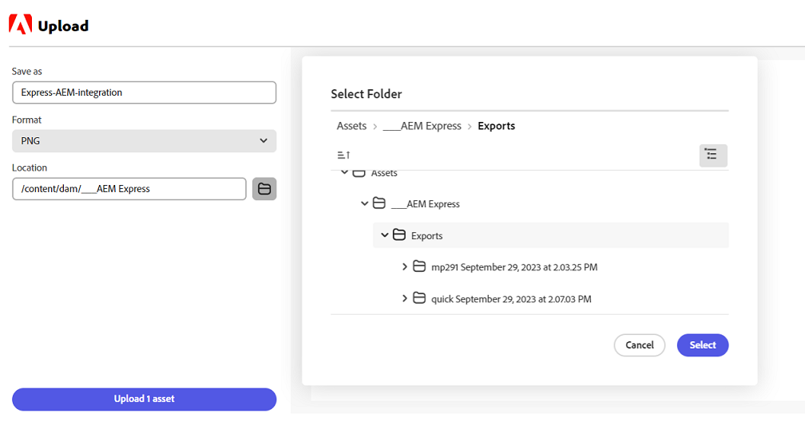

# Componente aggiuntivo AEM Assets per Adobe Express {#assets-addon-adobe-express}

Il componente aggiuntivo AEM Assets, ad Adobe Express, consente di accedere direttamente alle risorse memorizzate in AEM Assets dall’interfaccia utente di Adobi Express. Puoi inserire il contenuto gestito in AEM Assets nell’area di lavoro di Express e quindi salvare il contenuto nuovo o modificato in un archivio AEM Assets. Il componente aggiuntivo offre i seguenti vantaggi chiave:

* Maggiore riutilizzo dei contenuti grazie alla modifica e al salvataggio di nuove risorse in AEM

* Riduzione del tempo e dell&#39;impegno necessari per creare nuove risorse o nuove versioni di risorse esistenti

## Prerequisiti {#prerequisites}

Diritti di accesso ad Adobi Express e ad almeno un ambiente in AEM Assets. L’ambiente può essere uno qualsiasi degli archivi in Assets as a Cloud Service o Assets Essentials.

## Aggiungere il componente aggiuntivo AEM Assets a Adobi Express {#access-assets-addon}

Per aggiungere il componente aggiuntivo AEM Assets a un Adobe Express, effettua le seguenti operazioni:

1. Apri l’applicazione web Adobi Express.

1. Apri una nuova area di lavoro vuota caricando un nuovo modello o progetto oppure creando una nuova risorsa.

1. Clic **[!UICONTROL Componenti aggiuntivi]** disponibile nel riquadro di navigazione a sinistra.

1. Specifica **[!UICONTROL AEM Assets]** nella barra di ricerca disponibile nella parte superiore della [!UICONTROL Componenti aggiuntivi] e fai clic sul componente aggiuntivo AEM Assets.

   

1. Clic **[!UICONTROL Aggiungi]**. Il componente aggiuntivo viene visualizzato nell&#39;elenco di **[!UICONTROL Componenti aggiuntivi]** sezione. Fare di nuovo clic sul componente aggiuntivo per visualizzare il contenuto nel riquadro di spostamento a destra. Il componente aggiuntivo visualizza l’elenco degli archivi a cui hai diritto e l’elenco delle risorse e cartelle disponibili a livello principale.

   Utilizza la barra di ricerca per cercare le risorse da utilizzare nell’area di lavoro.

   

   A. Seleziona il tuo AEM Assets Repository B. Cerca le risorse utilizzando la barra di ricerca C. Ordina le risorse in ordine crescente o decrescente D. Le risorse e le cartelle disponibili nella posizione selezionata. E. Salvare le modifiche in AEM Assets

## Utilizzare AEM Assets nell’editor di Adobi Express {#use-aem-assets-in-express}

Dopo aver aggiunto il componente aggiuntivo AEM Assets ad Adobi Express, puoi iniziare a utilizzare le immagini PNG e JPEG memorizzate nell’archivio AEM Assets all’interno dell’area di lavoro Express. Passa alla cartella appropriata e fai clic sulla risorsa per includerla nell’area di lavoro.

## Salvare progetti di Adobe Express in AEM Assets {#save-express-projects-in-assets}

Dopo aver incorporato le modifiche appropriate nell’area di lavoro di Express, puoi salvarla nell’archivio di AEM Assets.

1. Clic **[!UICONTROL Salva]** per aprire **[!UICONTROL Carica]** .
1. Specifica un nome e un formato per la risorsa. È possibile salvare il contenuto dell&#39;area di lavoro in formato PNG o JPEG.

1. Fai clic sull’icona della cartella accanto al **[!UICONTROL Posizione]** , passa alla posizione in cui devi salvare la risorsa e fai clic su **[!UICONTROL Seleziona]**. Il nome della cartella viene visualizzato nel **[!UICONTROL Posizione]** campo.

1. Clic **[!UICONTROL Carica]** per caricare la risorsa in AEM Assets.

   

