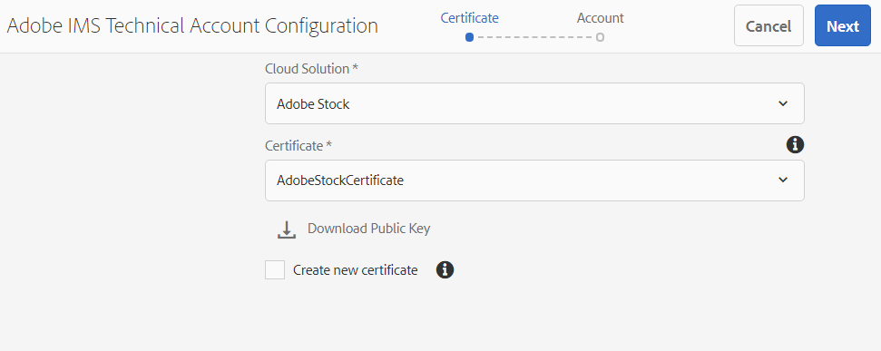
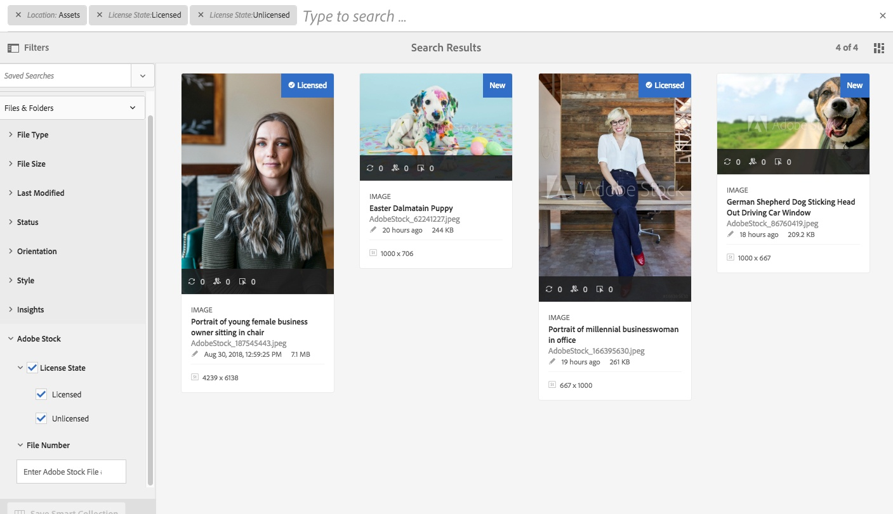

# Utilizzare [!DNL Adobe Stock] risorse in [!DNL Adobe Experience Manager Assets] {#use-adobe-stock-assets-in-aem-assets}

[!DNL Adobe Stock]Il servizio offre a designer e aziende l’accesso a milioni di foto, immagini vettoriali, illustrazioni, video, modelli e risorse 3D di alta qualità, curate ed esenti da royalty, per qualsiasi progetto creativo.

[!DNL Adobe Stock] per impostazione predefinita, l’offerta enterprise include i diritti di condivisione in tutta l’organizzazione. Una volta che una risorsa è stata concessa in licenza da un utente dell’organizzazione, altri utenti dell’organizzazione possono identificarla, scaricarla e utilizzarla senza doverla concedere nuovamente in licenza. Una volta che una risorsa è stata concessa in licenza dalla tua organizzazione, il diritto di utilizzarla è permanente.

Le organizzazioni possono integrare la propria azienda [!DNL Adobe Stock] pianificare con [!DNL Experience Manager Assets] garantire che le risorse concesse in licenza siano ampiamente disponibili per i progetti creativi e di marketing, con le potenti funzionalità di gestione delle risorse di [!DNL Experience Manager]. [!DNL Experience Manager] gli utenti possono trovare, visualizzare in anteprima e concedere in licenza le risorse Adobe Stock salvate in [!DNL Experience Manager], senza uscire dal [!DNL Experience Manager] di rete.

## Integrare [!DNL Experience Manager] e [!DNL Adobe Stock] {#integrate-aem-and-adobe-stock}

[!DNL Experience Manager Assets] consente agli utenti di eseguire ricerche, visualizzare in anteprima, salvare e concedere licenze [!DNL Adobe Stock] risorse direttamente da [!DNL Experience Manager].

**Prerequisiti**

L&#39;integrazione richiede:

* Una soluzione [!DNL Experience Manager Assets] as a [!DNL Cloud Service] istanza
* Un [enterprise [!DNL Adobe Stock] piano](https://stockenterprise.adobe.com/)
* Un utente con autorizzazioni in Admin Console al profilo di prodotto Stock predefinito
* Utente con autorizzazioni per il profilo Accesso per sviluppatori per la creazione di un’integrazione nella console Adobe Developer

Un&#39;azienda [!DNL Adobe Stock] piano,

* Fornisce l&#39;adesione al prodotto per [!DNL Adobe Stock] (Scorte connesse all’Experience Manager)
* Crediti acquistati in [!DNL Adobe Admin Console] per avere diritto alle azioni
* Abilita l’autenticazione dell’account di servizio (JWT) in [!DNL Adobe Developer Console] per avere diritto alle azioni
* Consente di gestire i crediti e le licenze a livello globale dall&#39;interno [!DNL Adobe Admin Console]

All’interno dell’adesione, un profilo di prodotto predefinito per [!DNL Adobe Stock] esiste in [!DNL Admin Console]. È possibile creare più profili, che determinano chi può concedere in licenza le risorse Stock. Un utente con accesso diretto al profilo di prodotto può accedere a [https://stock.adobe.com/](https://stock.adobe.com/) e licenze Stock assets. Esiste invece un altro metodo per utilizzare Developer Access per creare un’integrazione (API). Questa integrazione autentica la comunicazione tra [!DNL Experience Manager Assets] e [!DNL Adobe Stock].

>[!NOTE]
>
>L’autenticazione dell’account del servizio Stock (JWT) viene fornita con il diritto Enterprise Stock.
>
>L’integrazione non supporta l’autenticazione Oauth per l’adesione a Enterprise Stock.

<!--
### Create an IMS configuration {#create-an-ims-configuration}

1. In the [!DNL Experience Manager] user interface, navigate to **[!UICONTROL Tools]** > **[!UICONTROL Security]** > **[!UICONTROL Adobe IMS Configurations]**. Click **[!UICONTROL Create]** and select **[!UICONTROL Cloud Solution]** > **[!UICONTROL Adobe Stock]**.
1. Either reuse an existing certificate or select **[!UICONTROL Create new certificate]**.
1. Click **[!UICONTROL Create certificate]**. Once created, download the public key. Click **[!UICONTROL Next]**. Leave the [!UICONTROL Adobe IMS Technical Account Configuration] screen open to provide the required values shortly.
1. Access [Adobe Developer Console](https://console.adobe.io). Ensure that your account has administrator permissions for the organization for which the integration is required.
1. Click **[!UICONTROL Create new project]** and click **[!UICONTROL Add API]**. Select **[!UICONTROL Adobe Stock]** from the list of APIs that are available to you. Select [!UICONTROL OAUTH 2.0 Web].
1. Provide **[!UICONTROL Default redirect URI]** and **[!UICONTROL Redirect URI pattern]** values. Click **[!UICONTROL Save configured API]**. Copy the generated ID and secret.
1. In [!UICONTROL Adobe IMS Technical Account Configuration] screen, provide the values in the boxes titled **[!UICONTROL Title]**, **[!UICONTROL Authorization Server]**, **[!UICONTROL API Key]**, **[!UICONTROL Client Secret]**, and **[!UICONTROL Payload]**. For detailed information about these values, see [JWT authentication quick start](https://www.adobe.io/authentication/auth-methods.html#!AdobeDocs/adobeio-auth/master/JWT/JWT.md).

-->
<!-- TBD: Update the URL to update the terminology when AIO team updates their documentation URL. Logged issue github.com/AdobeDocs/adobeio-auth/issues/63.
-->

<!--
### Create [!DNL Adobe Stock] configuration in [!DNL Experience Manager] {#create-adobe-stock-configuration-in-aem}

1. In the [!DNL Experience Manager], navigate to **[!UICONTROL Tools]** > **[!UICONTROL Cloud Services]** > **[!UICONTROL Adobe Stock]**.
1. Click **[!UICONTROL Create]** to create a configuration and associate it with your existing IMS Configuration. Select `PROD` as the environment parameter.
1. In **[!UICONTROL Licensed Assets Path]** field, leave a location as is. Do not change the location where you want to store the [!DNL Adobe Stock] assets.
1. Complete creation by adding all the required properties. Click **[!UICONTROL Save & Close]**.
1. Add [!DNL Experience Manager] users or groups, who can license the assets.

>[!NOTE]
>
>If there are multiple [!DNL Adobe Stock] configurations, select the desired configuration in User Preferences panel. To access the panel from Experience Manager home page, click the user icon and then click **[!UICONTROL User Preferences]** > **[!UICONTROL Stock Configuration]**.

-->

## Passaggi per l’integrazione [!DNL Experience Manager] e [!DNL Adobe Stock] {#integration-steps}

Per integrare [!DNL Experience Manager] e [!DNL Adobe Stock], esegui i seguenti passaggi nella sequenza elencata:

1. [Recuperare il certificato pubblico](#public-certificate)

   In entrata [!DNL Experience Manager], crea un account IMS e genera un certificato pubblico (chiave pubblica).

1. [Creare la connessione dell’account di servizio (JWT)](#createnewintegration)

   In entrata [!DNL Adobe Developer Console], crea un progetto per [!DNL Adobe Stock] organizzazione. Nel progetto, configura un’API utilizzando la chiave pubblica per creare una connessione a un account di servizio (JWT). Ottieni le credenziali dell’account di servizio e le informazioni sul payload JWT.

1. [Configurare l’account IMS](#create-ims-account-configuration)

   In entrata [!DNL Experience Manager], configura l’account IMS utilizzando le credenziali dell’account di servizio e il payload JWT.

1. [Configurare il servizio cloud](#configure-the-cloud-service)

   In entrata [!DNL Experience Manager], configura un [!DNL Adobe Stock] servizio cloud tramite l’account IMS.

### Creare una configurazione IMS {#create-an-ims-configuration}

La configurazione IMS autentica il [!DNL Experience Manager Assets] istanza di authoring con [!DNL Adobe Stock] diritto.

La configurazione IMS prevede due passaggi:

* [Recuperare il certificato pubblico](#public-certificate)
* [Configurare l’account IMS](#create-ims-account-configuration)

### Recuperare il certificato pubblico {#public-certificate}

La chiave pubblica (certificato) autentica il profilo di prodotto in Adobe Developer Console.

1. Accedi al tuo [!DNL Experience Manager Assets] istanza cloud.

1. Dalla sezione **[!UICONTROL Strumenti]** , passa a **[!UICONTROL Sicurezza]** > **[!UICONTROL Configurazioni Adobe IMS]**.

1. Nella pagina Configurazioni Adobe IMS, fai clic su **[!UICONTROL Crea]**. Il **[!UICONTROL Configurazione account tecnico Adobe IMS]** viene visualizzata la pagina.

1. In **[!UICONTROL Certificato]** , seleziona **[!UICONTROL Adobe Stock]** dal **[!UICONTROL Soluzione cloud]** elenco a discesa.

1. Puoi creare un certificato o riutilizzare un certificato esistente per la configurazione.

   Per creare un certificato, seleziona la **[!UICONTROL Crea nuovo certificato]** e specificare un **alias** per la chiave pubblica. L&#39;alias funge da nome della chiave pubblica.

1. Fai clic su **[!UICONTROL Crea certificato]**. Quindi, fai clic su **[!UICONTROL OK]** per generare la chiave pubblica.

1. Fai clic su **[!UICONTROL Scarica chiave pubblica]** e salvare il file della chiave pubblica (.crt) sul computer. La chiave pubblica viene utilizzata in seguito per configurare l’API per il tenant Brand Portal e generare le credenziali dell’account di servizio nella console Adobe Developer.

   Fai clic su **[!UICONTROL Avanti]**.

   

1. In **Account** , viene creato un account Adobe IMS che richiede le credenziali dell’account del servizio.

   Apri una nuova scheda e [creare una connessione dell’account di servizio (JWT) in Adobe Developer Console](#createnewintegration).

### Creare la connessione dell’account di servizio (JWT) {#createnewintegration}

Nella console Adobe Developer, i progetti e le API sono configurati a livello di organizzazione. La configurazione di un’API crea una connessione dell’account di servizio (JWT). Esistono due metodi per configurare l’API: generando una coppia di chiavi (chiavi privata e pubblica) o caricando una chiave pubblica. In questo esempio, le credenziali dell’account del servizio vengono generate caricando la chiave pubblica.

Per generare le credenziali dell’account di servizio e il payload JWT:

1. Accedi alla console Adobe Developer con i privilegi di amministratore di sistema. L’URL predefinito è [https://www.adobe.com/go/devs_console_ui](https://www.adobe.com/go/devs_console_ui).

   Accertati di aver selezionato l’organizzazione IMS (Stock entitlement) corretta dall’elenco a discesa (organizzazione).

1. Clic **[!UICONTROL Crea nuovo progetto]**. Per l’organizzazione viene creato un progetto vuoto con un nome generato dal sistema.

   Clic **[!UICONTROL Modifica progetto]**. Aggiornare il **[!UICONTROL Titolo progetto]** e **[!UICONTROL Descrizione]** e quindi fare clic su **[!UICONTROL Salva]**.

1. In **[!UICONTROL Panoramica del progetto]** , fare clic su **[!UICONTROL Aggiungi API]**.

1. In **[!UICONTROL Aggiungere una finestra API]**, seleziona **[!UICONTROL Adobe Stock]**. Fai clic su **[!UICONTROL Avanti]**.

1. In **[!UICONTROL Configurare API]** finestra, seleziona **[!UICONTROL Account di servizio (JWT)]** autenticazione. Fai clic su **[!UICONTROL Avanti]**.

   

1. Clic **[!UICONTROL Carica la chiave pubblica]**. Clic **[!UICONTROL Seleziona un file]** e carica la chiave pubblica (file .crt) scaricata in [ottenere un certificato pubblico](#public-certificate) sezione. Fai clic su **[!UICONTROL Avanti]**.

1. Verifica la chiave pubblica e fai clic su **[!UICONTROL Successivo]**.

1. Seleziona il valore predefinito **[!UICONTROL Adobe Stock]** profilo di prodotto e fai clic su **[!UICONTROL Salva API configurata]**.

1. Una volta configurata l’API, vieni reindirizzato alla pagina di panoramica API. Dalla barra di navigazione a sinistra in **[!UICONTROL Credenziali]**, fare clic sul pulsante **[!UICONTROL Account di servizio (JWT)]** opzione. Qui puoi visualizzare le credenziali ed eseguire azioni quali generare token JWT, copiare i dettagli delle credenziali e recuperare il segreto client.

1. Dalla sezione **[!UICONTROL Credenziali client]** , copia il **[!UICONTROL ID client]**.

   Clic **[!UICONTROL Recupera segreto client]** e copia **[!UICONTROL segreto client]**.

   

1. Accedi a **[!UICONTROL Genera JWT]** e copia il **[!UICONTROL Payload JWT]** informazioni.

Ora puoi utilizzare l’ID client (chiave API), il segreto client e il payload JWT per [configurare l’account IMS](#create-ims-account-configuration) in [!DNL Experience Manager Assets].

### Configurare l’account IMS {#create-ims-account-configuration}

È necessario disporre di [certificato](#public-certificate) e [credenziali dell’account di servizio (JWT)](#createnewintegration) per configurare l’account IMS.

Per configurare l’account IMS:

1. Apri la configurazione IMS e passa a **[!UICONTROL Account]** scheda. La pagina è rimasta aperta [ottenimento del certificato pubblico](#public-certificate).

1. Specifica un **[!UICONTROL titolo]** per l’account IMS.

   In **[!UICONTROL Server autorizzazioni]** , immetti l’URL: [https://ims-na1.adobelogin.com/](https://ims-na1.adobelogin.com/).

   Immetti l’ID client nel **[!UICONTROL Chiave API]** campo, **[!UICONTROL Segreto client]**, e **[!UICONTROL Payload]** (payload JWT) che hai copiato mentre [creazione della connessione dell’account di servizio (JWT)](#createnewintegration).

1. Fai clic su **[!UICONTROL Crea]**. Viene creata una configurazione dell’account IMS.

   

1. Seleziona la configurazione dell’account IMS e fai clic su **[!UICONTROL Verifica stato]**.

   Clic **[!UICONTROL Verifica]** nella finestra di dialogo. Una volta completata la configurazione, viene visualizzato un messaggio che informa che *Token recuperato correttamente*.

   

### Configurare il servizio cloud {#configure-the-cloud-service}

Per configurare [!DNL Adobe Stock] servizio cloud:

1. In [!DNL Experience Manager] interfaccia utente, passa a **[!UICONTROL Strumenti]** > **[!UICONTROL Cloud Services]** > **[!UICONTROL Adobe Stock]**.

1. In [!DNL Adobe Stock Configurations] pagina, fai clic su **[!UICONTROL Crea]**.

1. Specifica un **[!UICONTROL Titolo]** per la configurazione cloud.

   Seleziona la configurazione IMS creata durante [configurazione dell’account IMS](#create-ims-account-configuration).

   Seleziona la lingua dall’elenco a discesa.

   

1. Fai clic su **[!UICONTROL Salva e chiudi]**.

   Il tuo [!DNL Experience Manager Assets] l’istanza di authoring è ora integrata con [!DNL Adobe Stock]. È possibile creare più [!DNL Adobe Stock] configurazioni (ad esempio, configurazioni basate sulle impostazioni internazionali). Ora puoi accedere, cercare e concedere la licenza al [!DNL Adobe Stock] risorse all&#39;interno del [!DNL Experience Manager] dell&#39;utente.

   

   >[!NOTE]
   >
   >In questa fase dell’integrazione, solo gli amministratori possono accedere al [!DNL Adobe Stock] risorse, cerca le risorse Stock (utilizzando omnisearch) e concede la licenza per [!DNL Adobe Stock] risorse.
   >
   >Gli amministratori possono aggiungere ulteriori utenti o gruppi al [!DNL Adobe Stock] cloud service e assegnare le autorizzazioni a questi utenti non amministratori in [!DNL Experience Manager] per accedere alla configurazione Stock.

1. Per aggiungere utenti o gruppi, seleziona la [!DNL Adobe Stock] configurazione cloud e clic su **[!UICONTROL Proprietà]**.

1. Cerca per aggiungere gli utenti o i gruppi ai quali hai assegnato le autorizzazioni per accedere alla configurazione di Adobe Stock. Consulta [assegnare le autorizzazioni al gruppo di utenti](#assign-permissions-to-group).

## Assegna autorizzazioni a gruppo di utenti {#assign-permissions-to-group}

Gli amministratori possono creare gruppi di utenti e concedere autorizzazioni ad alcuni utenti o gruppi per accedere al [!DNL Adobe Stock] servizio cloud.

Di seguito sono riportate le autorizzazioni necessarie affinché un utente possa cercare e concedere in licenza le risorse Adobe Stock:

* Configura il percorso: `/conf/global/settings/stock`
* Privilegi: `jcr:read`
* Tipo di autorizzazione: `Allow`

Puoi creare un gruppo di utenti o assegnare le autorizzazioni a un gruppo di utenti esistente. Le autorizzazioni possono essere assegnate dal [!DNL Experience Manager Assets] o dall&#39;interfaccia [!DNL User Admin] Console.

**Per fornire l&#39;accesso a un gruppo di utenti da [!DNL Experience Manager]:**

1. In [!DNL Experience Manager] interfaccia utente, passa a **[!UICONTROL Strumenti]** > **[!UICONTROL Sicurezza]** > **[!UICONTROL Gruppi]**. Crea un gruppo di utenti per [!DNL Adobe Stock].

1. Accedi a **[!UICONTROL Strumenti]** > **[!UICONTROL Sicurezza]** > **[!UICONTROL Autorizzazioni]**.

1. Cerca il gruppo di utenti nel pannello a sinistra e aggiungi nuovo **[!UICONTROL Voce di controllo di accesso]** per Adobe Stock.

   * Configura il percorso: `/conf/global/settings/stock`
   * Privilegi: `jcr:read`
   * Tipo di autorizzazione: `Allow`

   Fate clic su **[!UICONTROL Aggiungi]**.

   

1. Accedi a **[!UICONTROL Strumenti]** > **[!UICONTROL Cloud Services]** > **[!UICONTROL Adobe Stock]**. Seleziona la [!DNL Adobe Stock] configurazione cloud e clic su **[!UICONTROL Proprietà]**.

1. Aggiungi il gruppo utenti appena creato a [!DNL Adobe Stock] configurazione. Fai clic su **[!UICONTROL Salva e chiudi]**.

   

**Per fornire l’accesso a un utente da [!DNL User Admin Console]:**

1. Apri [!DNL Experience Manager] Admin Console utente. L’URL predefinito è `http://localhost:4502/userdamin`.

1. Nel pannello a sinistra, cerca l’utente immettendo il valore `user_id` o `name`. Fare doppio clic per aprire le proprietà utente.

1. Accedi a **[!UICONTROL Autorizzazioni]** scheda e consenti `read` autorizzazioni per [!DNL Adobe Stock] configurazione cloud: `/conf/global/settings/stock`.

   >[!CAUTION]
   >
   >Se la configurazione cloud non è consentita, l’utente può accedere solo a **[!UICONTROL Risorse]** nel [!DNL Experience Manager] di rete.
   >
   >Per consentire l’accesso a [!UICONTROL Risorse] e [!DNL Adobe Stock] risorse, assicurati che la configurazione cloud sia consentita per l’utente.

1. Clic **[!UICONTROL Salva]** per aggiornare le autorizzazioni.

   

1. Aggiungere l’utente o il gruppo al [!DNL Adobe Stock] configurazione cloud.

## Accedere alle risorse di Adobe Stock {#access-stock-assets}

Un utente non amministratore con autorizzazioni per [!DNL Adobe Stock] la configurazione cloud può cercare e concedere in licenza i [!DNL Adobe Stock] risorse da [!DNL Experience Manager] di rete.

L’utente deve eseguire un passaggio aggiuntivo di attivazione di [!DNL Adobe Stock] configurazione cloud prima dell’accesso [!DNL Adobe Stock] risorse. Si tratta di un’attività una tantum. Se all’utente sono assegnate autorizzazioni su più [!DNL Adobe Stock] configurazioni cloud, l’utente può selezionare la configurazione desiderata tra le **[!UICONTROL Preferenze utente]**.

Per attivare [!DNL Adobe Stock] configurazione cloud:

1. Accedi a [!DNL Experience Manager].

1. Fai clic sull’icona utente in alto a destra, quindi fai clic su **[!UICONTROL Le mie preferenze]**. Il **[!UICONTROL Preferenze utente]** viene visualizzata la finestra.

1. Seleziona il **[!UICONTROL Configurazione Stock]** dall’elenco a discesa e fai clic su **[!UICONTROL Accetta]** per attivare la configurazione.

   

1. Accedi a **[!UICONTROL Risorse]** > **[!UICONTROL Adobe Stock]**. Ora puoi visualizzare, cercare e concedere in licenza [!DNL Adobe Stock] risorse.

La tabella seguente spiega come funzionano le autorizzazioni utente durante l’accesso a [!DNL Adobe Stock] risorse:

| User | Gruppo | Autorizzazioni | Accetta configurazione Stock nelle preferenze utente | Accedere alle risorse | Accedere ad Adobe Stock |
| --- | --- | --- | --- | --- | --- |
| admin | N/D | Tutti i bundle  | N/D | Sì | Sì |
| test-doc1 | Utente DAM | /conf/global/settings/stock/cloud-config | Sì | Sì | Sì |
| test-doc1 | Utente DAM | /conf/global/settings/stock/cloud-config | No | Errore: impossibile caricare i dati | No |
| test-doc1 | Utente DAM | **consenti**: /conf/global/settings/stock **rifiuta**: /cloud-config | La configurazione Stock non è visibile | Sì | No |

## Utilizzare e gestire [!DNL Adobe Stock] risorse in [!DNL Experience Manager] {#usemanage}

Utilizzando questa funzionalità, le organizzazioni possono consentire agli utenti di lavorare utilizzando [!DNL Adobe Stock] risorse in [!DNL Experience Manager Assets]. Dall&#39;interno del [!DNL Experience Manager] dell&#39;interfaccia utente, gli utenti possono effettuare ricerche [!DNL Adobe Stock] risorse e concedere in licenza le risorse richieste.

Una volta [!DNL Adobe Stock] la risorsa è concessa in licenza in [!DNL Experience Manager], può essere utilizzato e gestito come una risorsa tipica. In entrata [!DNL Experience Manager], gli utenti possono cercare e visualizzare in anteprima le risorse; copiare e pubblicare le risorse; condividerle su [!DNL Brand Portal]; accedere alle risorse e utilizzarle tramite [!DNL Experience Manager] app desktop e così via.

![Cerca [!DNL Adobe Stock] risorse e filtrare i risultati dal tuo [!DNL Adobe Experience Manager] workspace](assets/adobe-stock-search-results-workspace.png)

**A.**[!DNL Adobe Stock] Cerca risorse simili a quelle di chi è fornito l’ID **B.** Cerca risorse corrispondenti alla tua selezione di forma o orientamento. **C.** Cerca uno o più dei tipi di risorse supportati **D.** Apri o comprimi il riquadro Filtri **E.** Procurati la licenza relativa e salva la risorsa selezionata in [!DNL Experience Manager]**F.**[!DNL Experience Manager] Salva la risorsa in applicando la filigrana **G.**[!DNL Adobe Stock] Sul sito web di , esplora le risorse simili a quella selezionata **H.**[!DNL Adobe Stock] Visualizza le risorse selezionate sul sito web di **I.** Numero di risorse selezionate proveniente dai risultati della ricerca **J.** Passaggio tra la vista a schede e la vista a elenco

### Trovare le risorse {#find-assets}

Il tuo [!DNL Experience Manager] utenti, possono cercare le risorse in entrambi, [!DNL Experience Manager] e [!DNL Adobe Stock]. Quando il percorso di ricerca non è limitato a [!DNL Adobe Stock], i risultati della ricerca da [!DNL Experience Manager] e [!DNL Adobe Stock] vengono visualizzati.

* Per cercare [!DNL Adobe Stock] risorse, fai clic su **[!UICONTROL Navigazione]** > **[!UICONTROL Risorse]** > **[!UICONTROL Cerca in Adobe Stock]**.

* Per cercare le risorse in [!DNL Adobe Stock] e [!DNL Experience Manager Assets], fare clic su Cerca .

In alternativa, inizia a digitare `Location: Adobe Stock` nella barra di ricerca per selezionare [!DNL Adobe Stock] risorse. [!DNL Experience Manager] offre funzionalità di filtro avanzate sulle risorse trovate, consentendo agli utenti di inserire rapidamente le risorse richieste utilizzando i filtri, ad esempio i tipi di risorse supportate, l’orientamento delle immagini e lo stato della licenza.

>[!NOTE]
>
>Risorse ricercate da [!DNL Adobe Stock] vengono visualizzati in [!DNL Experience Manager]. [!DNL Adobe Stock] le risorse vengono recuperate e memorizzate in [!DNL Experience Manager] solo dopo che un utente [salva una risorsa](/help/assets/aem-assets-adobe-stock.md#saveassets) o [concede licenze e salva una risorsa](/help/assets/aem-assets-adobe-stock.md#licenseassets). Risorse già memorizzate in [!DNL Experience Manager] vengono visualizzate ed evidenziate per semplificare la consultazione e l&#39;accesso. Inoltre, il [!DNL Stock] le risorse vengono salvate con alcuni metadati aggiuntivi per indicare come origine [!DNL Stock].

![Cerca filtri in [!DNL Experience Manager] ed evidenziato [!DNL Adobe Stock] risorse nei risultati di ricerca](assets/aem-search-filters2.jpg)

### Salva e visualizza le risorse richieste {#saveassets}

Seleziona una risorsa in cui vuoi salvare [!DNL Experience Manager]. Clic [!UICONTROL Salva] nella barra degli strumenti nella parte superiore e specifica il nome e la posizione della risorsa. Le risorse senza licenza vengono salvate localmente con una filigrana.

La prossima volta che cerchi delle risorse, quelle salvate vengono evidenziate con un contrassegno per indicare che sono disponibili in [!DNL Experience Manager Assets].

>[!NOTE]
>
>Le risorse aggiunte di recente presentano un badge Nuovo invece di Un badge Concesso in licenza.

### Ottieni licenza per risorse {#licenseassets}

Gli utenti possono richiedere una licenza [!DNL Adobe Stock] risorse utilizzando la quota delle loro [!DNL Adobe Stock] piano aziendale. Quando si concede in licenza una risorsa, questa viene salvata senza filigrana ed è disponibile per la ricerca e l’utilizzo in [!DNL Experience Manager Assets].

![Finestra di dialogo per la licenza e il salvataggio [!DNL Adobe Stock] risorse in [!DNL Experience Manager Assets]](assets/aem-stock_licenseandsave.jpg)

### Accedere ai metadati e alle proprietà delle risorse {#access-metadata-and-asset-properties}

Gli utenti possono accedere e visualizzare in anteprima i metadati, tra cui [!DNL Adobe Stock] proprietà dei metadati per le risorse salvate in [!DNL Experience Manager], e aggiungi **[!UICONTROL Riferimenti licenza]** per una risorsa. Tuttavia, gli aggiornamenti al riferimento della licenza non vengono sincronizzati tra [!DNL Experience Manager] e [!DNL Adobe Stock] sito Web.

Gli utenti possono visualizzare le proprietà sia per le risorse con licenza che per quelle senza licenza.

## Limitazioni note {#known-limitations}

* **La funzionalità per impedire agli utenti di concedere licenze non funziona correttamente**: tutti gli utenti con `read` le autorizzazioni per la configurazione stock sono consentite per cercare e concedere in licenza il [!DNL Adobe Stock] risorse.

* **Gli utenti non amministratori devono attivare manualmente [!DNL Adobe Stock] configurazione cloud**: nel **[!UICONTROL Preferenze utente]** finestra, il **[!UICONTROL Configurazione Stock]** mostra la [!DNL Adobe Stock] la configurazione cloud è abilitata, ma non funziona per un utente non amministratore. L’utente deve fare clic sul pulsante **[!UICONTROL Accetta]** per attivare la configurazione Stock. In assenza di questo passaggio, il sistema visualizza un messaggio di errore all&#39;accesso **[!UICONTROL Risorse]**.

* **L’avviso dell’immagine editoriale non viene visualizzato**: quando si concede la licenza a un’immagine, gli utenti non possono verificare se un’immagine è Solo per uso editoriale. Per evitare possibili abusi, gli amministratori possono disattivare dall’Admin Console l’accesso alle risorse editoriali.

* **Viene visualizzato un tipo di licenza errato**: in è possibile che venga visualizzato un tipo di licenza non corretto [!DNL Experience Manager] per una risorsa. Gli utenti possono accedere a [!DNL Adobe Stock] per visualizzare il tipo di licenza.

* **I campi di riferimento e i metadati non sono sincronizzati**: quando un utente aggiorna un campo di riferimento licenza, le informazioni di riferimento licenza vengono aggiornate in [!DNL Experience Manager] ma non sul [!DNL Adobe Stock] sito Web. Analogamente, se l’utente aggiorna i campi di riferimento sulla [!DNL Adobe Stock] , gli aggiornamenti non vengono sincronizzati in [!DNL Experience Manager].

<!--
## Use and manage [!DNL Adobe Stock] assets in [!DNL Experience Manager] {#usemanage}

Using this capability, organizations users can work using [!DNL Adobe Stock] assets in [!DNL Experience Manager Assets]. From within the [!DNL Experience Manager] user interface, users can search [!DNL Adobe Stock] assets and license the required assets.

Once an [!DNL Adobe Stock] asset is licensed in [!DNL Experience Manager], it can be used and managed like a typical asset. In [!DNL Experience Manager], the users can search and preview the assets; copy and publish the assets; share the assets on [!DNL Brand Portal]; access and use the assets via [!DNL Experience Manager] desktop app; and so on.
-->

<!--  

*Figure: Search for [!DNL Adobe Stock] assets and filter results from your [!DNL Experience Manager] interface.*

**A.** Search assets similar to the assets whose [!DNL Adobe Stock] ID is provided. **B.** Search assets that match your selection of shape or orientation. **C.** Search for one of more supported asset types **D.** Open or collapse the filters pane **E.** License and save the selected asset in [!DNL Experience Manager] **F.** Save the asset in [!DNL Experience Manager] with watermark **G.** Explore assets on [!DNL Adobe Stock] website that are similar to the selected asset **H.** View the selected assets on [!DNL Adobe Stock] website **I.** Number of selected assets from the search results **J.** Switch between Card view and List view -->

<!--
### Find assets {#find-assets}

Your [!DNL Experience Manager] users, can search for assets in both, [!DNL Experience Manager] and [!DNL Adobe Stock]. When the search location is not limited to [!DNL Adobe Stock], the search results from [!DNL Experience Manager] and [!DNL Adobe Stock] are displayed.

* To search for [!DNL Adobe Stock] assets, click **[!UICONTROL Navigation]** > **[!UICONTROL Assets]** > **[!UICONTROL Search Adobe Stock]**.

* To search for assets across [!DNL Adobe Stock] and [!DNL Experience Manager Assets], click search .

Alternatively, start typing `Location: Adobe Stock` in the search bar to select [!DNL Adobe Stock] assets. [!DNL Experience Manager] offers advanced filtering capabilities on the searched assets, allowing users to quickly zero-in on the required assets using filters, such as types of supported assets, image orientation, and licensed state.

>[!NOTE]
>
>Assets searched from [!DNL Adobe Stock] are just displayed in [!DNL Experience Manager]. [!DNL Adobe Stock] assets are fetched and stored in [!DNL Experience Manager] repository only after a user either [saves an asset](/help/assets/aem-assets-adobe-stock.md#saveassets) or [licenses and saves an asset](/help/assets/aem-assets-adobe-stock.md#licenseassets). Assets that are already stored in [!DNL Experience Manager] are displayed and highlighted for ease of reference and access. Also, the [!DNL Stock] assets are saved with some additional metadata to indicate the source as [!DNL Stock].

*Figure: Search filters in [!DNL Experience Manager] and highlighted [!DNL Adobe Stock] assets in search results.*

### Save and view the required assets {#saveassets}

Select an asset that you want to save in [!DNL Experience Manager]. Click [!UICONTROL Save] in the toolbar at the top and provide the name and location of the asset. The unlicensed assets are saved locally with a watermark.

Next time when you search for assets, the saved assets are highlighted with a badge, to indicate that such assets are available in [!DNL Experience Manager Assets].

>[!NOTE]
>
>The recently added assets display a New badge instead of Licensed badge.

### License assets {#licenseassets}

Users can license [!DNL Adobe Stock] assets by using the quota of their [!DNL Adobe Stock] enterprise plan. When you license an asset, it is saved without a watermark and is available for searching and using in [!DNL Experience Manager Assets].

*Figure: Dialog to license and save [!DNL Adobe Stock] assets in [!DNL Experience Manager Assets].*

### Access metadata and asset properties {#access-metadata-and-asset-properties}

Users can access and preview the metadata, including the [!DNL Adobe Stock] metadata properties for the assets saved in [!DNL Experience Manager], and add **[!UICONTROL License References]** for an asset. However, the updates to license reference are not synced between [!DNL Experience Manager] and [!DNL Adobe Stock] website.

Users can see the properties for both, licensed and unlicensed assets.

*Figure: View and access metadata and license references of saved assets.*

## Known limitations {#known-limitations}

* **Editorial image warning is not displayed**: When licensing an image, users cannot check if an image is Editorial Use Only. To prevent possible misuse, the administrators can turn off the access to editorial assets from the Admin Console.

* **Wrong license type is displayed**: It is possible that an incorrect license type is displayed in [!DNL Experience Manager] for an asset. Users can log into the [!DNL Adobe Stock] website to see the license type.

* **Reference fields and metadata are not synced**: When a user updates a license reference field, the license reference information is updated in [!DNL Experience Manager] but not on the [!DNL Adobe Stock] website. Similarly, if the user updates the reference fields on the [!DNL Adobe Stock] website, the updates are not synchronized in [!DNL Experience Manager].
-->

>[!MORELIKETHIS]
>
>* [Tutorial video sull’utilizzo di risorse Adobe Stock con Experience Manager Assets](https://experienceleague.adobe.com/docs/experience-manager-learn/assets/creative-workflows/adobe-stock.html)
>* [Guida al piano aziendale di Adobe Stock](https://helpx.adobe.com/enterprise/using/adobe-stock-enterprise.html)
>* [Domande frequenti su Adobe Stock](https://helpx.adobe.com/stock/faq.html)

