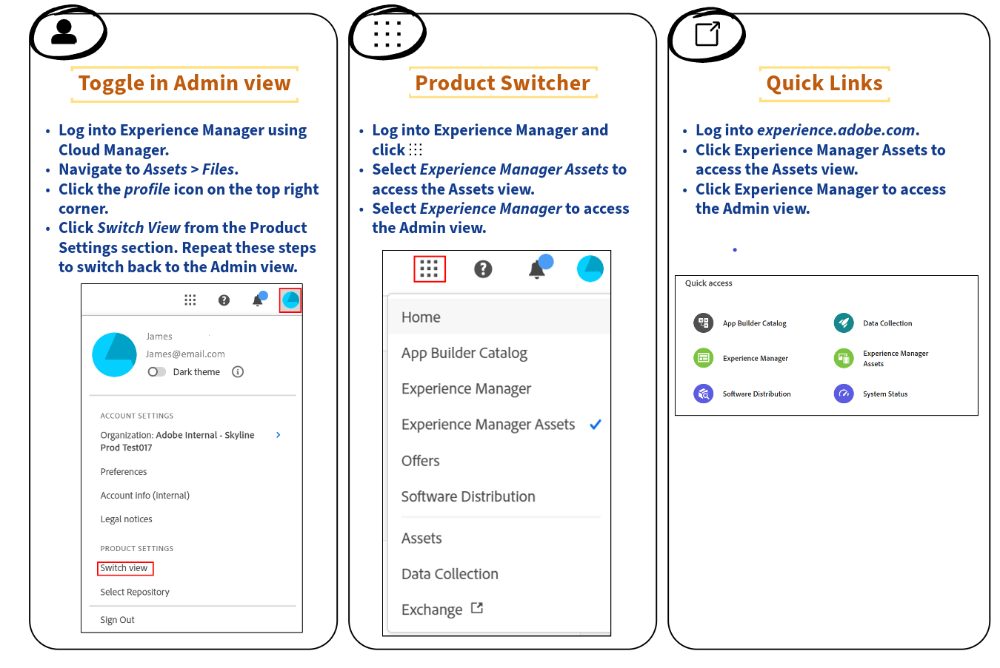

# Approvare risorse per Content Hub {#approve-assets-content-hub}

>[!AVAILABILITY]
>
>La guida di Content Hub è ora disponibile in formato PDF. Scarica l’intera guida e utilizza l’Assistente IA di Adobe Acrobat per rispondere alle tue domande.
>
>[!BADGE Guida di Content Hub - PDF]{type=Informative url="https://helpx.adobe.com/content/dam/help/en/experience-manager/aem-assets/content-hub.pdf"}

I Brand Manager e gli addetti al marketing mantengono un controllo rigoroso sulle risorse del brand. Solo la versione approvata e più recente della risorsa è disponibile per l’utilizzo in Content Hub, garantendo la coerenza del brand su tutti i canali e le applicazioni.

Puoi approvare le risorse utilizzando AEM Assets as a Cloud Service per semplificare la gestione delle risorse, garantendo un processo controllato ed efficiente.

## Prima di iniziare {#pre-requisites}

Prima di iniziare, è necessario disporre di:

* Accesso ad AEM Assets as a Cloud Service

* Autorizzazioni di scrittura per modificare i metadati della risorsa per poter modificare il campo **[!UICONTROL Stato]** disponibile nelle [proprietà della risorsa](/help/assets/manage-organize-assets-view.md##manage-asset-status) per una risorsa.

## Approvare risorse per Content Hub{#approve-assets-for-content-hub}

Le risorse contrassegnate come `approved` in Assets as a Cloud Service sono automaticamente disponibili in Content Hub.

>[!NOTE]
>
>Assets as a Cloud Service e Content Hub devono utilizzare la stessa organizzazione per visualizzare le risorse in Content Hub.

Per impostare lo stato della risorsa come `approved` utilizzando la vista Assets in AEM as a Cloud Service:

1. Seleziona la risorsa e fai clic su **[!UICONTROL Dettagli]** nella barra degli strumenti.

1. Nella scheda **[!UICONTROL Base]**, seleziona lo stato della risorsa come `approved` dall&#39;elenco a discesa **[!UICONTROL Stato]**.
1. Fai clic su **[!UICONTROL Salva]**.

   >[!VIDEO](https://video.tv.adobe.com/v/3433172)

Se devi approvare le risorse utilizzando la visualizzazione Amministratore, consulta [Approvare le risorse utilizzando la visualizzazione Amministratore](/help/assets/approve-assets.md#approve-assets).

## Approvare in blocco le risorse per Content Hub tramite la vista Assets {#bulk-approve-assets-content-hub}

Approva in blocco le risorse utilizzando la vista Assets per AEM Assets as a Cloud Service. Tutte le risorse, approvate in blocco, diventano disponibili in Content Hub.

Per approvare in blocco le risorse all’interno di una cartella nella vista Assets:

1. Seleziona le risorse e fai clic su **[!UICONTROL Modifica metadati in blocco]**.

1. Seleziona **[!UICONTROL Approvato]** nel campo **[!UICONTROL Stato]** disponibile nella sezione [!UICONTROL Proprietà] nel riquadro di destra.

1. Fai clic su **[!UICONTROL Salva]**.

## Impostare il target di approvazione {#set-approval-target}

La vista Assets consente di pubblicare le risorse approvate in Dynamic Media con funzionalità OpenAPI, Content Hub o entrambe in base al valore impostato nel campo **Destinazione approvazione** disponibile nella pagina Dettagli risorsa.

Per impostare il target di approvazione:

1. Seleziona la risorsa e fai clic su **[!UICONTROL Dettagli]** nella barra degli strumenti.

1. Nella scheda **[!UICONTROL Base]**, seleziona lo stato della risorsa dall&#39;elenco a discesa **[!UICONTROL Stato]**. I valori possibili sono Approvato, Rifiutato e Nessuno stato (impostazione predefinita).

1. Se nel passaggio 2 si seleziona **Approvato**, selezionare una destinazione di approvazione. I valori possibili includono Delivery e Content Hub.

   * **Delivery** è l&#39;opzione predefinita selezionata nel menu a discesa e pubblica la risorsa in [Dynamic Media con OpenAPI](/help/assets/dynamic-media-open-apis-overview.md) e [Content Hub](/help/assets/product-overview.md), se entrambi sono abilitati per Experience Manager Assets.

   * Selezionando **Content Hub** la risorsa viene pubblicata solo in Content Hub. Content Hub viene visualizzato come opzione solo se è abilitato per Experience Manager Assets.

   * Se non selezioni un’opzione dall’elenco a discesa, l’opzione predefinita abilitata per il tuo ambiente AEM as a Cloud Service viene applicata automaticamente alla risorsa.

   Per ulteriori informazioni sulle opzioni disponibili, consulta [Destinazione approvazione predefinita e destinazioni di pubblicazione per risorse approvate](#default-approval-target-options-publish-destinations).

   

1. Specifica altre proprietà della risorsa e fai clic su **[!UICONTROL Salva]**.

Alcuni punti aggiuntivi da notare includono:

* Quando non utilizzi il modulo metadati predefinito e non riesci a visualizzare il campo **[!UICONTROL Destinazione approvazione]**, [modifica il modulo metadati](/help/assets/metadata-assets-view.md#metadata-forms) per trascinare il campo **[!UICONTROL Approvazione per]** dai componenti disponibili al modulo metadati e fai clic su **[!UICONTROL Salva]**.

* Quando selezioni la destinazione di approvazione come `Content Hub` utilizzando la vista Assets, le risorse vengono rese disponibili in Content Hub agli utenti che fanno parte della stessa organizzazione.

### Destinazione di approvazione e destinazioni di pubblicazione predefinite per le risorse approvate {#default-approval-target-options-publish-destinations}

Nella tabella seguente sono illustrati i prerequisiti per la visualizzazione dell&#39;elenco a discesa `Approval Target` e del target di approvazione predefinito in base all&#39;abilitazione di DM con OpenAPI e Content Hub nell&#39;ambiente AEM as a Cloud Service:

| Dynamic Media con OpenAPI | Content Hub | Viene visualizzato l’elenco a discesa Approval Target (Destinazione approvazione)? | Target di approvazione predefinito per le risorse approvate | Destinazione di pubblicazione |
| --- | --- | --- | --- |---|
| Abilitato | Abilitato | Sì | Distribuzione | Dynamic Media con OpenAPI e Content Hub |
| Non abilitato | Abilitato | Sì | Content Hub | Content Hub |
| Abilitato | Non abilitato | Sì | Distribuzione | Dynamic Media con OpenAPI |
| Non abilitato | Non abilitato | No | N/D | N/D |

## Automatizzare l’approvazione per le nuove risorse acquisite nella visualizzazione Amministratore {#automate-approval-newly-ingested-assets}

Dopo il passaggio dalla vista Assets alla vista Amministratore, puoi impostare le impostazioni della cartella in modo che tutte le nuove risorse aggiunte alla cartella vengano approvate automaticamente.

Puoi passare dalla vista Amministratore alla vista Assets nei seguenti modi:

Segui questi passaggi per automatizzare l&#39;approvazione per le risorse appena acquisite in [!DNL Experience Manager Admin view]:

1. Crea una cartella nell’ambiente di authoring (https://author-pXXX-eYYY.adobeaemcloud.com). Sostituisci _XXX_ con il tuo ID programma e _YYY_ con l&#39;ID ambiente di Experience Manager.
1. Passa a **[!UICONTROL Strumenti]** > **[!UICONTROL Assets]** > **[!UICONTROL Profili metadati]**.
1. Fai clic su **[!UICONTROL Crea]** in alto a destra della pagina.
1. Aggiungi un titolo profilo e fai clic su **[!UICONTROL Crea]**. Il profilo metadati è stato creato correttamente.
1. Selezionare il profilo metadati appena creato e fare clic su **[!UICONTROL Modifica _(e)_]**.  Viene aperto il modulo **[!UICONTROL Modifica profilo metadati]**con la scheda **[!UICONTROL Base]**evidenziata.
1. Trascina e rilascia un **[!UICONTROL Campo di testo a riga singola]** dalla sezione **[!UICONTROL Genera modulo]** a destra alla sezione Metadati nel modulo.
1. Fai clic sul campo appena aggiunto, quindi esegui i seguenti aggiornamenti nel pannello **[!UICONTROL Impostazioni]**:
   1. Cambia l&#39;etichetta **[!UICONTROL Campo]** in _Assets approvato_.
   1. Aggiorna **[!UICONTROL Mappa sulla proprietà]** in _./jcr:content/metadata/dam :status_.
   1. Cambia il valore predefinito in _approvato_.

1. Analogamente al passaggio 6, trascinare un **[!UICONTROL Campo di testo a riga singola]** dalla sezione **[!UICONTROL Genera modulo]** a destra alla sezione Metadati nel modulo.
1. Fai clic sul campo appena aggiunto, quindi esegui i seguenti aggiornamenti nel pannello **[!UICONTROL Impostazioni]**:
   1. Cambia l&#39;etichetta **[!UICONTROL Campo]** in _Destinazione attivazione_.
   1. Aggiorna **[!UICONTROL Mappa sulla proprietà]** in _./jcr:content/metadata/dam :activationTarget_.
   1. Cambia il valore predefinito in _contentthub_.

1. Fai clic su **[!UICONTROL Salva]**.
1. Nella pagina **[!UICONTROL Profili metadati]**, seleziona il profilo metadati appena creato.
1. Fai clic su **[!UICONTROL Applica profilo metadati a cartelle]** nella barra delle azioni superiore.
1. Seleziona le cartelle da approvare e fai clic su **[!UICONTROL Applica]**.
     L&#39;autorizzazione per l&#39;intera cartella è impostata per l&#39;approvazione e tutte le risorse caricate in questa cartella vengono approvate automaticamente.

   >[!VIDEO](https://video.tv.adobe.com/v/3427431)

>[!NOTE]
> 
>Questo approccio approva le nuove risorse create nella cartella. Per le risorse esistenti nella cartella, devi selezionarle e approvarle manualmente.

## Gestire le risorse caricate tramite Content Hub {#manage-assets-uploaded-using-content-hub}

[Gli utenti di Content Hub con diritti di aggiunta risorse](/help/assets/deploy-content-hub.md#onboard-content-hub-users-add-assets) possono [aggiungere risorse a Content Hub](/help/assets/upload-brand-approved-assets.md) dal file system locale o importare risorse da origini dati OneDrive o Dropbox. Tutte le risorse vengono visualizzate al livello superiore in Content Hub, indipendentemente dalla struttura di cartelle disponibile nel file system locale o dalle origini dati di OneDrive e Dropbox, per migliorare le funzionalità di ricerca.

La visualizzazione delle risorse caricate tramite Content Hub dipende dal fatto che sia stato abilitato [l&#39;interruttore di approvazione automatica](/help/assets/configure-content-hub-ui-options.md#configure-import-options-content-hub):

* Se il pulsante di attivazione **[!UICONTROL Approvazione automatica]** è abilitato, le risorse caricate tramite Content Hub sono automaticamente disponibili.

* Se il pulsante di attivazione **[!UICONTROL Approvazione automatica]** è disattivato, le risorse caricate tramite Content Hub non vengono visualizzate automaticamente. Le risorse sono disponibili nella cartella `hydrated-assets` dell’ambiente Assets as a Cloud Service. Passa alla cartella e [modifica in blocco](#bulk-approve-assets-content-hub) lo stato di tali risorse in `Approved` per consentirne la visualizzazione in Content Hub.

