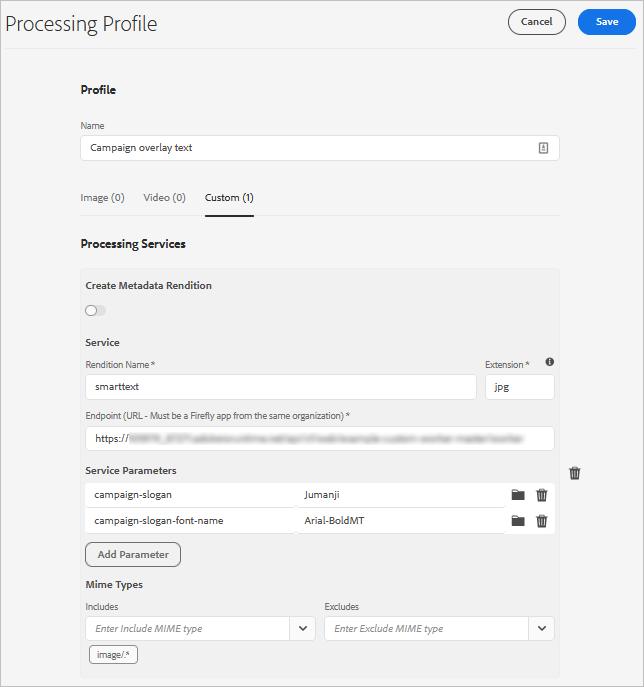
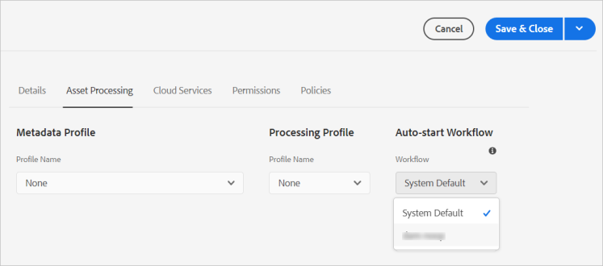

# Utilizzare i microservizi delle risorse e i profili di elaborazione {#get-started-using-asset-microservices}

I microservizi per le risorse forniscono un’elaborazione scalabile e resiliente delle risorse utilizzando applicazioni native per il cloud (denominati anche processi di lavoro). Adobe gestisce i servizi per una gestione ottimale di diversi tipi di risorse e opzioni di elaborazione.

I microservizi per le risorse consentono di elaborare [un&#39;ampia gamma di tipi di file](/help/assets/file-format-support.md) che coprono più formati predefiniti rispetto alle versioni precedenti di [!DNL Experience Manager]. Ad esempio, è ora possibile estrarre le miniature dei formati PSD e PSB, ma in precedenza richiedevano soluzioni di terze parti come [!DNL ImageMagick].

L&#39;elaborazione delle risorse dipende dalla configurazione in **[!UICONTROL Profili elaborazione]**. Experience Manager fornisce una configurazione di base predefinita e consente agli amministratori di aggiungere una configurazione di elaborazione delle risorse più specifica. Gli amministratori possono creare, gestire e modificare le configurazioni dei flussi di lavoro di post-elaborazione, inclusa la personalizzazione facoltativa. La personalizzazione dei flussi di lavoro consente agli sviluppatori di estendere l’offerta predefinita.

<!-- Proposed DRAFT diagram for asset microservices flow - see section "asset-microservices-flow.png (asset-microservices-configure-and-use.md)" in the PPTX deck

https://adobe-my.sharepoint.com/personal/gklebus_adobe_com/_layouts/15/guestaccess.aspx?guestaccesstoken=jexDC5ZnepXSt6dTPciH66TzckS1BPEfdaZuSgHugL8%3D&docid=2_1ec37f0bd4cc74354b4f481cd420e07fc&rev=1&e=CdgElS
-->

>[!NOTE]
>
>L&#39;elaborazione delle risorse qui descritta sostituisce il modello di flusso di lavoro `DAM Update Asset` esistente nelle versioni precedenti di [!DNL Experience Manager]. L’elaborazione dei microservizi per le risorse sostituisce la maggior parte dei passaggi standard relativi alla generazione di rappresentazioni e ai metadati e la configurazione del flusso di lavoro di post-elaborazione può sostituire gli eventuali passaggi rimanenti.

## Comprendere le opzioni di elaborazione delle risorse {#get-started}

[!DNL Experience Manager] consente i seguenti livelli di elaborazione.

| Opzione | Descrizione | Casi d’uso trattati |
|---|---|---|
| [Configurazione predefinita](#default-config) | È disponibile così com’è e non può essere modificato. Questa configurazione fornisce una funzionalità di base per la generazione delle rappresentazioni. | <ul> <li>Miniature standard utilizzate dall&#39;interfaccia utente [!DNL Assets] (48, 140 e 319 pixel) </li> <li> Anteprima grande (rappresentazione web - 1280 pixel) </li><li> Estrazione di metadati e testo.</li></ul> |
| [Configurazione personalizzata](#standard-config) | Configurato dagli amministratori tramite l’interfaccia utente di. Vengono fornite più opzioni per la generazione della rappresentazione estendendo l’opzione predefinita. Estendi l’opzione predefinita per fornire formati e rappresentazioni diversi. | <ul><li>Rendering FPO (solo per posizionamento). </li> <li>Modificare il formato e la risoluzione delle immagini</li> <li> Applicabile in modo condizionale ai tipi di file configurati. </li> </ul> |
| [Profilo personalizzato](#custom-config) | Configurato dagli amministratori tramite l&#39;interfaccia utente per utilizzare il codice personalizzato tramite applicazioni personalizzate per chiamare il servizio [Asset Compute](https://experienceleague.adobe.com/en/docs/asset-compute/using/introduction). Supporta requisiti più complessi in un metodo scalabile e nativo per il cloud. | Vedi [casi d&#39;uso consentiti](#custom-config). |

<!-- To create custom processing profiles specific to your custom requirements, say to integrate with other systems, see [post-processing workflows](#post-processing-workflows).
-->

## Formati di file supportati {#supported-file-formats}

I microservizi per le risorse supportano un’ampia varietà di formati di file per elaborare, generare rappresentazioni o estrarre metadati. Consulta [formati di file supportati](file-format-support.md) per l&#39;elenco completo dei tipi MIME e delle funzionalità supportate per ciascun tipo.

## Configurazione predefinita {#default-config}

Alcune impostazioni predefinite sono preconfigurate per garantire la disponibilità delle rappresentazioni predefinite richieste in Experience Manager. La configurazione predefinita garantisce inoltre la disponibilità delle operazioni di estrazione dei metadati e del testo. Gli utenti possono iniziare a caricare o aggiornare le risorse immediatamente e l’elaborazione di base è disponibile per impostazione predefinita.

Con la configurazione predefinita, viene configurato solo il profilo di elaborazione di base. Tale profilo di elaborazione non è visibile nell’interfaccia utente e non è possibile modificarlo. Viene sempre eseguito per elaborare le risorse caricate. Questo profilo di elaborazione predefinito garantisce il completamento dell&#39;elaborazione di base richiesta da [!DNL Experience Manager] per tutte le risorse.

<!-- 
-->

## Configurazione standard {#standard-config}

[!DNL Experience Manager] fornisce funzionalità per generare rappresentazioni più specifiche per i formati comuni in base alle esigenze dell&#39;utente. Un amministratore può creare ulteriori [!UICONTROL profili di elaborazione] per facilitare la creazione di copie trasformate. Gli utenti assegnano quindi uno o più profili disponibili a cartelle specifiche per eseguire l’elaborazione aggiuntiva. Ad esempio, l’elaborazione aggiuntiva può generare rappresentazioni per web, dispositivi mobili e tablet. [Guarda questo video per comprendere come creare e applicare [!UICONTROL Profili di elaborazione] e come accedere alle rappresentazioni create](https://experienceleague.adobe.com/en/docs/experience-manager-learn/assets/content-automation/creative-operations).

* **Larghezza e altezza rappresentazione**: le specifiche di larghezza e altezza della rappresentazione forniscono le dimensioni massime dell&#39;immagine di output generata. I microservizi per le risorse tentano di produrre la rappresentazione più grande possibile, con larghezza e altezza non superiori a quelle specificate, rispettivamente. Le proporzioni vengono mantenute, ovvero sono identiche a quelle dell&#39;originale. Un valore vuoto indica che l’elaborazione delle risorse assume la dimensione in pixel dell’originale.

* **Regole di inclusione del tipo MIME**: quando viene elaborata una risorsa con un tipo MIME specifico, il tipo MIME viene prima controllato rispetto al valore dei tipi MIME esclusi per la specifica della rappresentazione. Se corrisponde a tale elenco, la rappresentazione specifica non viene generata per la risorsa (elenco Bloccati). In caso contrario, il tipo MIME viene confrontato con il tipo MIME incluso e, se corrisponde all’elenco, viene generata la rappresentazione (elenco Consentiti).

* **Rendering FPO speciale**: quando si inseriscono risorse di grandi dimensioni da [!DNL Experience Manager] in [!DNL Adobe InDesign] documenti, un professionista del settore creativo attende molto tempo dopo aver [inserito una risorsa](https://helpx.adobe.com/indesign/using/placing-graphics.html). Nel frattempo, l&#39;utente non può utilizzare [!DNL InDesign]. Questo interrompe il flusso creativo e influisce negativamente sull’esperienza utente. Adobe consente di inserire temporaneamente copie trasformate di piccole dimensioni in [!DNL InDesign] documenti, che possono essere sostituiti da risorse a risoluzione completa in un secondo momento. [!DNL Experience Manager] fornisce copie trasformate utilizzate solo per il posizionamento. Queste copie trasformate FPO hanno dimensioni di file ridotte ma hanno le stesse proporzioni.

Il profilo di elaborazione può includere una rappresentazione FPO (solo per posizionamento). Consulta la [!DNL Adobe Asset Link] [documentazione](https://helpx.adobe.com/it/enterprise/using/manage-assets-using-adobe-asset-link.html) per capire se devi attivarla per il tuo profilo di elaborazione. Per ulteriori informazioni, consulta la [documentazione completa di Adobe Asset Link](https://helpx.adobe.com/it/enterprise/using/adobe-asset-link.html).

### Creare un profilo standard {#create-standard-profile}

1. Gli amministratori accedono a **[!UICONTROL Strumenti]** > **[!UICONTROL Assets]** > **[!UICONTROL Profili di elaborazione]**. Fai clic su **[!UICONTROL Crea]**.
1. Specifica un nome che ti aiuti a identificare in modo univoco il profilo quando applichi a una cartella.
1. Per generare le rappresentazioni dell&#39;oggetto Criteri di gruppo, nella scheda **[!UICONTROL Immagine]** abilitare **[!UICONTROL Crea rappresentazione oggetto Criteri di gruppo]**. Inserisci un valore **[!UICONTROL Quality]** da 1 a 100.
1. Per generare altre copie trasformate, fare clic su **[!UICONTROL Aggiungi nuovo]** e fornire le seguenti informazioni:

   * Nome file di ciascuna rappresentazione.
   * Formato file (PNG, JPEG, GIF o WebP) di ciascuna copia trasformata.
   * Larghezza e altezza in pixel di ciascuna rappresentazione. Se i valori non sono specificati, viene utilizzata la dimensione in pixel completa dell&#39;immagine originale.
   * Qualità in percentuale di ogni rappresentazione JPEG e WebP.
   * Tipi MIME inclusi ed esclusi per definire l’applicabilità di un profilo.

   

1. Fai clic su **[!UICONTROL Salva]**.

<!-- TBD: Update the video link when a new video is available from Tech Marketing.

The following video demonstrates the usefulness and usage of standard profile.

>[!VIDEO](https://video.tv.adobe.com/v/29832?quality=9)
-->

<!-- This image was removed per cqdoc-15624, as requested by engineering.
  
 -->

## Profilo personalizzato e casi d’uso {#custom-config}

[!DNL Asset Compute Service] supporta diversi casi d&#39;uso, inclusa l&#39;elaborazione predefinita e l&#39;elaborazione di formati specifici di Adobe come i file Photoshop. Consente inoltre di implementare un’elaborazione personalizzata o specifica per l’organizzazione. La personalizzazione del flusso di lavoro Risorsa di aggiornamento DAM richiesta in passato viene gestita automaticamente o tramite la configurazione dei profili di elaborazione. Se queste opzioni di elaborazione non soddisfano le esigenze aziendali, Adobe consiglia di sviluppare e utilizzare [!DNL Asset Compute Service] per estendere le funzionalità predefinite. Per una panoramica, vedi [comprendere l&#39;estensibilità e quando utilizzarla](https://experienceleague.adobe.com/en/docs/asset-compute/using/extend/understand-extensibility).

>[!NOTE]
>
>Adobe consiglia di utilizzare un’applicazione personalizzata solo quando i requisiti aziendali non possono essere soddisfatti utilizzando le configurazioni predefinite o il profilo standard.

Può trasformare immagini, video, documenti e altri formati di file in diverse rappresentazioni, tra cui miniature, testo e metadati estratti e archivi.

Gli sviluppatori possono utilizzare [!DNL Asset Compute Service] per [creare applicazioni personalizzate](https://experienceleague.adobe.com/en/docs/asset-compute/using/extend/develop-custom-application) per i casi d&#39;uso supportati. [!DNL Experience Manager] può richiamare queste applicazioni personalizzate dall&#39;interfaccia utente utilizzando profili personalizzati configurati dagli amministratori. [!DNL Asset Compute Service] supporta i seguenti casi d&#39;uso di chiamata di servizi esterni:

* Utilizza l&#39;[!DNL Adobe Photoshop]API ImageCutout[&#x200B; di &#x200B;](https://developer.adobe.com/photoshop/photoshop-api-docs/) e salva il risultato come rappresentazione.
* Chiama i sistemi di terze parti per apportare modifiche, ad esempio un sistema PIM.
* Utilizza l&#39;API [!DNL Photoshop] per generare diverse rappresentazioni basate sul modello Photoshop.
* Utilizza l&#39;[API Adobe Lightroom](https://developer.adobe.com/photoshop/photoshop-api-docs/) per ottimizzare le risorse acquisite e salvarle come rappresentazioni.

>[!NOTE]
>
>Non è possibile modificare i metadati standard utilizzando le applicazioni personalizzate. Puoi modificare solo i metadati personalizzati.

### Creare un profilo personalizzato {#create-custom-profile}

1. Gli amministratori accedono a **[!UICONTROL Strumenti]** > **[!UICONTROL Assets]** > **[!UICONTROL Profili di elaborazione]** > **[!UICONTROL Crea]**.
1. Nella pagina Profilo di elaborazione, fai clic sulla scheda **[!UICONTROL Personalizzato]**, quindi fai clic su **[!UICONTROL Aggiungi nuovo]**.
1. Nel campo di testo Nome, digita il nome file desiderato per la rappresentazione, quindi fornisci le seguenti informazioni.

   * Nome file di ciascuna copia trasformata e estensione di file supportata.
   * [URL endpoint di un&#39;app personalizzata App Builder](https://experienceleague.adobe.com/en/docs/asset-compute/using/extend/deploy-custom-application). L’app deve appartenere alla stessa organizzazione dell’account Experience Manager.
   * Aggiungere parametri di servizio a [passare ulteriori informazioni o parametri all&#39;applicazione personalizzata](https://experienceleague.adobe.com/en/docs/asset-compute/using/extend/develop-custom-application#extend).
   * Tipi MIME inclusi ed esclusi per limitare l’elaborazione ad alcuni formati di file specifici.

1. Fai clic su **[!UICONTROL Salva]** nell’angolo superiore destro della pagina.

Le applicazioni personalizzate sono app [Project App Builder](https://developer.adobe.com/app-builder/docs/overview/) headless. L’applicazione personalizzata ottiene tutti i file forniti se sono configurati con un profilo di elaborazione. L&#39;applicazione deve filtrare i file.

>[!CAUTION]
>
>Se l&#39;app App Builder e l&#39;account [!DNL Experience Manager] non appartengono alla stessa organizzazione, l&#39;integrazione non funziona.

### Esempio di profilo personalizzato {#custom-profile-example}

Per illustrare l’utilizzo del profilo personalizzato, consideriamo un caso d’uso per applicare del testo personalizzato alle immagini della campagna. Puoi creare un profilo di elaborazione che utilizza l’API Photoshop per modificare le immagini.

L&#39;integrazione del servizio Asset Compute consente ad Experience Manager di trasmettere questi parametri all&#39;applicazione personalizzata utilizzando il campo [!UICONTROL Parametri del servizio]. L’applicazione personalizzata chiama quindi l’API Photoshop e trasmette questi valori all’API. Ad esempio, puoi passare il nome del font, il colore del testo, lo spessore e la dimensione del testo per aggiungere il testo personalizzato alle immagini della campagna.

<!-- TBD: Check screenshot against the interface. -->

*Figura: utilizzare il campo [!UICONTROL Parametri servizio] per trasmettere informazioni aggiunte ai parametri predefiniti compilati nell&#39;applicazione personalizzata. In questo esempio, quando le immagini della campagna vengono caricate, le immagini vengono aggiornate con `Jumanji` testo nel font `Arial-BoldMT`.*

## Utilizzare i profili di elaborazione per elaborare le risorse {#use-profiles}

Crea e applica ulteriori profili di elaborazione personalizzati a cartelle specifiche. Questo flusso di lavoro consente ad Experience Manager di elaborare le risorse caricate o aggiornate in queste cartelle. Il profilo di elaborazione standard predefinito viene sempre eseguito ma non è visibile nell’interfaccia utente. Se aggiungi un profilo personalizzato, entrambi i profili vengono utilizzati per elaborare le risorse caricate.

Applica i profili di elaborazione alle cartelle utilizzando uno dei metodi seguenti:

* Gli amministratori possono selezionare una definizione di profilo di elaborazione in **[!UICONTROL Strumenti]** > **[!UICONTROL Assets]** > **[!UICONTROL Profili di elaborazione]** e utilizzare l&#39;azione **[!UICONTROL Applica profilo alle cartelle]**. Viene aperto un browser dei contenuti che consente di passare a cartelle specifiche e selezionarle, quindi confermare l’applicazione del profilo.
* Gli utenti possono selezionare una cartella nell&#39;interfaccia utente di Assets e utilizzare l&#39;azione **[!UICONTROL Proprietà]** per aprire la schermata delle proprietà della cartella. Nella scheda **[!UICONTROL Elaborazione risorse]** è possibile selezionare il profilo di elaborazione appropriato per la cartella dall&#39;elenco [!UICONTROL Profilo elaborazione]. Per salvare le modifiche, fai clic su **[!UICONTROL Salva e chiudi]**.
  

* Gli utenti possono selezionare cartelle o risorse specifiche nell&#39;interfaccia utente di Assets per applicare un profilo di elaborazione, quindi selezionare  **[!UICONTROL Opzione Rielabora Assets]** tra le opzioni disponibili nella parte superiore.

>[!TIP]
>
>A una cartella è possibile applicare un solo profilo di elaborazione. Per generare più rappresentazioni, aggiungi altre definizioni di rappresentazione al profilo di elaborazione esistente.

Dopo aver applicato un profilo di elaborazione a una cartella, tutte le nuove risorse caricate (o aggiornate) in questa cartella o in una delle sue sottocartelle vengono elaborate utilizzando il profilo di elaborazione aggiuntivo configurato. Questa elaborazione si aggiunge al profilo predefinito standard.

>[!NOTE]
>
>Un profilo di elaborazione applicato a una cartella funziona per l’intera struttura, ma può essere sostituito con un altro profilo applicato a una sottocartella. Quando le risorse vengono caricate in una cartella, Experience Manager controlla le proprietà della cartella contenitore per individuare un profilo di elaborazione. Se nessun profilo è applicato, viene selezionata una cartella principale nella gerarchia per un profilo di elaborazione da applicare.

Per verificare che le risorse siano state elaborate, visualizza l&#39;anteprima delle rappresentazioni generate nella visualizzazione [!UICONTROL Rappresentazioni] nella barra a sinistra. Apri l&#39;anteprima della risorsa e apri la barra a sinistra per accedere alla visualizzazione **[!UICONTROL Rappresentazioni]**. Le rappresentazioni specifiche nel profilo di elaborazione, per le quali il tipo di risorsa specifica corrisponde alle regole di inclusione del tipo MIME, devono essere visibili e accessibili.

*Figura: esempio di due rappresentazioni aggiuntive generate da un profilo di elaborazione applicato alla cartella principale.*

## Workflow di post-elaborazione {#post-processing-workflows}

In una situazione in cui è necessaria un’elaborazione aggiuntiva delle risorse che non può essere ottenuta utilizzando i Profili di elaborazione, è possibile aggiungere alla configurazione ulteriori flussi di lavoro di post-elaborazione. La post-elaborazione consente di aggiungere un’elaborazione completamente personalizzata oltre a quella configurabile utilizzando i microservizi per le risorse.

Al termine dell&#39;elaborazione dei microservizi, [!DNL Experience Manager] esegue automaticamente flussi di lavoro di post-elaborazione o [flussi di lavoro con avvio automatico](https://experienceleague.adobe.com/en/docs/experience-manager-learn/assets/configuring/auto-start-workflows), se configurati. Non è necessario aggiungere manualmente moduli di avvio dei flussi di lavoro per attivarli. Gli esempi includono:

* Passaggi personalizzati del flusso di lavoro per elaborare le risorse.
* Integrazioni per aggiungere metadati o proprietà alle risorse da sistemi esterni, ad esempio informazioni su prodotti o processi.
* L’elaborazione aggiuntiva viene eseguita da servizi esterni.

Per aggiungere una configurazione del flusso di lavoro di post-elaborazione a [!DNL Experience Manager], eseguire la procedura seguente:

* Crea uno o più modelli di flusso di lavoro. In questa documentazione questi modelli personalizzati sono denominati *modelli di flusso di lavoro di post-elaborazione*. Si tratta di [!DNL Experience Manager] modelli di flusso di lavoro regolari.
* Aggiungi i passaggi del flusso di lavoro richiesti a questi modelli. Esamina i passaggi del flusso di lavoro predefinito e aggiungi tutti i passaggi predefiniti richiesti al flusso di lavoro personalizzato. I passaggi vengono eseguiti sulle risorse in base alla configurazione di un modello di flusso di lavoro. Ad esempio, se desideri che l’assegnazione tag avanzati avvenga automaticamente al caricamento delle risorse, aggiungi il passaggio al modello di flusso di lavoro di post-elaborazione personalizzato.
* Aggiungi il passaggio [!UICONTROL Flusso di lavoro risorse di aggiornamento DAM completato] alla fine. L&#39;aggiunta di questo passaggio assicura che Experience Manager sappia quando termina l&#39;elaborazione e che la risorsa possa essere contrassegnata come elaborata, ovvero *Nuova* visualizzata sulla risorsa.
* Crea una configurazione per il servizio Custom Workflow Runner che consente di configurare l’esecuzione di un modello di flusso di lavoro di post-elaborazione in base a un percorso (percorso cartella) o a un’espressione regolare.

Per informazioni dettagliate sul passaggio del flusso di lavoro standard che può essere utilizzato nel flusso di lavoro di post-elaborazione, vedere [passaggi del flusso di lavoro di post-elaborazione](developer-reference-material-apis.md#post-processing-workflows-steps) nella documentazione per gli sviluppatori.

### Creare modelli di flusso di lavoro di post-elaborazione {#create-post-processing-workflow-models}

I modelli di flusso di lavoro di post-elaborazione sono [!DNL Experience Manager] modelli di flusso di lavoro regolari. Se hai bisogno di un’elaborazione diversa per posizioni di archivio o tipi di risorse diversi, puoi creare modelli diversi.

I passaggi di elaborazione vengono aggiunti in base alle esigenze. Puoi utilizzare i passaggi supportati disponibili ed eventuali passaggi del flusso di lavoro implementati su misura.

Verificare che l&#39;ultimo passaggio di ogni flusso di lavoro di post-elaborazione sia `DAM Update Asset Workflow Completed Process`. Il passaggio finale assicura che Experience Manager riconosca quando l’elaborazione delle risorse è completa.

### Configurare l’esecuzione di un flusso di lavoro di post-elaborazione {#configure-post-processing-workflow-execution}

Dopo che i microservizi per le risorse hanno completato l’elaborazione delle risorse caricate, puoi definire un flusso di lavoro di post-elaborazione per elaborare ulteriormente le risorse. Per configurare la post-elaborazione utilizzando i modelli di flusso di lavoro, effettuate una delle seguenti operazioni:

* [Applica un modello di flusso di lavoro nella cartella Proprietà](#apply-workflow-model-to-folder).
* [Configurare il servizio Workflow Runner personalizzato](#configure-custom-workflow-runner-service).

#### Applicare un modello di flusso di lavoro a una cartella {#apply-workflow-model-to-folder}

Per i casi di utilizzo tipici di post-elaborazione, considera l’utilizzo del metodo per applicare un flusso di lavoro a una cartella. Per applicare un modello di flusso di lavoro nella cartella [!UICONTROL Proprietà], eseguire la procedura seguente:

1. Crea un modello di flusso di lavoro.
1. Seleziona una cartella, fai clic su **[!UICONTROL Proprietà]** nella barra degli strumenti, quindi fai clic sulla scheda **[!UICONTROL Elaborazione Assets]**.
1. In **[!UICONTROL Avvia flusso di lavoro automatico]**, selezionare il flusso di lavoro richiesto, fornire un titolo del flusso di lavoro, quindi salvare le modifiche.

   

#### Configurare il servizio Custom Workflow Runner {#configure-custom-workflow-runner-service}

Puoi configurare il servizio Custom Workflow Runner per le configurazioni avanzate che non possono essere facilmente soddisfatte applicando un flusso di lavoro a una cartella. Ad esempio, un flusso di lavoro che utilizza un’espressione regolare. Adobe CQ DAM Custom Workflow Runner (`com.adobe.cq.dam.processor.nui.impl.workflow.CustomDamWorkflowRunnerImpl`) è un servizio OSGi. Per la configurazione sono disponibili le due opzioni seguenti:

* Flussi di lavoro di post-elaborazione per percorso (`postProcWorkflowsByPath`): è possibile elencare più modelli di flusso di lavoro, in base a percorsi di archivio diversi. Separa i percorsi e i modelli utilizzando i due punti. Sono supportati percorsi di archivio semplici. Mappare a un modello di workflow nel percorso `/var`. Ad esempio: `/content/dam/my-brand:/var/workflow/models/my-workflow`.
* Flussi di lavoro di post-elaborazione per espressione (`postProcWorkflowsByExpression`): è possibile elencare più modelli di flusso di lavoro, in base a espressioni regolari diverse. Separa le espressioni e i modelli con due punti. Puntare l’espressione regolare per puntare direttamente al nodo Risorsa e non a uno dei rendering o dei file. Ad esempio: `/content/dam(/.*/)(marketing/seasonal)(/.*):/var/workflow/models/my-workflow`.

Per informazioni su come distribuire una configurazione OSGi, vedere [distribuire in [!DNL Experience Manager]](/help/implementing/deploying/overview.md).

#### Disattiva esecuzione flusso di lavoro di post-elaborazione

Se la post-elaborazione non è necessaria, creare e utilizzare un modello di flusso di lavoro &quot;vuoto&quot; nella selezione **Avvia automaticamente flusso di lavoro**.

##### Creare il modello di flusso di lavoro con avvio automatico disattivato

1. Passa a **Strumenti** > **Flusso di lavoro** > **Modelli**.
1. Fai clic su **Crea** > **Crea modello** nella barra delle azioni superiore.
1. Specifica un titolo e un nome per il nuovo modello di flusso di lavoro, ad esempio:
   * Titolo: Disabilita flusso di lavoro con avvio automatico
   * Nome: disable-auto-start-workflow
1. Fai clic su **Fine** per creare il modello di flusso di lavoro.
1. Seleziona e modifica il modello di flusso di lavoro creato
1. Nell&#39;editor modelli flusso di lavoro, fare clic su **Passaggio 1** dalla definizione del modello ed eliminarlo.
1. Nel pannello laterale, fai clic su **Passaggi**.
1. Trascina il passaggio **Flusso di lavoro risorsa di aggiornamento DAM completato** nella definizione del modello.
1. Fai clic su **Informazioni pagina** (accanto all&#39;interruttore **Pannello laterale**), quindi fai clic su **Apri proprietà**.
1. Nella scheda Base fare clic su **Flusso di lavoro transitorio**.
1. Dalla barra delle azioni superiore, fai clic su **Salva e chiudi**.
1. Dalla barra delle azioni superiore, fai clic su **Sincronizza**.
1. Chiudi l’editor modelli di flusso di lavoro.

##### Applicare il modello di flusso di lavoro con avvio automatico disattivato

Segui i passaggi descritti in [Applica un modello di flusso di lavoro a una cartella](#apply-workflow-model-to-folder) e imposta **Disattiva flusso di lavoro con avvio automatico** come **Flusso di lavoro con avvio automatico** per le cartelle che non richiedono la post-elaborazione delle risorse.

## Best practice e limitazioni {#best-practices-limitations-tips}

* Durante la progettazione dei flussi di lavoro, considera le tue esigenze per tutti i tipi di rendering. Se non prevedi la necessità di una rappresentazione in futuro, rimuovi il relativo passaggio di creazione dal flusso di lavoro. Non è possibile eliminare le rappresentazioni in blocco in un secondo momento. Le rappresentazioni indesiderate potrebbero occupare una grande quantità di spazio di archiviazione dopo l&#39;uso prolungato di [!DNL Experience Manager]. Per le singole risorse, puoi rimuovere manualmente le rappresentazioni dall’interfaccia utente. Per più risorse, puoi personalizzare [!DNL Experience Manager] per eliminare rappresentazioni specifiche oppure eliminare le risorse e caricarle nuovamente.
* Attualmente, il supporto è limitato alla generazione di rappresentazioni. La generazione di una nuova risorsa non è supportata.
* Attualmente, il limite di dimensione del file per l’estrazione dei metadati è di circa 15 GB. Quando si caricano risorse di grandi dimensioni, a volte l’operazione di estrazione dei metadati non riesce.

**Consulta anche**

* [Traduci risorse](translate-assets.md)
* [API HTTP di Assets](mac-api-assets.md)
* [Formati di file supportati dalle risorse](file-format-support.md)
* [Cerca risorse](search-assets.md)
* [Risorse collegate](use-assets-across-connected-assets-instances.md)
* [Rapporti sulle risorse](asset-reports.md)
* [Schemi di metadati](metadata-schemas.md)
* [Scaricare le risorse](download-assets-from-aem.md)
* [Gestire i metadati](manage-metadata.md)
* [Facet di ricerca](search-facets.md)
* [Gestire le raccolte](manage-collections.md)
* [Importazione in blocco dei metadati](metadata-import-export.md)
* [Pubblicare risorse in AEM e Dynamic Media](/help/assets/publish-assets-to-aem-and-dm.md)

>[!MORELIKETHIS]
>
>* [Introduzione al servizio Asset Compute](https://experienceleague.adobe.com/en/docs/asset-compute/using/introduction).
>* [Comprendere l&#39;estensibilità e quando utilizzarla](https://experienceleague.adobe.com/en/docs/asset-compute/using/extend/understand-extensibility).
>* [Come creare applicazioni personalizzate](https://experienceleague.adobe.com/en/docs/asset-compute/using/extend/develop-custom-application).
>* [Tipi MIME supportati per vari casi d&#39;uso](/help/assets/file-format-support.md).

<!-- TBD: 
* How/where can admins check what's already configured and provisioned.
* How/where to request for new provisioning/purchase.
-->
