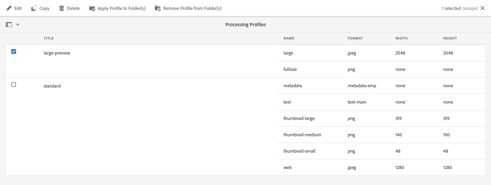

# Utilizzare i microservizi delle risorse e i profili di elaborazione {#get-started-using-asset-microservices}

<!--
* Current capabilities of asset microservices offered. If workers have names then list the names and give a one-liner description. (The feature-set is limited for now and continues to grow. So will this article continue to be updated.)
* How to access the microservices. UI. API. Is extending possible right now?
* Detailed list of what file formats and what processing is supported by which workflows/workers process.
* How/where can admins check what's already configured and provisioned.
* How to create new config or request for new provisioning/purchase.

* [DO NOT COVER?] Exceptions or limitations or link back to lack of parity with AEM 6.5.
-->

I microservizi delle risorse consentono l’elaborazione scalabile e resiliente delle risorse mediante i servizi cloud.  Adobe gestisce i servizi per una gestione ottimale dei diversi tipi di risorse e opzioni di elaborazione.

L’elaborazione delle risorse dipende dalla configurazione in Profili **[!UICONTROL di]** elaborazione, che fornisce una configurazione predefinita, e consente all’amministratore di aggiungere una configurazione di elaborazione delle risorse più specifica. Gli amministratori possono creare e mantenere le configurazioni dei flussi di lavoro post-elaborazione, inclusa la personalizzazione facoltativa. La personalizzazione dei flussi di lavoro consente estensibilità e personalizzazione completa.

I microservizi delle risorse consentono di elaborare una [vasta gamma di tipi](/help/assets/file-format-support.md) di file che coprono più formati out-of-the-box di quanto sia possibile con le versioni precedenti del Experience Manager . Ad esempio, l&#39;estrazione delle miniature dei formati PSD e PSB ora è possibile che soluzioni di terze parti come ImageMagick precedentemente richieste.

<!-- Proposed DRAFT diagram for asset microservices flow - see section "asset-microservices-flow.png (asset-microservices-configure-and-use.md)" in the PPTX deck

https://adobe-my.sharepoint.com/personal/gklebus_adobe_com/_layouts/15/guestaccess.aspx?guestaccesstoken=jexDC5ZnepXSt6dTPciH66TzckS1BPEfdaZuSgHugL8%3D&docid=2_1ec37f0bd4cc74354b4f481cd420e07fc&rev=1&e=CdgElS
-->

>[!NOTE]
>
>L’elaborazione delle risorse qui descritta sostituisce il modello di `DAM Update Asset` flusso di lavoro esistente nelle versioni precedenti di [!DNL Experience Manager]. La maggior parte della generazione di rappresentazioni standard e dei passaggi relativi ai metadati vengono sostituiti dall’elaborazione dei microservizi di risorse e gli eventuali passaggi rimanenti possono essere sostituiti dalla configurazione del flusso di lavoro di post-elaborazione.

## Comprendere le opzioni di elaborazione delle risorse {#get-started}

 Experience Manager consente i seguenti livelli di elaborazione.

| Opzione | Descrizione | Casi di utilizzo coperti |
|---|---|---|
| [Configurazione predefinita](#default-config) | È disponibile così come è e non può essere modificato. Questa configurazione fornisce funzionalità di generazione delle rappresentazioni di base. | <ul> <li>Miniature standard utilizzate dall’interfaccia [!DNL Assets] utente (48, 140 e 319 px) </li> <li> Anteprima grande (rappresentazione Web - 1280 px) </li><li> Estrazione di metadati e testo.</li></ul> |
| [Configurazione personalizzata](#standard-config) | Configurato dagli amministratori tramite l&#39;interfaccia utente. Offre più opzioni per la generazione della rappresentazione, estendendo l&#39;opzione predefinita. Estendete il lavoratore out-of-the-box per fornire formati e rappresentazioni diversi. | <ul><li>Rendering FPO. </li> <li>Modificare il formato file e la risoluzione delle immagini</li> <li> Applicabile in modo condizionale ai tipi di file configurati. </li> </ul> |
| [Profilo personalizzato](#custom-config) | Configurato dagli amministratori tramite l&#39;interfaccia utente per utilizzare il codice personalizzato tramite i lavoratori personalizzati per richiamare [Asset Compute Service](https://docs.adobe.com/content/help/en/asset-compute/using/introduction.html). Supporta requisiti più complessi in un metodo scalabile e nativo per il cloud. | Consultate [casi](#custom-config)di utilizzo consentiti. |

<!-- To create custom processing profiles specific to your custom requirements, say to integrate with other systems, see [post-processing workflows](#post-processing-workflows).
-->

## Formati di file supportati {#supported-file-formats}

I microservizi delle risorse supportano un’ampia varietà di formati di file per elaborare, generare rappresentazioni o estrarre metadati. Consulta i formati [di file](file-format-support.md) supportati per l&#39;elenco completo dei tipi MIME e le funzionalità supportate per ciascun tipo.

## Configurazione predefinita {#default-config}

Alcune impostazioni predefinite sono preconfigurate per garantire la disponibilità delle rappresentazioni predefinite richieste nel  Experience Manager. La configurazione predefinita garantisce inoltre la disponibilità di operazioni di estrazione dei metadati e di estrazione del testo. Gli utenti possono iniziare a caricare o aggiornare immediatamente le risorse e per impostazione predefinita è disponibile l’elaborazione di base.

Con la configurazione predefinita, è configurato solo il profilo di elaborazione di base. Tale profilo di elaborazione non è visibile nell&#39;interfaccia utente e non è possibile modificarlo. Viene sempre eseguito per elaborare le risorse caricate. Questo profilo di elaborazione predefinito garantisce che l&#39;elaborazione di base richiesta da [!DNL Experience Manager] venga completata su tutte le risorse.

<!-- 
-->

## Configurazione standard {#standard-config}

[!DNL Experience Manager] forniscono funzionalità per generare rappresentazioni più specifiche per i formati comuni in base alle esigenze dell&#39;utente. Un amministratore può creare ulteriori profili [!UICONTROL di] elaborazione per facilitare la creazione di tali rappresentazioni. Gli utenti quindi assegnano uno o più dei profili disponibili a cartelle specifiche per completare l’elaborazione aggiuntiva. Ad esempio, l&#39;elaborazione aggiuntiva può generare rappresentazioni per Web, dispositivi mobili e tablet. Il seguente video illustra come creare e applicare profili [!UICONTROL di] elaborazione e come accedere alle rappresentazioni create.

* **Larghezza e altezza** rappresentazione: Le specifiche relative a larghezza e altezza della rappresentazione forniscono le dimensioni massime dell’immagine di output generata. I microservizi risorse cercano di produrre la rappresentazione più grande possibile, che larghezza e altezza non sono maggiori rispettivamente della larghezza e dell’altezza specificate. Le proporzioni vengono mantenute, ovvero sono uguali a quelle dell’originale. Un valore vuoto indica che l&#39;elaborazione delle risorse assume la dimensione in pixel dell&#39;originale.

* **Regole** di inclusione del tipo MIME: Quando viene elaborata una risorsa con un tipo MIME specifico, il tipo MIME viene prima controllato rispetto al valore dei tipi MIME esclusi per la specifica di rappresentazione. Se corrisponde a tale elenco, questa rappresentazione specifica non viene generata per la risorsa (elenco Bloccati ). In caso contrario, il tipo MIME viene controllato rispetto al tipo MIME incluso e, se corrisponde all&#39;elenco, viene generata la rappresentazione ( elenco Consentiti).

* **Rappresentazioni** FPO speciali: Quando si inseriscono risorse di grandi dimensioni da [!DNL Experience Manager] a [!DNL Adobe InDesign] documenti, un creativo professionista attende molto tempo dopo aver [inserito una risorsa](https://helpx.adobe.com/indesign/using/placing-graphics.html). Nel frattempo, all&#39;utente viene impedito di utilizzare [!DNL InDesign]. Questo interrompe il flusso creativo e influisce negativamente sull&#39;esperienza dell&#39;utente.  Adobe consente di inserire temporaneamente rappresentazioni di piccole dimensioni nei [!DNL InDesign] documenti, che possono essere sostituite con risorse a risoluzione piena on-demand in un secondo momento. [!DNL Experience Manager] fornisce rappresentazioni utilizzate solo per il posizionamento (FPO). Tali rappresentazioni FPO hanno una dimensione file ridotta ma hanno le stesse proporzioni.

Il profilo di elaborazione può includere una rappresentazione FPO (solo per posizionamento). Consulta la [!DNL Adobe Asset Link] documentazione  per comprendere se è necessario attivarla per il profilo di elaborazione. Per ulteriori informazioni, consulta [documentazione](https://helpx.adobe.com/it/enterprise/using/adobe-asset-link.html)completa Adobe collegamento risorse.

### Crea profilo standard {#create-standard-profile}

Per creare un profilo di elaborazione standard, effettuate le seguenti operazioni:

1. Gli amministratori accedono a **[!UICONTROL Strumenti]** > **[!UICONTROL Risorse]** > Profili **** di elaborazione. Fai clic su **[!UICONTROL Crea]**.
1. Specificate un nome che consenta di identificare in modo univoco il profilo quando si applica a una cartella.
1. Per generare le rappresentazioni FPO, nella scheda **[!UICONTROL Standard]** abilitare **[!UICONTROL Crea rappresentazione]** FPO. Immettete un valore **[!UICONTROL Qualità]** compreso tra 1 e 100.
1. Per generare altre rappresentazioni, fate clic su **[!UICONTROL Aggiungi nuovo]** e fornite le seguenti informazioni:

   * Nome file di ogni rappresentazione.
   * Formato file (PNG, JPEG o GIF) di ciascuna rappresentazione.
   * Larghezza e altezza in pixel di ciascuna rappresentazione. Se i valori non sono specificati, viene usata la dimensione in pixel dell’immagine originale.
   * Qualità in percentuale di ciascuna rappresentazione JPEG.
   * Tipi MIME inclusi ed esclusi per definire l&#39;applicabilità di un profilo.

   

1. Fai clic su **[!UICONTROL Salva]**.

<!-- TBD: Update the video link when a new video is available from Tech Marketing.

The following video demonstrates the usefulness and usage of standard profile.

>[!VIDEO](https://video.tv.adobe.com/v/29832?quality=9)
-->

<!-- This image was removed per cqdoc-15624, as requested by engineering.
  
 -->

## Profilo personalizzato e casi di utilizzo {#custom-config}

<!-- **TBD items**:

* Overall cross-linking with the extensibility content.
* Mention how to get URL of worker. Worker URL for Dev, Stage, and Prod environments.
* Mention mapping of service parameters. Link to compute service article.
* Review from flow perspective shared in Jira ticket.
-->

Supporta una serie di [!DNL Asset Compute Service] casi di utilizzo, ad esempio l&#39;elaborazione predefinita, l&#39;elaborazione  formati specifici per i Adobi come i file Photoshop e l&#39;implementazione di un&#39;elaborazione personalizzata o specifica per l&#39;organizzazione. La personalizzazione del flusso di lavoro di DAM Update Asset richiesta in passato, viene gestita automaticamente o tramite la configurazione dei profili di elaborazione. Se queste opzioni di elaborazione non soddisfano le esigenze aziendali,  Adobe consiglia di sviluppare e utilizzare [!DNL Asset Compute Service] per estendere le funzionalità predefinite. Per una panoramica, consultate [Comprendere l’estensibilità e quando utilizzarla](https://docs.adobe.com/content/help/en/asset-compute/using/extend/understand-extensibility.html).

>[!NOTE]
>
> Adobe consiglia di utilizzare un lavoratore personalizzato solo quando non è possibile eseguire il lavoro utilizzando le configurazioni predefinite o il profilo standard.

Può trasformare immagini, video, documenti e altri formati di file in diverse rappresentazioni, come miniature, testo estratto e metadati e archivi.

Gli sviluppatori possono utilizzare il [!DNL Asset Compute Service] per [creare lavoratori](https://docs.adobe.com/content/help/en/asset-compute/using/extend/develop-custom-worker.html) personalizzati che si adattano ai casi di utilizzo supportati. [!DNL Experience Manager] può richiamare questi lavoratori personalizzati dall&#39;interfaccia utente utilizzando profili personalizzati che gli amministratori configurano. [!DNL Asset Compute Service] supporta i seguenti casi di utilizzo di servizi esterni:

* Utilizzate [!DNL Adobe Photoshop]l&#39;API [ImageCutout](https://github.com/AdobeDocs/photoshop-api-docs-pre-release#imagecutout) e salvate il risultato come rappresentazione.
* Richiama i sistemi di terze parti per aggiornare i dati, ad esempio un sistema PIM.
* Utilizzate [!DNL Photoshop] API per generare diverse rappresentazioni basate su modello Photoshop.
* Utilizzate [API](https://github.com/AdobeDocs/lightroom-api-docs#supported-features) Lightroom di Adobe per ottimizzare le risorse assimilate e salvarle come rappresentazioni.

>[!NOTE]
>
>Non è possibile modificare i metadati standard utilizzando i lavoratori personalizzati. Potete modificare solo i metadati personalizzati.

### Creare un profilo personalizzato {#create-custom-profile}

Per creare un profilo personalizzato, attenetevi alla procedura seguente:

1. Gli amministratori accedono a **[!UICONTROL Strumenti > Risorse > Profili]** di elaborazione. Fai clic su **[!UICONTROL Crea]**.
1. Click on **[!UICONTROL Custom]** tab. Fate clic su **[!UICONTROL Aggiungi nuovo]**. Specificate il nome file desiderato per la rappresentazione.
1. Fornite le seguenti informazioni.

   * Nome file di ogni rappresentazione e estensione file supportata.
   * URL punto finale di un&#39;app Firefly personalizzata. L&#39;app deve provenire dalla stessa organizzazione dell&#39;account del Experience Manager .
   * Aggiungete parametri [!UICONTROL di] servizio per trasmettere ulteriori informazioni o parametri al lavoratore personalizzato.
   * Tipi MIME inclusi ed esclusi per definire l&#39;applicabilità di un profilo.

   Fai clic su **[!UICONTROL Salva]**.

>[!CAUTION]
>
>Se l&#39;app Firefly e [!DNL Experience Manager] l&#39;account non appartengono alla stessa organizzazione, l&#39;integrazione non funziona.

### Esempio di profilo personalizzato {#custom-profile-example}

Per illustrare l&#39;utilizzo del profilo personalizzato, consideriamo un caso d&#39;uso per applicare del testo personalizzato alle immagini della campagna. Potete creare un profilo di elaborazione che sfrutta l&#39;API di Photoshop per modificare le immagini.

L&#39;integrazione di Asset Compute Service consente  Experience Manager di trasmettere questi parametri al lavoratore personalizzato utilizzando il campo [!UICONTROL Service Parameters] . Il lavoratore personalizzato richiama quindi l&#39;API di Photoshop e trasmette questi valori all&#39;API. Ad esempio, potete trasmettere il nome del font, il colore del testo, lo spessore del testo e la dimensione del testo per aggiungere il testo personalizzato alle immagini della campagna.

*Figura: Utilizzare il campo Parametri[!UICONTROL di]servizio per trasmettere informazioni aggiunte ai parametri predefiniti generati nel lavoratore personalizzato.*

Quando le immagini della campagna vengono caricate nella cartella alla quale è applicato questo profilo di elaborazione, le immagini vengono aggiornate con `Jumanji` del testo in `Arial-BoldMT` font.

## Utilizzo dei profili di elaborazione per elaborare le risorse {#use-profiles}

Potete creare e applicare profili di elaborazione personalizzati aggiuntivi a cartelle specifiche per  Experience Manager per elaborare le risorse caricate o aggiornate in queste cartelle. Il profilo di elaborazione standard predefinito viene sempre eseguito ma non è visibile nell&#39;interfaccia utente. Se aggiungete un profilo personalizzato, entrambi i profili vengono utilizzati per elaborare le risorse caricate.

Applicate i profili di elaborazione alle cartelle utilizzando uno dei seguenti metodi:

* Gli amministratori possono selezionare una definizione di profilo di elaborazione in **[!UICONTROL Strumenti]** > **[!UICONTROL Risorse]** > Profili **** di elaborazione e utilizzare l&#39;azione **[!UICONTROL Applica profilo alle cartelle]** . Viene aperto un browser del contenuto che consente di passare a cartelle specifiche, selezionarle e confermare l’applicazione del profilo.
* Users can select a folder in the Assets user interface, use **[!UICONTROL Properties]** action to open folder properties screen, click on the **[!UICONTROL Processing Profiles]** tab, and in the popup list, select the correct processing profile for that folder. Per salvare le modifiche, fate clic su **[!UICONTROL Salva e chiudi]**.

>[!NOTE]
>
>A una cartella specifica può essere applicato un solo profilo di elaborazione. Per generare più rappresentazioni, aggiungi più definizioni di rappresentazione al profilo di elaborazione esistente.

Dopo aver applicato un profilo di elaborazione a una cartella, tutte le nuove risorse caricate (o aggiornate) in questa cartella o in una delle sottocartelle vengono elaborate utilizzando il profilo di elaborazione aggiuntivo configurato. Questa elaborazione si aggiunge al profilo standard predefinito. Se applicate più profili a una cartella, le risorse caricate o aggiornate vengono elaborate utilizzando ciascuno di questi profili.

>[!NOTE]
>
>Un profilo di elaborazione applicato a una cartella funziona per l’intera struttura ad albero, ma può essere sostituito con un altro profilo applicato a una sottocartella. Quando le risorse vengono caricate in una cartella,  Experience Manager controlla le proprietà della cartella contenitore per un profilo di elaborazione. Se non ne viene applicata alcuna, viene controllata una cartella principale nella gerarchia per verificare se è necessario applicare un profilo di elaborazione.

Tutte le rappresentazioni generate sono disponibili nella vista [!UICONTROL Rappresentazioni] , nella parte sinistra. Aprite l&#39;anteprima della risorsa e aprite la barra a sinistra per accedere alla visualizzazione **[!UICONTROL Rappresentazioni]** . Le rappresentazioni specifiche nel profilo di elaborazione, per le quali il tipo di risorsa specifico corrisponde alle regole di inclusione del tipo MIME, devono essere visibili e accessibili.

*Figura: Esempio di due rappresentazioni aggiuntive generate da un profilo di elaborazione applicato alla cartella principale.*

## Flussi di lavoro di post-elaborazione {#post-processing-workflows}

Per situazioni in cui è necessaria un’ulteriore elaborazione delle risorse che non può essere ottenuta utilizzando i profili di elaborazione, alla configurazione possono essere aggiunti ulteriori flussi di lavoro di post-elaborazione. Questo consente di aggiungere un&#39;elaborazione completamente personalizzata al di sopra dell&#39;elaborazione configurabile tramite i microservizi delle risorse.

I flussi di lavoro post-elaborazione, se configurati, vengono eseguiti automaticamente da AEM al termine dell&#39;elaborazione dei microservizi. Non è necessario aggiungere manualmente gli avviatori del flusso di lavoro per attivarli. Gli esempi includono:

* Passaggi del flusso di lavoro personalizzati per l’elaborazione delle risorse.
* Integrazioni per aggiungere metadati o proprietà alle risorse da sistemi esterni, ad esempio informazioni su prodotti o processi.
* Elaborazione aggiuntiva eseguita da servizi esterni.

L&#39;aggiunta di una configurazione di flusso di lavoro post-elaborazione a  Experience Manager comprende i seguenti passaggi:

* Creare uno o più modelli di workflow. I documenti li menzionano come modelli *di flusso di lavoro* post-elaborazione, ma sono modelli di flusso di lavoro  Experience Manager standard.
* A questi modelli potete aggiungere specifici passaggi del flusso di lavoro. I passaggi vengono eseguiti sulle risorse in base alla configurazione di un modello di workflow.
* Aggiungi il passaggio [!UICONTROL DAM Update Asset Workflow (Flusso di lavoro aggiornamento risorse DAM completato)] al termine. L’aggiunta di questo passaggio fa sì che  Experience Manager sappia quando termina l’elaborazione e la risorsa possa essere contrassegnata come elaborata, ossia quando sulla risorsa viene visualizzato *Nuovo* .
* Create una configurazione per il servizio Custom Workflow Runner Service che consenta di configurare l&#39;esecuzione di un modello di flusso di lavoro post-elaborazione tramite un percorso (percorso della cartella) o mediante un&#39;espressione regolare.

### Creare modelli di flussi di lavoro post-elaborazione {#create-post-processing-workflow-models}

I modelli di flusso di lavoro post-elaborazione sono modelli AEM flusso di lavoro standard. Create modelli diversi se avete bisogno di un&#39;elaborazione diversa per diverse posizioni di repository o tipi di risorse.

Le fasi di elaborazione devono essere aggiunte in base alle esigenze. Potete utilizzare tutti i passaggi supportati disponibili, nonché eventuali passaggi di flusso di lavoro implementati personalizzati.

Assicurati che l&#39;ultimo passaggio di ogni flusso di lavoro di post-elaborazione sia `DAM Update Asset Workflow Completed Process`. L’ultimo passaggio consente di garantire che  Experience Manager sia a conoscenza del completamento dell’elaborazione delle risorse.

### Configurare l&#39;esecuzione del flusso di lavoro di post-elaborazione {#configure-post-processing-workflow-execution}

Per configurare i modelli di flusso di lavoro post-elaborazione da eseguire per le risorse caricate o aggiornate nel sistema al termine dell’elaborazione dei microservizi di risorse, è necessario configurare il servizio Custom Workflow Runner.

Il servizio Custom Workflow Runner (`com.adobe.cq.dam.processor.nui.impl.workflow.CustomDamWorkflowRunnerImpl`) è un servizio OSGi e offre due opzioni di configurazione:

* Flussi di lavoro di post-elaborazione per percorso (`postProcWorkflowsByPath`): È possibile elencare più modelli di workflow, basati su percorsi di repository diversi. I percorsi e i modelli devono essere separati da due punti. I percorsi dell&#39;archivio semplici sono supportati e devono essere mappati su un modello di workflow nel `/var` percorso. Esempio: `/content/dam/my-brand:/var/workflow/models/my-workflow`.
* Flussi di lavoro di post-elaborazione per espressione (`postProcWorkflowsByExpression`): È possibile elencare più modelli di flusso di lavoro, in base a diverse espressioni regolari. Le espressioni e i modelli devono essere separati da due punti. L&#39;espressione regolare deve puntare direttamente al nodo Asset, e non a una delle rappresentazioni o dei file. Esempio: `/content/dam(/.*/)(marketing/seasonal)(/.*):/var/workflow/models/my-workflow`.

>[!NOTE]
>
>La configurazione di Custom Workflow Runner è una configurazione di un servizio OSGi. Consultate [Implementare  Experience Manager](/help/implementing/deploying/overview.md) per informazioni su come distribuire una configurazione OSGi.
>La console Web OSGi, a differenza delle distribuzioni di AEM di servizi locali e gestiti, non è direttamente disponibile nelle distribuzioni di servizi cloud.

Per informazioni dettagliate sul passaggio del flusso di lavoro standard da utilizzare nel flusso di lavoro di post-elaborazione, consultate i passaggi del [flusso di lavoro nel flusso di lavoro](developer-reference-material-apis.md#post-processing-workflows-steps) di post-elaborazione (in riferimento allo sviluppatore).

## Best practice e limitazioni {#best-practices-limitations-tips}

* Considerate le vostre esigenze per tutti i tipi di rappresentazioni durante la progettazione di flussi di lavoro. Se non prevedete la necessità di una rappresentazione in futuro, rimuovete il passaggio di creazione dal flusso di lavoro. Le rappresentazioni non possono essere eliminate in blocco in seguito. Le rappresentazioni indesiderate possono occupare molto spazio di archiviazione dopo un uso prolungato di [!DNL Experience Manager]. Per le singole risorse, potete rimuovere manualmente i rendering dall’interfaccia utente. Per più risorse, potete personalizzare [!DNL Experience Manager] per eliminare rappresentazioni specifiche oppure eliminare le risorse e caricarle di nuovo.
* Al momento, il supporto è limitato alla generazione di rappresentazioni. La generazione di nuova risorsa non è supportata.

>[!MORELIKETHIS]
>
>* [Introduzione al servizio](https://docs.adobe.com/content/help/en/asset-compute/using/introduction.html)di calcolo delle risorse.
>* [Comprendere l&#39;estensibilità e quando utilizzarla](https://docs.adobe.com/content/help/en/asset-compute/using/extend/understand-extensibility.html).
>* [Come creare lavoratori](https://docs.adobe.com/content/help/en/asset-compute/using/extend/develop-custom-worker.html)personalizzati.

