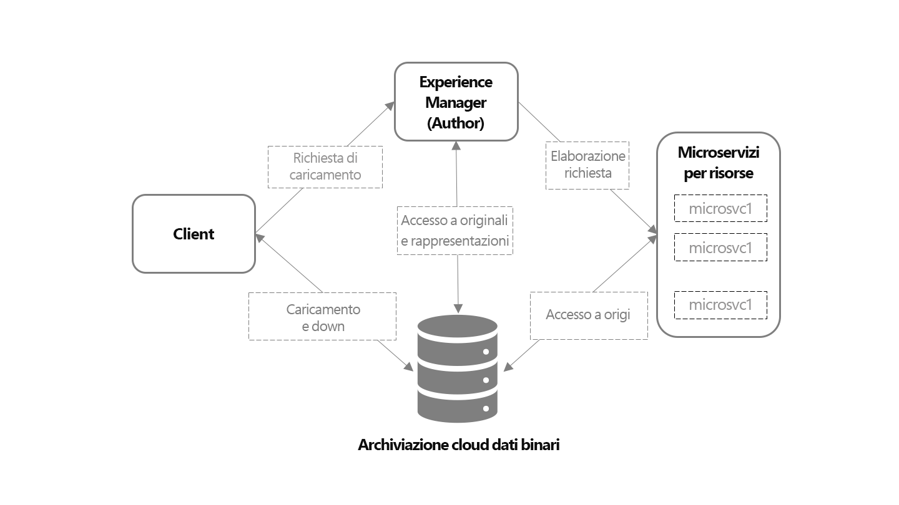

# Panoramica dell’acquisizione e dell’elaborazione delle risorse con i microservizi relativi {#asset-microservices-overview}

Adobe Experience Manager as a [!DNL Cloud Service] fornisce un metodo nativo per il cloud per sfruttare le applicazioni e le funzionalità di Experience Manager. Uno degli elementi chiave di questa nuova architettura è l’acquisizione e l’elaborazione delle risorse, basate sui microservizi per le risorse. I microservizi per le risorse forniscono un’elaborazione scalabile e flessibile delle risorse utilizzando servizi cloud. Adobe gestisce i servizi cloud per una gestione ottimale dei diversi tipi di risorse e opzioni di elaborazione. I vantaggi principali dei microservizi per le risorse native per il cloud sono:

* Architettura scalabile che consente un’elaborazione perfetta per le operazioni ad alta intensità di risorse.
* Indicizzazione ed estrazione del testo efficienti che non influiscono sulle prestazioni degli ambienti di Experience Manager.
* Riduci al minimo la necessità di flussi di lavoro per gestire l’elaborazione delle risorse nell’ambiente Experience Manager. Questo consente di liberare risorse, ridurre al minimo il carico sull’Experience Manager e fornisce scalabilità.
* Maggiore resilienza dell’elaborazione delle risorse. I potenziali problemi relativi alla gestione di file atipici, come file danneggiati o file di grandi dimensioni, non influiscono più sulle prestazioni della distribuzione.
* Configurazione semplificata dell’elaborazione delle risorse per gli amministratori.
* La configurazione di elaborazione delle risorse viene gestita e mantenuta da Adobe per fornire la configurazione più nota per la gestione di rappresentazioni, metadati ed estrazione del testo per vari tipi di file
* Se applicabile, si utilizzano servizi di elaborazione dei file in Adobe nativo, che forniscono un output ad alta fedeltà e una [gestione efficiente dei formati proprietari di Adobe](file-format-support.md).
* Possibilità di configurare un flusso di lavoro di post-elaborazione per aggiungere azioni e integrazioni specifiche per l’utente.

I microservizi per le risorse aiutano a evitare la necessità di strumenti e metodi di rendering di terze parti (come [!DNL ImageMagick] e transcodifica FFmpeg) e semplificano le configurazioni, fornendo al contempo le funzionalità di base per i formati di file comuni per impostazione predefinita.

## Architettura di alto livello {#asset-microservices-architecture}

Un diagramma di architettura di alto livello descrive gli elementi chiave dell’acquisizione, dell’elaborazione e del flusso delle risorse all’interno del sistema.

<!-- Proposed DRAFT diagram for asset microservices overview - see section "Asset processing - high-level diagram" in the PPTX deck

https://adobe-my.sharepoint.com/personal/gklebus_adobe_com/_layouts/15/guestaccess.aspx?guestaccesstoken=jexDC5ZnepXSt6dTPciH66TzckS1BPEfdaZuSgHugL8%3D&docid=2_1ec37f0bd4cc74354b4f481cd420e07fc&rev=1&e=CdgElS
-->

I passaggi chiave per l’acquisizione e l’elaborazione tramite i microservizi per le risorse sono i seguenti:

* I client, ad esempio browser web o Adobe Asset Link, inviano una richiesta di caricamento a [!DNL Experience Manager] e iniziano a caricare il binario direttamente nell’archivio cloud binario.
* Al termine del caricamento del binario diretto, il client ne informa [!DNL Experience Manager].
* [!DNL Experience Manager] invia una richiesta di elaborazione ai microservizi delle risorse. Il contenuto della richiesta dipende dalla configurazione dei profili di elaborazione in [!DNL Experience Manager] che specificano quali rappresentazioni generare.
* Il back-end dei microservizi per le risorse riceve la richiesta e la invia a uno o più microservizi in base alla richiesta. Ogni microservizio accede al binario originale direttamente dallo store cloud binario.
* I risultati dell’elaborazione, ad esempio le rappresentazioni, vengono memorizzati nell’archivio cloud binario.
* Ad Experience Manager viene notificato che l’elaborazione è completa insieme ai puntatori diretti ai binari generati (rappresentazioni). I rendering generati sono disponibili in [!DNL Experience Manager] per la risorsa caricata.

Questo è il flusso di base dell’acquisizione e dell’elaborazione delle risorse. Se configurato, Experience Manager può anche avviare un modello di flusso di lavoro personalizzato per la post-elaborazione della risorsa. Ad esempio, esegui passaggi personalizzati specifici per il tuo ambiente, come il recupero di informazioni da un sistema aziendale e l’aggiunta alle proprietà delle risorse.

Il flusso di acquisizione ed elaborazione è un concetto chiave dell’architettura dei microservizi delle risorse per Experience Manager.

* **Accesso binario diretto**: le risorse vengono trasportate (e caricate) nello store cloud binario, una volta configurato per gli ambienti di Experience Manager, e quindi [!DNL Experience Manager], i microservizi per le risorse e infine i client hanno accesso diretto a tali servizi per svolgere il loro lavoro. Questo riduce al minimo il carico sulle reti e la duplicazione dei binari archiviati
* **Elaborazione esterna**: l’elaborazione delle risorse viene eseguita al di fuori dell’ambiente [!DNL Experience Manager] e salva le sue risorse (CPU, memoria) per fornire funzionalità chiave di Digital Asset Management (DAM) e supportare il lavoro interattivo con il sistema per gli utenti finali

## Caricamento delle risorse con accesso binario diretto {#asset-upload-with-direct-binary-access}

I client di Experience Manager, che fanno parte dell’offerta di prodotti, supportano tutti i caricamenti con accesso binario diretto per impostazione predefinita, tra cui il caricamento mediante l’interfaccia web, Adobe Asset Link e [!DNL Experience Manager] l’app desktop.

Puoi utilizzare strumenti di caricamento personalizzati che funzionano direttamente con [!DNL Experience Manager] API HTTP. Puoi utilizzare queste API direttamente oppure utilizzare ed estendere i seguenti progetti open-source che implementano il protocollo di caricamento:

* [Libreria di caricamento open-source](https://github.com/adobe/aem-upload)
* [Strumento a riga di comando open source](https://github.com/adobe/aio-cli-plugin-aem)

Per ulteriori informazioni, consulta [Caricare le risorse](add-assets.md).

## Aggiungi post-elaborazione delle risorse personalizzate {#add-custom-asset-post-processing}

Sebbene la maggior parte dei clienti debba soddisfare tutte le esigenze di elaborazione delle risorse dai microservizi per le risorse configurabili, alcuni potrebbero aver bisogno di una loro ulteriore elaborazione. Ciò è particolarmente vero se le risorse devono essere elaborate in base alle informazioni provenienti da altri sistemi tramite integrazioni. In casi come questo, è possibile utilizzare flussi di lavoro di post-elaborazione personalizzati.

I flussi di lavoro di post-elaborazione sono regolari [!DNL Experience Manager] modelli di flusso di lavoro, creati e gestiti nell’[!DNL Experience Manager] Editor flusso di lavoro. I clienti possono configurare i flussi di lavoro per eseguire ulteriori passaggi di elaborazione su una risorsa, tra cui l’utilizzo dei passaggi di flusso di lavoro predefiniti disponibili e di quelli personalizzati.

È possibile configurare Adobe Experience Manager per attivare automaticamente i flussi di lavoro di post-elaborazione al termine dell’elaborazione delle risorse.

<!-- TBD asgupta, Engg: Create some asset-microservices-data-flow-diagram.
-->

**Consulta anche**

* [Traduci risorse](translate-assets.md)
* [API HTTP di Assets](mac-api-assets.md)
* [Formati di file supportati dalle risorse](file-format-support.md)
* [Cerca risorse](search-assets.md)
* [Risorse collegate](use-assets-across-connected-assets-instances.md)
* [Rapporti sulle risorse](asset-reports.md)
* [Schemi di metadati](metadata-schemas.md)
* [Scaricare le risorse](download-assets-from-aem.md)
* [Gestire i metadati](manage-metadata.md)
* [Facet di ricerca](search-facets.md)
* [Gestire le raccolte](manage-collections.md)
* [Importazione in blocco dei metadati](metadata-import-export.md)
* [Pubblicare risorse in AEM e Dynamic Media](/help/assets/publish-assets-to-aem-and-dm.md)

>[!MORELIKETHIS]
>
>* [Introduzione all’utilizzo dei microservizi per le risorse](asset-microservices-configure-and-use.md)
>* [Formati di file supportati](file-format-support.md)
>* [Adobe Asset Link](https://helpx.adobe.com/it/enterprise/using/adobe-asset-link.html)
>* [[!DNL Experience Manager] App desktop](https://experienceleague.adobe.com/docs/experience-manager-desktop-app/using/introduction.html?lang=it)
>* [Documentazione Apache Oak sull’accesso binario diretto](https://jackrabbit.apache.org/oak/docs/features/direct-binary-access.html)
