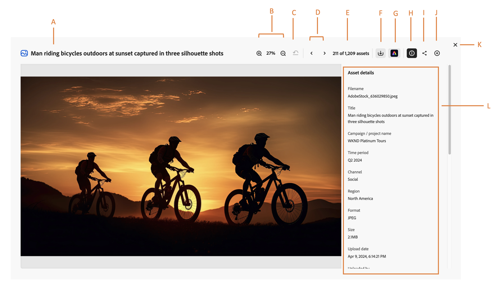

# Visualizzare l’anteprima della risorsa e delle relative proprietà in Content Hub {#asset-properties}

[!DNL The Content Hub] consente di visualizzare informazioni sulla risorsa, che sono fondamentali per una distribuzione efficiente delle risorse. Si tratta della raccolta di tutti i dati disponibili per una risorsa.

La visualizzazione dell’anteprima delle risorse e delle relative proprietà consente di categorizzare ulteriormente le risorse ed è utile in caso di aumento della quantità di informazioni digitali. Ricorrendo solo ai nomi dei file, alle miniature e alla memoria dell’utente, è possibile gestire alcune centinaia di file. Tuttavia, questo approccio non è scalabile quando aumentano il numero di persone coinvolte e il numero di risorse gestite. Inoltre, il valore di una risorsa digitale aumenta man mano che la risorsa diventa:

* Più accessibile: i sistemi e gli utenti possono trovarla facilmente.
* Più semplice da gestire: si dispone di informazioni complete sugli elementi visivi delle risorse e sulle relative informazioni, per potervi agire in modo più rapido e affidabile.
* Completo: la risorsa contiene più informazioni e contesto.

## Prerequisiti {#prerequisites}

[Gli utenti di Content Hub](deploy-content-hub.md#onboard-content-hub-users) possono eseguire le azioni indicate in questo articolo.

## Anteprima della risorsa e relative proprietà {#properties-ui}

Prima di utilizzare, condividere o scaricare una risorsa, puoi visualizzarla più da vicino. La funzione di anteprima consente di visualizzare non solo le immagini, ma anche alcuni altri tipi di risorse supportati. Oltre a visualizzare la risorsa, puoi visualizzarne le informazioni dettagliate e intraprendere altre azioni. Per visualizzare le informazioni di una risorsa, passa alla risorsa o [cerca](search-assets.md) la risorsa, quindi fai clic sulla risorsa per aprirne le proprietà. La figura seguente illustra i campi disponibili nella pagina delle proprietà di una risorsa:

* **A:** titolo di una risorsa
* **B:** Percentuale di risorse di zoom o anteprima più vicine mediante zoom avanti o indietro
* **C:** Annulla zoom alla percentuale selezionata in precedenza
* **D:** Passare alla risorsa precedente o successiva
* **E:** conteggio Assets
* **F:** scarica la risorsa
* **G:** Modifica risorsa tramite [!DNL Adobe Express]
* **H:** Comprimi o visualizza in anteprima le informazioni di una risorsa
* **I:** Condividi la risorsa
* **J:** Aggiungi risorsa a [!DNL Collection]
* **K:** Chiudi la schermata di anteprima
* **L:** informazioni di una risorsa che includono titolo, formato, dimensione, risoluzione, tag, tag colore e smart tag.

## Formati di risorse supportati {#supported-formats}

[!DNL Content Hub] supporta tutti i tipi e i formati di risorse supportati dall&#39;archivio [!DNL Assets] sottostante. Nella tabella seguente sono elencati i formati di file chiave in [!DNL the Content Hub], che forniscono supporto aggiuntivo per l&#39;anteprima visiva delle risorse:

<table> 
    <tbody>
     <tr>
      <th><strong>Tipo di file</strong></th>
      <th><strong>Formati supportati</strong></th>
     </tr>
     <tr>
        <td rowspan="3"> Immagine </td>
    </tr>
    </tr>
    <tr>
        <td>[!UICONTROL JPEG]</td>
    </tr>
    <tr>
        <td>[!UICONTROL PNG]</td>
    </tr>
    <tr>
        <td rowspan="4"> Video </td>
    </tr>
    </tr>
    <tr>
        <td>[!UICONTROL Quicktime]</td>
    </tr>
    <tr>
        <td>[!UICONTROL MP4]</td>
    </tr>
    <tr>
        <td>[!UICONTROL MPEG]</td>
    </tr>
    <tr>
        <td rowspan="4"> Documento </td>
    </tr>
    </tr>
    <tr>
        <td>[!UICONTROL txt] (semplice)</td>
    </tr>
    <tr>
        <td>[!UICONTROL Doc/Docx]</td>
    </tr>
    <tr>
        <td>[!UICONTROL XML]</td>
    </tr>
    <tr>
        <td rowspan="2"> Supporti di stampa </td>
    </tr>
    </tr>
    <tr>
        <td>[!UICONTROL PDF]</td>
    </tr>
    </tbody>
</table>

### Proprietà derivate {#derived-properties}

Alcune proprietà per le risorse visualizzate in [!DNL Content Hub] vengono derivate o generate automaticamente quando le risorse vengono caricate in [!DNL Assets] e quindi approvate per la disponibilità in [!DNL Content Hub]. Di seguito è riportato un elenco di alcuni di essi:

* **Dimensione:** La dimensione rappresenta la dimensione del binario di risorse archiviato nell&#39;archivio sottostante.

<!--* **Tags:** Tags help you categorize assets that can be browsed and searched more efficiently. Tagging helps in propagating the appropriate taxonomy to other users and workflows. -->

* **Tag avanzati:** [!DNL The Content Hub] utilizza i servizi di contenuti avanzati di Adobe AI per addestrare le risorse utilizzando l&#39;algoritmo di riconoscimento sulla struttura basata su tag. Questa content intelligence viene quindi utilizzata per applicare tag rilevanti a un diverso set di risorse. Grazie ai tag avanzati è possibile velocizzare le attività relative ai contenuti dei progetti grazie alla possibilità di trovare rapidamente le risorse rilevanti. Gli smart tag sono un esempio di informazioni sulla risorsa non contenute nell’immagine. [!DNL Experience Manager Assets] applica automaticamente i tag avanzati alle risorse per impostazione predefinita.

* **Tag colore:** [I tag colore](#https://experienceleague.adobe.com/docs/experience-manager-cloud-service/content/assets/manage/color-tag-images.html?lang=it) consentono di riconoscere una risorsa utilizzando colori identificati automaticamente in una risorsa mediante le funzionalità di intelligenza artificiale di Adobe.

* Data di caricamento

* Caricato da

* Ultima modifica

* Ultima modifica eseguita da

Sono inoltre disponibili proprietà specificate durante l’aggiunta di risorse a Content Hub. Per ulteriori informazioni, consulta [Aggiungere risorse approvate dal marchio a Content Hub](upload-brand-approved-assets.md). Tali proprietà vengono visualizzate anche nella pagina delle proprietà della risorsa.

Gli amministratori possono anche configurare le proprietà, visualizzate per ogni risorsa:

* Nell&#39;interfaccia utente di anteprima risorse: vedi [Configurare l&#39;interfaccia utente di Content Hub](configure-content-hub-ui-options.md#configure-asset-details-content-hub).
* Nelle schede delle risorse nei risultati di ricerca o nelle raccolte: vedere [Configurare l&#39;interfaccia utente di Content Hub](configure-content-hub-ui-options.md#asset-card).

<!--

### Date range {#date-range} 

The date range allows you to select dates you want to see the assets. You can customize date range by choosing the start and end dates. 

-->

## Domande frequenti {#faqs-asset-properties-content-hub}

### Perché visualizzi l’anteprima delle risorse e delle relative proprietà in AEM Assets Content Hub?

L’anteprima delle risorse e delle relative proprietà in AEM Assets Content Hub consente agli utenti di visualizzarne i dettagli, essenziali per una distribuzione e una gestione efficienti delle risorse. Con la crescita delle informazioni digitali, affidarsi semplicemente a nomi di file e miniature diventa inscalabile. La visualizzazione delle proprietà dettagliate consente di categorizzare le risorse, renderle più accessibili, semplificarne l’utilizzo e garantire la completezza delle informazioni per tutti gli utenti.

### Come posso visualizzare e interagire con le proprietà di una risorsa in AEM Assets Content Hub?

Per visualizzare le proprietà di una risorsa in AEM Assets Content Hub, accedi o cerca la risorsa, quindi fai clic su di essa per aprirne la pagina delle proprietà. Qui puoi ingrandire o ridurre l’anteprima, annullare lo zoom, passare alle risorse precedenti o successive, scaricare la risorsa, modificarla con Adobe Express, aggiungerla a una raccolta o chiudere l’anteprima. Nella pagina delle proprietà vengono visualizzate informazioni dettagliate quali titolo, formato, dimensioni, risoluzione, tag, tag colore e smart tag.

### Quali sono le proprietà derivate in AEM Assets Content Hub e come vengono generate?

Le proprietà derivate in AEM Assets Content Hub vengono generate automaticamente quando le risorse vengono caricate e approvate. Alcuni esempi includono le dimensioni della risorsa, i tag avanzati e i tag colore. I tag avanzati utilizzano i servizi di contenuti avanzati di Adobe AI per riconoscere e applicare automaticamente i tag rilevanti, migliorando l’individuazione delle risorse. I tag colore vengono inoltre identificati automaticamente tramite l’intelligenza artificiale, consentendo agli utenti di riconoscere le risorse in base ai loro colori prominenti.

### Gli amministratori possono personalizzare quali proprietà delle risorse sono visibili in AEM Assets Content Hub?

Sì, gli amministratori possono configurare le proprietà da visualizzare per ogni risorsa in AEM Assets Content Hub. Questa operazione può essere eseguita sia per l’interfaccia utente di anteprima delle risorse che per le schede delle risorse nei risultati di ricerca o nelle raccolte, in modo che gli utenti possano visualizzare le informazioni più rilevanti in base ai requisiti.

### Quali sono i formati di file supportati per l’anteprima delle risorse in AEM Assets Content Hub?

I formati di file supportati in AEM Assets Content Hub includono JPEG e PNG per le immagini, Quicktime, MP4 e MPEG per i video, TXT, DOC/DOCX e XML per i documenti e PDF per i supporti di stampa.

