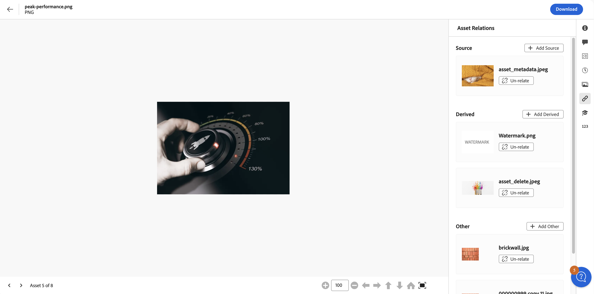

# Relazioni risorse {#related-assets}

[!DNL Adobe Experience Manager Assets] consente di correlare manualmente le risorse in base alle esigenze dell&#39;organizzazione utilizzando la funzionalità risorse correlate. Ad esempio, puoi correlare un file di licenza con una risorsa o un’immagine o un video su un argomento simile. Puoi correlare risorse che condividono alcuni attributi comuni. È inoltre possibile utilizzare la funzione per creare relazioni di origine/derivate tra le risorse. Se ad esempio si dispone di un file PDF generato da un file INDD, è possibile correlare il file PDF al relativo file INDD di origine.

Grazie a questa funzione, è possibile condividere un file PDF a bassa risoluzione o un file JPG con fornitori o agenzie e rendere disponibile il file INDD ad alta risoluzione solo su richiesta.

>[!NOTE]
>
>Solo gli utenti con autorizzazioni di modifica per le risorse possono correlare e scollegare le risorse.

## Passaggi per correlare le risorse {#steps-to-relate-assets}

1. Dall&#39;interfaccia [!DNL Experience Manager], apri la pagina **[!UICONTROL Proprietà]** per una risorsa da correlare.

   

1. Per correlare un&#39;altra risorsa alla risorsa selezionata, fare clic su **[!UICONTROL Relazioni risorse]** .
1. Effettua una delle seguenti operazioni:

   * Per correlare il file di origine della risorsa, selezionare **[!UICONTROL Aggiungi Source]** dall&#39;elenco. È possibile associare una sola risorsa come origine.
   * Per correlare un file derivato, selezionare **[!UICONTROL Aggiungi derivato]** dall&#39;elenco. È possibile associare più risorse in questa categoria.
   * Per creare una relazione bidirezionale tra le risorse, seleziona **[!UICONTROL Aggiungi altro]** dall&#39;elenco. È possibile associare più risorse in questa categoria.

1. Dalla schermata **[!UICONTROL Seleziona Assets]**, individua il percorso della risorsa da correlare e selezionala. È possibile selezionare una o più risorse tenendo premuto il tasto Maiusc mentre si fa clic su, che può includere uno dei [formati di file supportati in Assets View](/help/assets/supported-file-formats-assets-view.md).

   

1. Fai clic su **[!UICONTROL Seleziona]**. A seconda della relazione scelta al passaggio 3, la risorsa correlata viene elencata in una categoria appropriata nella sezione **[!UICONTROL Relazioni risorse]**. Se ad esempio la risorsa correlata è il file di origine della risorsa corrente, verrà elencata in **[!UICONTROL Source]**.

   

1. Fai clic su **[!UICONTROL Annulla correlazione]**  disponibili per tutte le risorse correlate in ogni sezione ([!UICONTROL Source], [!UICONTROL Derivato] e [!UICONTROL Altro]) per annullare la correlazione di una risorsa.

## Tradurre le risorse correlate {#translating-related-assets}

La creazione di relazioni origine/derivate tra risorse utilizzando la funzione risorse correlate è utile anche nei flussi di lavoro di traduzione. Quando esegui un flusso di lavoro di traduzione su una risorsa derivata, [!DNL Experience Manager Assets] recupera automaticamente qualsiasi risorsa a cui il file di origine fa riferimento e la include per la traduzione. In questo modo, la risorsa a cui fa riferimento la risorsa sorgente viene tradotta insieme alle risorse sorgente e derivate. Se il file di origine è correlato a un&#39;altra risorsa, [!DNL Experience Manager Assets] recupera la risorsa di riferimento e la include per la traduzione.

Vedi [Tradurre le risorse in AEM](/help/assets/translate-assets.md).

## Passaggi successivi {#next-steps}

* Fornisci feedback sui prodotti utilizzando l’opzione [!UICONTROL Feedback] disponibile nell’interfaccia utente della vista Risorse

* Fornisci feedback alla documentazione utilizzando [!UICONTROL Modifica questa pagina]  o [!UICONTROL Segnala un problema]  disponibile sulla barra laterale destra

* Contatta il [Servizio clienti](https://experienceleague.adobe.com/it?support-solution=General#support)

>[!MORELIKETHIS]
>
>* [Visualizzare le versioni di una risorsa](/help/assets/manage-organize-assets-view.md#view-versions)
>* [Traduci risorse in AEM](/help/assets/translate-assets.md)
>* [Formati di file supportati nella visualizzazione Assets](/help/assets/supported-file-formats-assets-view.md).
