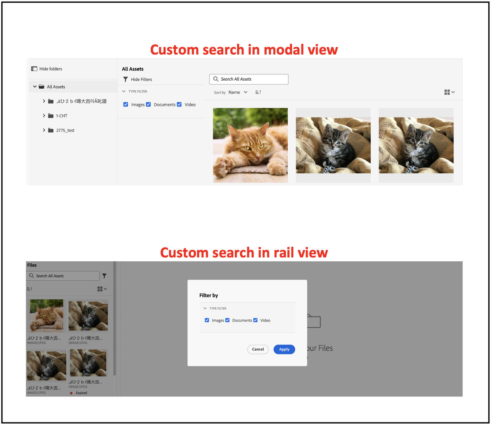

# Selettore risorse micro front-end {#Overview}

Il Selettore risorse micro front-end fornisce un’interfaccia utente che si integra facilmente con l’archivio di [!DNL Experience Manager Assets as a Cloud Service] in modo da poter sfogliare o cercare le risorse digitali disponibili nell’archivio e utilizzarle nell’esperienza di authoring dell’applicazione.

L’interfaccia utente micro front-end è resa disponibile nell’esperienza dell’applicazione utilizzando il pacchetto Selettore risorse. Eventuali aggiornamenti al pacchetto vengono importati automaticamente e l’ultimo Selettore risorse implementato viene caricato automaticamente all’interno dell’applicazione.


Il Selettore risorse offre molti vantaggi, tra cui:

* Facilità di integrazione con qualsiasi applicazione Adobe o non Adobe utilizzando la libreria JavaScript Vanilla.
* Facile manutenzione poiché gli aggiornamenti al pacchetto Selettore risorse vengono automaticamente distribuiti nel selettore risorse disponibile per l’applicazione. Non sono necessari aggiornamenti all’interno dell’applicazione per caricare le modifiche più recenti.
* Facilità di personalizzazione grazie alle proprietà disponibili che controllano la visualizzazione del Selettore risorse all’interno dell’applicazione.

* Filtri di ricerca full-text, predefiniti e personalizzati per passare rapidamente alle risorse da utilizzare nell’esperienza di authoring.

* Possibilità di cambiare archivi all’interno di un’organizzazione IMS per la selezione delle risorse.

* Possibilità di ordinare le risorse per nome, proporzioni e dimensioni e di visualizzarle nelle viste Elenco, Griglia, Galleria o Cascata.

L’obiettivo di questo articolo è dimostrare come utilizzare il Selettore risorse con un’applicazione [!DNL Adobe] in Unified Shell o quando disponi già di un imsToken generato per l’autenticazione. In questo articolo, questi flussi di lavoro sono denominati flussi non-SUSI.

Per integrare e utilizzare Selettore risorse con il tuo archivio [!DNL Experience Manager Assets as a Cloud Service], esegui le seguenti attività:

* [Integra il Selettore risorse utilizzando Vanilla JS](#integration-with-vanilla-js)
* [Definisci le proprietà di visualizzazione del Selettore risorse](#asset-selector-properties)
* [Utilizza il Selettore risorse](#using-asset-selector)

## Integra il Selettore risorse utilizzando Vanilla JS {#integration-with-vanilla-js}

È possibile integrare qualsiasi [!DNL Adobe] o applicazioni non Adobe nell’archivio [!DNL Experience Manager Assets] as a [!DNL Cloud Service] e selezionare le risorse dall’interno dell’applicazione.

L’integrazione viene eseguita importando il pacchetto Selettore risorse e connettendolo ad Assets as a Cloud Service tramite la libreria JavaScript Vanilla. È necessario modificare un `index.html` o qualsiasi file appropriato all’interno dell’applicazione per:
* Definire i dettagli di autenticazione
* Accedere all’archivio Assets as a Cloud Service
* Configurare le proprietà di visualizzazione del Selettore risorse

<!--
Asset Selector supports authentication to the [!DNL Experience Manager Assets] as a [!DNL Cloud Service] repository using Identity Management System (IMS) properties such as `imsScope` or `imsClientID`. Authentication using these IMS properties is referred to as SUSI (Sign Up Sign In) flow in this article.

You can perform authentication without defining some of the IMS properties, such as `imsScope` or `imsClientID`, if:

*   You are integrating an [!DNL Adobe] application on [Unified Shell](https://experienceleague.adobe.com/docs/experience-manager-cloud-service/content/overview/aem-cloud-service-on-unified-shell.html?lang=en).
*   You already have an IMS token generated for authentication.

Accessing [!DNL Experience Manager Assets] as a [!DNL Cloud Service] repository without defining `imsScope` or `imsClientID` IMS properties is referred to as a non-SUSI flow in this article.
-->

Puoi eseguire l’autenticazione senza definire alcune delle proprietà IMS se:

* Stai integrando un’applicazione [!DNL Adobe] su [Unified Shell](https://experienceleague.adobe.com/docs/experience-manager-cloud-service/content/overview/aem-cloud-service-on-unified-shell.html?lang=it).
* Hai già generato un token IMS per l’autenticazione.

## Prerequisiti {#prerequisites}

<!--
If your application requires user based authentication, out-of-the-box Asset Selector also supports a flow for authentication to the [!DNL Experience Manager Assets] as a [!DNL Cloud Service] repository using Identity Management System (IMS.)

You can use properties such as `imsScope` or `imsClientID` to retrieve `imsToken` automatically. You can use SUSI (Sign Up Sign In) flow and IMS properties. Also, you can obtain your own imsToken and pass it to Asset Selector by integrating within [!DNL Adobe] application on Unified Shell or if you already have an imsToken obtained via other methods (for example, using technical account). Accessing [!DNL Experience Manager Assets] as a [!DNL Cloud Service] repository without defining IMS properties (For example, `imsScope` and `imsClientID`) is referred to as a non-SUSI flow.
-->

Definisci i prerequisiti in un file `index.html` o simile nell’implementazione dell’applicazione per definire i dettagli di autenticazione per accedere all’archivio di [!DNL Experience Manager Assets] as a [!DNL Cloud Service]. I prerequisiti includono:
* imsOrg
* imsToken
* apikey
<!--
The prerequisites vary if you are authenticating using a SUSI flow or a non-SUSI flow.

**Non-SUSI flow**

*   imsOrg
*   imsToken
*   apikey

For more information on these properties, refer to [Asset Selector Properties](#asset-selector-properties).

**SUSI flow**

*   imsClientId
*   imsScope
*   redirectUrl
*   imsOrg
*   apikey

For more information on these properties, refer to [Example for the SUSI flow](#susi-vanilla) and [Asset Selector Properties](#asset-selector-properties).
-->

## Installazione {#installation}

I selettori di Assets sono disponibile tramite entrambe le versioni ESM CDN(ad esempio, [esm.sh](https://esm.sh/)/[skypack](https://www.skypack.dev/)) e [UMD](https://github.com/umdjs/umd).

Nei browser che utilizzano la **versione UMD** (scelta consigliata):

```
<script src="https://experience.adobe.com/solutions/CQ-assets-selectors/assets/resources/assets-selectors.js"></script>

<script>
  const { renderAssetSelector } = PureJSSelectors;
</script>
```

Nei browser con supporto di `import maps` che utilizzano la **versione ESM CDN**:

```
<script type="module">
  import { AssetSelector } from 'https://experience.adobe.com/solutions/CQ-assets-selectors/assets/resources/@assets/selectors/index.js'
</script>
```

Nella federazione di moduli Deno/Webpack utilizzando la **versione ESM CDN**:

```
import { AssetSelector } from 'https://experience.adobe.com/solutions/CQ-assets-selectors/assets/resources/@assets/selectors/index.js'
```

### Tipo di risorsa selezionato {#selected-asset-type}

Il tipo di risorsa selezionato è un array di oggetti che contiene le informazioni della risorsa quando si utilizzano le funzioni `handleSelection`, `handleAssetSelection`, e `onDrop`.

**Sintassi dello schema**

```
interface SelectedAsset {
    'repo:id': string;
    'repo:name': string;
    'repo:path': string;
    'repo:size': number;
    'repo:createdBy': string;
    'repo:createDate': string;
    'repo:modifiedBy': string; 
    'repo:modifyDate': string; 
    'dc:format': string; 
    'tiff:imageWidth': number;
    'tiff:imageLength': number;
    'repo:state': string;
    computedMetadata: Record<string, any>;
    _links: {
        'http://ns.adobe.com/adobecloud/rel/rendition': Array<{
            href: string;
            type: string;
            'repo:size': number;
            width: number;
            height: number;
            [others: string]: any;
        }>;
    };
}
```

Nella tabella seguente vengono descritte alcune delle proprietà importanti dell’oggetto Risorsa selezionata.

| Proprietà | Tipo | Spiegazione |
|---|---|---|
| *repo:repositoryId* | stringa | Identificatore univoco dell’archivio in cui è memorizzata la risorsa. |
| *repo:id* | stringa | Identificatore univoco della risorsa. |
| *repo:assetClass* | stringa | La classificazione della risorsa (ad esempio immagine o video, documento). |
| *repo:name* | stringa | Nome della risorsa, inclusa l’estensione del file. |
| *repo:size* | numero | Dimensione della risorsa in byte. |
| *repo:path* | stringa | Posizione della risorsa all’interno dell’archivio. |
| *repo:ancestors* | `Array<string>` | Array di elementi predecessori per la risorsa nell’archivio. |
| *repo:state* | stringa | Stato corrente della risorsa nell’archivio (ad esempio attiva, eliminata e così via). |
| *repo:createdBy* | stringa | Utente o sistema che ha creato la risorsa. |
| *repo:createDate* | stringa | La data e l’ora in cui è stata creata la risorsa. |
| *repo:modifiedBy* | stringa | Utente o sistema che ha modificato per ultimo la risorsa. |
| *repo:modifyDate* | stringa | La data e l’ora dell’ultima modifica apportata alla risorsa. |
| *dc:format* | stringa | Il formato della risorsa, quale il tipo di file (ad esempio, JPEG, PNG, ecc.). |
| *tiff:imageWidth* | numero | Larghezza di una risorsa. |
| *tiff:imageLength* | numero | Altezza di una risorsa. |
| *computedMetadata* | `Record<string, any>` | Oggetto che rappresenta un bucket per tutti i metadati di tutti i tipi di risorsa (archivio, applicazione o metadati incorporati). |
| *_collegamenti* | `Record<string, any>` | Collegamenti ipermediali della risorsa associata. Include collegamenti a risorse quali metadati e rappresentazioni. |
| *_links.http://ns.adobe.com/adobecloud/rel/rendition* | `Array<Object>` | Array di oggetti contenenti informazioni sulle rappresentazioni della risorsa. |
| *_links.http://ns.adobe.com/adobecloud/rel/rendition[].href* | stringa | URI della rappresentazione. |
| *_links.http://ns.adobe.com/adobecloud/rel/rendition[].type* | stringa | Tipo MIME della rappresentazione. |
| *_links.http://ns.adobe.com/adobecloud/rel/rendition[].&#39;repo:size&#39;* | numero | Dimensione della rappresentazione in byte. |
| *_links.http://ns.adobe.com/adobecloud/rel/rendition[].width* | numero | Larghezza della rappresentazione. |
| *_links.http://ns.adobe.com/adobecloud/rel/rendition[].height* | numero | Altezza della rappresentazione. |

Per un elenco completo delle proprietà e un esempio dettagliato, consulta [Esempio di codice del Selettore risorse](https://github.com/adobe/aem-assets-selectors-mfe-examples).

<!--
### ImsAuthProps {#ims-auth-props}

The `ImsAuthProps` properties define the authentication information and flow that the Asset Selector uses to obtain an `imsToken`. By setting these properties, you can control how the authentication flow should behave and register listeners for various authentication events.

| Property Name | Description|
|---|---|
| `imsClientId`| A string value representing the IMS client ID used for authentication purposes. This value is provided by Adobe and is specific to your Adobe AEM CS organization.|
| `imsScope`| Describes the scopes used in authentication. The scopes determine the level of access that the application has to your organization resources. Multiple scopes can be separated by commas.|
| `redirectUrl` | Represents the URL where the user is redirected after authentication. This value is typically set to the current URL of the application. If a `redirectUrl` is not supplied, `ImsAuthService` will use the redirectUrl used to register the `imsClientId`|
| `modalMode`| A boolean indicating whether the authentication flow should be displayed in a modal (pop-up) or not. If set to `true`, the authentication flow is displayed in a pop-up. If set to `false`, the authentication flow is displayed in a full page reload. _Note:_ for better UX, you can dynamically control this value if the user has browser pop-up disabled. |
| `onImsServiceInitialized`| A callback function that is called when the Adobe IMS authentication service is initialized. This function takes one parameter, `service`, which is an object representing the Adobe IMS service. See [`ImsAuthService`](#imsauthservice-ims-auth-service) for more details.|
| `onAccessTokenReceived`| A callback function that is called when an `imsToken` is received from the Adobe IMS authentication service. This function takes one parameter, `imsToken`, which is a string representing the access token. |
| `onAccessTokenExpired`| A callback function that is called when an access token has expired. This function is typically used to trigger a new authentication flow to obtain a new access token. |
| `onErrorReceived`| A callback function that is called when an error occurs during authentication. This function takes two parameters: the error type and error message. The error type is a string representing the type of error and the error message is a string representing the error message. |

### ImsAuthService {#ims-auth-service}

`ImsAuthService` class handles the authentication flow for the Asset Selector. It is responsible for obtaining an `imsToken` from the Adobe IMS authentication service. The `imsToken` is used to authenticate the user and authorize access to the Adobe Experience Manager (AEM) CS Assets repository. ImsAuthService uses the `ImsAuthProps` properties to control the authentication flow and register listeners for various authentication events. You can use the convenient [`registerAssetsSelectorsAuthService`](#purejsselectorsregisterassetsselectorsauthservice) function to register the _ImsAuthService_ instance with the Asset Selector. The following functions are available on the `ImsAuthService` class. However, if you are using the _registerAssetsSelectorsAuthService_ function, you do not need to call these functions directly.

| Function Name | Description |
|---|---|
| `isSignedInUser` | Determines whether the user is currently signed in to the service and returns a boolean value accordingly.|
| `getImsToken`    | Retrieves the authentication `imsToken` for the currently signed-in user, which can be used to authenticate requests to other services such as generating asset _rendition.|
| `signIn`| Initiates the sign-in process for the user. This function uses the `ImsAuthProps` to show authentication in either a pop-up or a full page reload |
| `signOut`| Signs the user out of the service, invalidating their authentication token and requiring them to sign in again to access protected resources. Invoking this function will reload the current page.|
| `refreshToken`| Refreshes the authentication token for the currently signed-in user, preventing it from expiring and ensuring uninterrupted access to protected resources. Returns a new authentication token that can be used for subsequent requests. |
-->

### Esempio di flusso non-SUSI {#non-susi-vanilla}

Questo esempio illustra come utilizzare il selettore risorse con un flusso non SUSI durante l’esecuzione di un’applicazione [!DNL Adobe] in Unified Shell o quando disponi già di un `imsToken` generato per l’autenticazione.

Includi il pacchetto Asset Selector nel codice utilizzando `script` come mostrato nella _righe 6-15_ dell’esempio seguente. Una volta caricato lo script, la variabile globale `PureJSSelectors` è disponibile per l’uso. Definire il selettore risorse [proprietà](#asset-selector-properties) come mostrato nella _righe 16-23_. In un flusso non-SUSI, entrambe le proprietà `imsOrg` e `imsToken` sono necessarie per l’autenticazione. La proprietà `handleSelection` è utilizzata per gestire le risorse selezionate. Per eseguire il rendering del Selettore risorse, chiama la funzione `renderAssetSelector` come indicato nella _riga 17_. Il Selettore risorse viene visualizzato nell’`<div>`elemento contenitore, come illustrato nelle _righe 21 e 22_.

Seguendo questi passaggi, puoi utilizzare il Selettore risorse con un flusso non-SUSI nella tua applicazione [!DNL Adobe].

```html {line-numbers="true"}
<!DOCTYPE html>
<html>
<head>
    <title>Asset Selector</title>
    <script src="https://experience.adobe.com/solutions/CQ-assets-selectors/assets/resources/assets-selectors.js"></script>
    <script>
        // get the container element in which we want to render the AssetSelector component
        const container = document.getElementById('asset-selector-container');
        // imsOrg and imsToken are required for authentication in non-SUSI flow
        const assetSelectorProps = {
            imsOrg: 'example-ims@AdobeOrg',
            imsToken: "example-imsToken",
            apiKey: "example-apiKey-associated-with-imsOrg",
            handleSelection: (assets: SelectedAssetType[]) => {},
        };
        // Call the `renderAssetSelector` available in PureJSSelectors globals to render AssetSelector
        PureJSSelectors.renderAssetSelector(container, assetSelectorProps);
    </script>
</head>

<body>
    <div id="asset-selector-container" style="height: calc(100vh - 80px); width: calc(100vw - 60px); margin: -20px;">
    </div>
</body>

</html>
```

Per un esempio dettagliato, consulta [Esempio di codice del Selettore risorse](https://github.com/adobe/aem-assets-selectors-mfe-examples).

<!--
### Example for the SUSI flow {#susi-vanilla}

Use this example `index.html` file for authentication if you are integrating your application using SUSI flow.

Access the Asset Selector package using the `Script` Tag, as shown in *line 9* to *line 11* of the example `index.html` file.

*Line 14* to *line 38* of the example describes the IMS flow properties, such as `imsClientId`, `imsScope`, and `redirectURL`. The function requires that you define at least one of the `imsClientId` and `imsScope` properties. If you do not define a value for `redirectURL`, the registered redirect URL for the client ID is used.

As you do not have an `imsToken` generated, use the `registerAssetsSelectorsAuthService` and `renderAssetSelectorWithAuthFlow` functions, as shown in line 40 to line 50 of the example `index.html` file. Use the `registerAssetsSelectorsAuthService` function before `renderAssetSelectorWithAuthFlow` to register the `imsToken` with the Asset Selector. [!DNL Adobe] recommends to call `registerAssetsSelectorsAuthService` when you instantiate the component.

Define the authentication and other Assets as a Cloud Service access-related properties in the `const props` section, as shown in *line 54* to *line 60* of the example `index.html` file.

The `PureJSSelectors` global variable, mentioned in *line 65*, is used to render the Asset Selector in the web browser.

Asset Selector is rendered on the `<div>` container element, as mentioned in *line 74* to *line 81*. The example uses a dialog to display the Asset Selector.

```html {line-numbers="true"}
<!DOCTYPE html>
<html>

<head>
    <meta http-equiv="X-UA-Compatible" content="IE=edge">
    <meta charset="utf-8">
    <title>Asset Selectors</title>
    <link rel="stylesheet" href="index.css">
    <script id="asset-selector"
        src="https://experience.adobe.com/solutions/CQ-assets-selectors/assets/resources/asset-selectors.js"></script>
    <script>

        const imsProps = {
            imsClientId: "<obtained from IMS team>",
            imsScope: "openid, <other scopes>",
            redirectUrl: window.location.href,
            modalMode: true, // false to open in a full page reload flow
            onImsServiceInitialized: (service) => {
                // invoked when the ims service is initialized and is ready
                console.log("onImsServiceInitialized", service);
            },
            onAccessTokenReceived: (token) => {
                console.log("onAccessTokenReceived", token);
            },
            onAccessTokenExpired: () => {
                console.log("onAccessTokenError");
                // re-trigger sign-in flow
            },
            onErrorReceived: (type, msg) => {
                console.log("onErrorReceived", type, msg);
            },
        }

        function load() {
            const registeredTokenService = PureJSSelectors.registerAssetsSelectorsAuthService(imsProps);
            imsInstance = registeredTokenService;
        };

        // initialize the IMS flow before attempting to render the asset selector
        load();
        

        //function that will render the asset selector
            const otherProps = {
            // any other props supported by asset selector
            }
            const assetSelectorProps = {
                "imsOrg": "imsorg",
                ...otherProps
            }
             // container element on which you want to render the AssetSelector/DestinationSelector component
            const container = document.getElementById('asset-selector');

            /// Use the PureJSSelectors in globals to render the AssetSelector/DestinationSelector component
            PureJSSelectors.renderAssetSelectorWithAuthFlow(container, assetSelectorProps, () => {
                const assetSelectorDialog = document.getElementById('asset-selector-dialog');
                assetSelectorDialog.showModal();
            });
        }
    </script>

</head>
<body class="asset-selectors">
    <div>
        <button onclick="renderAssetSelectorWithAuthFlowFlow()">Asset Selector - Select Assets with Ims Flow</button>
    </div>
        <dialog id="asset-selector-dialog">
            <div id="asset-selector" style="height: calc(100vh - 80px); width: calc(100vw - 60px); margin: -20px;">
            </div>
        </dialog>
    </div>
</body>

</html>

```
-->

## Utilizzare le proprietà del Selettore risorse {#asset-selector-properties}

Puoi utilizzare le proprietà del Selettore risorse per personalizzarne il rendering. Nella tabella seguente sono elencate le proprietà che è possibile utilizzare per personalizzare e utilizzare il Selettore risorse.

| Proprietà | Tipo | Obbligatorio | Predefiniti | Descrizione |
|---|---|---|---|---|
| *barra* | booleano | No | false | Se contrassegnato `true`, il rendering del selettore risorse viene eseguito nella barra a sinistra. Se è contrassegnato `false`, il selettore delle risorse viene renderizzato nella vista modale. |
| *imsOrg* | stringa | Sì | | L’ID di Adobe Identity Management System (IMS) assegnato durante il provisioning di [!DNL Adobe Experience Manager] as a [!DNL Cloud Service] per l’organizzazione. Il `imsOrg` È necessario specificare la chiave per autenticare se l’organizzazione a cui stai accedendo è in Adobe IMS o meno. |
| *imsToken* | stringa | No | | Token di connessione IMS utilizzato per l’autenticazione. `imsToken` è obbligatorio se si utilizza un flusso non SUSI. |
| *apiKey* | stringa | No | | Chiave API utilizzata per accedere al servizio di individuazione AEM. `apiKey` è obbligatorio se si utilizza un flusso non SUSI. |
| *rootPath* | stringa | No | /content/dam/ | Percorso della cartella da cui il selettore risorse visualizza le risorse. `rootPath` può essere utilizzato anche sotto forma di incapsulamento. Ad esempio, dato il seguente percorso, `/content/dam/marketing/subfolder/`, il Selettore risorse non consente di spostarsi all’interno di alcuna cartella principale, ma mostra solo le cartelle secondarie. |
| *percorso* | stringa | No | | Percorso utilizzato per passare a una directory specifica di risorse durante il rendering del Selettore risorse. |
| *filterSchema* | array | No | | Modello utilizzato per configurare le proprietà del filtro. Questa funzione è utile quando desideri limitare determinate opzioni di filtro nel Selettore risorse. |
| *filterFormProps* | Oggetto | No | | Specifica le proprietà del filtro da utilizzare per perfezionare la ricerca. Ad esempio, tipo MIME JPG, PNG, GIF. |
| *selectedAssets* | Array `<Object>` | No |                 | Specifica le risorse selezionate quando viene eseguito il rendering del Selettore risorse. È necessario un array di oggetti che contenga una proprietà ID delle risorse. Ad esempio, `[{id: 'urn:234}, {id: 'urn:555'}]` Deve essere disponibile una risorsa nella directory corrente. Se devi utilizzare una directory diversa, specifica anche un valore per la proprietà `path`. |
| *acvConfig* | Oggetto | No | | La proprietà Visualizzazione della raccolta risorse che contiene un oggetto con una configurazione personalizzata per sostituire le impostazioni predefinite. |
| *i18nSymbols* | `Object<{ id?: string, defaultMessage?: string, description?: string}>` | No |                 | Se le traduzioni OOTB non sono sufficienti per le esigenze dell’applicazione, puoi esporre un’interfaccia tramite la quale puoi trasmettere valori localizzati personalizzati tramite la proprietà `i18nSymbols`. Il passaggio di un valore tramite questa interfaccia sostituisce le traduzioni predefinite fornite e utilizza le tue.  Per eseguire la sostituzione, è necessario passare un oggetto valido del [Descrittore del messaggio](https://formatjs.io/docs/react-intl/api/#message-descriptor) alla chiave di `i18nSymbols` che desideri sostituire. |
| *intl* | Oggetto | No | | Il selettore risorse fornisce le traduzioni predefinite OOTB. È possibile selezionare la lingua di traduzione fornendo una stringa di lingua valida attraverso la proprietà `intl.locale`. Ad esempio: `intl={{ locale: "es-es" }}` </br></br> Le stringhe di lingua supportate seguono i [Codici - ISO 639](https://www.iso.org/iso-639-language-codes.html) per la rappresentazione di nomi di lingue standard. </br></br> Elenco delle lingue supportate: Inglese - ‘en-us’ (impostazione predefinita) Spagnolo - ‘es-es’ Tedesco - ‘de-de’ Francese - ‘fr-fr’ Italiano - ‘it-it’ Giapponese - ‘ja-jp’ Coreano - ‘ko-kr’ Portoghese - ‘pt-br’ cinese (tradizionale) - ‘zh-cn’ Cinese (Taiwan) - ‘zh-tw’ |
| *repositoryId* | stringa | No | &#39;&#39; | Archivio da cui il Selettore risorse carica il contenuto. |
| *additionalAemSolutions* | `Array<string>` | No | [ ] | Consente di aggiungere un elenco di archivi AEM aggiuntivi. Se non vengono fornite informazioni in questa proprietà, vengono considerati solo la libreria di file multimediali o gli archivi di AEM Assets. |
| *hideTreeNav* | booleano | No |  | Specifica se mostrare o nascondere la barra laterale di navigazione della struttura delle risorse. Viene utilizzata solo nella vista modale e quindi questa proprietà non influisce sulla visualizzazione della barra. |
| *onDrop* | Funzione | No | | La proprietà consente la funzionalità di rilascio di una risorsa. |
| *dropOptions* | `{allowList?: Object}` | No | | Configura le opzioni di rilascio utilizzando un “elenco consentiti”. |
| *colorScheme* | stringa | No | | Configura il tema (`light` o `dark`) per il Selettore risorse. |
| *handleSelection* | Funzione | No | | Richiamata con un array di elementi di risorse quando queste sono selezionate e si fa clic sul pulsante `Select` nel modale. Questa funzione viene richiamata solo nella vista modale. Per la visualizzazione della barra, utilizza le funzioni `handleAssetSelection` o `onDrop`. Esempio: <pre>handleSelection=(risorse: risorsa[])=> {...}</pre> Per maggiori dettagli, consulta [Tipo di risorsa selezionato](#selected-asset-type). |
| *handleAssetSelection* | Funzione | No | | Richiamata con un array di elementi durante la selezione o la deselezione delle risorse. Questa funzione è utile quando si desidera ascoltare le risorse selezionate dall’utente. Esempio: <pre>handleSelection=(risorse: risorsa[])=> {...}</pre> Per maggiori dettagli, consulta [Tipo di risorsa selezionato](#selected-asset-type). |
| *onClose* | Funzione | No | | Richiamata quando viene premuto il pulsante `Close` nella vista modale. Questa è chiamata solo nella vista `modal` e ignorata nella vista `rail`. |
| *onFilterSubmit* | Funzione | No | | Richiamata con gli elementi filtro poiché l’utente modifica criteri di filtro diversi. |
| *selectionType* | stringa | No | singolo | Configurazione per la selezione `single` o `multiple` di risorse alla volta. |

## Esempi per utilizzare le proprietà del Selettore risorse {#usage-examples}

Puoi definire le [proprietà](#asset-selector-properties) del Selettore risorse nel file `index.html` per personalizzare la visualizzazione del Selettore risorse all’interno dell’applicazione.

### Esempio 1: Selettore risorse nella visualizzazione della barra


Se il valore di AssetSelector `rail` è impostato su `false` oppure non è menzionato nelle proprietà; per impostazione predefinita, il Selettore risorse viene visualizzato nella vista modale.

<!--
### Example 2: Use selectedAssets property in addition to the path property

Use the `path` property to define the folder name that displays automatically when the Asset Selector is rendered. In addition, use the `selectedAssets` property to define the IDs for the assets that you need to select within the folder. Moreover, when you want to display assets that are pre-defined within the folder, you can use selectedAssets property.

   
-->

### Esempio 2: finestra popover dei metadati

Utilizza varie proprietà per definire i metadati di una risorsa da visualizzare mediante un’icona Info. La finestra popover Iinfo fornisce un insieme di informazioni sulla risorsa o sulla cartella, tra cui titolo, dimensioni, data di modifica, posizione e descrizione di una risorsa. Nell’esempio seguente, per visualizzare i metadati di una risorsa vengono utilizzate diverse proprietà, ad esempio: proprietà `repo:path` che specifica la posizione di una risorsa. <!--`repo` represents the repository from where the asset is showing, whereas, `path` represents the route from where the asset or folder is rendered.-->


### Esempio 3: proprietà filtro personalizzata nella visualizzazione della barra

Oltre alla ricerca con facet, il Selettore risorse consente di personalizzare vari attributi per perfezionare la ricerca dall’applicazione [!DNL Adobe Experience Manager] as a [!DNL Cloud Service]. Per aggiungere filtri di ricerca personalizzati nell’applicazione, devi aggiungere il seguente codice. Nell’esempio seguente, la ricerca `Type Filter` che identifica il tipo di risorsa tra Immagini, Documenti o Video o il tipo di filtro aggiunto per la ricerca.


<!--

## Customization after integrating Asset Selector 

### Custom metadata

Assets display panel shows the out of the box metadata that can be displayed in the info of the asset. In addition to this, [!DNL Adobe Experience Manager] as a [!DNL Cloud Service] application allows configuration of the asset selector by adding custom metadata that is shown in info panel of the asset.
-->

<!-- Property details to be added here. Referred the ticket https://jira.corp.adobe.com/browse/ASSETS-19023-->

<!--
## Asset Selector Object Schema {#object-schema}

Schema describes the object properties associated with an asset selected using Asset Selector. It uses the combination of data types and their values to validate the object describing the selected Asset using an Asset Selector.

**Schema Syntax**
````
interface SelectedAsset {
    'repo:id': string;
    'repo:name': string;
    'repo:path': string;
    'repo:size': number;
    'repo:createdBy': string;
    'repo:createDate': string;
    'repo:modifiedBy': string; 
    'repo:modifyDate': string; 
    'dc:format': string; 
    'tiff:imageWidth': number;
    'tiff:imageLength': number;
    'repo:state': string;
    computedMetadata: Record<string, any>;
    _links: {
        'http://ns.adobe.com/adobecloud/rel/rendition': Array<{
            href: string;
            type: string;
            'repo:size': number;
            width: number;
            height: number;
            [others: string]: any;
        }>;
    };
}
````

**Query Parameters**

| Parameter | Type | Description |
|---|---|---|
| repo:id | string | ID of an Asset |
| repo:name | string | The name of an Asset |
| repo:path | string | The path of an Asset |
| repo:size | number | Size of an Asset (in bytes) |
| repo:createdBy | string | ID of a user who created an Asset |
| repo: createdDate | string | The timestamp when an asset was created |
| repo:modifiedBy | string | ID of a user who modified the asset recently |
| repo:modifyDate | string | The timestamp when the asset was last modified |
| dc:format | string | MIME type of an Asset |
| tiff:imageWidth | number | The width of an image type of Asset |
| tiff:imageLength | number | The height of an image type of Asset |
| repo:state | string | The `Approved`, `Rejected`, or `Expired`state of an Asset |
| computedMetadata | string | It is an object that represents a bucket for all the Asset's metadata of all kinds (repository, application or embedded metadata) |
| _links | string | It represents the collection of links used in the Asset Selector. The links are represented in the form of an array. The parameters of an array include: `href`, `type`, `repo:size`, `width`, `height`, etc.  |

For the detailed example of Object Schema, click 
-->

## Gestione della selezione di risorse tramite lo schema a oggetti {#handling-selection}

La proprietà `handleSelection` viene utilizzata per gestire selezioni singole o multiple di risorse nel Selettore risorse. L’esempio seguente indica la sintassi di utilizzo di `handleSelection`.


## Utilizzo del Selettore risorse {#using-asset-selector}

Dopo aver configurato il Selettore risorse ed aver effettuato l’autenticazione per utilizzarlo con l’applicazione [!DNL Adobe Experience Manager] as a [!DNL Cloud Service], puoi selezionare le risorse o eseguire varie altre operazioni per cercare le risorse all’interno dell’archivio.


* **A**: [Nascondi/Mostra pannello](#hide-show-panel)
* **B**: [Selettore archivio](#repository-switcher)
* **C**: [Risorse](#repository)
* **D**: [Filtri](#filters)
* **E**: [Barra di ricerca](#search-bar)
* **F**: [Ordinamento](#sorting)
* **G**: [Ordinamento crescente o decrescente](#sorting)
* **H**: [Visualizzazione](#types-of-view)

### Nascondi/Mostra pannello {#hide-show-panel}

Per nascondere le cartelle nel menu di navigazione a sinistra, fai clic sull’icona **[!UICONTROL Nascondi cartelle]**. Per annullare le modifiche, fai di nuovo clic sull’icona **[!UICONTROL Nascondi cartelle]**.

### Selettore archivio {#repository-switcher}

Il Selettore risorse consente inoltre di cambiare archivio per la selezione delle risorse. Puoi selezionare l’archivio desiderato dal menu a discesa disponibile nel pannello a sinistra. Le opzioni dell’archivio disponibili nell’elenco a discesa si basano sulla proprietà `repositoryId` definita nel file `index.html`. Si basa sugli ambienti dell’organizzazione IMS selezionata a cui accede l’utente che ha eseguito l’accesso. I consumatori possono trasmettere un `repositoryID` preferito e, in tal caso, il Selettore risorse interrompe il rendering del selettore archivio ed esegue il rendering solo delle risorse dall’archivio specificato.
<!--
It is based on the `imsOrg` that is provided in the application. If you want to see the list of repositories, then `repositoryId` is required to view those specific repositories in your application.
-->

### Archivio risorse

Si tratta di una raccolta di cartelle di risorse che puoi utilizzare per eseguire le operazioni.

### Filtri predefiniti {#filters}

Il Selettore risorse fornisce anche opzioni di filtro predefinite per perfezionare i risultati della ricerca. Sono disponibili i seguenti filtri:

* `File type`: include cartelle, file, immagini, documenti o video
* `MIME type`: include JPG, GIF, PPTX, PNG, MP4, DOCX, TIFF, PDF, XLSX
* `Image Size`: include larghezza minima/massima, altezza minima/massima dell’immagine


### Ricerca personalizzata

Oltre alla ricerca full-text, il Selettore risorse consente di cercare le risorse all’interno dei file utilizzando la ricerca personalizzata. Puoi utilizzare filtri di ricerca personalizzati sia nella vista modale che nella vista della barra.



Puoi anche creare un filtro di ricerca predefinito per salvare i campi che cerchi frequentemente e utilizzarli in un secondo momento. Per creare una ricerca personalizzata delle risorse, puoi utilizzare la proprietà `filterSchema`.

### Barra di ricerca {#search-bar}

Il Selettore risorse consente di eseguire una ricerca full-text delle risorse all’interno dell’archivio selezionato. Ad esempio, se digiti la parola chiave `wave` nella barra di ricerca, vengono mostrate tutte le risorse con la parola chiave `wave` menzionata in una qualsiasi delle proprietà dei metadati.

### Ordinamento {#sorting}

Puoi ordinare le risorse all’interno selettore risorse per nome, dimensione o dimensione di una risorsa. Puoi anche ordinare le risorse in ordine crescente o decrescente.

### Tipi di visualizzazione {#types-of-view}

Il selettore risorse consente di visualizzare la risorsa in quattro diversi modi:

* ** [!UICONTROL Vista a elenco]**: la vista a elenco mostra i file e le cartelle in modo scorrevole in una singola colonna.
* ** [!UICONTROL Vista griglia]**: la vista griglia mostra i file e le cartelle in modo scorrevole in una griglia di righe e colonne.
* ** [!UICONTROL Vista galleria]**: la vista galleria mostra i file o le cartelle in un elenco orizzontale bloccato al centro.
* ** [!UICONTROL Vista a cascata]**: la vista a cascata mostra file o cartelle sotto forma di un Bridge.

<!--
### Modes to view Asset Selector

Asset Selector supports two types of out of the box views:

**  Modal view or Inline view:** The modal view or inline view is the default view of Asset Selector that represents Assets folders in the front area. The modal view allows users to view assets in a full screen to ease the selection of multiple assets for import. Use `<AssetSelector rail={false}>` to enable modal view.

    

**  Rail view:** The rail view represents Assets folders in a left panel. The drag and drop of assets can be performed in this view. Use `<AssetSelector rail={true}>` to enable rail view.

    
-->
<!--

### Application Integration

Asset Selector is flexible and can be integrated within your existing [!DNL Adobe Experience Manager] as a [!DNL Cloud Service] application. It is accessible and localized to add, search, and select assets in your application. With Asset Selector you can:
*   **Configure** You can configure the files/folders that you want to show at the upfront. The assets that are chosen to view can be of any supported formats, for example, JPEG. It allows you to control the display of various text or symbols as per your choice.
*   **Perfect fit** Asset selector easily fits in your existing [!DNL Adobe Experience Manager] as a [!DNL Cloud Service] application and choose the way you want to view. The mode of view can be inline, rail, or modal view.
*   **Accessible** With Asset Selector, you can reach the desired asset in an easy manner.
*   **Localize** Assets can be availed for the various locales available as per Adobe's localization standards.
-->
<!--

### Support for multiple instances

The micro front-end design supports the display of multiple instances of Asset Selector on a single screen.


-->

<!--

### Controlled selection with multi-select

You can make default multi-selection of assets by specifying the assets to the component using `selectedAssets` property. You should specify an array of asset IDs. For example, `[{id: 'urn:234}, {id: 'urn:555'}].`
-->
<!--

### Action buttons

When you customize your application with Asset Selector based on ReactJS, you are provided with the following action buttons to perform various actions:
*   **Open in media library** Allows you to open the asset in media library.
*   **Upload** Allows you to upload an asset directly.
*   **Download** Downloads the asset in [!DNL Adobe Experience Manager] as a [!DNL Cloud Service].
-->
<!--

### Status of an asset

Asset Selector allows you to know the status of your uploaded assets. The status can be `Approved`, `Rejected`, or `Expired` of the asset. 
-->
<!--

### Localization

The integration of Asset Selector with [!DNL Adobe Experience Manager] as a [!DNL Cloud Service] allows localized content appear in your application.
-->
