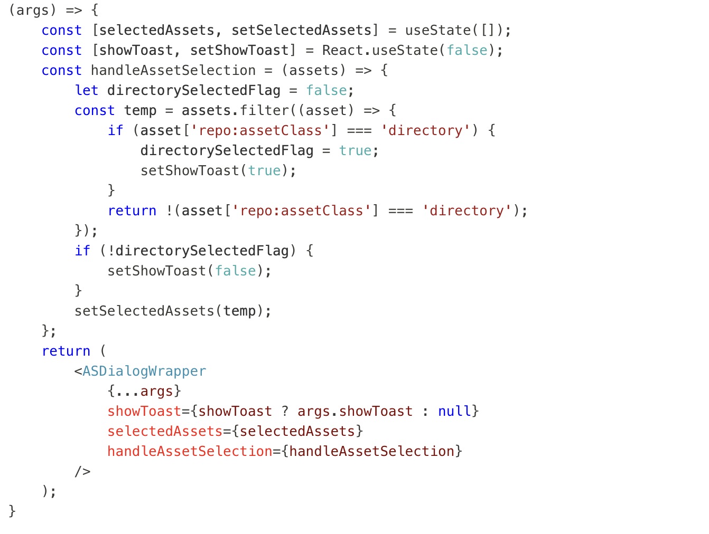

# Selettore risorse micro front-end {#Overview}

Il Selettore risorse micro front-end fornisce un’interfaccia utente che si integra facilmente con l’archivio di [!DNL Experience Manager Assets] in modo da poter sfogliare o cercare le risorse digitali disponibili nell’archivio e utilizzarle nell’esperienza di authoring dell’applicazione.

L’interfaccia utente micro front-end è resa disponibile nell’esperienza dell’applicazione utilizzando il pacchetto Selettore risorse. Eventuali aggiornamenti al pacchetto vengono importati automaticamente e l’ultimo Selettore risorse implementato viene caricato automaticamente all’interno dell’applicazione.


Il Selettore risorse offre molti vantaggi, tra cui:

* Facilità di integrazione con le applicazioni [Adobe](#asset-selector-ims) o [non Adobe](#asset-selector-non-ims) utilizzando la libreria Vanilla JavaScript.
* Facile manutenzione poiché gli aggiornamenti al pacchetto Selettore risorse vengono automaticamente distribuiti nel selettore risorse disponibile per l’applicazione. Non sono necessari aggiornamenti all’interno dell’applicazione per caricare le modifiche più recenti.
* Facilità di personalizzazione grazie alle proprietà disponibili che controllano la visualizzazione del Selettore risorse all’interno dell’applicazione.
* Filtri di ricerca full-text, predefiniti e personalizzati per passare rapidamente alle risorse da utilizzare nell’esperienza di authoring.
* Possibilità di cambiare archivi all’interno di un’organizzazione IMS per la selezione delle risorse.
* Possibilità di ordinare le risorse per nome, proporzioni e dimensioni e di visualizzarle nelle viste Elenco, Griglia, Galleria o Cascata.

<!--Perform the following tasks to integrate and use Asset Selector with your [!DNL Experience Manager Assets] repository:

1. [Install Asset Selector](#installation)
2. [Integrate Asset Selector using Vanilla JS](#integration-using-vanilla-js)
3. [Use Asset Selector](#using-asset-selector)
-->

<!--
## Setting up Asset Selector {#asset-selector-setup}


-->

## Prerequisiti{#prereqs}

Devi accertarti di utilizzare i seguenti metodi di comunicazione:

* L’applicazione è in esecuzione su HTTPS.
* L’URL dell’applicazione si trova nell’elenco Consentiti degli URL di reindirizzamento del client IMS.
* Il flusso di accesso IMS viene configurato e renderizzato utilizzando un pop-up sul browser web. Pertanto, i popup devono essere abilitati o consentiti nel browser di destinazione.

Se hai bisogno del flusso di lavoro di autenticazione IMS di Asset Selector, utilizza i prerequisiti precedenti. In alternativa, se hai già effettuato l’autenticazione con il flusso di lavoro IMS, puoi aggiungere le informazioni IMS.

>[!IMPORTANT]
>
> Questo archivio funge da documentazione aggiuntiva sulle API disponibili e fornisce alcuni esempi di utilizzo per l’integrazione del Selettore risorse. Prima di installare o utilizzare il Selettore risorse, assicurati che all’organizzazione sia stato fornito l’accesso al Selettore risorse come parte del profilo Experience Manager Assets as a Cloud Service. Se non è stato fornito l’accesso, non è possibile integrare o utilizzare questi componenti. Per richiedere il provisioning, l’amministratore del programma deve richiedere ad Admin Console un ticket di supporto contrassegnato come P2 e includere le seguenti informazioni:
>
>* Nomi di dominio in cui è ospitata l’applicazione di integrazione.
>* Dopo la fornitura dell’accesso, all’organizzazione verranno forniti i dati di `imsClientId`, `imsScope` e un `redirectUrl` corrispondenti agli ambienti richiesti, dati essenziali per la configurazione del Selettore risorse. Senza tali proprietà valide, non è possibile eseguire i passaggi di installazione.

## Installazione {#installation}

Il Selettore risorse è disponibile tramite entrambe le versioni ESM CDN (ad esempio, [esm.sh](https://esm.sh/)/[skypack](https://www.skypack.dev/)) e [UMD](https://github.com/umdjs/umd).

Nei browser che utilizzano la **versione UMD** (scelta consigliata):

```
<script src="https://experience.adobe.com/solutions/CQ-assets-selectors/static-assets/resources/assets-selectors.js"></script>

<script>
  const { renderAssetSelector } = PureJSSelectors;
</script>
```

Nei browser con supporto di `import maps` che utilizzano la **versione ESM CDN**:

```
<script type="module">
  import { AssetSelector } from 'https://experience.adobe.com/solutions/CQ-assets-selectors/static-assets/resources/@assets/selectors/index.js'
</script>
```

Nella federazione di moduli Deno/Webpack utilizzando la **versione ESM CDN**:

```
import { AssetSelector } from 'https://experience.adobe.com/solutions/CQ-assets-selectors/static-assets/resources/@assets/selectors/index.js'
```

## Integra il Selettore risorse utilizzando Vanilla JS {#integration-using-vanilla-js}

È possibile integrare qualsiasi applicazione [!DNL Adobe] o non Adobe con l&#39;archivio [!DNL Experience Manager Assets] e selezionare le risorse all&#39;interno dell&#39;applicazione. Consulta [Integrazione di Asset Selector con varie applicazioni](#asset-selector-integration-with-apps).

L’integrazione viene eseguita importando il pacchetto Selettore risorse e connettendolo ad Assets as a Cloud Service tramite la libreria JavaScript Vanilla. Modificare un file `index.html` o qualsiasi file appropriato all&#39;interno dell&#39;applicazione in:

* Definire i dettagli di autenticazione
* Accedere all’archivio Assets as a Cloud Service
* Configurare le proprietà di visualizzazione del Selettore risorse

Puoi eseguire l’autenticazione senza definire alcune delle proprietà IMS se:

* Stai integrando un’applicazione [!DNL Adobe] su [Unified Shell](https://experienceleague.adobe.com/docs/experience-manager-cloud-service/content/overview/aem-cloud-service-on-unified-shell.html?lang=it).
* Hai già generato un token IMS per l’autenticazione.

## Integrare Asset Selector con varie applicazioni {#asset-selector-integration-with-apps}

È possibile integrare Asset Selector (Selettore risorse) con diverse applicazioni, tra cui:

* [Integrare Asset Selector con un&#39;applicazione  [!DNL Adobe] ](#adobe-app-integration-vanilla)
* [Integrare il Selettore risorse con un’applicazione non Adobe](#adobe-non-app-integration)
* [Integrazione per Dynamic Media con funzionalità OpenAPI](#adobe-app-integration-polaris)

>[!BEGINTABS]

<!--Integration with an Adobe application content starts here-->

>[!TAB Integrazione con un&#39;applicazione Adobe]

### Prerequisiti{#prereqs-adobe-app}

Utilizzare i seguenti prerequisiti se si integra Asset Selector con un&#39;applicazione [!DNL Adobe]:

* [Metodi di comunicazione](#prereqs)
* imsOrg
* imsToken
* apikey

### Integrare Asset Selector con un&#39;applicazione [!DNL Adobe] {#adobe-app-integration-vanilla}

Nell&#39;esempio seguente viene illustrato l&#39;utilizzo di Asset Selector durante l&#39;esecuzione di un&#39;applicazione [!DNL Adobe] in Unified Shell o quando è già stato generato `imsToken` per l&#39;autenticazione.

Includi il pacchetto Asset Selector nel codice utilizzando il tag `script`, come mostrato nelle _righe 6-15_ dell&#39;esempio seguente. Una volta caricato lo script, la variabile globale `PureJSSelectors` è disponibile per l’uso. Definisci il selettore risorse [proprietà](#asset-selector-properties) come mostrato nelle _righe 16-23_. Le proprietà `imsOrg` e `imsToken` sono entrambe necessarie per l&#39;autenticazione nell&#39;applicazione Adobe. La proprietà `handleSelection` è utilizzata per gestire le risorse selezionate. Per eseguire il rendering del Selettore risorse, chiama la funzione `renderAssetSelector` come indicato nella _riga 17_. Il Selettore risorse viene visualizzato nell’`<div>`elemento contenitore, come illustrato nelle _righe 21 e 22_.

Seguendo questi passaggi è possibile utilizzare Asset Selector con l&#39;applicazione [!DNL Adobe].

```html {line-numbers="true"}
<!DOCTYPE html>
<html>
<head>
    <title>Asset Selector</title>
    <script src="https://experience.adobe.com/solutions/CQ-assets-selectors/assets/resources/assets-selectors.js"></script>
    <script>
        // get the container element in which we want to render the AssetSelector component
        const container = document.getElementById('asset-selector-container');
        // imsOrg and imsToken are required for authentication in Adobe application
        const assetSelectorProps = {
            imsOrg: 'example-ims@AdobeOrg',
            imsToken: "example-imsToken",
            apiKey: "example-apiKey-associated-with-imsOrg",
            handleSelection: (assets: SelectedAssetType[]) => {},
        };
        // Call the `renderAssetSelector` available in PureJSSelectors globals to render AssetSelector
        PureJSSelectors.renderAssetSelector(container, assetSelectorProps);
    </script>
</head>

<body>
    <div id="asset-selector-container" style="height: calc(100vh - 80px); width: calc(100vw - 60px); margin: -20px;">
    </div>
</body>

</html>
```

<!--For detailed example, visit [Asset Selector Code Example](https://github.com/adobe/aem-assets-selectors-mfe-examples).-->

+++**ImsAuthProps**
Le proprietà `ImsAuthProps` definiscono le informazioni di autenticazione e il flusso utilizzati da Asset Selector per ottenere un `imsToken`. Impostando queste proprietà è possibile controllare il comportamento del flusso di autenticazione e registrare i listener per vari eventi di autenticazione.

| Nome proprietà | Descrizione |
|---|---|
| `imsClientId` | Valore stringa che rappresenta l’ID client IMS utilizzato a scopo di autenticazione. Questo valore è fornito da Adobe ed è specifico per la tua organizzazione Adobe AEM CS. |
| `imsScope` | Descrive gli ambiti utilizzati nell&#39;autenticazione. Gli ambiti determinano il livello di accesso dell&#39;applicazione alle risorse dell&#39;organizzazione. Più ambiti possono essere separati da virgole. |
| `redirectUrl` | Rappresenta l&#39;URL a cui l&#39;utente viene reindirizzato dopo l&#39;autenticazione. Questo valore viene in genere impostato sull’URL corrente dell’applicazione. Se non viene fornito `redirectUrl`, `ImsAuthService` utilizza il redirectUrl utilizzato per registrare `imsClientId` |
| `modalMode` | Valore booleano che indica se il flusso di autenticazione deve essere visualizzato o meno in un modale (pop-up). Se è impostato su `true`, il flusso di autenticazione viene visualizzato in un popup. Se è impostato su `false`, il flusso di autenticazione viene visualizzato in un ricaricamento dell&#39;intera pagina. _Note :_per una migliore interfaccia utente, è possibile controllare dinamicamente questo valore se la finestra popup del browser dell&#39;utente è disabilitata. |
| `onImsServiceInitialized` | Funzione di callback chiamata quando viene inizializzato il servizio di autenticazione Adobe IMS. Questa funzione accetta un parametro, `service`, che è un oggetto che rappresenta il servizio Adobe IMS. Per ulteriori dettagli, vedere [`ImsAuthService`](#imsauthservice-ims-auth-service). |
| `onAccessTokenReceived` | Funzione di callback chiamata quando viene ricevuto un `imsToken` dal servizio di autenticazione Adobe IMS. Questa funzione accetta un parametro, `imsToken`, che è una stringa che rappresenta il token di accesso. |
| `onAccessTokenExpired` | Funzione di callback chiamata quando un token di accesso è scaduto. Questa funzione viene in genere utilizzata per attivare un nuovo flusso di autenticazione per ottenere un nuovo token di accesso. |
| `onErrorReceived` | Funzione di callback chiamata quando si verifica un errore durante l&#39;autenticazione. Questa funzione accetta due parametri: il tipo di errore e il messaggio di errore. Il tipo di errore è una stringa che rappresenta il tipo di errore e il messaggio di errore è una stringa che rappresenta il messaggio di errore. |

+++

+++**ServizioAuthIms**
La classe `ImsAuthService` gestisce il flusso di autenticazione per Asset Selector. È responsabile dell&#39;ottenimento di un `imsToken` dal servizio di autenticazione Adobe IMS. `imsToken` viene utilizzato per autenticare l&#39;utente e autorizzare l&#39;accesso a [!DNL Adobe Experience Manager] come archivio Assets [!DNL Cloud Service]. ImsAuthService utilizza le proprietà `ImsAuthProps` per controllare il flusso di autenticazione e registrare i listener per vari eventi di autenticazione. È possibile utilizzare la comoda funzione [`registerAssetsSelectorsAuthService`](#purejsselectorsregisterassetsselectorsauthservice) per registrare l&#39;istanza _ImsAuthService_ con Asset Selector. Le seguenti funzioni sono disponibili nella classe `ImsAuthService`. Tuttavia, se si utilizza la funzione _registerAssetsSelectorsAuthService_, non è necessario chiamare queste funzioni direttamente.

| Nome funzione | Descrizione |
|---|---|
| `isSignedInUser` | Determina se l&#39;utente è attualmente connesso al servizio e restituisce di conseguenza un valore booleano. |
| `getImsToken` | Recupera l&#39;autenticazione `imsToken` per l&#39;utente attualmente connesso, che può essere utilizzata per autenticare le richieste ad altri servizi, ad esempio per generare la _rappresentazione della risorsa. |
| `signIn` | Avvia il processo di accesso per l&#39;utente. Questa funzione utilizza `ImsAuthProps` per mostrare l&#39;autenticazione in un popup o in un ricaricamento dell&#39;intera pagina |
| `signOut` | Firma l’utente fuori dal servizio, invalidando il token di autenticazione e richiedendo di nuovo l’accesso per accedere alle risorse protette. Richiamando questa funzione verrà ricaricata la pagina corrente. |
| `refreshToken` | Aggiorna il token di autenticazione per l&#39;utente attualmente connesso, evitando la scadenza e garantendo l&#39;accesso ininterrotto alle risorse protette. Restituisce un nuovo token di autenticazione che può essere utilizzato per le richieste successive. |

+++

+++**Convalida con il token IMS fornito**

```
<script>
    const apiToken="<valid IMS token>";
    function handleSelection(selection) {
    console.log("Selected asset: ", selection);
    };
    function renderAssetSelectorInline() {
    console.log("initializing Asset Selector");
    const props = {
    "repositoryId": "delivery-p64502-e544757.adobeaemcloud.com",
    "apiKey": "ngdm_test_client",
    "imsOrg": "<IMS org>",
    "imsToken": apiToken,
    handleSelection,
    hideTreeNav: true
    }
    const container = document.getElementById('asset-selector-container');
    PureJSSelectors.renderAssetSelector(container, props);
    }
    $(document).ready(function() {
    renderAssetSelectorInline();
    });
</script>
```

+++

+++**Registra callback al servizio IMS**

```
// object `imsProps` to be defined as below 
let imsProps = {
    imsClientId: <IMS Client Id>,
        imsScope: "openid",
        redirectUrl: window.location.href,
        modalMode: true,
        adobeImsOptions: {
            modalSettings: {
            allowOrigin: window.location.origin,
},
        useLocalStorage: true,
},
onImsServiceInitialized: (service) => {
            console.log("onImsServiceInitialized", service);
},
onAccessTokenReceived: (token) => {
            console.log("onAccessTokenReceived", token);
},
onAccessTokenExpired: () => {
            console.log("onAccessTokenError");
// re-trigger sign-in flow
},
onErrorReceived: (type, msg) => {
            console.log("onErrorReceived", type, msg);
},
}
```

+++

<!--Integration with non-Adobe application content starts here-->

>[!TAB Integrazione con un&#39;applicazione non Adobe]

<!--### Integrate Asset Selector with a [!DNL non-Adobe] application {#adobe-non-app-integration}-->

### Prerequisiti {#prereqs-non-adobe-app}

Se integri Asset Selector con un’applicazione non Adobe, utilizza i seguenti prerequisiti:

* [Metodi di comunicazione](#prereqs)
* imsClientId
* imsScope
* redirectUrl
* imsOrg
* apikey

Asset Selector supporta l&#39;autenticazione nell&#39;archivio [!DNL Experience Manager Assets] tramite le proprietà di Identity Management System (IMS), ad esempio `imsScope` o `imsClientID`, durante l&#39;integrazione con un&#39;applicazione non Adobe.

+++**Configurare il selettore risorse per un&#39;applicazione non Adobe**
Per configurare Asset Selector per un’applicazione non Adobe, devi innanzitutto registrare un ticket di supporto per il provisioning, seguito dai passaggi di integrazione.

**Registrazione di un ticket di supporto**
Passaggi per registrare un ticket di supporto tramite Admin Console:

1. Aggiungi **Selettore risorse con AEM Assets** nel titolo del ticket.

1. Nella descrizione, includi i seguenti dettagli:

   * [!DNL Experience Manager Assets] come URL [!DNL Cloud Service] (ID programma e ID ambiente).
   * Nomi di dominio in cui è ospitata l’applicazione web non Adobe.
+++

+++**Passaggi di integrazione**
Utilizza questo file di esempio `index.html` per l&#39;autenticazione durante l&#39;integrazione di Asset Selector con un&#39;applicazione non Adobe.

Accedere al pacchetto Asset Selector utilizzando il tag `Script`, come illustrato nella *riga 9* alla *riga 11* del file `index.html` di esempio.

*La riga da 14* a *la riga 38* dell&#39;esempio descrive le proprietà del flusso IMS, ad esempio `imsClientId`, `imsScope` e `redirectURL`. La funzione richiede di definire almeno una delle proprietà `imsClientId` e `imsScope`. Se non si definisce un valore per `redirectURL`, verrà utilizzato l&#39;URL di reindirizzamento registrato per l&#39;ID client.

Poiché non è stato generato alcun `imsToken`, utilizzare le funzioni `registerAssetsSelectorsAuthService` e `renderAssetSelectorWithAuthFlow`, come mostrato nella riga 40 alla riga 50 del file `index.html` di esempio. Utilizzare la funzione `registerAssetsSelectorsAuthService` prima di `renderAssetSelectorWithAuthFlow` per registrare `imsToken` con il selettore risorse. [!DNL Adobe] consiglia di chiamare `registerAssetsSelectorsAuthService` quando si crea un&#39;istanza del componente.

Definisci l&#39;autenticazione e altre proprietà relative all&#39;accesso ad Assets as a Cloud Service nella sezione `const props`, come mostrato nella *riga 54* alla *riga 60* del file di esempio `index.html`.

La variabile globale `PureJSSelectors`, menzionata nella *riga 65*, viene utilizzata per eseguire il rendering del selettore risorse nel browser Web.

Il rendering del selettore risorse viene eseguito sull&#39;elemento contenitore `<div>`, come indicato nella *riga 74* alla *riga 81*. Nell&#39;esempio viene utilizzata una finestra di dialogo per visualizzare il selettore risorse.

```html {line-numbers="true"}
<!DOCTYPE html>
<html>

<head>
    <meta http-equiv="X-UA-Compatible" content="IE=edge">
    <meta charset="utf-8">
    <title>Asset Selectors</title>
    <link rel="stylesheet" href="index.css">
    <script id="asset-selector"
        src="https://experience.adobe.com/solutions/CQ-assets-selectors/assets/resources/asset-selectors.js"></script>
    <script>

        const imsProps = {
            imsClientId: "<obtained from IMS team>",
            imsScope: "openid, <other scopes>",
            redirectUrl: window.location.href,
            modalMode: true, // false to open in a full page reload flow
            onImsServiceInitialized: (service) => {
                // invoked when the ims service is initialized and is ready
                console.log("onImsServiceInitialized", service);
            },
            onAccessTokenReceived: (token) => {
                console.log("onAccessTokenReceived", token);
            },
            onAccessTokenExpired: () => {
                console.log("onAccessTokenError");
                // re-trigger sign-in flow
            },
            onErrorReceived: (type, msg) => {
                console.log("onErrorReceived", type, msg);
            },
        }

        function load() {
            const registeredTokenService = PureJSSelectors.registerAssetsSelectorsAuthService(imsProps);
            imsInstance = registeredTokenService;
        };

        // initialize the IMS flow before attempting to render the asset selector
        load();
        

        //function that will render the asset selector
            const otherProps = {
            // any other props supported by asset selector
            }
            const assetSelectorProps = {
                "imsOrg": "imsorg",
                ...otherProps
            }
             // container element on which you want to render the AssetSelector/DestinationSelector component
            const container = document.getElementById('asset-selector');

            /// Use the PureJSSelectors in globals to render the AssetSelector/DestinationSelector component
            PureJSSelectors.renderAssetSelectorWithAuthFlow(container, assetSelectorProps, () => {
                const assetSelectorDialog = document.getElementById('asset-selector-dialog');
                assetSelectorDialog.showModal();
            });
        }
    </script>

</head>
<body class="asset-selectors">
    <div>
        <button onclick="renderAssetSelectorWithAuthFlowFlow()">Asset Selector - Select Assets with Ims Flow</button>
    </div>
        <dialog id="asset-selector-dialog">
            <div id="asset-selector" style="height: calc(100vh - 80px); width: calc(100vw - 60px); margin: -20px;">
            </div>
        </dialog>
    </div>
</body>

</html>
```

+++

+++**Impossibile accedere all&#39;archivio di consegna**

>[!TIP]
>
>Se hai integrato il selettore delle risorse utilizzando il flusso di lavoro Registra, ma non riesci ancora ad accedere all’archivio di consegna, assicurati che i cookie del browser siano puliti. In caso contrario, nella console verrà visualizzato `invalid_credentials All session cookies are empty` errore.

+++

<!--Integration with Polaris application content starts here-->

>[!TAB Integrazione per Dynamic Media con funzionalità OpenAPI]

### Prerequisiti {#prereqs-polaris}

Se integri Asset Selector con Dynamic Media con le funzionalità OpenAPI, utilizza i seguenti prerequisiti:

* [Metodi di comunicazione](#prereqs)
* Per accedere a Dynamic Media con funzionalità OpenAPI, è necessario disporre di licenze per:
   * Archivio Assets (ad esempio, Experience Manager Assets as a Cloud Service).
   * Dynamic Media di AEM.
* Solo [le risorse approvate](#approved-assets.md) sono disponibili per l&#39;utilizzo per garantire la coerenza del brand.

### Integrazione per Dynamic Media con funzionalità OpenAPI{#adobe-app-integration-polaris}

L’integrazione di Asset Selector con il processo Dynamic Media OpenAPI prevede diversi passaggi, tra cui la creazione di un URL Dynamic Media personalizzato, la scelta dell’URL Dynamic Media e così via.

+++**Integrare Asset Selector per Dynamic Media con funzionalità OpenAPI**

Le proprietà `rootPath` e `path` non devono far parte di Dynamic Media con funzionalità OpenAPI. È invece possibile configurare la proprietà `aemTierType`. Di seguito è riportata la sintassi della configurazione:

```
aemTierType:[1: "delivery"]
```

Questa configurazione ti consente di visualizzare tutte le risorse approvate senza cartelle o come struttura semplice. Per ulteriori informazioni, passa alla proprietà `aemTierType` in [Proprietà selettore risorse](#asset-selector-properties)

+++

+++**Creare un URL di consegna dinamico da risorse approvate**
Una volta configurato il Selettore risorse, viene utilizzato uno schema di oggetti per creare un URL di consegna dinamico dalle risorse selezionate.
Ad esempio, uno schema di un oggetto da un array di oggetti che viene ricevuto al momento della selezione di una risorsa:

```
{
"dc:format": "image/jpeg",
"repo:assetId": "urn:aaid:aem:xxxxxxxx-xxxx-xxxx-xxxx-xxxxxxxxxxxx",
"repo:name": "image-7.jpg",
"repo:repositoryId": "delivery-pxxxx-exxxxxx.adobe.com",
...
}
```

Tutte le risorse selezionate sono gestite dalla funzione `handleSelection` che agisce come oggetto JSON. Ad esempio, `JsonObj`. L’URL di consegna dinamico viene creato combinando i gestori seguenti:

| Oggetto | JSON |
|---|---|
| Host | `assetJsonObj["repo:repositoryId"]` |
| Directory principale API | `/adobe/assets` |
| asset-id | `assetJsonObj["repo:assetId"]` |
| seo-name | `assetJsonObj["repo:name"].split(".").slice(0,-1).join(".")` |
| formato | `.jpg` |

**Specifiche API di consegna risorse approvate**

Formato URL:
`https://<delivery-api-host>/adobe/assets/<asset-id>/as/<seo-name>.<format>?<image-modification-query-parameters>`

Dove:

* Host: `https://delivery-pxxxxx-exxxxxx.adobe.com`
* La radice API è `"/adobe/assets"`
* `<asset-id>` è l&#39;identificatore della risorsa
* `as` è la parte costante della specifica API aperta che indica quale risorsa deve essere definita
* `<seo-name>` è il nome di una risorsa
* `<format>` è il formato di output
* `<image modification query parameters>` come supporto dalla specifica API di consegna delle risorse approvate

**API di consegna rappresentazione originale delle risorse approvate**

L’URL di consegna dinamico ha la seguente sintassi:
`https://<delivery-api-host>/adobe/assets/<asset-id>/original/as/<seo-name>`, dove

* Host: `https://delivery-pxxxxx-exxxxxx.adobe.com`
* La radice API per la consegna della rappresentazione originale è `"/adobe/assets"`
* `<asset-id>` è l&#39;identificatore della risorsa
* `/original/as` è la parte costante della specifica API aperta che indica quale rappresentazione originale deve essere definita
* `<seo-name>` è il nome della risorsa che potrebbe avere o meno un&#39;estensione

+++

+++**Pronto a scegliere l&#39;URL di consegna dinamico**
Tutte le risorse selezionate sono gestite dalla funzione `handleSelection` che agisce come oggetto JSON. Ad esempio, `JsonObj`. L’URL di consegna dinamico viene creato combinando i gestori seguenti:

| Oggetto | JSON |
|---|---|
| Host | `assetJsonObj["repo:repositoryId"]` |
| Directory principale API | `/adobe/assets/deliver` |
| asset-id | `assetJsonObj["repo:assetId"]` |
| seo-name | `assetJsonObj["repo:name"]` |

Di seguito sono riportati i due modi per attraversare l’oggetto JSON:


* **Miniatura:** le miniature possono essere immagini e le risorse sono PDF, video, immagini e così via. Tuttavia, puoi utilizzare gli attributi di altezza e larghezza della miniatura di una risorsa come rappresentazione dinamica della consegna.
Per le risorse di tipo PDF può essere utilizzato il seguente set di rappresentazioni:
Una volta selezionato un PDF nella barra laterale, il contesto di selezione offre le informazioni seguenti. Di seguito è riportato il modo per scorrere l’oggetto JSON:

  <!---->

  È possibile fare riferimento a `selection[0].....selection[4]` per l&#39;array del collegamento della rappresentazione dalla schermata precedente. Ad esempio, le proprietà chiave di una delle rappresentazioni delle miniature includono:

  ```
  { 
      "height": 319, 
      "width": 319, 
      "href": "https://delivery-pxxxxx-exxxxx.adobeaemcloud.com/adobe/assets/urn:aaid:aem:8560f3a1-d9cf-429d-a8b8-d81084a42d41/as/algorithm design.jpg?width=319&height=319", 
      "type": "image/webp" 
  } 
  ```

Nella schermata precedente, se è necessario PDF e non la sua miniatura, l’URL di consegna del rendering originale di PDF deve essere incorporato nell’esperienza di destinazione. Ad esempio `https://delivery-pxxxxx-exxxxx-cmstg.adobeaemcloud.com/adobe/assets/urn:aaid:aem:8560f3a1-d9cf-429d-a8b8-d81084a42d41/original/as/algorithm design.pdf`

* **Video:** Puoi utilizzare l&#39;URL del lettore video per le risorse dei tipi di video che utilizzano un iFrame incorporato. Nell’esperienza di destinazione puoi utilizzare le seguenti rappresentazioni di array:
  <!---->

  ```
  { 
      "height": 319, 
      "width": 319, 
      "href": "https://delivery-pxxxxx-exxxxx.adobeaemcloud.com/adobe/assets/urn:aaid:aem:2fdef732-a452-45a8-b58b-09df1a5173cd/as/asDragDrop.2.jpg?width=319&height=319", 
      "type": "image/webp" 
  } 
  ```

  È possibile fare riferimento a `selection[0].....selection[4]` per l&#39;array del collegamento della rappresentazione dalla schermata precedente. Ad esempio, le proprietà chiave di una delle rappresentazioni delle miniature includono:

  Lo snippet di codice nella schermata precedente è un esempio di risorsa video. Include l’array di collegamenti per le rappresentazioni. `selection[5]` nell&#39;estratto è l&#39;esempio della miniatura dell&#39;immagine che può essere utilizzata come segnaposto della miniatura video nell&#39;esperienza di destinazione. `selection[5]` nell&#39;array delle rappresentazioni è per il lettore video. Serve un HTML e può essere impostato come `src` dell&#39;iframe. Supporta lo streaming con bitrate adattivo, ovvero la distribuzione del video ottimizzata per il web.

  Nell&#39;esempio precedente, l&#39;URL del lettore video è `https://delivery-pxxxxx-exxxxx.adobeaemcloud.com/adobe/assets/urn:aaid:aem:2fdef732-a452-45a8-b58b-09df1a5173cd/play`

+++**Interfaccia utente di Asset Selector per Dynamic Media con funzionalità OpenAPI**

Dopo l’integrazione con il selettore delle risorse micro-front-end di Adobe, nell’archivio delle risorse di Experience Manager puoi visualizzare solo la struttura delle risorse approvate.


* **A**: [Nascondi/Mostra pannello](#hide-show-panel)
* **B**: [Assets](#repository)
* **C**: [Ordinamento](#sorting)
* **D**: [Filtri](#filters)
* **E**: [Barra di ricerca](#search-bar)
* **F**: [Ordinamento crescente o decrescente](#sorting)
* **G**: Annulla selezione
* **H**: selezionare una o più risorse

+++

+++**Configurare filtri personalizzati**
Il selettore risorse per Dynamic Media con funzionalità OpenAPI consente di configurare proprietà personalizzate e i filtri basati su di esse. La proprietà `filterSchema` viene utilizzata per configurare tali proprietà. La personalizzazione può essere esposta come `metadata.<metadata bucket>.<property name>.` in base al quale è possibile configurare i filtri, dove

* `metadata` sono le informazioni di una risorsa
* `embedded` è il parametro statico utilizzato per la configurazione e
* `<propertyname>` è il nome del filtro che si sta configurando

Per la configurazione, le proprietà definite al livello `jcr:content/metadata/` sono esposte come `metadata.<metadata bucket>.<property name>.` per i filtri che si desidera configurare.

Ad esempio, in Asset Selector for Dynamic Media con funzionalità OpenAPI, una proprietà su `asset jcr:content/metadata/client_name:market` viene convertita in `metadata.embedded.client_name:market` per la configurazione del filtro.

Per ottenere il nome, è necessario eseguire un’attività una tantum. Effettua una chiamata API di ricerca per la risorsa e ottieni il nome della proprietà (essenzialmente il bucket).

+++

>[!ENDTABS]

## Proprietà del Selettore risorse {#asset-selector-properties}

Puoi utilizzare le proprietà del Selettore risorse per personalizzarne il rendering. Nella tabella seguente sono elencate le proprietà che è possibile utilizzare per personalizzare e utilizzare il Selettore risorse.

| Proprietà | Tipo | Obbligatorio | Predefiniti | Descrizione |
|---|---|---|---|---|
| *barra* | Booleano | No | Falso | Se contrassegnato come `true`, il rendering del selettore risorse viene eseguito in una visualizzazione della barra a sinistra. Se è contrassegnato `false`, il rendering del selettore risorse viene eseguito nella vista modale. |
| *imsOrg* | Stringa | Sì | | L’ID di Adobe Identity Management System (IMS) assegnato durante il provisioning di [!DNL Adobe Experience Manager] as a [!DNL Cloud Service] per l’organizzazione. La chiave `imsOrg` è necessaria per autenticare se l&#39;organizzazione a cui si accede è in Adobe IMS o meno. |
| *imsToken* | Stringa | No | | Token di connessione IMS utilizzato per l’autenticazione. `imsToken` è obbligatorio se si utilizza un&#39;applicazione [!DNL Adobe] per l&#39;integrazione. |
| *apiKey* | Stringa | No | | Chiave API utilizzata per accedere al servizio di individuazione AEM. `apiKey` è richiesto se si utilizza un&#39;integrazione dell&#39;applicazione [!DNL Adobe]. |
| *filterSchema* | Array | No | | Modello utilizzato per configurare le proprietà del filtro. Questa funzione è utile quando desideri limitare determinate opzioni di filtro nel Selettore risorse. |
| *filterFormProps* | Oggetto | No | | Specifica le proprietà del filtro da utilizzare per perfezionare la ricerca. Per! ad esempio JPG, PNG, GIF di tipo MIME. |
| *selectedAssets* | Array `<Object>` | No |                 | Specifica le risorse selezionate quando viene eseguito il rendering del Selettore risorse. È necessario un array di oggetti che contenga una proprietà ID delle risorse. Ad esempio, `[{id: 'urn:234}, {id: 'urn:555'}]` Deve essere disponibile una risorsa nella directory corrente. Se devi utilizzare una directory diversa, specifica anche un valore per la proprietà `path`. |
| *acvConfig* | Oggetto | No | | Proprietà Visualizzazione raccolta risorse che contiene un oggetto contenente una configurazione personalizzata per ignorare le impostazioni predefinite. Inoltre, questa proprietà viene utilizzata con la proprietà `rail` per abilitare la visualizzazione della barra del visualizzatore risorse. |
| *i18nSymbols* | `Object<{ id?: string, defaultMessage?: string, description?: string}>` | No |                 | Se le traduzioni OOTB non sono sufficienti per le esigenze dell&#39;applicazione, è possibile esporre un&#39;interfaccia tramite la quale è possibile passare i propri valori localizzati personalizzati tramite la proprietà `i18nSymbols`. Il passaggio di un valore tramite questa interfaccia sostituisce le traduzioni predefinite fornite e utilizza le tue. Per eseguire la sostituzione, è necessario passare un oggetto valido del [Descrittore del messaggio](https://formatjs.io/docs/react-intl/api/#message-descriptor) alla chiave di `i18nSymbols` che desideri sostituire. |
| *intl* | Oggetto | No | | Il selettore risorse fornisce le traduzioni OOTB predefinite. È possibile selezionare la lingua di traduzione fornendo una stringa di lingua valida attraverso la proprietà `intl.locale`. Ad esempio: `intl={{ locale: "es-es" }}` </br></br> Le stringhe di lingua supportate seguono i [Codici - ISO 639](https://www.iso.org/iso-639-language-codes.html) per la rappresentazione di nomi di lingue standard. </br></br> Elenco delle lingue supportate: Inglese - ‘en-us’ (impostazione predefinita) Spagnolo - ‘es-es’ Tedesco - ‘de-de’ Francese - ‘fr-fr’ Italiano - ‘it-it’ Giapponese - ‘ja-jp’ Coreano - ‘ko-kr’ Portoghese - ‘pt-br’ cinese (tradizionale) - ‘zh-cn’ Cinese (Taiwan) - ‘zh-tw’ |
| *repositoryId* | Stringa | No | &#39;&#39; | Archivio da cui il Selettore risorse carica il contenuto. |
| *additionalAemSolutions* | `Array<string>` | No | [ ] | Ti consente di aggiungere un elenco di archivi AEM aggiuntivi. Se non vengono fornite informazioni in questa proprietà, vengono considerati solo la libreria di file multimediali o gli archivi di AEM Assets. |
| *hideTreeNav* | Booleano | No |  | Specifica se mostrare o nascondere la barra laterale di navigazione della struttura delle risorse. Viene utilizzata solo nella vista modale e quindi questa proprietà non influisce sulla visualizzazione della barra. |
| *onDrop* | Funzione | No | | La proprietà consente la funzionalità di rilascio di una risorsa. |
| *dropOptions* | `{allowList?: Object}` | No | | Configura le opzioni di rilascio utilizzando un “elenco consentiti”. |
| *colorScheme* | Stringa | No | | Configura il tema (`light` o `dark`) per il Selettore risorse. |
| *handleSelection* | Funzione | No | | Richiamata con un array di elementi di risorse quando queste sono selezionate e si fa clic sul pulsante `Select` nel modale. Questa funzione viene richiamata solo nella vista modale. Per la visualizzazione della barra, utilizza le funzioni `handleAssetSelection` o `onDrop`. Esempio: <pre>handleSelection=(risorse: risorsa[])=> {...}</pre> Per maggiori dettagli, consulta [Tipo di risorsa selezionato](#selected-asset-type). |
| *handleAssetSelection* | Funzione | No | | Richiamata con un array di elementi durante la selezione o la deselezione delle risorse. Questa funzione è utile quando si desidera ascoltare le risorse selezionate dall’utente. Esempio: <pre>handleSelection=(risorse: risorsa[])=> {...}</pre> Per maggiori dettagli, consulta [Tipo di risorsa selezionato](#selected-asset-type). |
| *onClose* | Funzione | No | | Richiamata quando viene premuto il pulsante `Close` nella vista modale. Questa è chiamata solo nella vista `modal` e ignorata nella vista `rail`. |
| *onFilterSubmit* | Funzione | No | | Richiamata con gli elementi filtro poiché l’utente modifica criteri di filtro diversi. |
| *selectionType* | Stringa | No | Celibe/Nubile | Configurazione per la selezione `single` o `multiple` di risorse alla volta. |
| *trascinamentoOpzioni.inserisco nell&#39;elenco Consentiti di* | booleano | No | | La proprietà viene utilizzata per consentire o negare il trascinamento di risorse non selezionabili. |
| *aemTierType* | Stringa | No |  | Consente di scegliere se visualizzare le risorse dal livello di consegna, dal livello di authoring o da entrambi. Sintassi <br><br>: `aemTierType:[0]: "author" 1: "delivery"` <br><br> Ad esempio, se vengono utilizzati entrambi `["author","delivery"]`, il commutatore dell&#39;archivio visualizza le opzioni sia per l&#39;autore che per la consegna. |
| *handleNavigateToAsset* | Funzione | No | | È una funzione di callback per gestire la selezione di una risorsa. |
| *noWrap* | Booleano | No | | La proprietà *noWrap* consente di eseguire il rendering del selettore risorse nel pannello della barra laterale. Se questa proprietà non è menzionata, per impostazione predefinita viene eseguita la visualizzazione *Finestra di dialogo*. |
| *dimensioneFinestraDiDialogo* | acquisizione di piccole, medie, grandi, a schermo intero o intero | Stringa | Facoltativo | È possibile controllare il layout specificandone le dimensioni utilizzando le opzioni specificate. |
| *colorScheme* | Chiaro o scuro | No | | Questa proprietà viene utilizzata per impostare il tema di un&#39;applicazione Asset Selector. Puoi scegliere tra tema chiaro o scuro. |
| *filterRepoList* | Funzione | No |  | È possibile utilizzare la funzione di callback `filterRepoList` che chiama l&#39;archivio Experience Manager e restituisce un elenco filtrato di archivi. |
| *expiryOptions* | Funzione | | | È possibile utilizzare tra le due proprietà seguenti: **getExpiryStatus** che fornisce lo stato di una risorsa scaduta. La funzione restituisce `EXPIRED`, `EXPIRING_SOON` o `NOT_EXPIRED` in base alla data di scadenza di una risorsa fornita. Consulta [personalizzare le risorse scadute](#customize-expired-assets). È inoltre possibile utilizzare **allowSelectionAndDrag** in cui il valore della funzione può essere `true` o `false`. Quando il valore è impostato su `false`, la risorsa scaduta non può essere selezionata o trascinata nell&#39;area di lavoro. |
| *showToast* | | No | | Consente al selettore risorse di visualizzare un messaggio popup personalizzato per la risorsa scaduta. |

<!--
| *rootPath* | String | No | /content/dam/ | Folder path from which Asset Selector displays your assets. `rootPath` can also be used in the form of encapsulation. For example, given the following path, `/content/dam/marketing/subfolder/`, Asset Selector does not allow you to traverse through any parent folder, but only displays the children folders. |
| *path* | String | No | | Path that is used to navigate to a specific directory of assets when the Asset Selector is rendered. |
| *expirationDate* | Function | No | | This function is used to set the usability period of an asset. |
| *disableDefaultBehaviour* | Boolean | No | False | It is a function that is used to enable or disable the selection of an expired asset. You can customize the default behavior of an asset that is set to expire. See [customize expired assets](#customize-expired-assets). |
-->

## Esempi per utilizzare le proprietà del Selettore risorse {#usage-examples}

Puoi definire le [proprietà](#asset-selector-properties) del Selettore risorse nel file `index.html` per personalizzare la visualizzazione del Selettore risorse all’interno dell’applicazione.

### Esempio 1: Selettore risorse nella visualizzazione della barra


Se il valore di AssetSelector `rail` è impostato su `false` o non è menzionato nelle proprietà, per impostazione predefinita Asset Selector viene visualizzato nella visualizzazione modale. La proprietà `acvConfig` consente alcune configurazioni approfondite, come il trascinamento della selezione. Visita [abilita o disabilita il trascinamento della selezione](#enable-disable-drag-and-drop) per informazioni sull&#39;utilizzo della proprietà `acvConfig`.

<!--
### Example 2: Use selectedAssets property in addition to the path property

Use the `path` property to define the folder name that displays automatically when the Asset Selector is rendered. In addition, use the `selectedAssets` property to define the IDs for the assets that you need to select within the folder. Moreover, when you want to display assets that are pre-defined within the folder, you can use selectedAssets property.

   
-->

### Esempio 2: finestra popover dei metadati

Utilizza varie proprietà per definire i metadati di una risorsa da visualizzare mediante un’icona Info. La finestra popover Iinfo fornisce un insieme di informazioni sulla risorsa o sulla cartella, tra cui titolo, dimensioni, data di modifica, posizione e descrizione di una risorsa. Nell’esempio seguente, per visualizzare i metadati di una risorsa vengono utilizzate diverse proprietà, ad esempio: proprietà `repo:path` che specifica la posizione di una risorsa. <!--`repo` represents the repository from where the asset is showing, whereas, `path` represents the route from where the asset or folder is rendered.-->


### Esempio 3: proprietà filtro personalizzata nella visualizzazione della barra

Oltre alla ricerca con facet, Assets Selector consente di personalizzare vari attributi per perfezionare la ricerca da [!DNL Adobe Experience Manager] come applicazione [!DNL Cloud Service]. Aggiungi il seguente codice per aggiungere filtri di ricerca personalizzati nell’applicazione. Nell’esempio seguente, la ricerca `Type Filter` che identifica il tipo di risorsa tra Immagini, Documenti o Video o il tipo di filtro aggiunto per la ricerca.


<!--

## Customization after integrating Asset Selector 

### Custom metadata

Assets display panel shows the out of the box metadata that can be displayed in the info of the asset. In addition to this, [!DNL Adobe Experience Manager] as a [!DNL Cloud Service] application allows configuration of the asset selector by adding custom metadata that is shown in info panel of the asset.
-->

## Snippet di codice di configurazione funzionale{#code-snippets}

Definire i prerequisiti nel file `index.html` o in un file simile nell&#39;implementazione dell&#39;applicazione per definire i dettagli di autenticazione per accedere all&#39;archivio [!DNL Experience Manager Assets]. Al termine, puoi aggiungere snippet di codice in base alle tue esigenze.

### Personalizzare il pannello dei filtri {#customize-filter-panel}

È possibile aggiungere il seguente frammento di codice nell&#39;oggetto `assetSelectorProps` per personalizzare il pannello dei filtri:

```
filterSchema: [
    {
    header: 'File Type',
    groupKey: 'TopGroup',
    fields: [
    {
    element: 'checkbox',
    name: 'type',
    options: [
    {
    label: 'Images',
    value: '<comma separated mimetypes, without space, that denote all images, for e.g., image/>',
    },
    {
    label: 'Videos',
    value: '<comma separated mimetypes, without space, that denote all videos for e.g., video/,model/vnd.mts,application/mxf>'
    }
    ]
    }
    ]
    },
    {
    fields: [
    {
    element: 'checkbox',
    name: 'type',
    options: [
    { label: 'JPG', value: 'image/jpeg' },
    { label: 'PNG', value: 'image/png' },
    { label: 'TIFF', value: 'image/tiff' },
    { label: 'GIF', value: 'image/gif' },
    { label: 'MP4', value: 'video/mp4' }
    ],
    columns: 3,
    },
    ],
    header: 'Mime Types',
    groupKey: 'MimeTypeGroup',
    }},
    {
    fields: [
    {
    element: 'checkbox',
    name: 'property=metadata.application.xcm:keywords.value',
    options: [
    { label: 'Fruits', value: 'fruits' },
    { label: 'Vegetables', value: 'vegetables'}
    ],
    columns: 3,
    },
    ],
    header: 'Food Category',
    groupKey: 'FoodCategoryGroup',
    }
],
```

### Personalizzare le informazioni nella vista modale {#customize-info-in-modal-view}

Puoi personalizzare la visualizzazione dei dettagli di una risorsa facendo clic sull&#39;icona . Esegui il codice seguente:

```
// Create an object infoPopoverMap and set the property `infoPopoverMap` with it in assetSelectorProps
const infoPopoverMap = (map) => {
// for example, to skip `path` from the info popover view
let defaultPopoverData = PureJSSelectors.getDefaultInfoPopoverData(map);
return defaultPopoverData.filter((i) => i.label !== 'Path'
};
assetSelectorProps.infoPopoverMap = infoPopoverMap;
```

### Attiva o disattiva la modalità di trascinamento della selezione {#enable-disable-drag-and-drop}

Aggiungi le seguenti proprietà a `assetSelectorProp` per abilitare la modalità di trascinamento. Per disattivare il trascinamento, sostituire il parametro `true` con `false`.

```
rail: true,
acvConfig: {
dragOptions: {
allowList: {
'*': true,
},
},
selectionType: 'multiple'
}

// the drop handler to be implemented
function drop(e) {
e.preventDefault();
// following helps you get the selected assets – an array of objects.
const data = JSON.parse(e.dataTransfer.getData('collectionviewdata'));
}
```

### Selezione di Assets {#selection-of-assets}

Il tipo di risorsa selezionato è un array di oggetti che contiene le informazioni della risorsa quando si utilizzano le funzioni `handleSelection`, `handleAssetSelection`, e `onDrop`.

Per configurare la selezione di una o più risorse, effettua le seguenti operazioni:

```
acvConfig: {
selectionType: 'multiple' // 'single' for single selection
}
// the `handleSelection` callback, always gets you the array of selected assets
```

**Sintassi dello schema**

```
interface SelectedAsset {
    'repo:id': string;
    'repo:name': string;
    'repo:path': string;
    'repo:size': number;
    'repo:createdBy': string;
    'repo:createDate': string;
    'repo:modifiedBy': string; 
    'repo:modifyDate': string; 
    'dc:format': string; 
    'tiff:imageWidth': number;
    'tiff:imageLength': number;
    'repo:state': string;
    computedMetadata: Record<string, any>;
    _links: {
        'https://ns.adobe.com/adobecloud/rel/rendition': Array<{
            href: string;
            type: string;
            'repo:size': number;
            width: number;
            height: number;
            [others: string]: any;
        }>;
    };
}
```

Nella tabella seguente vengono descritte alcune delle proprietà importanti dell’oggetto Risorsa selezionata.

| Proprietà | Tipo | Descrizione |
|---|---|---|
| *archivio:repositoryId* | stringa | Identificatore univoco dell’archivio in cui è memorizzata la risorsa. |
| *archivio:id* | stringa | Identificatore univoco della risorsa. |
| *archivio:assetClass* | stringa | La classificazione della risorsa (ad esempio immagine o video, documento). |
| *archivio:name* | stringa | Nome della risorsa, inclusa l’estensione del file. |
| *archivio:size* | numero | Dimensione della risorsa in byte. |
| *archivio:path* | stringa | Posizione della risorsa all’interno dell’archivio. |
| *archivio:ancestors* | `Array<string>` | Array di elementi predecessori per la risorsa nell’archivio. |
| *archivio:state* | stringa | Stato corrente della risorsa nell’archivio (ad esempio attiva, eliminata e così via). |
| *archivio:createdBy* | stringa | Utente o sistema che ha creato la risorsa. |
| *archivio:createDate* | stringa | La data e l’ora in cui è stata creata la risorsa. |
| *archivio:modifiedBy* | stringa | Utente o sistema che ha modificato per ultimo la risorsa. |
| *archivio:modifyDate* | stringa | La data e l’ora dell’ultima modifica apportata alla risorsa. |
| *dc:format* | stringa | Il formato della risorsa, ad esempio il tipo di file (ad esempio, JPEG, PNG e così via). |
| *tiff:imageWidth* | numero | Larghezza di una risorsa. |
| *tiff:imageLength* | numero | Altezza di una risorsa. |
| *computedMetadata* | `Record<string, any>` | Oggetto che rappresenta un bucket per tutti i metadati di tutti i tipi di risorsa (archivio, applicazione o metadati incorporati). |
| *_collegamenti* | `Record<string, any>` | Collegamenti ipermediali della risorsa associata. Include collegamenti a risorse quali metadati e rappresentazioni. |
| *_collegamenti.<https://ns.adobe.com/adobecloud/rel/rendition>* | `Array<Object>` | Array di oggetti contenenti informazioni sulle rappresentazioni della risorsa. |
| *_collegamenti.<https://ns.adobe.com/adobecloud/rel/rendition[].href>* | stringa | URI della rappresentazione. |
| *_collegamenti.<https://ns.adobe.com/adobecloud/rel/rendition[].type>* | stringa | Tipo MIME della rappresentazione. |
| *_collegamenti.<https://ns.adobe.com/adobecloud/rel/rendition[].repo:size>&#39;* | numero | Dimensione della rappresentazione in byte. |
| *_collegamenti.<https://ns.adobe.com/adobecloud/rel/rendition[].width>* | numero | Larghezza della rappresentazione. |
| *_collegamenti.<https://ns.adobe.com/adobecloud/rel/rendition[].height>* | numero | Altezza della rappresentazione. |

<!--For a complete list of properties and detailed example, visit [Asset Selector Code Example](https://github.com/adobe/aem-assets-selectors-mfe-examples).-->

### Personalizzare le risorse scadute {#customize-expired-assets}

Il selettore risorse consente di controllare l’utilizzo di una risorsa scaduta. Puoi personalizzare la risorsa scaduta con un distintivo **In scadenza** che ti aiuterà a conoscere in anticipo le risorse che scadranno entro 30 giorni dalla data corrente. Inoltre, questo può essere personalizzato in base al requisito. Puoi anche consentire la selezione di una risorsa scaduta nell’area di lavoro o viceversa. La personalizzazione di una risorsa scaduta può essere eseguita utilizzando alcuni snippet di codice in vari modi:

<!--{
    getExpiryStatus: function, // to control Expired/Expiring soon badges of the asset
    allowSelectionAndDrag: boolean, // set true to allow the selection of expired assets on canvas, set false, otherwise.
}-->

```
expiryOptions: {
    getExpiryStatus: getExpiryStatus;
}
```

#### Selezione di una risorsa scaduta {#selection-of-expired-asset}

Puoi personalizzare l’utilizzo di una risorsa scaduta per renderla selezionabile o non selezionabile. Puoi personalizzare se desideri consentire o meno il trascinamento di una risorsa scaduta nell’area di lavoro del Selettore risorse. A questo scopo, utilizza i seguenti parametri per rendere una risorsa non selezionabile sull’area di lavoro:

```
expiryOptions:{
    allowSelectionAndDrop: false;
}
```

<!--
Additionally, To do this, navigate to **[!UICONTROL Disable default expiry behavior]** under the [!UICONTROL Controls] tab and set the boolean value to `true` or `false` as per the requirement. If `true` is selected, you can see the select box over the expired asset, otherwise it remains unselected. You can hover to the info icon of an asset to know the details of an expired asset. 

-->

#### Impostazione della durata di una risorsa scaduta {#set-duration-of-expired-asset}

Il seguente frammento di codice ti aiuta a impostare il badge **In scadenza** per le risorse che scadranno nei prossimi cinque giorni: <!--The `expirationDate` property is used to set the expiration duration of an asset. Refer to the code snippet below:-->

```
/**
  const getExpiryStatus = async (asset) => {
  if (!asset.expirationDate) {
    return null;
  }
  const currentDate = new Date();
  const millisecondsInDay = 1000 * 60 * 60 * 24;
  const fiveDaysFromNow = new Date(value: currentDate.getTime() + 5 * millisecondsInDay);
  const expirationDate = new Date(asset.expirationDate);
  if (expirationDate.getTime() < currentDate.getTime()) {
    return 'EXPIRED';
  } else if (expirationDate.getTime() < fiveDaysFromNow.getTime()) {
    return 'EXPIRING_SOON';
  } else {
    return 'NOT_EXPIRED';
  }
};
```

<!--In the above code snippet, the `getExpiryStatus` function is used to show the **Expiring soon** badge that have expiration date stored in `customExpirationDate`. Additionally, it sets the expiration date of an asset to five days from the current date. The `millisecondsInDay` helps you set expiry of an asset by specifying the time range in milliseconds. You can replace milliseconds with hours directly or customize function as per the requirement. Whereas, the `getTime()` function returns the number of milliseconds for the mentioned date. See [properties](#asset-selector-properties) to know about `expirationDate` property.-->

Fai riferimento all’esempio seguente per comprendere come funziona la proprietà per recuperare la data e l’ora correnti:

```
const currentData = new Date();
currentData.getTime(),
```

restituisce `1718779013959` come nel formato di data 2024-06-19T06:36:53.959Z.

#### Personalizzare il messaggio popup di una risorsa scaduta {#customize-toast-message}

La proprietà `showToast` viene utilizzata per personalizzare il messaggio popup da visualizzare su una risorsa scaduta.

Sintassi:

```
{
    type: 'ERROR', 'NEUTRAL', 'INFO', 'SUCCESS',
    message: '<message to be shown>',
    timeout: optional,
}
```

Il timeout predefinito è di 500 millisecondi. Mentre, è possibile modificarlo in base al requisito. Inoltre, se si passa il valore `timeout: 0`, l&#39;avviso popup rimane aperto fino a quando non si fa clic sul pulsante incrociato.

Di seguito è riportato un esempio per visualizzare un messaggio popup quando è necessario non consentire la selezione di una cartella e visualizzare un messaggio corrispondente:

```
const showToast = {
    type: 'ERROR',
    message: 'Folder cannot be selected',
    timeout: 5000,
}
```

Utilizza il seguente frammento di codice per visualizzare un messaggio popup per l’utilizzo di una risorsa scaduta:



### Filtro di chiamata contestuale{#contextual-invocation-filter}

Il selettore risorse consente di aggiungere un filtro per la selezione dei tag. Supporta un gruppo di tag che combina tutti i tag pertinenti a un particolare gruppo di tag. Inoltre, ti consente di selezionare altri tag corrispondenti alla risorsa che stai cercando. Inoltre, puoi anche impostare i gruppi di tag predefiniti sotto il filtro di chiamata contestuale, che vengono utilizzati principalmente da te in modo che siano accessibili da te in movimento.

>[!NOTE]
>
> * Per abilitare il filtro di assegnazione tag nella ricerca, è necessario aggiungere lo snippet di codice di chiamata contestuale.
> * È obbligatorio utilizzare la proprietà name corrispondente al tipo di gruppo di tag `(property=xcm:keywords.id=)`.

Sintassi:

```
const filterSchema=useMemo(() => {
    return: [
        {
            element: 'taggroup',
            name: 'property=xcm:keywords.id='
        },
    ];
}, []);
```

Per aggiungere gruppi di tag nel pannello filtri, è necessario aggiungere almeno un gruppo di tag come impostazione predefinita. Inoltre, utilizza lo snippet di codice seguente per aggiungere i tag predefiniti preselezionati dal gruppo di tag.

```
export const WithAssetTags = (props) = {
const [selectedTags, setSelectedTags] = useState (
new Set(['orientation', 'color', 'facebook', 'experience-fragments:', 'dam', 'monochrome'])
const handleSelectTags = (selected) => {
setSelectedTags (new Set (selected)) ;
};
const filterSchema = useMemo ((); => {
    return {
        schema: [
            ｛
                fields: [
                    {
                    element: 'checkbox', 
                    name: 'property=xcm:keywords=', 
                    defaultValue: Array. from(selectedTags), 
                    options: assetTags, 
                    orientation: 'vertical',
                    },
                ],
    header: 'Asset Tags', 
    groupkey: 'AssetTagsGroup',
        ],
    },
｝；
}, [selectedTags]);
```


## Gestione della selezione di risorse tramite lo schema a oggetti {#handling-selection}

La proprietà `handleSelection` viene utilizzata per gestire selezioni singole o multiple di risorse nel Selettore risorse. L’esempio seguente indica la sintassi di utilizzo di `handleSelection`.


## Disabilitazione della selezione di Assets {#disable-selection}

La funzione Disattiva selezione viene utilizzata per nascondere o disabilitare la selezione delle risorse o cartelle. La casella di controllo di selezione viene nascosta dalla scheda o dalla risorsa, che ne impedisce la selezione. Per utilizzare questa funzione, puoi dichiarare la posizione di una risorsa o cartella che desideri disabilitare in un array. Ad esempio, se vuoi disattivare la visualizzazione di una cartella in prima posizione, puoi aggiungere il seguente codice:
`disableSelection: [0]:folder`

Puoi fornire all’array un elenco di tipi mime (ad esempio immagine, cartella, file o altri tipi mime come immagine/jpeg) che desideri disabilitare. I tipi MIME dichiarati sono mappati negli attributi `data-card-type` e `data-card-mimetype` di una risorsa.

Inoltre, Assets con selezione disabilitata è trascinabile. Per disattivare il trascinamento di un particolare tipo di risorsa, puoi utilizzare la proprietà `dragOptions.allowList`.

La sintassi per disabilitare la selezione è la seguente:

```
(args)=> {
    return(
        <ASDialogWrapper
            {...args}
            disableSelection={args.disableSelection}
            handleAssetSelection={action('handleAssetSelection')}
            handleSelection={action('handleSelection')}
            selectionType={args.selectionType}
        />
    );
}
```

>[!NOTE]
>
> Nel caso di una risorsa, la casella di controllo di selezione è nascosta, mentre nel caso di una cartella, la cartella non è selezionabile ma viene ancora visualizzata la navigazione della cartella indicata.

## Utilizzo del Selettore risorse {#using-asset-selector}

Dopo aver configurato il Selettore risorse ed aver effettuato l’autenticazione per utilizzarlo con l’applicazione [!DNL Adobe Experience Manager] as a [!DNL Cloud Service], puoi selezionare le risorse o eseguire varie altre operazioni per cercare le risorse all’interno dell’archivio.


* **A**: [Nascondi/Mostra pannello](#hide-show-panel)
* **B**: [Selettore archivio](#repository-switcher)
* **C**: [Risorse](#repository)
* **D**: [Filtri](#filters)
* **E**: [Barra di ricerca](#search-bar)
* **F**: [Ordinamento](#sorting)
* **G**: [Ordinamento crescente o decrescente](#sorting)
* **H**: [Visualizzazione](#types-of-view)

### Nascondi/Mostra pannello {#hide-show-panel}

Per nascondere le cartelle nel menu di navigazione a sinistra, fai clic sull’icona **[!UICONTROL Nascondi cartelle]**. Per annullare le modifiche, fai di nuovo clic sull’icona **[!UICONTROL Nascondi cartelle]**.

### Selettore archivio {#repository-switcher}

Il Selettore risorse consente inoltre di cambiare archivio per la selezione delle risorse. Puoi selezionare l’archivio desiderato dal menu a discesa disponibile nel pannello a sinistra. Le opzioni dell’archivio disponibili nell’elenco a discesa si basano sulla proprietà `repositoryId` definita nel file `index.html`. Si basa sugli ambienti dell’organizzazione IMS selezionata a cui accede l’utente che ha eseguito l’accesso. I consumatori possono trasmettere un `repositoryID` preferito e, in tal caso, il Selettore risorse interrompe il rendering del selettore archivio ed esegue il rendering solo delle risorse dall’archivio specificato.

### Archivio risorse

Si tratta di una raccolta di cartelle di risorse che puoi utilizzare per eseguire le operazioni.

### Filtri predefiniti {#filters}

Il Selettore risorse fornisce anche opzioni di filtro predefinite per perfezionare i risultati della ricerca. Sono disponibili i seguenti filtri:

* **[!UICONTROL Stato]:** include lo stato corrente della risorsa tra `all`, `approved`, `rejected` o `no status`.
* **[!UICONTROL Tipo di file]:** include `folder`, `file`, `images`, `documents` o `video`.
* **[!UICONTROL Stato di scadenza]:** fa riferimento alle risorse in base alla relativa durata di scadenza. È possibile selezionare la casella di controllo `[!UICONTROL Expired]` per filtrare le risorse scadute oppure impostare `[!UICONTROL Expiration Duration]` per visualizzare le risorse in base alla durata della scadenza. Quando una risorsa è già scaduta o sta per scadere, viene visualizzato un badge che illustra la stessa cosa. Inoltre, puoi controllare se consentire l’utilizzo (o il trascinamento) di una risorsa scaduta. Ulteriori informazioni su [personalizzare le risorse scadute](#customize-expired-assets). Per impostazione predefinita, il badge **In scadenza** viene visualizzato per le risorse che scadono nei successivi 30 giorni. È tuttavia possibile configurare la scadenza utilizzando la proprietà `expirationDate`.

  >[!TIP]
  >
  > Se desideri visualizzare o filtrare le risorse in base alla relativa data di scadenza futura, indica l’intervallo di date futuro nel campo `[!UICONTROL Expiration Duration]`. Le risorse verranno visualizzate con accanto il badge **In scadenza**.

* **[!UICONTROL Tipo MIME]:** include `JPG`, `GIF`, `PPTX`, `PNG`, `MP4`, `DOCX`, `TIFF`, `PDF`, `XLSX`.
* **[!UICONTROL Dimensioni immagine]:** include larghezza minima/massima, altezza minima/massima dell’immagine.

  

### Ricerca personalizzata

Oltre alla ricerca full-text, il Selettore risorse consente di cercare le risorse all’interno dei file utilizzando la ricerca personalizzata. Puoi utilizzare filtri di ricerca personalizzati sia nella vista modale che nella vista della barra.


Puoi anche creare un filtro di ricerca predefinito per salvare i campi che cerchi frequentemente e utilizzarli in un secondo momento. Per creare una ricerca personalizzata delle risorse, puoi utilizzare la proprietà `filterSchema`.

### Barra di ricerca {#search-bar}

Il selettore risorse consente di eseguire una ricerca full-text delle risorse all’interno dell’archivio selezionato. Ad esempio, se digiti la parola chiave `wave` nella barra di ricerca, vengono mostrate tutte le risorse con la parola chiave `wave` menzionata in una qualsiasi delle proprietà dei metadati.

### Ordinamento {#sorting}

Puoi ordinare le risorse all’interno selettore risorse per nome, dimensione o dimensione di una risorsa. Puoi anche ordinare le risorse in ordine crescente o decrescente.

### Tipi di visualizzazione {#types-of-view}

Il selettore risorse consente di visualizzare la risorsa in quattro diversi modi:

* ** [!UICONTROL Vista a elenco]**: la vista a elenco mostra i file e le cartelle in una singola colonna scorrevole.
* ** [!UICONTROL Vista griglia]**: con la vista griglia i file e le cartelle scorrono in una griglia di righe e colonne.
* ** [!UICONTROL Vista galleria]**: la vista galleria mostra i file o le cartelle in un elenco orizzontale bloccato al centro.
* ** [!UICONTROL Vista a cascata]**: la vista a cascata mostra file o cartelle sotto forma di un Bridge.

<!--
### Modes to view Asset Selector

Asset Selector supports two types of out of the box views:

**  Modal view or Inline view:** The modal view or inline view is the default view of Asset Selector that represents Assets folders in the front area. The modal view allows users to view assets in a full screen to ease the selection of multiple assets for import. Use `<AssetSelector rail={false}>` to enable modal view.

    

**  Rail view:** The rail view represents Assets folders in a left panel. The drag and drop of assets can be performed in this view. Use `<AssetSelector rail={true}>` to enable rail view.

    
-->
<!--

### Application Integration

Asset Selector is flexible and can be integrated within your existing [!DNL Adobe Experience Manager] as a [!DNL Cloud Service] application. It is accessible and localized to add, search, and select assets in your application. With Asset Selector you can:
*   **Configure** You can configure the files/folders that you want to show at the upfront. The assets that are chosen to view can be of any supported formats, for example, JPEG. It lets you control the display of various text or symbols as per your choice.
*   **Perfect fit** Asset selector easily fits in your existing [!DNL Adobe Experience Manager] as a [!DNL Cloud Service] application and choose the way you want to view. The mode of view can be inline, rail, or modal view.
*   **Accessible** With Asset Selector, you can reach the desired asset in an easy manner.
*   **Localize** Assets can be availed for the various locales available as per Adobe's localization standards.
-->
<!--

### Support for multiple instances

The micro front-end design supports the display of multiple instances of Asset Selector on a single screen.


-->

<!--

### Controlled selection with multi-select

You can make default multi-selection of assets by specifying the assets to the component using `selectedAssets` property. You should specify an array of asset IDs. For example, `[{id: 'urn:234}, {id: 'urn:555'}].`
-->
<!--

### Action buttons

When you customize your application with Asset Selector based on ReactJS, you are provided with the following action buttons to perform various actions:
*   **Open in media library** Lets you open the asset in media library.
*   **Upload** Lets you upload an asset directly.
*   **Download** Downloads the asset in [!DNL Adobe Experience Manager] as a [!DNL Cloud Service].
-->
<!--

### Status of an asset

Asset Selector lets you know the status of your uploaded assets. The status can be `Approved`, `Rejected`, or `Expired` of the asset. 
-->
<!--

### Localization

The integration of Asset Selector with [!DNL Adobe Experience Manager] as a [!DNL Cloud Service] allows localized content appear in your application.
-->


<!--Best Practice-->
<!--
+++**Control default selection of the filter**
You can make the selection of filter default by implementing the following code snippet:

```
"defaultValue": [
    "image/*",
    "application/*"
],

{
    "label": "Documents",
    "value": "application/*"
}
```

+++
-->
