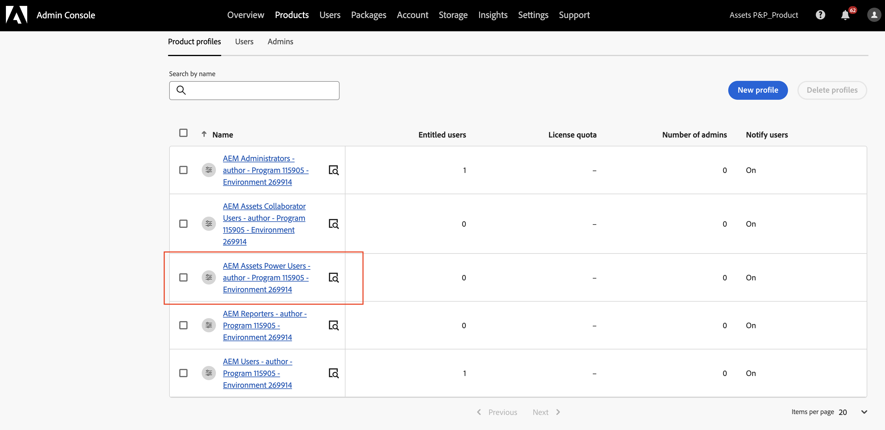

# [!DNL Assets] as a Cloud Service Prime  {#assets-prime}

Assets as a Cloud Service Prime include un DAM leggero che consente di eseguire varie funzionalità chiave, ad esempio:

* **Servizi di libreria e gestione risorse**: strumenti che consentono agli utenti di acquisire, archiviare, catalogare, controllare, gestire e amministrare le risorse digitali di un brand in un archivio centralizzato

* **Ricerca, individuazione e collaborazione**: strumenti che consentono agli utenti di sfogliare, individuare, condividere e collaborare alle risorse necessarie per creare esperienze cliente avanzate.

* **Sicurezza e Rights Management**: strumenti per gestire l’accesso, le autorizzazioni, i diritti e la sicurezza per garantire la conformità, la coerenza e l’integrità del brand.

* **Connessioni Creative Cloud**: strumenti che consentono ai team di marketing e creativi di collaborare con accesso semplificato, commento, revisione e annotazioni per aggiornare o finalizzare le risorse digitali.

* **Connessioni Experience Cloud**: strumenti per supportare l’accesso nativo alle risorse digitali da altre applicazioni e servizi Experience Cloud.

* **Esperienza del portale di distribuzione senza opzioni di estensibilità (Content Hub)**: strumenti per espandere l&#39;accesso alle risorse digitali approvate di un brand alle parti interessate per garantire l&#39;utilizzo e la coerenza del brand.

* **Integrazioni**: integrazioni con altre applicazioni Adobe e non Adobe.

* **Dynamic Media (componente aggiuntivo)**: strumenti per trasformare e distribuire immagini, video e altri contenuti emergenti per esperienze multimediali avanzate e interattive per qualsiasi dispositivo su larga scala.

  >[!NOTE]
  >
  >Dynamic Media con funzionalità OpenAPI, che consente di accedere a modificatori di immagine di base come rotazione, ritaglio (solo manuale, senza ritaglio avanzato), capovolgimento, altezza, larghezza, qualità, formato e streaming video adattivo, è disponibile anche con Assets Prime. Per ulteriori informazioni, rivolgiti al team dell’account di Adobe.

Tuttavia, man mano che le tue esigenze di DAM aumentano e hai bisogno di più funzionalità, come estensibilità dell&#39;interfaccia utente, automazione basata su API e distribuzione di codice personalizzato, devi valutare l&#39;opportunità di effettuare l&#39;aggiornamento ad [Assets Ultimate](/help/assets/assets-ultimate-overview.md).

Questo articolo fornisce un flusso di lavoro end-to-end per abilitare Assets as a Cloud Service Prime.

## Abilita Assets as a Cloud Service Prime{#enable-assets-prime}

Abilita Assets Prime durante la creazione di un nuovo programma tramite Cloud Manager. Esegui i passaggi seguenti:

1. Accedere a Cloud Manager come amministratore di sistema. Assicurati di selezionare l’organizzazione adatta durante l’accesso.

   >[!NOTE]
   >
   >Accertati di essere aggiunto al profilo di prodotto Cloud Manager appropriato per aggiungere un nuovo programma. Per ulteriori informazioni, vedere [Autorizzazioni basate sul ruolo in Cloud Manager](/help/onboarding/cloud-manager-introduction.md#role-based-permissions).

1. [Crea un nuovo programma](/help/journey-onboarding/create-program.md).

   Durante la creazione del nuovo programma, nella scheda **[!UICONTROL Soluzioni e componenti aggiuntivi]**, seleziona **[!UICONTROL Assets Prime]**. Puoi anche espandere **[!UICONTROL Assets Prime]** e selezionare **[!UICONTROL Content Hub]** per abilitare [Content Hub](/help/assets/product-overview.md) per la distribuzione delle risorse.

   

1. Fai clic su **[!UICONTROL Crea]** per creare il programma.

1. Fai clic sulla scheda del programma e fai clic su **[!UICONTROL Aggiungi ambiente]**.

1. Specifica il nome dell&#39;ambiente, definisci un&#39;area e fai clic su **[!UICONTROL Salva]** per creare l&#39;ambiente.

   

>[!NOTE]
>
>Assets Prime consente di creare solo un ambiente di produzione. L’opzione Aggiungi ambiente non è più disponibile dopo la corretta creazione dell’ambiente di produzione.

Assets Prime è ora abilitato per Experience Manager Assets as a Cloud Service.

L’amministratore di sistema ha automaticamente diritto come amministratore di AEM e riceve un messaggio e-mail per passare ad Admin Console e gestire i profili di prodotto.

L’istanza di AEM as a Cloud Service su Admin Console include i seguenti profili di prodotto:

* AEM Administrators

* Utenti AEM

* [AEM Assets Collaborator Users](#onboard-collaborator-users)

* [AEM Assets Power Users](#onboard-power-users)

Puoi iniziare ad aggiungere utenti o gruppi di utenti ai profili di prodotto Utenti di AEM Assets Collaborator e Utenti AEM Assets Power. Per ulteriori informazioni, vedere [Onboarding degli utenti AEM Assets Collaborator](#onboard-collaborator-users) e [onboarding degli utenti AEM Assets Power](#onboard-power-users).

Se hai abilitato Content Hub per Assets as a Cloud Service, è stata creata una nuova istanza all&#39;interno di AEM Assets as a Cloud Service su Admin Console con `delivery` come suffisso:

>[!NOTE]
>
>Se è stato eseguito il provisioning di Content Hub prima del 14 agosto 2024, la nuova istanza viene creata con `contenthub` come suffisso.

Tieni presente che il nome dell&#39;istanza per Content Hub non contiene `author` o `publish`.

Fare clic sul nome dell&#39;istanza per visualizzare il profilo di prodotto Content Hub `AEM Assets Limited Users`.

Puoi iniziare ad aggiungere utenti o gruppi di utenti a questo profilo di prodotto per consentire loro di accedere a Content Hub.

>[!NOTE]
>
>Se hai eseguito il provisioning di Content Hub prima del 14 agosto 2024, il profilo di prodotto Content Hub presenta `contenthub` menzionato dopo `Limited Users` invece di `delivery`.

## Eseguire l’onboarding degli utenti AEM Assets Collaborator {#onboard-collaborator-users}

Gli utenti di AEM Assets Collaborator possono lavorare con le risorse di Experience Manager tramite integrazioni di Assets disponibili per la tua organizzazione in altri prodotti Adobe e in applicazioni non Adobe, creare e modificare le risorse utilizzando Adobe Express e Firefly integrati utilizzando modelli progettati professionalmente, kit per il marchio, risorse Adobe Stock e così via, nonché accedere e sfruttare le risorse approvate dalla tua organizzazione tramite il portale AEM Assets Content Hub.

Per integrare gli utenti di Collaborator:

1. Accedi ai profili di prodotto di Experience Manager Assets facendo clic sul nome del prodotto AEM as a Cloud Service nell’elenco dei prodotti su Admin Console.

1. Fai clic sull’istanza di authoring di produzione per AEM as a Cloud Service:
   

1. Fare clic sul profilo di prodotto Utenti collaboratori e fare clic su **[!UICONTROL Aggiungi utenti]** per aggiungere l&#39;utente al profilo di prodotto.
   

1. Fai clic su **[!UICONTROL Salva]** per salvare le modifiche.

È inoltre possibile accedere ai servizi assegnati agli utenti di Collaborator e visualizzarli, come illustrato nell&#39;immagine seguente:

I servizi `Adobe Express` e `AEM Assets Collaborator Users` sono abilitati per impostazione predefinita. È possibile attivare e disattivare l’attivazione in base alle proprie esigenze, tuttavia Adobe consiglia di utilizzare i servizi predefiniti abilitati per i profili di prodotto.

## Onboarding degli utenti AEM Assets Power {#onboard-power-users}

Gli utenti di AEM Assets Power possono accedere a tutte le funzionalità di AEM Assets, tra cui la gestione di risorse, autorizzazioni, metadati e la governance e l’automazione generali relative alle risorse digitali; possono lavorare con le risorse di Experience Manager tramite integrazioni di Assets disponibili per la tua organizzazione in altre applicazioni Adobe e non Adobe; possono creare e modificare le risorse utilizzando Adobe Express e Firefly integrati utilizzando modelli progettati professionalmente, kit per i brand, risorse Adobe Stock e così via; possono inoltre accedere e sfruttare le risorse approvate della tua organizzazione tramite il portale AEM Assets Content Hub.

Per integrare gli utenti esperti:

1. Accedi ai profili di prodotto di Experience Manager Assets facendo clic sul nome del prodotto AEM as a Cloud Service nell’elenco dei prodotti su Admin Console.

1. Fai clic sull’istanza di authoring di produzione per AEM as a Cloud Service:
   

1. Fare clic sul profilo di prodotto Utenti avanzati e fare clic su **[!UICONTROL Aggiungi utenti]** per aggiungere l&#39;utente al profilo di prodotto.
   

1. Fai clic su **[!UICONTROL Salva]** per salvare le modifiche.

È inoltre possibile accedere e visualizzare i servizi assegnati agli utenti esperti, come illustrato nell&#39;immagine seguente:

I servizi `Adobe Express` e `AEM Assets Power Users` sono abilitati per impostazione predefinita. È possibile attivare e disattivare l’attivazione in base alle proprie esigenze, tuttavia Adobe consiglia di utilizzare i servizi predefiniti abilitati per i profili di prodotto.
