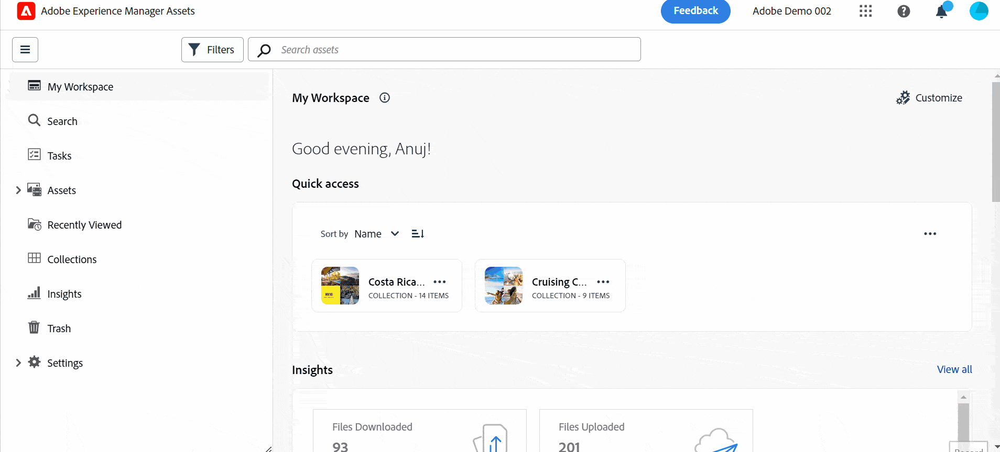

# Introduzione alla vista Assets {#assets-view}

Nell’attuale panorama dinamico digitale, in cui la creazione e la distribuzione dei contenuti in tempo reale sono essenziali, è fondamentale disporre di un’esperienza di gestione delle risorse digitali (DAM) progettata per velocizzare le attività di marketing downstream. Adobe, avvalendosi della sua esperienza nel campo del marketing e dei professionisti creativi, introduce una nuova esperienza utente rivoluzionaria. Questo approccio orientato al flusso di lavoro rivoluziona il modo in cui le aziende gestiscono le risorse digitali dinamiche, consentendo ai marketer di ottimizzare l’efficienza nella ricerca, nella collaborazione, nella personalizzazione e nella distribuzione delle risorse. Questi flussi di lavoro semplificati accelerano la velocità dei contenuti e stimolano le attività di marketing verso nuovi traguardi.

Per ulteriori informazioni sulle esperienze disponibili basate su utenti tipo per Assets as a Cloud Service, consulta [Introduzione ad Assets as a Cloud Service](/help/assets/overview.md#persona-based-experiences).

## Come accedere alla Vista risorse? {#access-assets-view}

È possibile accedere alla Vista risorse nei modi seguenti:

<!--

* **Toggle in Admin view**

    * Log into [!DNL Experience Manager] using Cloud Manager.
    * Navigate to **[!UICONTROL Assets]** > **[!UICONTROL Files]**.
    * Click the profile icon on the top right corner.
    * Click **[!UICONTROL Switch View]** from the **[!UICONTROL Profile Settings]** section.
    Repeat these steps to switch back to the Admin view.

* **Product Switcher**
    * Log into [!DNL Experience Manager] and click .
    * Select **[!UICONTROL Experience Manager Assets]** to access the Assets view.
    * Select **[!UICONTROL Experience Manager]** to access the Admin view.

* **Quick Links** 
    * Log into experience.adobe.com.
    * Click **[!UICONTROL Experience Manager Assets]** to access the Assets view.
    * Click **[!UICONTROL Experience Manager Assets]** to access the Assets view.

    -->

## Perché è utile la Vista risorse?

La vista Assets offre i seguenti vantaggi chiave che non sono disponibili nella vista Amministratore:

* [La dashboard dell’area di lavoro personale per fornire esperienze semplificate](#my-workspace-for-streamlined-experience)
* [Un approccio orientato alla ricerca per migliorare l’efficienza](#search-first)
* [Approfondimenti per prendere decisioni basate sui dati](#insights-data)
* [L’integrazione con Adobe Photoshop Express per accelerare la collaborazione](#accelerate-collaboration)
* [Caricamenti delle cartelle per impostare la struttura gerarchica per l’organizzazione](#folder-uploads)
* [L’iscrizione al contenuto dell’archivio per una gestione risorse efficiente](#subscribe-content)
* [L’eliminazione soft delle risorse per migliorare il controllo da parte degli amministratori](#soft-delete-assets)

### La dashboard dell’area di lavoro personale per fornire esperienze semplificate {#my-workspace-for-streamlined-experience}

Dai il benvenuto a una soluzione per la gestione delle risorse digitali che comprende le molteplici esigenze dei diversi ruoli organizzativi. L’elegante visualizzazione Assets dà priorità alla facilità d’uso e alla velocità, in base alla preferenza degli esperti di marketing per le aree di lavoro di aspetto visivo e prive di ingombri. Grazie a una dashboard personalizzata e specifica per l’utente dell’area di lavoro personale, i marketer possono trovare, visualizzare in anteprima, modificare, gestire e distribuire rapidamente le risorse con una notevole efficienza. Basta con le infinite ore di ricerca di risorse specifiche, dai il benvenuto a un’esperienza semplificata che ti mette a portata di mano tutto ciò che ti serve.

<!--

### Insights to take data-driven decisions {#insights-data}

To keep pace with content velocity, actionable insights are essential. The Assets view offers advanced insights within the My Workspace, providing valuable data on asset performance, audience usage, and engagements. Marketers can make data-driven decisions, optimize content strategies, and refine their downstream delivery to achieve optimal results. With access to meaningful insights, businesses can stay ahead of the competition and drive exceptional outcomes.

-->

### L’integrazione con Adobe Photoshop Express per accelerare la collaborazione {#accelerate-collaboration}

La nuova esperienza offre un set completo di funzioni di collaborazione, tra cui la modifica in tempo reale con funzionalità di Adobe Photoshop incorporate, controlli delle versioni e strumenti di annotazione. Questo consente una collaborazione perfetta tra i team di progettazione, creatività, branding e marketing, consentendo loro di eliminare gli ostacoli e accelerare il processo delle operazioni di marketing. I marketer dispongono ora di potenti strumenti per accelerare la consegna dei progetti e aumentare la produttività complessiva.

Guarda questo video per comprendere la potenza dell’integrazione della Vista risorse con Adobe Photoshop Express:

>[!VIDEO](https://video.tv.adobe.com/v/3420922)

Le prossime versioni di Assets as a Cloud Service includeranno anche l&#39;integrazione di [Adobe Firefly tramite Adobe Express](https://firefly.adobe.com/?gclid=EAIaIQobChMIlZeKuNfj_wIVeyCtBh3e5g2cEAAYASAAEgL56_D_BwE&sdid=JM4FW6VL&mv=search&mv2=paidsearch&ef_id=EAIaIQobChMIlZeKuNfj_wIVeyCtBh3e5g2cEAAYASAAEgL56_D_BwE:G:s&s_kwcid=AL!3085!3!652077237594!e!!g!!adobe%20firefly!19870733758!148140507838).

### Caricamenti delle cartelle per impostare la struttura gerarchica per l’organizzazione {#folder-uploads}

Imposta rapidamente una struttura di cartelle per l’organizzazione utilizzando Visualizza Risorse caricando le cartelle esistenti sul file system locale. Non è necessario creare cartelle nella cartella principale e quindi caricare manualmente le risorse in tali cartelle per mantenere la struttura gerarchica logica. Tutte le cartelle e le risorse nella cartella principale vengono caricate automaticamente in Experience Manager Assets.

### Un approccio orientato alla ricerca per migliorare l’efficienza {#search-first}

Sfrutta il potenziale della libreria di risorse digitali dell’organizzazione grazie alla potenza della ricerca con funzionalità all’avanguardia. Puoi dire addio alla difficoltà di navigare manualmente attraverso innumerevoli file e cartelle. Qualsiasi utente può individuare immediatamente l’immagine, il video o il documento perfetto per creare campagne di marketing straordinarie, presentazioni accattivanti e contenuti coinvolgenti. Il nostro motore di ricerca ti consente di navigare facilmente tra i tipi di risorse, i metadati, i tag avanzati e persino il contenuto stesso senza conoscere la parola chiave esatta. Adotta il futuro di DAM con la nostra funzione Cerca prima e libera tutto il potenziale della tua libreria di risorse digitali.

### L’iscrizione al contenuto dell’archivio per una gestione risorse efficiente {#subscribe-content}

La vista Assets consente di monitorare le operazioni eseguite sulle risorse, cartelle o raccolte disponibili nell’archivio. Devi selezionare e iscriverti al contenuto per il quale ti vengono inviate le notifiche. Puoi anche configurare i tipi di evento, ad esempio l’eliminazione dei contenuti a cui ti sei iscritto, le modifiche ai contenuti a cui ti sei iscritto e così via. Le notifiche vengono quindi inviate solo per questi tipi di evento.

### L’eliminazione soft delle risorse per migliorare il controllo da parte degli amministratori {#soft-delete-assets}

La cartella Cestino disponibile nella vista Risorse elenca le risorse eliminate dalla cartella principale Risorse. È possibile selezionare una risorsa nella cartella Cestino per ripristinarla nella posizione originale o eliminarla definitivamente. Puoi anche specificare una parola chiave o applicare filtri standard o personalizzati per cercare le risorse appropriate all’interno della cartella Cestino.

Oltre a queste funzioni, la vista Risorse consente di eseguire le seguenti funzioni non disponibili nella vista Amministratore:

* Carica una nuova versione di una risorsa, con un nome diverso, dal file system locale all’archivio delle risorse. La risorsa caricata è disponibile come nuova versione con lo stesso nome di quella originale.

* Rinomina le risorse e le cartelle disponibili nell’archivio.

La visualizzazione Assets è personalizzata per semplificare i flussi di lavoro, promuovere la collaborazione e accelerare la distribuzione delle risorse. Adottando la velocità dei contenuti, gli esperti di marketing possono sfruttare appieno il potenziale delle loro risorse digitali e stimolare la creatività come mai prima d’ora.

Utilizza questi collegamenti per iniziare rapidamente a utilizzare la vista Assets:

* [Area di lavoro personale](/help/assets/my-workspace-assets-view.md)
* [Introduzione all’utilizzo della vista Assets](/help/assets/get-started-assets-view.md)
