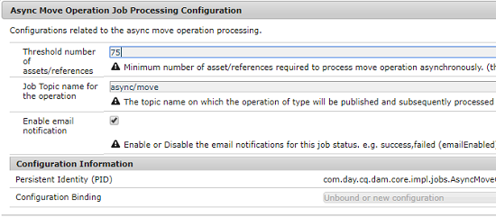

# Operazioni asincrone {#asynchronous-operations}

Per ridurre l’impatto negativo sulle prestazioni, Risorse Adobe Experience Manager (AEM) elabora in modo asincrono alcune operazioni sulle risorse a lungo termine e che richiedono molte risorse.

Tali operazioni comprendono:

* Eliminazione di molte risorse
* Spostamento di più risorse o risorse con più riferimenti
* Esportazione/importazione in massa dei metadati delle risorse.
* Recupero di risorse oltre il limite impostato, da una distribuzione AEM remota.

L’elaborazione asincrona comporta l’accodamento di più processi e la loro esecuzione in modo seriale, in base alla disponibilità di risorse di sistema.

Potete visualizzare lo stato dei processi asincroni dalla pagina Stato **[!UICONTROL processo]** asincrono.

>[!NOTE]
>
>Per impostazione predefinita, i processi in Risorse AEM vengono eseguiti in parallelo. Se N è il numero di core CPU, per impostazione predefinita i processi N/2 possono essere eseguiti in parallelo. Per utilizzare le impostazioni personalizzate per la coda di processi, modificate la configurazione della coda **predefinita dell’operazione** Async dalla console Web. Per ulteriori informazioni, consultate Configurazioni coda.

## Monitoraggio dello stato delle operazioni asincrone {#monitoring-the-status-of-asynchronous-operations}

Ogni volta che AEM Assets elabora un’operazione in modo asincrono, riceverai una notifica nella inbox <!-- and through email -->.

Per visualizzare nel dettaglio lo stato delle operazioni asincrone, andate alla pagina Stato **[!UICONTROL processo]** asincrono.

1. Tocca o fai clic sul logo AEM, quindi vai a **[!UICONTROL Risorse]** > **[!UICONTROL Jobs (Processi)]**.
1. Nella pagina Stato **[!UICONTROL processo]** asincrono, controllate i dettagli delle operazioni.

   

   Per verificare l’avanzamento di una particolare operazione, vedere il valore nella colonna **[!UICONTROL Stato]** . A seconda dell’avanzamento, viene visualizzato uno dei seguenti stati:

   **[!UICONTROL Attivo]**: Elaborazione dell&#39;operazione in corso

   **[!UICONTROL Successo]**: Operazione completata

   **[!UICONTROL Fail]** or **[!UICONTROL Error]** (Non riuscito o errore): impossibile elaborare l’operazione

   **[!UICONTROL Pianificato]**: L&#39;elaborazione dell&#39;operazione è pianificata per un momento successivo

1. Per interrompere un&#39;operazione attiva, selezionatela dall&#39;elenco e toccate o fate clic sull&#39;icona **[!UICONTROL Interrompi]** nella barra degli strumenti.

   

1. Per visualizzare ulteriori dettagli, ad esempio descrizione e registri, selezionate l’operazione e toccate o fate clic sull’icona **[!UICONTROL Apri]** nella barra degli strumenti.

   

   Viene visualizzata la pagina dei dettagli del processo.

   

1. Per eliminare l&#39;operazione dall&#39;elenco, selezionare **[!UICONTROL Elimina]** dalla barra degli strumenti. Per scaricare i dettagli in un file CSV, toccate o fate clic sull’icona **[!UICONTROL Scarica]** .

   >[!NOTE]
   >
   >Non potete eliminare un processo se il suo stato è attivo o in coda.

## Rimozione dei processi completati {#purging-completed-jobs}

Risorse AEM esegue ogni giorno un processo di eliminazione alle 1:00 per eliminare i processi asincroni completati con più di un giorno.

È possibile modificare la pianificazione per il processo di eliminazione e la durata per la quale i dettagli dei processi completati vengono conservati prima di essere eliminati. Potete inoltre configurare il numero massimo di processi completati per i quali i dettagli vengono conservati in qualsiasi momento.

1. Tocca/fai clic sul logo AEM e vai a **[!UICONTROL Strumenti]** > **[!UICONTROL Operazioni]** > **[!UICONTROL Console web]**.
1. Aprite il processo **[!UICONTROL Adobe CQ DAM Async Jobs Purge Pianificato]** .
1. Specificate la soglia per il numero di giorni dopo i quali i processi completati vengono eliminati e il numero massimo di processi per i quali i dettagli vengono conservati nella cronologia.

   
   *Figura: Configurazione per pianificare la rimozione dei processi asincroni*

1. Salva le modifiche.

## Configurazione delle soglie per l&#39;elaborazione asincrona {#configuring-thresholds-for-asynchronous-processing}

Puoi configurare il numero di soglia di risorse o riferimenti per Risorse AEM per elaborare una determinata operazione in modo asincrono.

### Configurazione delle soglie per le operazioni di eliminazione asincrone {#configuring-thresholds-for-asynchronous-delete-operations}

Se il numero di risorse o cartelle da eliminare supera la soglia, l’operazione di eliminazione viene eseguita in modo asincrono.

1. Tocca/fai clic sul logo AEM e vai a **[!UICONTROL Strumenti]** > **[!UICONTROL Operazioni]** > **[!UICONTROL Console web]**.
1. Dalla console Web, aprite la configurazione **[!UICONTROL Async Delete Operation Processing]** .
1. Nella casella **[!UICONTROL Soglia numero di risorse]** , specificate il numero di soglia di risorse/cartelle per l’elaborazione asincrona delle operazioni di eliminazione.

   

1. Salva le modifiche.

### Configurazione delle soglie per le operazioni di spostamento asincrone {#configuring-thresholds-for-asynchronous-move-operations}

Se il numero di risorse/cartelle o riferimenti da spostare supera il numero di soglia, l&#39;operazione di spostamento viene eseguita in modo asincrono.

1. Tocca/fai clic sul logo AEM e vai a **[!UICONTROL Strumenti]** > **[!UICONTROL Operazioni]** > **[!UICONTROL Console web]**.
1. Dalla console Web, aprite la configurazione **[!UICONTROL Async Move Operation Process]** .
1. Nella casella **[!UICONTROL Soglia numero di risorse/riferimenti]** , specificate il numero di soglia di risorse/cartelle o riferimenti per l’elaborazione asincrona delle operazioni di spostamento.

   

1. Salva le modifiche.
