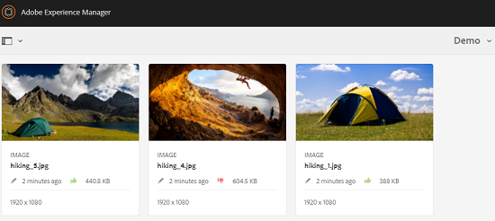

# Rivedere le risorse in cartelle e raccolte {#review-folder-assets-and-collections}

Utilizzando Risorse Adobe Experience Manager (AEM) potete impostare flussi di lavoro di revisione ad hoc per le risorse che si trovano in una cartella o in una raccolta. Potete condividerlo con revisori o partner creativi per ottenere i loro commenti. Potete associare un flusso di lavoro di revisione a un progetto o creare un&#39;attività di revisione indipendente.

Dopo aver condiviso le risorse, i revisori possono approvarle o rifiutarle. Le notifiche vengono inviate in varie fasi del flusso di lavoro per notificare ai destinatari previsti il completamento di varie attività. Ad esempio, quando condividete una cartella o una raccolta, il revisore riceve una notifica che una cartella o una raccolta è stata condivisa per la revisione.

Dopo che il revisore ha completato la revisione (approva o rifiuta le risorse), riceverete una notifica di completamento della revisione.

## Creazione di un’attività di revisione per le cartelle {#creating-a-review-task-for-folders}

1. Dall’interfaccia utente di Risorse, selezionate la cartella per la quale desiderate creare un’attività di revisione.
1. Dalla barra degli strumenti, toccate o fate clic sull&#39;icona **[!UICONTROL Crea attività]** revisione per aprire la pagina Attività **** revisione. Se l’icona non è visibile nella barra degli strumenti, toccate o fate clic su **[!UICONTROL Altro]** , quindi selezionate l’icona.

   

1. (Facoltativo) Dall&#39;elenco **[!UICONTROL Progetto]** , selezionare il progetto al quale si desidera associare l&#39;attività di revisione. Per impostazione predefinita, è selezionata l&#39;opzione **[!UICONTROL Nessuno]** . Se non si desidera associare alcun progetto all&#39;attività di revisione, mantenere questa selezione.

   >[!NOTE]
   >
   >Nell’elenco **[!UICONTROL Progetti]** sono visibili solo i progetti per i quali disponete delle autorizzazioni a livello di editor (o superiori).

1. Immettere un nome per l&#39;attività di revisione e selezionare un approver dall&#39;elenco **[!UICONTROL Assegna a]** .

   >[!NOTE]
   >
   >I membri/gruppi del progetto selezionato sono disponibili come approvatori nell&#39;elenco **[!UICONTROL Assegna a]** .

1. Inserire una descrizione, la priorità dell&#39;attività e la data di scadenza dell&#39;attività di revisione.

   

1. Nella scheda Avanzate, inserite un&#39;etichetta da utilizzare per creare l&#39;URI.

   

1. Toccate o fate clic su **[!UICONTROL Invia]**, quindi toccate o fate clic su **[!UICONTROL Fine]** per chiudere il messaggio di conferma. Una notifica per la nuova attività viene inviata al responsabile approvazione.
1. Accedi a Risorse AEM come approver e passa all’interfaccia utente Risorse. Per approvare le risorse, toccate o fate clic sull&#39;icona **[!UICONTROL Notifiche]** , quindi selezionate l&#39;attività di revisione dall&#39;elenco.

   

1. Nella pagina Attività **** revisione, esaminare i dettagli dell&#39;attività di revisione, quindi toccare o fare clic su **[!UICONTROL Revisione]**.
1. Nella pagina Attività **[!UICONTROL di]** revisione, selezionate le risorse, quindi toccate o fate clic sull&#39;icona **[!UICONTROL Approva/Rifiuta]** per approvare o rifiutare, a seconda delle necessità.

   

1. Tocca o fai clic sull’icona **[!UICONTROL Completato]** sulla barra degli strumenti. Nella finestra di dialogo, inserite un commento e toccate o fate clic su **[!UICONTROL Completa]** per confermare.
1. Andate all’interfaccia utente delle risorse e aprite la cartella. Le icone dello stato di approvazione per le risorse vengono visualizzate nelle viste a schede e Elenco.

   **Vista a schede**

   

   **Visualizzazione elenco**

   

## Creazione di un&#39;attività di revisione per le raccolte {#creating-a-review-task-for-collections}

1. Nella pagina Raccolte, selezionate la raccolta per la quale desiderate creare un&#39;attività di revisione.
1. Dalla barra degli strumenti, toccate o fate clic sull&#39;icona **[!UICONTROL Crea attività]** revisione per aprire la pagina Attività **** revisione. Se l’icona non è visibile nella barra degli strumenti, toccate o fate clic su **[!UICONTROL Altro]** , quindi selezionate l’icona.

   

1. (Facoltativo) Dall&#39;elenco **[!UICONTROL Progetto]** , selezionare il progetto al quale si desidera associare l&#39;attività di revisione. Per impostazione predefinita, è selezionata l&#39;opzione **[!UICONTROL Nessuno]** . Se non si desidera associare alcun progetto all&#39;attività di revisione, mantenere questa selezione.

   >[!NOTE]
   >
   >Nell’elenco **[!UICONTROL Progetti]** sono visibili solo i progetti per i quali disponete delle autorizzazioni a livello di editor (o superiori).

1. Immettere un nome per l&#39;attività di revisione e selezionare un approver dall&#39;elenco **[!UICONTROL Assegna a]** .

   >[!NOTE]
   >
   >I membri/gruppi del progetto selezionato sono disponibili come approvatori nell&#39;elenco **[!UICONTROL Assegna a]** .

1. Inserire una descrizione, la priorità dell&#39;attività e la data di scadenza dell&#39;attività di revisione.

   

1. Toccate o fate clic su **[!UICONTROL Invia]**, quindi toccate o fate clic su **[!UICONTROL Fine]** per chiudere il messaggio di conferma. Una notifica per la nuova attività viene inviata al responsabile approvazione.
1. Accedi a Risorse AEM come approver e passa alla console Risorse. Per approvare le risorse, toccate o fate clic sull&#39;icona **[!UICONTROL Notifiche]** , quindi selezionate l&#39;attività di revisione dall&#39;elenco.
1. Nella pagina Attività **** revisione, esaminare i dettagli dell&#39;attività di revisione, quindi toccare o fare clic su **[!UICONTROL Revisione]**.
1. Tutte le risorse della raccolta sono visibili nella pagina di revisione. Selezionate le risorse e toccate o fate clic sull&#39;icona **[!UICONTROL Approva/Rifiuta]** per approvare o rifiutare le risorse, a seconda delle necessità.

   

1. Tocca o fai clic sull’icona **[!UICONTROL Completato]** sulla barra degli strumenti. Nella finestra di dialogo, inserite un commento e toccate o fate clic su **[!UICONTROL Completa]** per confermare.
1. Passate alla console Raccolte e aprite la raccolta. Le icone dello stato di approvazione per le risorse vengono visualizzate nelle viste a schede e Elenco.

   **Vista a schede**

   

   **Visualizzazione elenco**

   

