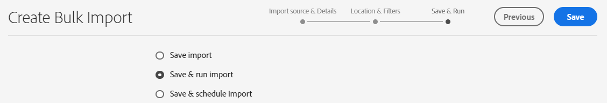
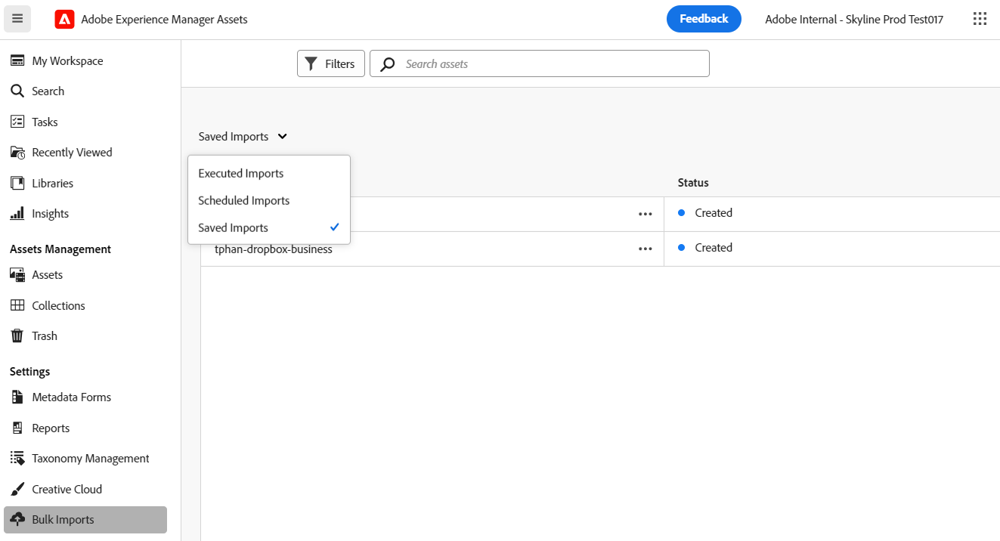

# Importazione in blocco delle risorse utilizzando la vista Assets  {#bulk-import-assets-view}

L’importazione in blocco nella vista AEM Assets consente agli amministratori di importare in AEM Assets un numero elevato di risorse da un’origine dati. Gli amministratori non devono più caricare singole risorse o cartelle in AEM Assets.

>[!NOTE]
>
>L’importazione in blocco della vista Risorse utilizza lo stesso backend dell’importazione in blocco della vista Amministratore. Tuttavia, offre più origini dati da cui importare e un’esperienza utente più semplice.

Puoi importare le risorse dalle seguenti origini dati:

* Azure
* AWS
* Google Cloud
* Dropbox
* OneDrive

## Prerequisiti {#prerequisites}

| Origine dati | Prerequisiti |
|-----|------|
| Azure | <ul> <li>Account archiviazione Azure </li> <li> Contenitore BLOB di Azure <li> Chiave di accesso Azure o token SAS in base alla modalità di autenticazione </li></ul> |
| AWS | <ul> <li>Area geografica AWS </li> <li> Bucket AWS <li> Chiave di accesso AWS </li><li> Segreto di accesso AWS </li></ul> |
| Google Cloud | <ul> <li>Bucket GCP </li> <li> E-mail account servizio GCP <li> Chiave privata account servizio GCP</li></ul> |
| Dropbox | <ul> <li>ID client Dropbox (chiave app) </li> <li> Segreto client Dropbox (segreto app)</li></ul> |
| OneDrive | <ul> <li>ID tenant OneDrive  </li> <li> ID client OneDrive</li><li> Segreto client OneDrive</li></ul> |

Oltre a questi prerequisiti basati sull’origine dati, è necessario conoscere il nome della cartella di origine disponibile nell’origine dati che contiene tutte le risorse da importare in AEM Assets.

## Configurare l’applicazione per sviluppatori di Dropbox {#dropbox-developer-application}

Prima di importare le risorse dall’account di Dropbox ad AEM Assets, crea e configura l’applicazione per sviluppatori di Dropbox.

Esegui i passaggi seguenti:

1. Accedi al tuo [Account Dropbox](https://www.dropbox.com/developers) e fai clic su **[!UICONTROL Creare le app]**.  Se utilizzi un account di Dropbox Enterprise, devi avere accesso al ruolo di amministratore dei contenuti.

1. Nella sezione **[!UICONTROL Choose an API]** (Scegli un API), seleziona l’unico pulsante di scelta disponibile.

1. Nella sezione **[!UICONTROL Choose the type of access you need]** (Scegli il tipo di accesso necessario), seleziona una delle opzioni seguenti:

   * Seleziona **[!UICONTROL App folder]** (Cartella app), se hai bisogno di accedere a una singola cartella creata all’interno dell’applicazione nel tuo account Dropbox.

   * Seleziona **[!UICONTROL Full Dropbox]** (Dropbox completo), se hai bisogno di accedere a tutti i file e le cartelle all’interno del tuo account Dropbox.

1. Specifica un nome per l’applicazione e fai clic su **[!UICONTROL Create app]** (Crea app).

1. In **[!UICONTROL Impostazioni]** della tua applicazione, aggiungi https://experience.adobe.com alla scheda **[!UICONTROL URI di reindirizzamento]** sezione.

1. Copia i valori per i campi **[!UICONTROL App key]** (Chiave app) e **[!UICONTROL App secret]** (Segreto app). I valori sono necessari durante la configurazione dello strumento di importazione in blocco in AEM Assets.

1. Nella scheda **[!UICONTROL Permissions]** (Autorizzazioni), aggiungi le seguenti autorizzazioni all’interno della sezione **[!UICONTROL Individual scopes]** (Singoli ambiti).

   * account_info.read

   * files.metadata.read

   * files.content.read

   * files.content.write

1. Per salvare le modifiche, fai clic su **[!UICONTROL Submit]** (Invia).

## Configurare l’applicazione per sviluppatori OneDrive {#onedrive-developer-application}

Prima di importare risorse dall’account OneDrive in AEM Assets, crea e configura l’applicazione per sviluppatori OneDrive.

### Creare un&#39;applicazione

1. Accedi al tuo [Account OneDrive](https://portal.azure.com/#view/Microsoft_AAD_RegisteredApps/ApplicationsListBlade) e fai clic su **[!UICONTROL Nuova registrazione]**.

1. Specifica un nome per l’applicazione, seleziona **[!UICONTROL Solo account in questa directory organizzativa (solo Adobe: singolo tenant)]** da **[!UICONTROL Tipi di account supportati]**.

1. Per aggiungere degli URI di reindirizzamento, effettua le seguenti operazioni:

   1. In **[!UICONTROL Seleziona una piattaforma]** menu a discesa, seleziona **[!UICONTROL Web]**.

   1. Aggiungi https://experience.adobe.com alla **[!UICONTROL URI di reindirizzamento]** sezione.
   <!-- Add the first URI and click **[!UICONTROL Configure]** to add it. You can add more by clicking **[!UICONTROL Add URI]** option available in the **[!UICONTROL Web]** section on the **[!UICONTROL Authentication]** page. -->

1. Fai clic su **[!UICONTROL Registra]**. L’applicazione viene creata.

1. Copia i valori per **[!UICONTROL ID applicazione (client)]** e **[!UICONTROL ID directory (tenant)]** campi. I valori sono necessari durante la configurazione dello strumento di importazione in blocco in AEM Assets.

1. Clic **[!UICONTROL Aggiungi un certificato o un segreto]** corrispondente a **[!UICONTROL Credenziali client]** opzione.

1. Clic **[!UICONTROL Nuovo segreto client]**, fornisci la descrizione del segreto client, la scadenza e fai clic su **[!UICONTROL Aggiungi]**.

1. Dopo aver creato il segreto client, copia il campo **[!UICONTROL Value]** (Valore) (non copiare il campo ID segreto). Verrà richiesto per configurare l’importazione in blocco in AEM Assets.

### Aggiungere le autorizzazioni API

Per aggiungere le autorizzazioni API per l’applicazione, effettua le seguenti operazioni:

1. Fai clic su **[!UICONTROL API permissions]** (Autorizzazioni API) nel riquadro a sinistra e fai clic su **[!UICONTROL Add a permission]** (Aggiungi un’autorizzazione).
1. Fai clic su **[!UICONTROL Microsoft Graph]** > **[!UICONTROL Delegated permissions]** (Grafico Microsoft > Autorizzazioni delegate). La sezione **[!UICONTROL Select Permission]** (Seleziona autorizzazione) mostra le autorizzazioni disponibili.
1. Seleziona l’autorizzazione `offline_access` da `OpenId permissions` e l’autorizzazione `Files.ReadWrite.All` da `Files`.
1. Fai clic su **[!UICONTROL Add permissions]** (Aggiungi autorizzazioni) per salvare gli aggiornamenti.

## Creare una configurazione di importazione in blocco {#create-bulk-import-configuration}

Esegui la procedura seguente per creare una configurazione di importazione in blocco in [!DNL Experience Manager Assets]:

1. Clic **[!UICONTROL Importazione in blocco]** nel riquadro a sinistra e fare clic su **[!UICONTROL Crea importazione]**.
1. Seleziona l’origine dati. Le opzioni disponibili includono **[!UICONTROL Azure]**, **[!UICONTROL AWS]**, **[!UICONTROL Google Cloud]**, **[!UICONTROL Dropbox]** e **[!UICONTROL OneDrive]**.
1. Specifica un nome per la configurazione dell’importazione in blocco nel campo **[!UICONTROL Nome]**.
1. Specifica le credenziali specifiche dell’origine dati, come indicato nei [Prerequisiti](#prerequisites).
1. Immetti il nome della cartella principale che contiene le risorse nell’origine dati in **[!UICONTROL Cartella di origine]** campo.

   >[!NOTE]
   >
   >Se utilizzi Dropbox come origine dati, specifica il percorso della cartella di origine in base alle regole seguenti:
   >* Se durante la creazione dell’applicazione di Dropbox hai selezionato **Full Dropbox** (Dropbox completo), la cartella che contiene le risorse è già presente in `https://www.dropbox.com/home/bulkimport-assets`, quindi specifica `bulkimport-assets` nel campo **[!UICONTROL Cartella di origine]**.
   >* Se durante la creazione dell’applicazione di Dropbox hai selezionato **App folder** (Cartella app), la cartella che contiene le risorse è già presente in `https://www.dropbox.com/home/Apps/BulkImportAppFolderScope/bulkimport-assets`, quindi specifica `bulkimport-assets` nel campo **[!UICONTROL Cartella di origine]**, dove `BulkImportAppFolderScope` fa riferimento al nome dell’applicazione. In questo caso, `Apps` viene aggiunto automaticamente dopo `home`.

1. (Facoltativo) Seleziona l’opzione **[!UICONTROL Elimina il file di origine dopo l’importazione]** per eliminare i file originali dall’archivio dati di origine dopo l’importazione in Experience Manager Assets.
1. Seleziona la **[!UICONTROL Modalità di importazione]**. Seleziona **[!UICONTROL Ignora]**, **[!UICONTROL Sostituisci]** o **[!UICONTROL Crea versione]**. La modalità Ignora è l’impostazione predefinita e, in questa modalità, l’importazione di una risorsa viene ignorata se esiste già.
   

1. (Facoltativo) Specifica il file di metadati da importare, fornito in formato CSV, nel **[!UICONTROL File metadati]** campo. Il file di origine dei metadati deve trovarsi nella cartella di origine. Clic **[!UICONTROL Successivo]** per passare a **[!UICONTROL Posizione e filtri]**.
1. Per definire una posizione in DAM in cui importare le risorse utilizzando il campo **[!UICONTROL Cartella risorse di destinazione]**, specifica un percorso. Esempio: `/content/dam/imported_assets`.
1. (Facoltativo) Nella sezione **[!UICONTROL Scegli filtri]**, specifica la dimensione minima in MB del file delle risorse da includere nel processo di acquisizione nel campo **[!UICONTROL Filtra per dimensione min]**.
1. (Facoltativo) Specifica la dimensione massima in MB del file delle risorse da includere nel processo di acquisizione del campo **[!UICONTROL Filtra per dimensione max]**.
1. (Facoltativo) Seleziona i tipi MIME da includere nel processo di acquisizione utilizzando il campo **[!UICONTROL Includi tipo MIME]**. In questo campo è possibile selezionare più tipi MIME. Se non definisci un valore, tutti i tipi MIME vengono inclusi nel processo di acquisizione.

1. (Facoltativo) Seleziona i tipi MIME da escludere dal processo di acquisizione utilizzando il campo **[!UICONTROL Escludi tipo MIME]**. In questo campo è possibile selezionare più tipi MIME. Se non definisci un valore, tutti i tipi MIME vengono inclusi nel processo di acquisizione.

   

1. Fai clic su **[!UICONTROL Avanti]**. Selezionare una delle opzioni seguenti in base alle proprie preferenze:

   * **[!UICONTROL Salva importazione]** per salvare la configurazione per ora in modo da poterla eseguire in un secondo momento.
   * **[!UICONTROL Salva ed esegui importazione]** per salvare la configurazione ed eseguire l&#39;importazione in blocco.
   * **[!UICONTROL Salva e pianifica l’importazione]** per salvare la configurazione e pianificare l’importazione in blocco per un momento successivo. Puoi scegliere la frequenza dell’importazione in blocco e impostare la data e l’ora dell’importazione. L’importazione in blocco viene eseguita alla data e all’ora impostate nella frequenza selezionata.

   

1. Fai clic su **[!UICONTROL Salva]** per eseguire l’opzione selezionata.

### Gestione dei nomi dei file durante l’importazione in blocco {#filename-handling-bulkimport-assets-view}

Quando importi risorse o cartelle in blocco, [!DNL Experience Manager Assets] importa l’intera struttura di ciò che esiste nell’origine di importazione. [!DNL Experience Manager] segue le regole predefinite per i caratteri speciali nei nomi delle risorse e delle cartelle; pertanto, questi nomi di file devono essere bonificati. Sia per il nome della cartella che per quello della risorsa, il titolo definito dall’utente rimane invariato e viene memorizzato in `jcr:title`.

Durante l’importazione in blocco, [!DNL Experience Manager] cerca le cartelle esistenti per evitare di reimportare le risorse e le cartelle e verifica inoltre le regole di bonifica applicate nella cartella principale in cui avviene l’importazione. Se le regole di bonifica vengono applicate nella cartella principale, le stesse regole vengono applicate all’origine di importazione. Per le nuove importazioni, per gestire i nomi file di risorse e cartelle vengono applicate le seguenti regole di bonifica.

Per ulteriori informazioni sui nomi non consentiti, sulla gestione dei nomi delle risorse e sulla gestione dei nomi delle cartelle durante l’importazione in blocco, consulta [Gestione dei nomi dei file durante l’importazione in blocco nella vista Amministrazione](add-assets.md##filename-handling-bulkimport).

## Visualizzare le configurazioni di importazione in blocco esistenti {#view-import-configuration}

Per visualizzare le importazioni in blocco esistenti, selezionare **[!UICONTROL Importazioni in blocco]** nel riquadro a sinistra. Viene visualizzata la pagina Importazioni in blocco con l&#39;elenco di **[!UICONTROL Importazioni eseguite]**.  
È inoltre possibile visualizzare **[!UICONTROL Importazioni salvate]** e **[!UICONTROL Importazioni pianificate]** dall’opzione a discesa.

## Modificare la configurazione dell’importazione in blocco {#edit-import-configuration}

Per modificare i dettagli della configurazione, fai clic su  corrisponde al nome della configurazione e fai clic su **[!UICONTROL Modifica]**. Durante l’operazione di modifica non è possibile modificare il titolo della configurazione e l’origine dati di importazione. Puoi modificare la configurazione dalle schede Importazioni eseguite, Importazioni pianificate e Importazioni salvate.

## Pianificare importazioni una tantum o ricorrenti {#schedule-imports}

Per pianificare un’importazione in blocco una tantum o ricorrente, effettua le seguenti operazioni:

1. Clic  corrispondente al nome di configurazione disponibile nella **[!UICONTROL Importazioni eseguite]** o **[!UICONTROL Importazioni salvate]** e fai clic su **[!UICONTROL Pianificazione]**. Puoi anche riprogrammare un’importazione pianificata esistente: passa alla scheda **[!UICONTROL Importazioni pianificate]** e fai clic su **[!UICONTROL Pianifica]**.

1. Imposta un’acquisizione una tantum o una pianificazione oraria, giornaliera o settimanale. Fai clic su **[!UICONTROL Invia]**.

   

## Verificare lo stato dell’importazione {#import-health-check}

Per convalidare la connessione all&#39;origine dati, fare clic su  corrisponde al nome della configurazione, quindi fai clic su **[!UICONTROL Verifica]**. Se la connessione ha esito positivo, Experience Manager Assets presenta il seguente messaggio:

## Eseguire un’esecuzione di prova prima di eseguire un’importazione {#dry-run-bulk-import}

Clic  corrisponde al nome della configurazione e fai clic su **[!UICONTROL Dry Run]** per richiamare un’esecuzione dei test per il processo di importazione in blocco. In Experience Manager Assets vengono visualizzati i dettagli seguenti sul processo di importazione in blocco:

## Eseguire un’importazione in blocco {#run-bulk-import}

Se hai salvato l’importazione durante la creazione della configurazione, puoi passare alla scheda Importazioni salvate e fare clic su  corrispondente alla configurazione e fai clic su **[!UICONTROL Esegui]**.

Allo stesso modo, se devi eseguire un’importazione già eseguita, passa alla scheda Importazioni eseguite, quindi fai clic su  corrisponde al nome della configurazione e fai clic su **[!UICONTROL Esegui]**.

## Interrompere o pianificare un’importazione in corso {#schedule-stop-ongoing-report}

Per pianificare o interrompere un’importazione in blocco in corso, puoi usare la finestra di dialogo sullo stato dell’importazione in blocco che viene visualizzata nella pagina home di Importazione in blocco durante un’importazione.

Puoi anche visualizzare le risorse importate nella cartella di destinazione, facendo clic su **[!UICONTROL Visualizza risorse]**.

## Eliminare una configurazione di importazione in blocco {#delete-bulk-import-configuration}

Clic  corrispondente al nome della configurazione esistente in **[!UICONTROL Importazioni eseguite]**, **[!UICONTROL Importazioni pianificate]**, o **[!UICONTROL Importazioni salvate]** e fai clic su **[!UICONTROL Elimina]** per eliminare la configurazione Importazione in blocco.

## Passare alle risorse dopo l’importazione in blocco {#view-assets-after-bulk-import}

Per visualizzare il percorso di destinazione delle risorse in cui vengono importate dopo l’esecuzione del processo di importazione in blocco, fai clic su  corrisponde al nome della configurazione, quindi fai clic su **[!UICONTROL Visualizza risorse]**.

## Video: importare risorse in blocco tramite la vista Risorse

>[!VIDEO](https://video.tv.adobe.com/v/3428012)
