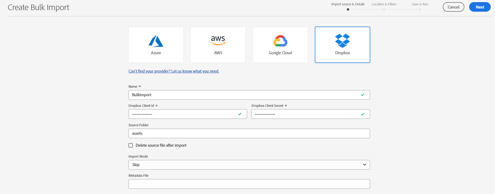
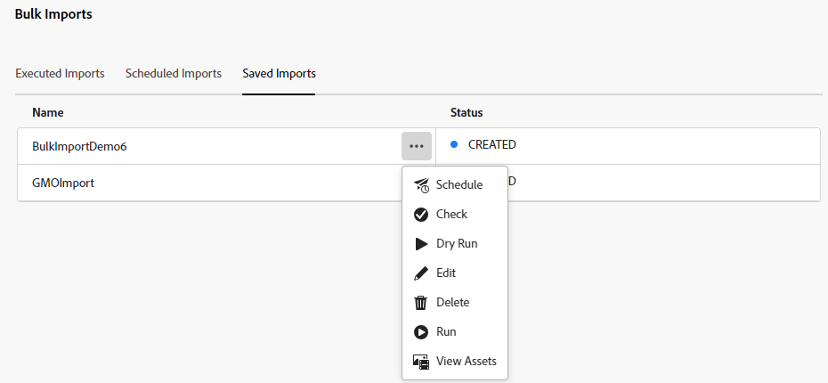

# Importare in blocco le risorse tramite la vista Risorse  {#bulk-import-assets-view}

L’importazione in blocco nella vista AEM Assets consente agli amministratori di importare in AEM Assets un numero elevato di risorse da un’origine dati. Gli amministratori non devono più caricare singole risorse o cartelle in AEM Assets.

Puoi importare le risorse dalle seguenti origini dati:

* Azure
* AWS
* Google Cloud
* Dropbox

## Prerequisiti {#prerequisites}

| Sorgente dati | Prerequisiti |
|-----|------|
| Azure | <ul> <li>Account archiviazione Azure </li> <li> Contenitore BLOB di Azure <li> Chiave di accesso Azure o token SAS basato sulla modalità di autenticazione </li></ul> |
| AWS | <ul> <li>Area geografica AWS </li> <li> Bucket AWS <li> Chiave di accesso AWS </li><li> Segreto di accesso AWS </li></ul> |
| Google Cloud | <ul> <li>Bucket GCP </li> <li> E-mail account servizio GCP <li> Chiave privata account servizio GCP</li></ul> |
| Dropbox | <ul> <li>ID client Dropbox </li> <li> Segreto client Dropbox</li></ul> |

Oltre a questi prerequisiti basati sull’origine dati, è necessario conoscere il nome della cartella di origine disponibile nell’origine dati che contiene tutte le risorse che devono essere importate in AEM Assets.

## Creare una configurazione di importazione in blocco {#create-bulk-import-configuration}

Per creare una configurazione di importazione in blocco, effettua le seguenti operazioni:

1. Accedi a **[!UICONTROL Impostazioni]** > **[!UICONTROL Importazione in blocco]** e fai clic su **[!UICONTROL Crea importazione]**.
1. Selezionare l&#39;origine dati. Le opzioni disponibili includono Azure, AWS, Google Cloud e Dropbox.
1. Specifica un nome per la configurazione dell&#39;importazione in blocco in **[!UICONTROL Nome]** campo.
1. Specifica le credenziali specifiche dell’origine dati, come indicato in [Prerequisiti](#prerequisites).
1. Immetti il nome della cartella principale che contiene le risorse nell’origine dati in **[!UICONTROL Cartella di origine]** campo.
1. (Facoltativo) Seleziona la **[!UICONTROL Elimina il file di origine dopo l’importazione]** opzione per eliminare i file originali dall&#39;archivio dati di origine dopo l&#39;importazione in Experience Manager Assets.
1. Seleziona la **[!UICONTROL Modalità di importazione]**. Seleziona **[!UICONTROL Ignora]**, **[!UICONTROL Sostituisci]**, o **[!UICONTROL Crea versione]**. La modalità Ignora è l’impostazione predefinita e, in questa modalità, l’importazione di una risorsa viene ignorata se esiste già.
   

1. (Facoltativo) Specifica il file di metadati da importare, fornito in formato CSV, nel campo File di metadati e fai clic su **[!UICONTROL Successivo]** per passare a **[!UICONTROL Posizione e filtri]**.
1. Per definire una posizione in DAM in cui importare le risorse utilizzando **[!UICONTROL Cartella risorse di destinazione]** , specifica un percorso. Esempio: `/content/dam/imported_assets`.
1. (Facoltativo) In **[!UICONTROL Scegli filtri]** , fornisci la dimensione minima in MB del file delle risorse da includere nel processo di acquisizione in **[!UICONTROL Filtra per dimensione min]** campo.
1. (Facoltativo) Specifica la dimensione massima in MB del file delle risorse da includere nel processo di acquisizione di **[!UICONTROL Filtra per dimensione max]** campo.
1. (Facoltativo) Seleziona i tipi MIME da includere nel processo di acquisizione utilizzando **[!UICONTROL Includi tipo MIME]** campo. In questo campo è possibile selezionare più tipi MIME. Se non definisci un valore, tutti i tipi MIME vengono inclusi nel processo di acquisizione.

1. (Facoltativo) Seleziona i tipi MIME da escludere nel processo di acquisizione utilizzando **[!UICONTROL Escludi tipo MIME]** campo. In questo campo è possibile selezionare più tipi MIME. Se non definisci un valore, tutti i tipi MIME vengono inclusi nel processo di acquisizione.

   

1. Fai clic su **[!UICONTROL Avanti]**. Seleziona **[!UICONTROL Salva ed esegui importazione]** per salvare la configurazione ed eseguire l&#39;importazione in blocco. Seleziona **[!UICONTROL Salva importazione]** per salvare la configurazione per ora in modo da poterla eseguire in un secondo momento.

   

1. Clic **[!UICONTROL Salva]** per eseguire l&#39;opzione selezionata.

## Visualizzare le configurazioni di importazione in blocco esistenti {#view-import-configuration}

Se selezioni di salvare la configurazione dopo averla creata, questa viene visualizzata nella **[!UICONTROL Importazioni salvate]** scheda.

Se selezioni di salvare ed eseguire l’importazione, la configurazione di importazione viene visualizzata in **[!UICONTROL Importazioni eseguite]** scheda.

Se pianifichi un’importazione, questa viene visualizzata nella **[!UICONTROL Importazioni pianificate]** scheda.

## Modifica configurazione importazione in blocco {#edit-import-configuration}

Per modificare i dettagli della configurazione, fai clic su ... corrispondente al nome della configurazione, quindi fai clic su **[!UICONTROL Modifica]**. Non è possibile modificare il titolo della configurazione e l&#39;origine dati di importazione durante l&#39;operazione di modifica. Puoi modificare la configurazione utilizzando le schede Eseguite, Pianificate o Importazioni salvate.

## Pianificazione di importazioni una tantum o ricorrenti {#schedule-imports}

Per pianificare un’importazione in blocco una tantum o ricorrente, effettua le seguenti operazioni:

1. fai clic su ... corrispondente al nome della configurazione disponibile nella **[!UICONTROL Importazioni eseguite]** o **[!UICONTROL Importazioni salvate]** e fai clic su **[!UICONTROL Pianificazione]**. È inoltre possibile riprogrammare un&#39;importazione pianificata esistente passando a **[!UICONTROL Importazioni pianificate]** e clic su **[!UICONTROL Pianificazione]**.

1. Imposta un’acquisizione una tantum o una pianificazione oraria, giornaliera o settimanale. Clic **[!UICONTROL Invia]**.

   

## Eseguire un controllo di integrità dell&#39;importazione {#import-health-check}

Per convalidare la connessione all&#39;origine dati, fare clic su ... corrispondente al nome della configurazione, quindi fare clic su **[!UICONTROL Verifica]**. Se la connessione ha esito positivo, Experience Manager Assets visualizza il seguente messaggio:

## Eseguire un&#39;esecuzione di prova prima di eseguire un&#39;importazione {#dry-run-bulk-import}

Fai clic su ... corrispondente al nome della configurazione e fai clic su **[!UICONTROL Dry Run]** per richiamare un’esecuzione dei test per il processo di importazione in blocco. In Experience Manager Assets vengono visualizzati i dettagli seguenti sul processo di importazione in blocco:

## Eseguire un’importazione in blocco {#run-bulk-import}

Se hai salvato l’importazione durante la creazione della configurazione, passa alla scheda Importazioni salvate, fai clic su ... corrispondente alla configurazione e fai clic su **[!UICONTROL Esegui]**.

Allo stesso modo, se devi eseguire un’importazione già eseguita, passa alla scheda Importazioni eseguite, fai clic su ... corrispondente al nome della configurazione e fai clic su **[!UICONTROL Esegui]**.

## Interrompere o pianificare un&#39;importazione in corso {#schedule-stop-ongoing-report}

È possibile pianificare o interrompere un’importazione in blocco in corso utilizzando la finestra di dialogo Stato importazione in blocco visualizzata nella home page di Importazione in blocco durante un’importazione.

Puoi anche visualizzare le risorse importate nella cartella di destinazione facendo clic su **[!UICONTROL Visualizza risorse]**.

## Eliminare una configurazione di importazione in blocco {#delete-bulk-import-configuration}

Fai clic su ... corrispondente al nome della configurazione esistente in **[!UICONTROL Importazioni eseguite]**, **[!UICONTROL Importazioni pianificate]**, o **[!UICONTROL Importazioni salvate]** e fai clic su **[!UICONTROL Elimina]** per eliminare la configurazione Importazione in blocco.

## Passare alle risorse dopo l&#39;importazione in blocco {#view-assets-after-bulk-import}

Per visualizzare il percorso di destinazione delle risorse in cui vengono importate dopo l’esecuzione del processo di importazione in blocco, fai clic su ... corrispondente al nome della configurazione, quindi fai clic su **[!UICONTROL Visualizza risorse]**.

