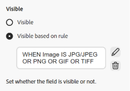
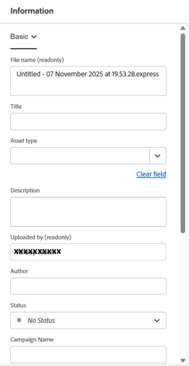

# Visualizzazione Assets metadati a cascata{#cascading-metadata-assets-view}

Quando acquisiscono le informazioni sui metadati di una risorsa, gli utenti forniscono informazioni nei vari campi disponibili. Puoi visualizzare campi di metadati specifici o valori di campo che dipendono dalle opzioni selezionate negli altri campi. Tale visualizzazione condizionale dei metadati è denominata metadati a catena. In altre parole, è possibile creare una dipendenza tra un particolare campo/valore di metadati e uno o più campi e/o i relativi valori.

Utilizza i metadati in Forms per definire le regole per la visualizzazione dei metadati a catena. Ad esempio, se il modulo di metadati include un campo tipo di risorsa, puoi definire un set di campi pertinente da visualizzare in base al tipo di risorsa selezionata da un utente.

Di seguito sono riportati alcuni casi d’uso per i quali è possibile definire i metadati a catena:

* Se è richiesta la posizione dell&#39;utente, visualizzare i nomi delle città pertinenti in base alla scelta del paese e dello stato dell&#39;utente.
* Carica i nomi di marchi pertinenti in un elenco in base alla categoria di prodotto scelta dall’utente.
* Attiva/disattiva la visibilità di un particolare campo in base al valore specificato in un altro campo. Ad esempio, se l’utente desidera che la spedizione venga consegnata a un indirizzo diverso, visualizza i campi dell’indirizzo di spedizione separato.
* Imposta un campo come obbligatorio in base al valore specificato in un altro campo.
* Modifica le opzioni visualizzate per un particolare campo in base al valore specificato in un altro campo.
* Imposta il valore di metadati predefinito in un particolare campo in base al valore specificato in un altro campo.

## Configura metadati a catena in [!DNL Experience Manager] {#configure-cascading-metadata-in-aem}

Considera uno scenario in cui desideri visualizzare i metadati a catena in base al tipo di risorsa selezionata. Ad esempio:

* Per un video, visualizza i campi applicabili come formato, codec, durata e così via.
* Per un documento Word o PDF, visualizzare i campi, ad esempio il conteggio delle pagine, l&#39;autore e così via.

Il campo a discesa `Image` viene utilizzato come esempio per categorizzare i file in base al tipo di immagine. Il menu a discesa contiene le opzioni che rappresentano le estensioni immagine supportate (come JPG/JPEG, GIF, ecc.). Per garantire la coerenza dei dati ed evitare la selezione o l’elaborazione di formati non supportati, a questo campo viene applicata una regola di convalida. La regola valuta il valore dell’elenco a discesa selezionato e applica vincoli in linea con i formati immagine accettati.

>[!IMPORTANT]
>
>Puoi creare regole solo in base ai campi a discesa.

Indipendentemente dal tipo di risorsa scelto, visualizza le informazioni sul copyright come campo obbligatorio. È possibile utilizzare i [componenti metadati predefiniti](metadata-assets-view.md#property-components) e [assegnare metadati a una cartella](metadata-assets-view.md#assign-metadata-form-folder).

### Genera Forms metadati {#build-metadata-schema-forms}

Per creare un nuovo modulo metadati, considera i passaggi seguenti:

1. Seleziona il logo [!DNL Experience Manager] e passa a **[!UICONTROL Impostazioni]** > **[!UICONTROL Forms metadati]** > **[!UICONTROL Crea]**.

1. Dal menu a discesa **[!UICONTROL Tipo]**, selezionare il tipo di modulo appropriato: **[!UICONTROL File]**, **[!UICONTROL Cartella]** o **[!UICONTROL Raccolta]**.

1. Specifica il titolo del modulo metadati nel campo **[!UICONTROL Name]**.

1. In alternativa, scegli un modello di modulo metadati esistente dal menu a discesa **[!UICONTROL Scegli dal modello di modulo esistente]**.

1. Viene visualizzato un modulo metadati vuoto. Aggiungi una nuova scheda.

   

   * **A:** Passaggio tra [!UICONTROL Modifica] o [!UICONTROL Anteprima]
   * **B:** [Componenti del modulo metadati](metadata-assets-view.md#property-components)
   * **C:** Passa ad altro modulo metadati
   * **D:** Aggiungi una nuova scheda
   * **E:** Area di lavoro
   * **F:** Impostazioni generali per il componente selezionato
   * **G:** scheda Regole
   * **H:** proprietà componente

Guarda questo video per visualizzare la sequenza di passaggi, [Imposta Forms metadati](https://video.tv.adobe.com/v/341275).

### Modificare un modulo metadati esistente {#modify-existing-metadata-form}

Per modificare un modulo di metadati esistente, effettua le seguenti operazioni:

1. Apri un modulo di metadati esistente e passa ai [componenti predefiniti](metadata-assets-view.md#property-components) che desideri aggiungere nel modulo e rilascia gli elementi nell&#39;area di lavoro.

   In conformità con il caso d&#39;uso **Immagine**, aggiungi un campo a discesa per definire i tipi di risorse immagine. Specificare il nome e il percorso della proprietà in **Impostazioni** e configurare facoltativamente il campo come **[!UICONTROL Sola lettura]** o **[!UICONTROL Selezioni multiple]**.

1. Immetti manualmente le opzioni chiave-valore per il menu a discesa, specificando un percorso JSON o importando un file CSV.

   * Per specificare manualmente i valori, selezionare **[!UICONTROL Aggiungi manualmente]** in **[!UICONTROL Opzioni]**, fare clic su `Add` e specificare l&#39;etichetta e il valore dell&#39;opzione. Ad esempio, specifica i tipi di risorse Video, PDF e Immagine.

     

   * Per recuperare i valori da un percorso JSON, selezionare **[!UICONTROL Aggiungi tramite percorso JSON]** e specificare il percorso del file JSON.

     >[!NOTE]
     >
     >Assicurati di memorizzare il file JSON in una posizione condivisa accessibile a tutti gli editor e autori DAM.

     

   * Per recuperare i valori da un file CSV in modo dinamico, fare clic su **[!UICONTROL Importa file CSV]** e specificare il percorso del file CSV. [!DNL Experience Manager] recupera le coppie chiave-valore in tempo reale quando il modulo viene presentato all&#39;utente.

     

   >[!NOTE]
   > 
   >Non è possibile importare le opzioni da un file CSV e modificarle manualmente, in quanto entrambe le opzioni si escludono a vicenda.

1. Per creare una dipendenza tra il campo Immagine e altri campi, selezionare il campo dipendente e aprire la scheda **[!UICONTROL Regole]**. Ogni componente supporta un set specifico di regole. Per questo caso d’uso, per definire la logica della regola vengono utilizzate le opzioni Tipo di risorsa immagine.

   <!---->

   <!---->

1. In **[!UICONTROL Obbligatorio]**, scegli l&#39;opzione **[!UICONTROL Richiesto in base alla nuova regola]**. Fai clic su  per aggiungere una nuova regola.

   

   Nel caso d’uso corrente, il campo Tipo di risorsa è obbligatorio quando il formato della risorsa immagine è JPG/JPEG, PNG, GIF, TIFF o WEBP. Inoltre, fai clic su  per ridefinire la regola oppure fai clic su  per eliminare la regola definita.

   

1. In **[!UICONTROL Visibilità]** scegliere l&#39;opzione **[!UICONTROL Visibile, in base alla nuova regola]**. Fai clic su  per aggiungere una nuova regola.

   >[!NOTE]
   >
   >Puoi applicare la condizione **[!UICONTROL Requisito]** e **[!UICONTROL Visibilità]** indipendentemente le une dalle altre.

   

   Nel caso d’uso corrente, il campo Tipo di risorsa è visibile quando il formato della risorsa immagine è JPG/JPEG, PNG o GIF. Inoltre, fai clic su  per ridefinire la regola oppure fai clic su  per eliminare la regola definita.

   

1. Seleziona **[!UICONTROL Opzioni basate sulla regola]** per creare una dipendenza e definire la regola. Fai clic su  per aggiungere una nuova regola.

   

   Per configurare le scelte basate su regole per il menu a discesa Tipo di risorsa, crea una regola e imposta Immagine come campo dipendente. Quindi definisci i valori di visualizzazione per ciascun formato immagine selezionando Immagine per JPG/JPEG, PNG, GIF e TIFF, quindi selezionando Video per WEBP, assicurandoti che vengano controllati solo i valori previsti per ciascun formato per visualizzare dinamicamente le opzioni rilevanti. Inoltre, fai clic su  per ridefinire la regola oppure fai clic su  per eliminare la regola definita.

   

1. Allo stesso modo, ripeti i passaggi per creare una dipendenza tra le altre risorse come PDF e Word nel campo [!UICONTROL Tipo risorsa] e campi come [!UICONTROL Conteggio pagine] e [!UICONTROL Autore].

1. Fai clic su **[!UICONTROL Salva]**. Applica il modulo metadati a una cartella.

1. Passa alla cartella a cui hai applicato il modulo metadati e apri la pagina delle proprietà di una risorsa. A seconda della scelta effettuata nel campo Tipo di risorsa, vengono visualizzati i campi di metadati a cascata pertinenti.

   

## Passaggi successivi {#next-steps}

* [Guarda un video per gestire i moduli di metadati nella visualizzazione Assets](https://experienceleague.adobe.com/docs/experience-manager-learn/assets-essentials/configuring/metadata-forms.html?lang=it)

* Fornisci feedback sui prodotti utilizzando l’opzione [!UICONTROL Feedback] disponibile nell’interfaccia utente della vista Risorse

* Fornisci feedback alla documentazione utilizzando [!UICONTROL Modifica questa pagina]  o [!UICONTROL Segnala un problema]  disponibile sulla barra laterale destra

* Contatta il [Servizio clienti](https://experienceleague.adobe.com/it?support-solution=General&lang=it#support)
