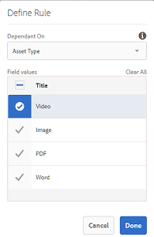

# Metadati A Cascata {#cascading-metadata}

Quando acquisite le informazioni di metadati di una risorsa, gli utenti forniscono informazioni nei vari campi disponibili. Potete visualizzare campi di metadati o valori di campi specifici che dipendono dalle opzioni selezionate negli altri campi. Tale visualizzazione condizionale dei metadati è denominata metadati CSS. In altre parole, potete creare una dipendenza tra un particolare campo/valore di metadati e uno o più campi e/o relativi valori.

Usate gli schemi di metadati per definire le regole per la visualizzazione dei metadati CSS. Ad esempio, se lo schema di metadati include un campo del tipo di risorsa, potete definire un set di campi pertinenti da visualizzare in base al tipo di risorsa selezionata dall’utente.

Di seguito sono riportati alcuni casi d’uso per i quali potete definire metadati a cascata:

* Se è richiesta la posizione dell&#39;utente, visualizzate i nomi delle città pertinenti in base alla scelta del paese e dello stato dell&#39;utente.
* Caricate i nomi dei marchi pertinenti in un elenco in base alla scelta della categoria di prodotti da parte dell&#39;utente.
* Attiva o disattiva la visibilità di un particolare campo in base al valore specificato in un altro campo. Ad esempio, visualizzare campi indirizzo di spedizione separati se l&#39;utente desidera che la spedizione venga consegnata a un indirizzo diverso.
* Designare un campo come obbligatorio in base al valore specificato in un altro campo.
* Modifica le opzioni visualizzate per un particolare campo in base al valore specificato in un altro campo.
* Impostate il valore di metadati predefinito in un particolare campo in base al valore specificato in un altro campo.

## Configurare i metadati in cascata in AEM {#configure-cascading-metadata-in-aem}

Considerate uno scenario in cui visualizzare i metadati CSS in base al tipo di risorsa selezionata. Alcuni esempi

* Per un video, visualizzate i campi applicabili come formato, codec, durata e così via.
* Per un documento Word o PDF, visualizzare campi quali conteggio delle pagine, autore e così via.

Indipendentemente dal tipo di risorsa scelta, visualizzate le informazioni sul copyright come campo obbligatorio.

1. Toccate o fate clic sul logo AEM, quindi andate a **[!UICONTROL Strumenti]** > **[!UICONTROL Risorse]** > Schemi di **[!UICONTROL metadati]**.
1. Nella pagina Moduli **** schema selezionare un modulo schema, quindi toccare o fare clic su **[!UICONTROL Modifica]** dalla barra degli strumenti per modificare lo schema.

   

1. (Facoltativo) Nell’editor dello schema di metadati, create un nuovo campo da personalizzare. Specificate un nome e un percorso di proprietà nella scheda **[!UICONTROL Impostazioni]** .

   Per creare una nuova scheda, toccate o fate clic `+` per aggiungere una scheda, quindi aggiungete un campo di metadati.

   

1. Aggiungi un campo a discesa per il tipo di risorsa. Specificate un nome e un percorso di proprietà nella scheda **[!UICONTROL Impostazioni]** . Aggiungete una descrizione facoltativa.

   

1. Le coppie di valori chiave sono le opzioni fornite all&#39;utente del modulo. Puoi fornire le coppie chiave-valore manualmente o da un file JSON.

   * Per specificare manualmente i valori, selezionate **[!UICONTROL Aggiungi manualmente]**, quindi toccate o fate clic su **[!UICONTROL Aggiungi scelta]** e specificate il testo e il valore dell’opzione. Ad esempio, specificate i tipi di risorse Video, PDF, Word e Immagine.

   * Per recuperare i valori da un file JSON in modo dinamico, selezionate **[!UICONTROL Aggiungi tramite percorso]** JSON e fornite il percorso del file JSON. AEM recupera le coppie chiave-valore in tempo reale quando il modulo viene presentato all’utente.
   Entrambe le opzioni si escludono a vicenda. Non potete importare le opzioni da un file JSON e modificarle manualmente.

   

   >[!NOTE]
   >
   >Quando si aggiunge un file JSON, le coppie chiave-valore non vengono visualizzate nell&#39;editor dello schema di metadati ma sono disponibili nel modulo pubblicato.

   >[!NOTE]
   >
   >Quando si aggiungono delle scelte, se si fa clic sul campo a comparsa, l&#39;interfaccia risulta distorta e l&#39;icona di eliminazione delle scelte non funziona più. Non fate clic sul menu a discesa finché non salvate le modifiche. Se si verifica questo problema, salvare lo schema e aprirlo nuovamente per continuare a modificarlo.

1. (Facoltativo) Aggiungete gli altri campi richiesti. Ad esempio, formato, codec e durata per il tipo di risorsa video.

   Analogamente, aggiungete campi dipendenti per altri tipi di risorse. Ad esempio, aggiungere il conteggio delle pagine dei campi e creare risorse per i documenti, come file PDF e Word.

   

1. Per creare una dipendenza tra il campo del tipo di risorsa e altri campi, scegliete il campo dipendente e aprite la scheda **[!UICONTROL Regole]** .

   

1. In **[!UICONTROL Requisito]**, scegliete l&#39;opzione **[!UICONTROL Obbligatorio, in base alla nuova opzione regola]** .
1. Toccate o fate clic su **[!UICONTROL Aggiungi regola]** e scegliete il campo Tipo **[!UICONTROL di]** risorsa per creare una dipendenza. Scegliere anche il valore del campo su cui creare la dipendenza. In questo caso, scegliete **[!UICONTROL Video]**. Tap/click **[!UICONTROL Done]** to save the changes.

   

   >[!NOTE]
   >
   >Con le regole è possibile utilizzare un elenco a discesa con valori predefiniti manualmente. I menu a discesa con percorso JSON configurato non possono essere utilizzati con regole che utilizzano valori predefiniti per applicare condizioni. Se i valori vengono caricati da JSON in fase di esecuzione, non è possibile applicare una regola predefinita.

1. In **[!UICONTROL Visibilità]**, scegli **[!UICONTROL Visibile, in base alla nuova opzione regola]** .

1. Toccate o fate clic su **[!UICONTROL Aggiungi regola]** e scegliete il campo Tipo **[!UICONTROL di]** risorsa per creare una dipendenza. Scegliere anche il valore del campo su cui creare la dipendenza. In questo caso, scegliete **[!UICONTROL Video]**. Tap/click **[!UICONTROL Done]** to save the changes.

   

   >[!CAUTION]
   >
   >Per ripristinare i valori, tocca o fai clic su uno spazio vuoto o in un punto qualsiasi dell&#39;interfaccia diverso dai valori. Se i valori vengono reimpostati, selezionateli di nuovo.

   >[!NOTE]
   >
   >Puoi applicare la condizione **[!UICONTROL Requisito]** e la condizione di **[!UICONTROL visibilità]** indipendentemente l&#39;una dall&#39;altra.

1. Analogamente, create una dipendenza tra il valore Video nel campo Tipo risorsa e altri campi, come Codec e Durata.
1. Ripetete i passaggi per creare una dipendenza tra le risorse del documento (PDF e Word) nel campo Tipo  risorsa e nei campi quali Conteggio  pagina e [!UICONTROL Autore].
1. Fai clic su **[!UICONTROL Salva]**. Applicate lo schema di metadati a una cartella.

1. Andate alla cartella alla quale avete applicato lo schema metadati e aprite la pagina delle proprietà di una risorsa. A seconda della scelta effettuata nel campo Tipo risorsa, vengono visualizzati i campi di metadati CSS pertinenti.

   
   *Figura: Cascading metadata for Video asset*

   
   *Figura:Creazione di metadati in cascata per la risorsa del documento*
