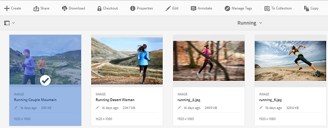

# Archiviazione e estrazione di file in risorse {#check-in-and-check-out-files-in-assets}

Risorse Adobe Experience Manager (AEM) consente di estrarre le risorse per la modifica e archiviarle nuovamente dopo aver completato le modifiche. Dopo aver estratto una risorsa, potete solo modificare, annotare, pubblicare, spostare o eliminare la risorsa. Il check-out di una risorsa blocca la risorsa. Altri utenti non possono eseguire nessuna di queste operazioni sulla risorsa finché non ricontrolli la risorsa in Risorse AEM. Tuttavia, possono comunque modificare i metadati della risorsa bloccata.

Per poter estrarre/archiviare le risorse, è necessario disporre dell&#39;accesso in scrittura.

Questa funzione consente di impedire ad altri utenti di ignorare le modifiche apportate da un autore, in cui più utenti collaborano ai flussi di lavoro di modifica tra più team.

## Estrazione delle risorse {#checking-out-assets}

1. Nell’interfaccia utente Risorse, seleziona la risorsa da estrarre. Potete anche selezionare più risorse da estrarre.

   

1. Dalla barra degli strumenti, tocca o fai clic sull’icona **[!UICONTROL Estrai]** .

   

   Osservate che l&#39;icona **[!UICONTROL Checkout]** si sposta sull&#39;icona **[!UICONTROL Check]** con il blocco aperto.

   

   Per verificare se altri utenti possono modificare la risorsa estratta, effettuate l’accesso come un altro utente. L’icona Blocca viene visualizzata sulla miniatura della risorsa estratta.

   

   Selezionate la risorsa. Nella barra degli strumenti non sono visualizzate opzioni che consentono di modificare, annotare, pubblicare o eliminare la risorsa.

   

   Potete tuttavia fare clic o toccare l’icona **[!UICONTROL Visualizza proprietà]** per modificare i metadati della risorsa bloccata.

1. Tocca o fai clic sull’icona Modifica per aprire la risorsa in modalità di modifica.

   

1. Modificate la risorsa e salvate le modifiche. Ad esempio, ritagliate l’immagine e salvate.

   

   Potete anche scegliere di inserire delle annotazioni o pubblicare la risorsa.

1. Selezionate la risorsa modificata dall’interfaccia utente Risorse, quindi toccate o fate clic sull’icona **[!UICONTROL Controllo]** nella barra degli strumenti.

   

   La risorsa modificata viene archiviata in Risorse AEM ed è disponibile per la modifica da parte di altri utenti.

## Check-In forzato {#forced-check-in}

Gli amministratori possono archiviare le risorse sottoposte a Check-Out da altri utenti.

1. Accedi a Risorse AEM come amministratore.
1. Nell’interfaccia utente delle risorse, seleziona una o più risorse che sono state sottoposte a check-out da parte di altri utenti.

   

1. Dalla barra degli strumenti, tocca o fai clic sull’icona **[!UICONTROL Rilascia blocco]** . La risorsa viene archiviata e può essere modificata da altri utenti.

   