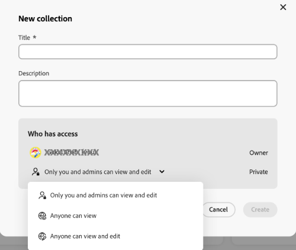
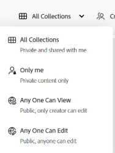
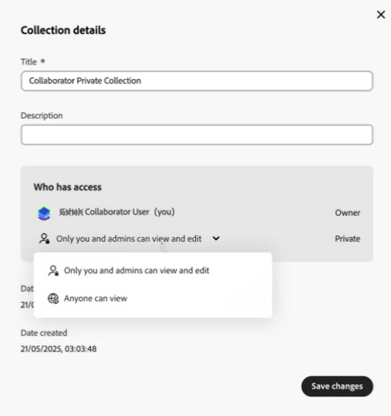
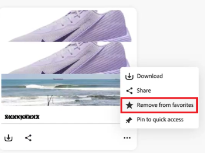

# Gestisci raccolte in [!DNL Content Hub] {#manage-collections}

<!--  -->

Una raccolta fa riferimento a un insieme di risorse che possono essere condivise tra gli utenti. Una raccolta può includere risorse da posizioni diverse mantenendo al contempo la loro integrità referenziale.

[!DNL Content Hub] consente di creare raccolte pubbliche. Queste raccolte sono accessibili a tutti gli utenti autorizzati, creando uno spazio condiviso in cui più utenti possono accedere e utilizzare in modo efficiente i contenuti. Le raccolte promuovono l&#39;uso collaborativo delle risorse per una maggiore efficienza e convenienza. Nella pagina Sfoglia raccolta puoi effettuare le seguenti operazioni:

* **Crea**: crea una o più raccolte.
* **Visualizza**: visualizza le risorse e le relative proprietà.
* **Condividi**: condividi le risorse come collegamento con altri.
* **Scarica**: scarica le risorse.
* **Rimuovi**: rimuovi risorse specifiche da una raccolta.
* **Elimina**: elimina l&#39;intera raccolta.
* **Blocca/Rimuovi**: Blocca o rimuovi la raccolta.
* **Preferiti**: contrassegna la raccolta come preferita.

Consente agli utenti di accedere e gestire facilmente le diverse risorse disponibili in [!DNL Content Hub].

## Prerequisiti {#prerequisites}

[Gli utenti di Content Hub](deploy-content-hub.md#onboard-content-hub-users) possono eseguire le azioni indicate in questo articolo.

## Creare le raccolte{#create-collections}

Puoi scegliere di [creare una nuova raccolta](#create-new-collection) o [aggiungere risorse a una raccolta esistente](#add-assets-to-existing-collection) durante la gestione della governance.

### Crea una nuova raccolta{#create-new-collection}

Esegui i passaggi seguenti per controllare l’accesso durante la creazione delle raccolte:

1. Vai alla scheda **[!DNL Collections]** e fai clic su **[!UICONTROL Crea raccolta]**. Viene visualizzata una nuova finestra Raccolta.

1. Aggiungi **[!UICONTROL Titolo]** e **[!UICONTROL Descrizione]** per la raccolta.

   

1. In **[!UICONTROL Chi può accedere]** menu a discesa > seleziona il tipo di controllo di accesso. Sono disponibili le seguenti opzioni:

   | Metodo di accesso | Tipo di accesso | Descrizione |
   |---|---|---|
   | **Solo tu e gli amministratori potete modificare** | Privata | Solo il creatore e gli amministratori possono modificare e accedere a questa raccolta. |
   | **Chiunque può visualizzare** | Pubblico | Tutti possono accedere a questa raccolta, ma solo il creatore e gli amministratori possono modificarla. |
   | **Chiunque può visualizzare e modificare** | Pubblico | Questa raccolta è aperta a tutti, con autorizzazioni di accesso e modifica complete concesse senza restrizioni. |

   >[!NOTE]
   >
   > L&#39;amministratore di [!DNL Content Hub] può visualizzare tutte le opzioni disponibili nel menu a discesa **[!UICONTROL Chi può accedere]**, mentre per gli utenti normali è necessario [specificare e configurare](configure-content-hub-ui-options.md) quali opzioni possono accedere.

1. Fai clic su **[!UICONTROL Crea]**. Al termine, puoi [aggiungere risorse alla raccolta](#add-assets-to-existing-collection).

>[!VIDEO](https://video.tv.adobe.com/v/3463336)

<!--
>[!NOTE]
>
>Collections governance is a limited availability feature. You can get it enabled  by creating a support ticket. Once enabled, you need to [Configure Collections in Content Hub](configure-content-hub-ui-options.md#configure-collections-content-hub).-->

<!--To create a new collection, navigate to the **[!UICONTROL Collections]** tab and click **[!UICONTROL Create new collection]**. Enter the **[!UICONTROL Title]** and provide an optional **[!UICONTROL Description]** for the assets. Click **[!UICONTROL Create]**.
          
-->

### Aggiungere risorse a una raccolta esistente{#add-assets-to-existing-collection}

Per aggiungere risorse a una raccolta esistente, seleziona le risorse da aggiungere alla raccolta. Fai clic su **[!UICONTROL Aggiungi alla raccolta]**. Viene richiesto di selezionare la raccolta.

Scegli la raccolta in cui aggiungere la risorsa. Puoi anche cercare nella raccolta esistente utilizzando la barra di ricerca.  Seleziona le raccolte a cui aggiungere le risorse e fai clic su **[!UICONTROL Aggiungi alla raccolta]**.

## Visualizza raccolte{#view-collections}

Passare alla scheda **[!UICONTROL Raccolte]** e cercare il nome della raccolta. Puoi utilizzare i filtri per perfezionare i risultati della ricerca selezionando criteri specifici, per trovare rapidamente le raccolte più rilevanti.

Per visualizzare l’elenco delle risorse disponibili in una raccolta, fai clic sul nome della raccolta. Puoi anche applicare filtri all’interno di una raccolta per limitare i risultati della risorsa. Fai clic sulla risorsa da visualizzare all’interno di una raccolta. [!DNL Content Hub] visualizza la vista dettagliata della risorsa. [Visualizza dettagli risorsa](asset-properties-content-hub.md).

### Filtrare la vista delle raccolte {#filter-collections-view}

Content Hub ti consente di filtrare la vista delle raccolte per trovare facilmente ciò che stai cercando, riducendo le opzioni in base alle tue preferenze. Verificare la [configurazione delle raccolte in Content Hub](configure-content-hub-ui-options.md#configure-collections-content-hub).

Per filtrare la visualizzazione delle raccolte, passare alla scheda **[!DNL Collections]** e passare al menu a discesa Raccolte. Scegli tra le seguenti opzioni:

* **[!UICONTROL Tutte le raccolte]:** Selezionare questa opzione per visualizzare e modificare tutte le raccolte, incluse quelle private o condivise.
* **[!UICONTROL Solo io]:** Seleziona questa opzione per visualizzare le raccolte a cui puoi accedere.
* **[!UICONTROL Chiunque può visualizzare]:** Questa opzione consente di filtrare le raccolte accessibili a tutti ma modificabili solo dall&#39;autore.
* **[!UICONTROL Chiunque può modificare]:** Seleziona questa opzione per filtrare raccolte accessibili e modificabili da tutti.

  

Inoltre, per filtrare la visualizzazione delle raccolte in base alle autorizzazioni di accesso, passare alla scheda **[!DNL Collections]** e passare a una delle opzioni seguenti:

* **[!UICONTROL Creato da chiunque]:** Questo filtro consente di visualizzare solo le raccolte create da qualsiasi utente.

* **[!UICONTROL Creato da me]:** Questo filtro consente di visualizzare solo le raccolte create da te.

  

<!--

* **A**: Details and metadata of the asset 
* **B**: Zoom In or Zoom Out the asset 
* **C**: Reset Zoom view 
* **D**: View the previous or next asset 
* **E**: Download the asset 
* **F**: Open the asset in Adobe Express 
* **G**: Hide the metadata of the asset 
* **H**: Share the asset as a link 
-->

## Scaricare le risorse disponibili all’interno di una raccolta{#download-assets-within-collection}

Per scaricare le risorse disponibili in una raccolta, passa alla scheda **[!UICONTROL Raccolte]**.\
Fai clic sull&#39;icona  sulla scheda della raccolta.

Tutte le risorse della raccolta vengono scaricate.

Puoi anche aprire la raccolta per scaricare le risorse singolarmente. Fai clic sulla raccolta contenente le risorse da scaricare. Seleziona le risorse e fai clic su **[!UICONTROL Scarica]**.

Scopri come [scaricare una risorsa da [!DNL Content Hub]](download-assets-content-hub.md).

## Condividere le risorse disponibili all’interno di una raccolta {#share-assets-available-within-collection}

Puoi anche condividere le risorse disponibili all’interno di una raccolta. Assicurati di [abilitare la condivisione di collegamenti pubblici in Content Hub](configure-content-hub-ui-options.md#configure-collections-content-hub). Passa alla scheda **[!UICONTROL Raccolte]**. Seleziona l&#39;icona  sulla scheda delle risorse. Il collegamento di condivisione viene copiato. Puoi condividere il collegamento copiato con il destinatario. Ulteriori informazioni sulla condivisione di [risorse in [!DNL Content Hub]](share-assets-content-hub.md).

Content Hub Collections fornisce strumenti di governance completi per una gestione efficace delle risorse, tra cui autorizzazioni di condivisione personalizzabili e funzioni di collaborazione. Dall’accesso in sola lettura al controllo amministrativo completo, queste impostazioni supportano la governance fine sulla distribuzione delle risorse. Quando si condivide una risorsa singolarmente o come parte di una raccolta, l’ambito di accesso è determinato dal livello di accesso corrente della raccolta assegnato all’utente. In alternativa, non è possibile condividere una raccolta privata.

## Modificare i dettagli di una raccolta {#edit-details-of-collection}

Per modificare **[!UICONTROL Titolo]** e **[!UICONTROL Descrizione]** di una raccolta, fare clic sul nome della raccolta e quindi sull&#39;icona . Viene visualizzata la schermata [!UICONTROL Dettagli raccolta] che consente di modificare il **[!UICONTROL Titolo]** e la **[!UICONTROL Descrizione]** di una raccolta. Fai clic su **[!UICONTROL Salva modifiche]** per confermare le modifiche. Inoltre, puoi aggiornare l’accesso alla raccolta tramite la finestra di dialogo Modifica raccolta, a seconda della configurazione.

## Rimuovere risorse da una raccolta{#remove-assets-from-a-collection}

I seguenti utenti possono rimuovere una o più risorse da una raccolta:

* Un amministratore
* Proprietario della raccolta
* Un utente non amministratore con i diritti di modifica

Per rimuovere risorse da una raccolta, fare clic sulla raccolta da cui rimuovere le risorse, selezionare le risorse e fare clic su **[!UICONTROL Rimuovi da raccolta]**.

Viene richiesto di confermare la rimozione della risorsa. Fai clic su **[!UICONTROL Rimuovi]**.\
Le risorse selezionate sono state rimosse dalla raccolta.

## Eliminare una raccolta{#delete-collection}

Solo gli amministratori e il creatore possono eliminare una raccolta. Per eliminare una raccolta, passare alla scheda **[!UICONTROL Raccolte]** e fare clic sulla raccolta da eliminare. Fai clic sull&#39;icona  per eliminare la raccolta.

## Blocca o rimuovi puntina raccolta {#pin-unpin-collection}

Gli amministratori di Content Hub possono fissare le raccolte in Content Hub per un accesso rapido. Le raccolte bloccate vengono visualizzate in una sezione bloccata dedicata nella home page Raccolte, consentendo di mantenere più facilmente raccolte importanti a portata di mano. Per un accesso rapido, puoi fissare o sbloccare una raccolta eseguendo i passaggi seguenti:

1. Sfoglia le raccolte che desideri fissare o sbloccare.

1. Fai clic su **[!UICONTROL Altre azioni]**  e seleziona **[!UICONTROL Aggiungi per accesso rapido]**. Viene visualizzata una casella di conferma.

   

1. Fai clic su **[!UICONTROL Pin]** per confermare. Il messaggio di avviso viene visualizzato quando si fissa una raccolta privata.

   

   Le Raccolte bloccate vengono visualizzate nella parte superiore per un accesso rapido. In alternativa, per sbloccare la raccolta, fai clic su **[!UICONTROL Altre azioni]**  e seleziona **[!UICONTROL Sblocca]**.

   

## Contrassegna raccolte come preferite {#favorite-collection}

È possibile contrassegnare le raccolte come Preferite in Content Hub, semplificandone l&#39;organizzazione e il recupero. Una volta aggiunte, le tue raccolte preferite sono comodamente disponibili dalla scheda Preferiti nella pagina Home di Content Hub. Inoltre, puoi cercare le risorse nelle Raccolte preferite. Per contrassegnare le raccolte come Preferite, effettuare le seguenti operazioni:

1. Sfogliare le raccolte che si desidera contrassegnare come Preferite.

1. Fai clic su **[!UICONTROL Altre azioni]**  e seleziona **[!UICONTROL Aggiungi ai preferiti]** per contrassegnare la raccolta come Preferita.

   

   Le raccolte contrassegnate come Preferiti ora vengono visualizzate nella scheda **[!UICONTROL Preferiti]**. In alternativa, è possibile rimuovere le raccolte da **[!UICONTROL Preferiti]**. A tale scopo, fare clic su **[!UICONTROL Altre azioni]**  e selezionare **[!UICONTROL Rimuovi dai preferiti]**.

   

>[!NOTE]
>
>[Blocca o Rimuovi puntina raccolta](#pin-unpin-collection) e [Contrassegna raccolte come Preferite](#favorite-collection) sono funzionalità di disponibilità limitate. Puoi [creare e inviare](https://helpx.adobe.com/it/enterprise/using/support-for-experience-cloud.html) un caso di assistenza clienti Adobe per abilitarlo per la distribuzione.

