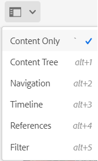

# Tag colore per immagini {#color-tag-images}

Adobe Experience Manager (AEM) Assets utilizza le funzionalità di intelligenza artificiale di Adobe per distinguere i colori in un’immagine e applicarli automaticamente come tag al momento dell’inserimento. Questi tag consentono un’esperienza di ricerca avanzata, in base alla composizione del colore dell’immagine.

È possibile configurare il numero di colori, compresi tra uno e 40, con cui un&#39;immagine viene taggata in modo da poter cercare le immagini in base a tali colori in un secondo momento. Experience Manager Assets applica i tag in base alla copertura cromatica di un’immagine. È inoltre possibile configurare il formato di visualizzazione per un tag colore.

La figura seguente illustra la sequenza di attività da eseguire per configurare e gestire i tag colore per le immagini in Experience Manager Assets:

## Formati di file supportati {#supported-file-formats-color-tags}

| Formato file | Estensione | Tipo MIME | Spazio colore di input | Dimensione massima file di origine supportata | Risoluzione massima dimensione file supportata |
|---|---|---|---|---|---|
| JPEG | .jpg e .jpeg | image/jpeg | sRGB | 15 GB | 20000 × 20000 pixel |
| PNG | .png | image/png | sRGB | 15 GB | 20000 × 20000 pixel |
| TIFF | tif e tiff | image/tiff | sRGB | 4 GB (limitati dalle specifiche del formato) | 20000 × 20000 pixel |
| PSD | .psd | image/vnd.adobe.photoshop | sRGB | 2 GB (limitata dalle specifiche del formato) | 20000 × 20000 pixel |
| GIF | gif | image/gif | sRGB | 15 GB | 20000 × 20000 pixel |
| BMP | bmp | image/bmp | sRGB | 4 GB (limitati dalle specifiche del formato) | 20000 × 20000 pixel |

## Gestire le proprietà dei tag colore {#manage-color-tagging-properties}

Per gestire le proprietà dei tag colore per le immagini:

1. Passa a **[!UICONTROL Strumenti > Assets > Tag colore]**.

   

1. Specificare un formato di visualizzazione per il tag colore nel campo **[!UICONTROL Formato visualizzazione]**. Le opzioni possibili includono il nome del colore, il RGB o il formato HEX.

1. Specifica il numero di colori a cui vuoi assegnare tag per le immagini nel campo **[!UICONTROL Limite]**. Questi colori vengono visualizzati quando si visualizzano le proprietà di un&#39;immagine. In questo campo puoi definire un numero compreso tra 1 e 40. Il valore predefinito per questo campo è dieci colori.

1. Specificare la percentuale minima di copertura dei colori per includere un tag colore nei risultati di ricerca nel campo **[!UICONTROL Soglia copertura/dominanza %]**. Ad esempio, se la copertura del colore Rosso in un&#39;immagine è il 10% e in questo campo si definisce il 9%, l&#39;immagine viene inclusa quando si cercano immagini con il colore Rosso. Tuttavia, se la copertura del colore rosso in un&#39;immagine è pari al 10% e si definisce l&#39;11% in questo campo, l&#39;immagine non viene inclusa quando si cercano immagini con il colore rosso.

   In questo campo è possibile specificare un numero qualsiasi compreso tra cinque e 100. Il valore predefinito è 11.

   >[!NOTE]
   >
   >Adobe consiglia di utilizzare un valore vicino al valore predefinito in questo campo. L&#39;impostazione di un valore numerico elevato per questo campo (ad esempio maggiore di 25) può restituire pochi risultati di ricerca. Allo stesso modo, l’impostazione di un valore con numero basso (ad esempio, inferiore a 6) può restituire troppi risultati di ricerca, il che potrebbe non essere utile.

1. Fai clic su **[!UICONTROL Salva]**.

   >[!VIDEO](https://video.tv.adobe.com/v/340108)

### Disattiva assegnazione tag colore {#disable-color-tagging}

L&#39;assegnazione di tag colore per le immagini è attivata per impostazione predefinita. È possibile disattivare l&#39;assegnazione di tag colore a livello di cartella. Tutte le cartelle secondarie ereditano le proprietà dei tag colore dalla cartella principale.

Per disattivare l&#39;assegnazione di tag colore a livello di cartella:

1. Passa a **[!UICONTROL Adobe Experience Manager > Assets > File]**.

1. Selezionare la cartella e fare clic su **[!UICONTROL Proprietà]**.

1. Nella scheda **[!UICONTROL Elaborazione risorse]**, passa alla cartella **[!UICONTROL Tag colore per immagini]**. Selezionare uno dei seguenti valori dall&#39;elenco a discesa:

   * Ereditata: la cartella eredita le opzioni di abilitazione o disabilitazione dalla cartella principale.

   * Abilita: abilita i tag colore per la cartella selezionata.

   * Disabilita: disabilita i tag colore per la cartella selezionata.

   

## Configura lo schema metadati per aggiungere il componente tag di colore avanzati {#configure-metadata-schema}

Gli schemi di metadati contengono campi specifici per informazioni specifiche da compilare. Contiene inoltre informazioni di layout per visualizzare i campi di metadati in modo semplice e intuitivo. Le proprietà dei metadati includono titolo, descrizione, tipi MIME, tag e altro ancora. È possibile utilizzare l&#39;editor di schema di metadati [!UICONTROL Forms] per modificare gli schemi esistenti o aggiungere schemi di metadati personalizzati.

>[!NOTE]
>
>Il campo Tag colore avanzato è disponibile nello schema metadati predefinito. Se utilizzi uno schema di metadati personalizzato, configura lo schema per aggiungere un campo tag di colore avanzato.

Per aggiungere il componente Tag colore avanzati all’editor modulo schema metadati:

1. Passa a **[!UICONTROL Strumenti > Assets > Schemi metadati]**.

1. Seleziona il nome dello schema e fai clic su **[!UICONTROL Modifica]**.

1. Trascina **[!UICONTROL Tag colore avanzati]** dalla scheda **[!UICONTROL Genera modulo]** all&#39;Editor modulo schema metadati ****.

1. Fare clic sul **[!UICONTROL Campo tag colore avanzato]** nell&#39;**[!UICONTROL Editor modulo schema metadati]**.

1. Specificare un valore appropriato nel campo **[!UICONTROL Etichetta campo]** della scheda **[!UICONTROL Impostazioni]**.

1. Fai clic su **[!UICONTROL Salva]**.

   >[!VIDEO](https://video.tv.adobe.com/v/340124)

## Tag colore per le immagini esistenti in DAM {#color-tags-existing-images}

Le immagini esistenti in DAM non vengono taggate automaticamente con colori. [!UICONTROL Rielabora Assets] manualmente per generare i tag colore.

Per applicare un colore alle immagini di tag o alle cartelle (comprese le sottocartelle) delle risorse presenti nell’archivio delle risorse, effettua le seguenti operazioni:

1. Seleziona il logo [!DNL Adobe Experience Manager], quindi seleziona le risorse dalla pagina [!UICONTROL Navigazione].

1. Selezionare [!UICONTROL File].

1. Nell’interfaccia di Assets, passa alla cartella alla quale desideri applicare i tag colore.

1. Seleziona l’intera cartella o immagini specifiche.

1. Seleziona  [!UICONTROL Icona Rielabora Assets] e seleziona l&#39;opzione [!UICONTROL Elabora completamente].

Al termine del processo, passa alla pagina [!UICONTROL Proprietà] di qualsiasi immagine all&#39;interno della cartella. I tag aggiunti automaticamente vengono visualizzati nella sezione [!UICONTROL Tag colore avanzati] della scheda [!UICONTROL Base].

## Visualizza tag colore avanzati per le immagini {#view-color-tags}

Per visualizzare i tag di colore avanzati per le immagini:

1. Passa a **[!UICONTROL Adobe Experience Manager > Assets > File]**.

1. Fai clic sulla cartella appropriata e seleziona l’immagine.

1. Seleziona **[!UICONTROL Proprietà]** e visualizza i tag nel campo **[!UICONTROL Tag colore avanzati]**.

   

   Passa il mouse su un tag colore per visualizzare la **[!UICONTROL soglia di copertura/dominanza %]** di un colore in un&#39;immagine.

## Configurare il predicato colore AEM Assets {#configure-search-predicate}

Puoi configurare un filtro di ricerca per le immagini. Puoi quindi basare i criteri di ricerca su un colore specifico per filtrare i risultati.

>[!NOTE]
>
>Configura il predicato colore di AEM Assets solo se non utilizzi il modulo di ricerca predefinito.

Per configurare il filtro di ricerca, crea un predicato Colore risorsa utilizzando la Barra di ricerca amministrazione di Assets.

Per configurare il filtro di ricerca:

1. Passa a **[!UICONTROL Strumenti > Generale > Cerca in Forms]**.

1. Seleziona **[!UICONTROL Barra di ricerca amministrazione Assets]** e fai clic su **[!UICONTROL Modifica]**.

1. Trascina **[!UICONTROL Predicato colore risorsa]** dalla scheda **[!UICONTROL Seleziona predicato]** all&#39;**[!UICONTROL Editor moduli di ricerca]**.

1. Specificare un valore appropriato nel campo **[!UICONTROL Etichetta campo]** della scheda **[!UICONTROL Impostazioni]**.

1. Fai clic su **[!UICONTROL Fine]** per salvare le impostazioni.

   >[!VIDEO](https://video.tv.adobe.com/v/340110)

## Ricerca immagini in base ai colori {#search-images-based-on-colors}

>[!VIDEO](https://video.tv.adobe.com/v/340761)

Dopo aver configurato tutte le proprietà dei tag colore e [configurato il predicato colore di Assets](#search-images-based-on-colors), puoi cercare le immagini in base a un colore come filtro.

Per cercare le immagini in base ai colori:

1. Passa a **[!UICONTROL Assets > File]**.

1. Seleziona **[!UICONTROL Filtro]** dall&#39;elenco a discesa.
   

1. Selezionare il predicato colore [AEM Assets](#configure-search-predicate).

1. Trascina il selettore colore per selezionare il colore appropriato. Il colore selezionato viene visualizzato nel campo di sola lettura disponibile sotto il selettore colore. Potete selezionare RGB o HEX come formato di visualizzazione per il colore.

   

   Puoi filtrare le immagini in base alla selezione di un colore. Nel riquadro di destra vengono visualizzate le immagini con il colore selezionato come uno dei tag di colore avanzato e al di sopra della soglia [Copertura/ Dominanza %](#manage-color-tagging-settings).

1. Per cancellare il filtro, fai clic su X nella barra di ricerca.

**Consulta anche**

* [Traduci risorse](translate-assets.md)
* [API HTTP di Assets](mac-api-assets.md)
* [Formati di file supportati dalle risorse](file-format-support.md)
* [Cerca risorse](search-assets.md)
* [Risorse collegate](use-assets-across-connected-assets-instances.md)
* [Rapporti sulle risorse](asset-reports.md)
* [Schemi di metadati](metadata-schemas.md)
* [Scaricare le risorse](download-assets-from-aem.md)
* [Gestire i metadati](manage-metadata.md)
* [Facet di ricerca](search-facets.md)
* [Gestire le raccolte](manage-collections.md)
* [Importazione in blocco dei metadati](metadata-import-export.md)
* [Pubblicare risorse in AEM e Dynamic Media](/help/assets/publish-assets-to-aem-and-dm.md)
