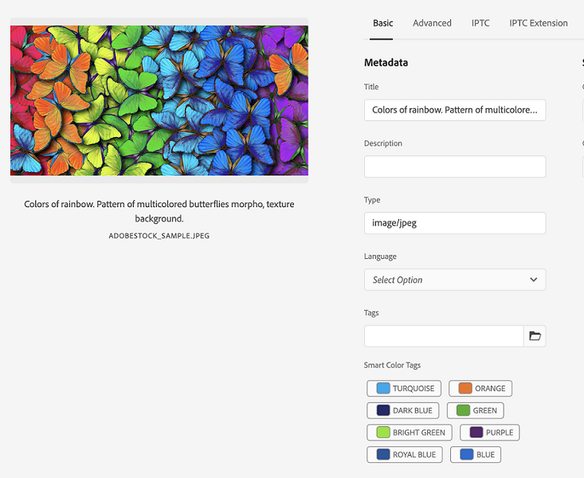

# Tag colore per immagini {#color-tag-images}

Experience Manager Assets utilizza le funzionalità di intelligenza artificiale di Adobe Sensei per distinguere i colori in un’immagine e applicarli automaticamente come tag al momento dell’acquisizione. Questi tag consentono un’esperienza di ricerca avanzata, in base alla composizione del colore dell’immagine.

È possibile configurare il numero di colori (da 1 a 40) che vengono assegnati come tag in modo da poter cercare, in un secondo momento, le immagini in base a tali colori. Experience Manager Assets applica i tag in base alla copertura cromatica di un’immagine. È inoltre possibile configurare il formato di visualizzazione per un tag colore.

La figura seguente illustra la sequenza di attività da eseguire per configurare e gestire i tag colore per le immagini in Experience Manager Assets:

## Formati di file supportati {#supported-file-formats-color-tags}

| Formato file | Estensione | Tipo MIME | Spazio colore di input | Dimensione massima file di origine supportata | Risoluzione massima dimensione file supportata |
|---|---|---|---|---|---|
| JPEG | jpg, jpeg | image/jpeg | sRGB | 15GB | 20000px X 20000px |
| PNG | .png | image/png | sRGB | 15GB | 20000px X 20000px |
| TIFF | tif, tiff | image/tiff | sRGB | 4 GB (limitati dalle specifiche del formato) | 20000px X 20000px |
| PSD | .psd | image/vnd.adobe.photoshop | sRGB | 2 GB (limitati dalle specifiche del formato) | 20000px X 20000px |
| GIF | .gif | image/gif | sRGB | 15GB | 20000px X 20000px |
| BMP | bmp | image/bmp | sRGB | 4 GB (limitati dalle specifiche del formato) | 20000px X 20000px |

## Gestire le proprietà dei tag colore {#manage-color-tagging-properties}

Per gestire le proprietà dei tag colore per le immagini:

1. Accedi a **[!UICONTROL Strumenti > Risorse > Assegnazione tag colore]**.

   

1. Specificate un formato di visualizzazione per il tag colore in **[!UICONTROL Formato di visualizzazione]** campo. Le opzioni possibili includono il nome del colore, il RGB o il formato HEX.

1. Specifica il numero di colori da assegnare alle immagini nel **[!UICONTROL Limite]** campo. Questi colori vengono visualizzati quando si visualizzano le proprietà di un&#39;immagine.  In questo campo puoi definire un numero compreso tra uno e quaranta. Il valore predefinito per questo campo è dieci colori.

1. Specifica la percentuale minima di copertura cromatica per includere un tag colore nei risultati di ricerca in **[!UICONTROL Soglia copertura/dominanza (%)]** campo. Ad esempio, se la copertura del colore Rosso in un&#39;immagine è il 10% e in questo campo si definisce il 9%, l&#39;immagine viene inclusa quando si cercano immagini con il colore Rosso. Tuttavia, se la copertura del colore rosso in un&#39;immagine è pari al 10% e si definisce l&#39;11% in questo campo, l&#39;immagine non viene inclusa quando si cercano immagini con il colore rosso.

   In questo campo è possibile specificare un numero qualsiasi compreso tra cinque e cento. Il valore predefinito è undici.

   >[!NOTE]
   >
   >L’Adobe consiglia di utilizzare un valore vicino al valore predefinito in questo campo. L&#39;impostazione di un numero elevato di valori per questo campo (ad esempio, maggiore di 25) può restituire pochi risultati di ricerca. Allo stesso modo, l’impostazione di un valore con numero basso (ad esempio, inferiore a 6) può restituire troppi risultati di ricerca, il che potrebbe non essere utile.

1. Fai clic su **[!UICONTROL Salva]**.

   >[!VIDEO](https://video.tv.adobe.com/v/340108)

### Disattiva assegnazione tag colore {#disable-color-tagging}

L&#39;assegnazione di tag colore per le immagini è attivata per impostazione predefinita. È possibile disattivare l&#39;assegnazione di tag colore a livello di cartella. Tutte le cartelle secondarie ereditano le proprietà dei tag colore dalla cartella principale.

Per disattivare l&#39;assegnazione di tag colore a livello di cartella:

1. Accedi a **[!UICONTROL Adobe Experience Manager > Risorse > File]**.

1. Seleziona la cartella e fai clic su **[!UICONTROL Proprietà]**.

1. In **[!UICONTROL Elaborazione risorse]** , passare alla scheda **[!UICONTROL Tag colore per immagini]** cartella. Selezionare uno dei seguenti valori dall&#39;elenco a discesa:

   * Ereditata: la cartella eredita le opzioni di abilitazione o disabilitazione dalla cartella principale.

   * Abilita: abilita i tag colore per la cartella selezionata.

   * Disabilita: disabilita i tag colore per la cartella selezionata.

   

## Configura lo schema metadati per aggiungere il componente tag di colore avanzati {#configure-metadata-schema}

Gli schemi di metadati contengono campi specifici per informazioni specifiche da compilare. Contiene inoltre informazioni di layout per visualizzare i campi di metadati in modo semplice e intuitivo. Le proprietà dei metadati includono titolo, descrizione, tipi MIME, tag e altro ancora. È possibile utilizzare [!UICONTROL Forms schema metadati] per modificare gli schemi esistenti o aggiungere schemi di metadati personalizzati.

>[!NOTE]
>
>Il campo Tag colore avanzato è disponibile nello schema metadati predefinito. Se utilizzi uno schema di metadati personalizzato, configura lo schema per aggiungere il campo tag smart color.

Per aggiungere il componente Tag colore avanzati all’editor modulo schema metadati:

1. Accedi a **[!UICONTROL Strumenti > Risorse > Schemi metadati]**.

1. Seleziona il nome dello schema e fai clic su **[!UICONTROL Modifica]**.

1. Trascina **[!UICONTROL Tag colore avanzato]** dal **[!UICONTROL Genera modulo]** scheda a **[!UICONTROL Editor modulo schema metadati]**.

1. Fai clic su **[!UICONTROL Campo tag colore avanzato]** nel **[!UICONTROL Editor modulo schema metadati]**.

1. Specifica un valore appropriato nella **[!UICONTROL Etichetta campo]** campo in **[!UICONTROL Impostazioni]**  scheda.

1. Fai clic su **[!UICONTROL Salva]**.

   >[!VIDEO](https://video.tv.adobe.com/v/340124)

## Tag colore per le immagini esistenti in DAM {#color-tags-existing-images}

Alle immagini già esistenti in DAM non vengono assegnati automaticamente tag colore. È necessario [!UICONTROL Rielabora risorse] manualmente per generare i tag colore.

Per colorare le immagini di tag o le cartelle (comprese le sottocartelle) di risorse già presenti nell’archivio delle risorse, effettua le seguenti operazioni:

1. Seleziona la [!DNL Adobe Experience Manager] e quindi selezionare le risorse dal [!UICONTROL Navigazione] pagina.

1. Seleziona [!UICONTROL File] per visualizzare l’interfaccia Assets.

1. Passare alla cartella alla quale si desidera applicare i tag colore.

1. Seleziona l’intera cartella o immagini specifiche.

1. Seleziona  [!UICONTROL Rielabora risorse] e seleziona la [!UICONTROL Processo completo] opzione.

Al termine del processo, passare alla [!UICONTROL Proprietà] di qualsiasi immagine all’interno della cartella. I tag aggiunti automaticamente sono visualizzati in [!UICONTROL Tag colore avanzato] sezione in [!UICONTROL Base] scheda.

## Visualizza tag colore avanzati per le immagini {#view-color-tags}

Per visualizzare i tag di colore avanzati per le immagini:

1. Accedi a **[!UICONTROL Adobe Experience Manager > Risorse > File]**.

1. Fai clic sulla cartella appropriata e seleziona l’immagine.

1. Seleziona **[!UICONTROL Proprietà]** e visualizzare i tag in **[!UICONTROL Tag colore avanzato]** campo.

   

   Passa il mouse su un tag a colori per visualizzare **[!UICONTROL Soglia copertura/dominanza (%)]** di un colore in un&#39;immagine.

## Configurare il predicato colore AEM Assets {#configure-search-predicate}

Puoi configurare il filtro di ricerca per le immagini. Puoi quindi basare i criteri di ricerca su un colore specifico per filtrare i risultati.

>[!NOTE]
>
>Configura il predicato colore di AEM Assets solo se non utilizzi il modulo di ricerca predefinito.

Per configurare il filtro di ricerca, crea un predicato Colore risorsa utilizzando la Barra di ricerca amministrazione risorse.

Per configurare il filtro di ricerca:

1. Accedi a **[!UICONTROL Strumenti > Generale > Cerca in Forms]**.

1. Seleziona **[!UICONTROL Barra di ricerca amministrazione risorse]** e fai clic su **[!UICONTROL Modifica]**.

1. Trascina **[!UICONTROL Predicato colore risorsa]** dal **[!UICONTROL Seleziona predicato]** scheda a **[!UICONTROL Editor moduli di ricerca]**.

1. Specifica un valore appropriato nella **[!UICONTROL Etichetta campo]** campo in **[!UICONTROL Impostazioni]**  scheda.

1. Clic **[!UICONTROL Fine]** per salvare le impostazioni.

   >[!VIDEO](https://video.tv.adobe.com/v/340110)

## Ricerca immagini in base ai colori {#search-images-based-on-colors}

>[!VIDEO](https://video.tv.adobe.com/v/340761)

Dopo aver configurato tutte le proprietà di assegnazione tag colore e [configurazione del predicato colore di Assets](#search-images-based-on-colors), è possibile cercare le immagini in base a un colore come filtro.

Per cercare le immagini in base ai colori:

1. Accedi a **[!UICONTROL Risorse > File]**.

1. Seleziona **[!UICONTROL Filtro]** dall’elenco a discesa.
   

1. Seleziona la [Predicato colore AEM Assets](#configure-search-predicate).

1. Trascina il selettore colore per selezionare il colore appropriato. Il colore selezionato viene visualizzato nel campo di sola lettura disponibile sotto il selettore colore. Potete selezionare RGB o HEX come formato di visualizzazione per il colore.

   

   Puoi filtrare le immagini in base alla selezione di un colore. Le immagini con il colore selezionato come uno dei tag di colore avanzato e sopra [Soglia copertura/dominanza (%)](#manage-color-tagging-settings) nel riquadro di destra.

1. Fai clic su x nella barra di ricerca per cancellare il filtro.
