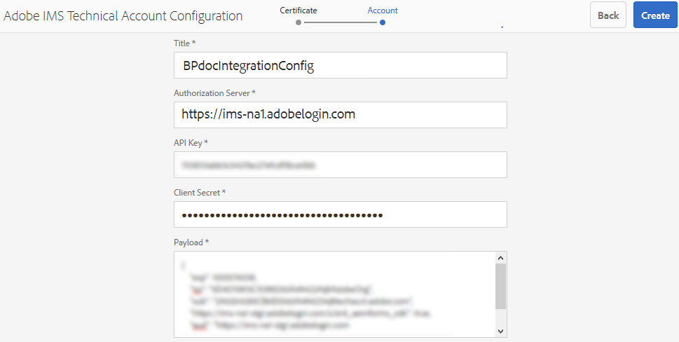

# Configurare AEM Assets con Brand Portal {#configure-aem-assets-with-brand-portal}

Risorse Adobe Experience Manager (AEM) è configurato con Brand Portal tramite Adobe Developer Console, che fornisce un token IMS per l’autorizzazione del tenant del Brand Portal.

**Come funziona la configurazione?**

La configurazione di un’istanza cloud di Risorse AEM con il tenant del Brand Portal (organizzazione) è un processo a più fasi che richiede configurazioni sia nell’istanza cloud di AEM Assets che in Adobe Developer Console.

1. Nell’istanza cloud AEM Assets, crea un account IMS e genera un certificato pubblico (chiave pubblica).
1. In Adobe Developer Console, crea un progetto per il tenant del Brand Portal (organizzazione).
1. Nel progetto, configura un&#39;API utilizzando la chiave pubblica per creare una connessione a un account di servizio (JWT).
1. Ottenete le credenziali dell&#39;account del servizio e le informazioni sul payload JWT.
1. Nell’istanza cloud AEM Assets, configura l’account IMS utilizzando le credenziali dell’account del servizio e il payload JWT.
1. Nell’istanza cloud di AEM Assets, configura il servizio cloud Brand Portal tramite l’account IMS e l’endpoint del Brand Portal (URL organizzazione).
1. Verifica la configurazione pubblicando una risorsa dall’istanza cloud di AEM Assets al Brand Portal.

>[!NOTE]
>>Un tenant di Brand Portal può essere configurato solo con un’istanza cloud di AEM Assets.
>>Non configurare un tenant di Brand Portal con più istanze cloud di AEM Assets.
>

## Prerequisiti {#prerequisites}

Per configurare AEM Assets con Brand Portal, è necessario quanto segue:

* Un’istanza cloud di AEM Assets in esecuzione.
* URL del tenant di Brand Portal.
* Un utente con privilegi di amministratore di sistema nell’organizzazione IMS del tenant di Brand Portal.

**Per ulteriori informazioni, contatta l’Assistenza** clienti.

## Creare la configurazione {#create-new-configuration}

Per configurare l’istanza cloud di AEM Assets con Brand Portal, effettua i seguenti passaggi nella sequenza specificata.

1. [Recuperare il certificato pubblico](#public-certificate)
1. [Creare una connessione account di servizio (JWT)](#createnewintegration)
1. [Configurare l&#39;account IMS](#create-ims-account-configuration)
1. [Configurare il servizio cloud](#configure-the-cloud-service)
1. [Verificare la configurazione](#test-configuration)

### Creare la configurazione IMS {#create-ims-configuration}

La configurazione IMS autentica il tenant di Brand Portal con l’istanza di authoring di AEM Assets.

La configurazione IMS prevede due passaggi:

* [Recuperare il certificato pubblico](#public-certificate)
* [Configurare l&#39;account IMS](#create-ims-account-configuration)

### Recuperare il certificato pubblico {#public-certificate}

Il certificato pubblico consente di autenticare il profilo in Adobe Developer Console.

1. Accedi all’istanza cloud di AEM Assets.

1. Dal pannello **Strumenti** , passa a **[!UICONTROL Protezione]** > **[!UICONTROL Configurazioni Adobe IMS]**.

   

1. Nella pagina Configurazioni Adobe IMS, fate clic su **[!UICONTROL Crea]**.

1. Viene nuovamente visualizzata la pagina Configurazione **[!UICONTROL account tecnico di]** Adobe IMS. By default, the **Certificate** tab opens.

   Selezionate la soluzione cloud **[!UICONTROL Adobe Brand Portal]**.

1. Seleziona la casella di controllo **[!UICONTROL Crea nuovo certificato]** e specifica un **alias** per il certificato. L’alias funge da nome della finestra di dialogo.

1. Fai clic su **[!UICONTROL Crea certificato]**. Quindi, fate clic su **[!UICONTROL OK]** nella finestra di dialogo per generare il certificato pubblico.

   

1. Click **[!UICONTROL Download Public Key]** and save the certificate (.crt) file on your machine.

   Il file del certificato verrà utilizzato nei passaggi successivi per configurare l&#39;API per il tenant del Brand Portal e generare le credenziali dell&#39;account del servizio in Adobe Developer Console.

   

1. Fai clic su **[!UICONTROL Avanti]**.

   Nella scheda **Account** , potete creare l&#39;account Adobe IMS, ma per questo dovrete disporre delle credenziali dell&#39;account di servizio generate in Adobe Developer Console. Per il momento tieni aperta questa pagina.

   Aprite una nuova scheda e [create una connessione account di servizio (JWT) in Adobe Developer Console](#createnewintegration) per ottenere le credenziali e il payload JWT per configurare l&#39;account IMS.

### Creare una connessione account di servizio (JWT) {#createnewintegration}

In Adobe Developer Console, i progetti e le API sono configurati a livello di organizzazione (tenant Brand Portal). La configurazione di un&#39;API crea una connessione a un account di servizio (JWT) in Adobe Developer Console. Esistono due metodi per configurare l&#39;API, generando una coppia di chiavi (chiavi private e pubbliche) o caricando una chiave pubblica. Per configurare l’istanza cloud di Risorse AEM con il Brand Portal, è necessario generare un certificato pubblico (chiave pubblica) nell’istanza cloud AEM Assets e creare le credenziali in Adobe Developer Console caricando la chiave pubblica. Questa chiave pubblica viene utilizzata per configurare l&#39;API per l&#39;organizzazione Brand Portal selezionata e genera le credenziali e il payload JWT per l&#39;account del servizio. Queste credenziali vengono ulteriormente utilizzate per configurare l&#39;account IMS nell&#39;istanza cloud di AEM Assets. Una volta configurato l’account IMS, puoi configurare il servizio cloud Brand Portal nell’istanza cloud di AEM Assets.

Effettuate le seguenti operazioni per generare le credenziali dell&#39;account del servizio e il payload JWT:

1. Accedete ad Adobe Developer Console con privilegi di amministratore di sistema nell’organizzazione IMS (tenant Brand Portal). L’URL predefinito è

   [https://www.adobe.com/go/devs_console_ui](https://www.adobe.com/go/devs_console_ui)

   >[!NOTE]
   >
   >Accertatevi di aver selezionato l&#39;organizzazione IMS corretta (tenant Brand Portal) dal menu a discesa (elenco organizzazioni) situato nell&#39;angolo superiore destro.

1. Click **[!UICONTROL Create new project]**. Viene creato un progetto vuoto per la vostra organizzazione.

   Fate clic su **[!UICONTROL Modifica progetto]** per aggiornare il Titolo **[!UICONTROL e la]** Descrizione **[!UICONTROL del]** progetto, quindi fate clic su **[!UICONTROL Salva]**.

   

1. Nella scheda Panoramica progetto, fate clic su **[!UICONTROL Aggiungi API]**.

   

1. Nella finestra Aggiungi un API, selezionate **[!UICONTROL AEM Brand Portal]** e fate clic su **[!UICONTROL Avanti]**.

   Assicuratevi di avere accesso al servizio AEM Brand Portal.

1. Nella finestra Configura API, fate clic su **[!UICONTROL Carica la chiave]** pubblica. Quindi, fate clic su **[!UICONTROL Seleziona un file]** e caricate il certificato pubblico (file .crt) scaricato nella sezione [Ottieni certificato](#public-certificate) pubblico.

   Fai clic su **[!UICONTROL Avanti]**.

   

1. Verifica il certificato pubblico e fai clic su **[!UICONTROL Avanti]**.

1. In Brand Portal, viene creato un profilo predefinito per ciascuna organizzazione. I profili di prodotto vengono creati nella console di amministrazione per assegnare gli utenti ai gruppi (in base ai ruoli e alle autorizzazioni). Per la configurazione con Brand Portal, il token OAuth viene creato a livello di organizzazione. Pertanto, devi configurare il profilo di prodotto predefinito per la tua organizzazione.

   Seleziona il profilo di prodotto predefinito **[!UICONTROL Assets Brand Portal]**.

   

1. Con l&#39;API configurata, verrete reindirizzati alla panoramica dell&#39;API. Nel menu di navigazione a sinistra, in **[!UICONTROL Credenziali]**, fate clic su Account **[!UICONTROL servizio (JWT)]**.

   >[!NOTE]
   >
   >Potete visualizzare le credenziali ed eseguire altre azioni (generare token JWT, copiare i dettagli delle credenziali, recuperare i segreti del client, ecc.) in base alle esigenze.

1. Dalla scheda Credenziali **** client, copiate l&#39;ID **** client.

   Click **[!UICONTROL Retrieve Client Secret]** and copy the **[!UICONTROL client secret]**.

   

1. Navigate to the **[!UICONTROL Generate JWT]** tab and copy the **[!UICONTROL JWT Payload]**.

Ora puoi usare l’ID client (chiave API), il segreto client e il payload JWT per [configurare l’account](#create-ims-account-configuration) IMS nell’istanza cloud di AEM Assets.

<!--
1. Click **[!UICONTROL Create Integration]**.

1. Select **[!UICONTROL Access an API]**, and click **[!UICONTROL Continue]**.

   

1. Create a new integration page opens. 
   
   Select your organization from the drop-down list.

   In **[!UICONTROL Experience Cloud]**, Select **[!UICONTROL AEM Brand Portal]** and click **[!UICONTROL Continue]**. 

   If the Brand Portal option is disabled for you, ensure that you have selected correct organization from the drop-down box above the **[!UICONTROL Adobe Services]** option. If you do not know your organization, contact your administrator.

   

1. Specify a name and description for the integration. Click **[!UICONTROL Select a File from your computer]** and upload the `AEM-Adobe-IMS.crt` file downloaded in the [obtain public certificates](#public-certificate) section.

1. Select the profile of your organization. 

   Or, select the default profile **[!UICONTROL Assets Brand Portal]** and click **[!UICONTROL Create Integration]**. The integration is created.

1. Click **[!UICONTROL Continue to integration details]** to view the integration information. 

   Copy the **[!UICONTROL API Key]** 
   
   Click **[!UICONTROL Retrieve Client Secret]** and copy the Client Secret key.

   

1. Navigate to **[!UICONTROL JWT]** tab, and copy the **[!UICONTROL JWT payload]**.

   The API Key, Client Secret key, and JWT payload information will be used to create IMS account configuration.

-->

### Configurare l&#39;account IMS {#create-ims-account-configuration}

Verifica di aver eseguito i seguenti passaggi:

* [Recuperare il certificato pubblico](#public-certificate)
* [Creare una connessione account di servizio (JWT)](#createnewintegration)

Effettuate le seguenti operazioni per configurare l&#39;account IMS creato per [ottenere il certificato](#public-certificate)pubblico.

1. Aprite IMS Configuration (Configurazione IMS) e passate alla scheda **[!UICONTROL Account]** . La pagina è rimasta aperta mentre [si ottengono i certificati](#public-certificate)pubblici.

1. Specifica un **[!UICONTROL titolo]** per l’account IMS.

   In **[!UICONTROL Server autorizzazioni]**, immetti l’URL: [https://ims-na1.adobelogin.com/](https://ims-na1.adobelogin.com/)

   Incollate l&#39;ID client nella chiave API, nel segreto client e nel payload JWT che avete copiato durante la [creazione della connessione](#createnewintegration)dell&#39;account del servizio (JWT).

   Fai clic su **[!UICONTROL Crea]**.

   L&#39;account IMS è configurato.

   

1. Select the IMS account configuration and click **[!UICONTROL Check Health]**.

   Fare clic su **[!UICONTROL Controlla]** nella finestra di dialogo. Se la configurazione è stata completata, viene visualizzato un messaggio che informa che il *token è stato recuperato* correttamente.

   

>[!CAUTION]
>
>Puoi disporre di una sola configurazione IMS. Non creare più configurazioni IMS.
>
>Verifica che la configurazione IMS superi il controllo di integrità. Se la configurazione non supera questa verifica, non è valida. Dovrai quindi eliminarla e creare una nuova configurazione valida.

### Configurare il servizio cloud {#configure-the-cloud-service}

Per configurare il servizio cloud Brand Portal, effettuate le seguenti operazioni:

1. Accedi all’istanza cloud di AEM Assets.

1. Dal pannello **Strumenti** , passa a **[!UICONTROL Cloud Services]** > **[!UICONTROL AEM Brand Portal]**.

1. Nella pagina Configurazioni Brand Portal, fate clic su **[!UICONTROL Crea]**.

1. Specifica un **[!UICONTROL titolo]** per la configurazione.

   Selezionate la configurazione IMS creata durante la [configurazione dell&#39;account](#create-ims-account-configuration)IMS.

   In the **[!UICONTROL Service URL]**, enter your Brand Portal tenant (organization URL).

   

1. Fai clic su **[!UICONTROL Salva e chiudi]**. Viene creata la configurazione cloud. L’istanza cloud di AEM Assets è ora configurata con il tenant di Brand Portal.

### Verificare la configurazione {#test-configuration}

Effettuate le seguenti operazioni per convalidare la configurazione:

1. Accedi all’istanza cloud di AEM Assets.

1. Dal pannello **Strumenti** , passa a **[!UICONTROL Implementazione]** > **[!UICONTROL Distribuzione]**.

   

1. Nella pagina Distribuzione, potete vedere che `bpdistributionagent0` viene creato un agente di distribuzione Brand Portal per **[!UICONTROL Pubblica sul portale]** del marchio.

   Fai clic su **[!UICONTROL Pubblica su Brand Portal]**.

   

   >[!NOTE]
   >
   >Per impostazione predefinita, per un tenant di Brand Portal viene creato un solo agente di distribuzione.

1. Nella pagina dell&#39;agente di distribuzione è possibile visualizzare le code di distribuzione nella scheda **[!UICONTROL Stato]** .

   Un agente di distribuzione contiene due code:
   * **Coda di elaborazione**: per la distribuzione delle risorse in Brand Portal.

   * **Coda di errore**: per le risorse per le quali la distribuzione non è riuscita.
   >[!NOTE]
   >
   >È consigliabile esaminare gli errori e cancellare periodicamente la **coda di errore**.

   

1. Per verificare la connessione tra AEM Assets e Brand Portal, fai clic su **[!UICONTROL Prova connessione]**.

   

   Nella parte inferiore della pagina viene visualizzato un messaggio che informa che il pacchetto di test è stato consegnato correttamente.

   >[!NOTE]
   >
   >Evita di disabilitare l’agente di distribuzione, in quanto potrebbe impedire la corretta distribuzione delle risorse (in esecuzione nella coda).

L’istanza cloud di AEM Assets è stata configurata correttamente con Brand Portal. Ora puoi:

* [Pubblicare risorse da AEM Assets su Brand Portal](publish-to-brand-portal.md)
* [Pubblicare cartelle da AEM Assets su Brand Portal](publish-to-brand-portal.md#publish-folders-to-brand-portal)
* [Pubblicare raccolte da AEM Assets su Brand Portal](publish-to-brand-portal.md#publish-collections-to-brand-portal)

Oltre a quanto sopra, è possibile pubblicare anche schemi di metadati, predefiniti per immagini, facet di ricerca e tag da AEM Assets a Brand Portal.

* [Pubblicare predefiniti, schemi e facet in Brand Portal](https://docs.adobe.com/content/help/it-IT/experience-manager-brand-portal/using/publish/publish-schema-search-facets-presets.html)
* [Pubblicare tag in Brand Portal](https://docs.adobe.com/content/help/it-IT/experience-manager-brand-portal/using/publish/brand-portal-publish-tags.html)

Per ulteriori informazioni, consulta la [documentazione di Brand Portal](https://docs.adobe.com/content/help/it-IT/experience-manager-brand-portal/using/home.html).

## Registri di distribuzione {#distribution-logs}

È possibile controllare i registri per ottenere informazioni dettagliate sulle azioni eseguite dall&#39;agente di distribuzione.

Ad esempio, abbiamo pubblicato una risorsa da AEM Assets al Portale marchio per convalidare la configurazione.

1. Follow the steps (from 1 to 4) as shown in **[!UICONTROL Test Connection]** and navigate to the distribution agent page.

1. Fai clic su **[!UICONTROL Registri]** per visualizzare i registri di distribuzione. Qui vengono visualizzati i registri di elaborazione ed errore.

   

L’agente di distribuzione genera i seguenti registri:

* INFO: si tratta di un registro generato dal sistema e viene attivato in caso di configurazione corretta che abilita l’agente di distribuzione.
* DSTRQ1 (richiesta 1): si attiva durante la prova della connessione.

Quando viene pubblicata la risorsa, vengono generati i seguenti registri di richieste e risposte:

**Richiesta dell’agente di distribuzione**:
* DSTRQ2 (richiesta 2): viene attivata la richiesta di pubblicazione della risorsa.
* DSTRQ3 (richiesta 3): il sistema attiva un’altra richiesta per pubblicare la cartella in cui si trova la risorsa e replica la cartella in Brand Portal.

**Risposta dell’agente di distribuzione**:
* queue-bpdistributionagent0 (DSTRQ2): la risorsa viene pubblicata su Brand Portal.
* queue-bpdistributionagent0 (DSTRQ3): il sistema replica la cartella contenente la risorsa in Brand Portal.

Nell’esempio precedente, viene attivata un’ulteriore combinazione di richiesta e risposta. Il sistema non è riuscito a trovare la cartella principale (con il nome specificato in ADD paths) in Brand Portal perché la risorsa è stata pubblicata per la prima volta, pertanto attiva un’ulteriore richiesta per creare in Brand Portal una cartella principale con lo stesso nome in cui viene pubblicata la risorsa.

>[!NOTE]
>
>Se la cartella principale non è presente in Brand Portal (come nell’esempio precedente) o se è stata modificata in AEM Assets, viene generata un’ulteriore richiesta.

<!--

## Additional information {#additional-information}

Go to `/system/console/slingmetrics` for statistics related to the distributed content:

1. **Counter metrics**
   * sling: `mac_sync_request_failure`
   * sling: `mac_sync_request_received`
   * sling: `mac_sync_request_success`

1. **Time metrics**
   * sling: `mac_sync_distribution_duration`
   * sling: `mac_sync_enqueue_package_duration`
   * sling: `mac_sync_setup_request_duration`

-->

<!--
   Comment Type: draft

   <li> </li>
   -->

<!--
   Comment Type: draft

   <li>Step text</li>
   -->
