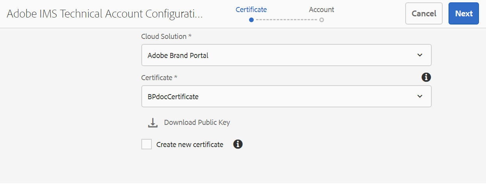

# Configurare AEM Assets con Brand Portal {#configure-aem-assets-with-brand-portal}

Adobe Experience Manager (AEM) Assets è configurato con Brand Portal tramite Adobe I/O, che fornisce un token IMS per l’autorizzazione del tenant di Brand Portal.

## Prerequisiti {#prerequisites}

Per configurare AEM Assets con Brand Portal, è necessario quanto segue:

* Un’istanza cloud di AEM Assets in esecuzione.
* URL del tenant di Brand Portal.
* Un utente con privilegi di amministratore di sistema nell’organizzazione IMS del tenant di Brand Portal.

Per ulteriori richieste, **contatta il supporto tecnico**.

## Creare la configurazione {#create-new-configuration}

Puoi creare una nuova configurazione su Adobe I/O per configurare l’istanza cloud di AEM Assets con Brand Portal.

Effettua i seguenti passaggi nella sequenza elencata:
1. [Recuperare il certificato pubblico](#public-certificate)
1. [Creare l’integrazione di Adobe I/O](#createnewintegration)
1. [Creare la configurazione dell’account IMS](#create-ims-account-configuration)
1. [Configurare il servizio cloud](#configure-the-cloud-service)
1. [Verificare la configurazione](#test-configuration)

### Creare la configurazione IMS {#create-ims-configuration}

La configurazione IMS autentica il tenant di Brand Portal con l’istanza di authoring di AEM Assets.

La configurazione IMS prevede due passaggi:

* [Recuperare il certificato pubblico](#public-certificate)
* [Creare la configurazione dell’account IMS](#create-ims-account-configuration)

### Recuperare il certificato pubblico {#public-certificate}

Il certificato pubblico consente di autenticare il profilo su Adobe I/O.

1. Accedi all’istanza cloud di AEM Assets.

1. Dal pannello **Strumenti** , passa a **[!UICONTROL Protezione]** > **[!UICONTROL Configurazioni Adobe IMS]**.

   

1. Viene visualizzata la pagina Configurazioni Adobe IMS.

   Fai clic su **[!UICONTROL Crea]**.

   Viene visualizzata la pagina **[!UICONTROL Configurazione account tecnico Adobe IMS]**.

1. Per impostazione predefinita, viene aperta la scheda **Certificato**.

   In **Soluzione cloud**, seleziona **[!UICONTROL Adobe Brand Portal]**.

1. Seleziona la casella di controllo **[!UICONTROL Crea nuovo certificato]** e specifica un **alias** per il certificato. L’alias funge da nome della finestra di dialogo.

1. Fai clic su **[!UICONTROL Crea certificato]**. Viene visualizzata una finestra di dialogo. Fai clic su **[!UICONTROL OK]** per generare il certificato pubblico.

   

1. Fai clic su **[!UICONTROL Scarica chiave pubblica]** e salva il file di certificato *AEM-Adobe-IMS.crt* sul computer. Il file di certificato viene utilizzato per [creare l’integrazione di Adobe I/O](#createnewintegration).

   

1. Fai clic su **[!UICONTROL Avanti]**.

   Nella scheda **Account**, puoi creare l’account Adobe IMS, ma dovrai disporre dei dettagli di integrazione. Per il momento tieni aperta questa pagina.

   Apri una nuova scheda e [crea l’integrazione di Adobe I/O](#createnewintegration) per ottenere i dettagli di integrazione per le configurazioni dell’account IMS.

### Creare l’integrazione di Adobe I/O {#createnewintegration}

L’integrazione di Adobe I/O genera i valori di Chiave API, Segreto client e Payload (JWT), necessari per definire le configurazioni dell’account IMS.

1. Accedi alla console di Adobe I/O con privilegi di amministratore di sistema nell’organizzazione IMS del tenant di Brand Portal.

   URL predefinito: [https://console.adobe.io/](https://console.adobe.io/)

1. Fai clic su **[!UICONTROL Create Integration]** (Crea integrazione).

1. Seleziona **[!UICONTROL Access an API]** (Accesso a un’API) e fai clic su **[!UICONTROL Continue]** (Continua).

   

1. Viene visualizzata la pagina Create a new integration (Crea una nuova integrazione).

   Seleziona la tua organizzazione dall’elenco a discesa.

   In **[!UICONTROL Experience Cloud]**, seleziona **[!UICONTROL AEM Brand Portal]** e fai clic su **[!UICONTROL Continue]** (Continua).

   Se l’opzione Brand Portal è disabilitata, assicurati di aver selezionato l’organizzazione corretta dalla casella a discesa sopra l’opzione **[!UICONTROL Adobe Services]**. Se non sai qual è la tua organizzazione, contatta l’amministratore.

   

1. Specifica un nome e una descrizione per l’integrazione. Fai clic su **[!UICONTROL Seleziona un file dal computer]** e carica il file `AEM-Adobe-IMS.crt` scaricato nella sezione [Recupero del certificato pubblico](#public-certificate).

1. Seleziona il profilo della tua organizzazione.

   In alternativa, seleziona il profilo predefinito **[!UICONTROL Assets Brand Portal]** e fai clic su **[!UICONTROL Create Integration]** (Crea integrazione). L’integrazione viene creata.

1. Fai clic su **[!UICONTROL Continue to integration details]** (Passa ai dettagli dell’integrazione) per visualizzare le informazioni sull’integrazione.

   Copia il valore di **[!UICONTROL API Key]** (Chiave API).

   Fai clic su **[!UICONTROL Retrieve Client Secret]** (Recupera segreto client) e copia la chiave del segreto client.

   

1. Passa alla scheda **[!UICONTROL JWT]** e copia il valore del **[!UICONTROL payload JWT]**.

   Le informazioni relative alla chiave API, al segreto client e al payload JWT verranno utilizzate per creare la configurazione dell’account IMS.

### Creare la configurazione dell’account IMS {#create-ims-account-configuration}

Verifica di aver eseguito i seguenti passaggi:

* [Recuperare il certificato pubblico](#public-certificate)
* [Creare l’integrazione di Adobe I/O](#createnewintegration)

**Procedura per creare la configurazione dell’account IMS:**

1. Apri la scheda **[!UICONTROL Account]** nella pagina Configurazione IMS. Hai tenuto aperta questa pagina alla fine della sezione [Recuperare il certificato pubblico](#public-certificate).

1. Specifica un **[!UICONTROL titolo]** per l’account IMS.

   In **[!UICONTROL Server autorizzazioni]**, immetti l’URL: [https://ims-na1.adobelogin.com/](https://ims-na1.adobelogin.com/)

   Incolla la chiave API, il segreto client e il payload JWT che hai copiato al termine di [Creare l’integrazione di Adobe I/O](#createnewintegration).

   Fai clic su **[!UICONTROL Crea]**.

   L’integrazione viene creata.

   

1. Seleziona la configurazione IMS e fai clic su **[!UICONTROL Verifica stato]**. Viene visualizzata una finestra di dialogo.

   Fai clic su **[!UICONTROL Verifica]**. Una volta stabilita la connessione, viene visualizzato il messaggio *Token recuperato correttamente*.

   

>[!CAUTION]
>
>Puoi disporre di una sola configurazione IMS. Non creare più configurazioni IMS.
>
>Verifica che la configurazione IMS superi il controllo di integrità. Se la configurazione non supera questa verifica, non è valida. Dovrai quindi eliminarla e creare una nuova configurazione valida.

### Configurare il servizio cloud {#configure-the-cloud-service}

Per creare la configurazione del servizio cloud di Brand Portal, effettua le seguenti operazioni:

1. Accedi all’istanza cloud di AEM Assets.

1. Dal pannello **Strumenti** , passa a **[!UICONTROL Cloud Services]** > **[!UICONTROL AEM Brand Portal]**.

   Viene aperta la pagina Configurazioni di Brand Portal.

1. Fai clic su **[!UICONTROL Crea]**.

1. Specifica un **[!UICONTROL titolo]** per la configurazione.

   Seleziona la configurazione IMS creata nel passaggio [Creare la configurazione dell’account IMS](#create-ims-account-configuration).

   In **[!UICONTROL URL servizio]**, immetti l’URL del tenant di Brand Portal.

   

1. Fai clic su **[!UICONTROL Salva e chiudi]**. Viene creata la configurazione cloud. L’istanza cloud di AEM Assets è ora configurata con il tenant di Brand Portal.

### Verificare la configurazione {#test-configuration}

1. Accedi all’istanza cloud di AEM Assets.

1. Dal pannello **Strumenti** , passa a **[!UICONTROL Implementazione]** > **[!UICONTROL Distribuzione]**.

   

1. Viene visualizzata la pagina Distribuzione.

   Nella sezione **[!UICONTROL Pubblica su Brand Portal]** viene creato un agente `bpdistributionagent0` per la distribuzione di Brand Portal.

   Fai clic su **[!UICONTROL Pubblica su Brand Portal]**.

   

   >[!NOTE]
   >
   >Per impostazione predefinita, per un tenant di Brand Portal viene creato un solo agente di distribuzione.

1. Viene visualizzata la pagina dell’agente di distribuzione. Per impostazione predefinita, viene aperta la scheda **[!UICONTROL Stato]**, che popola le code di distribuzione.

   Un agente di distribuzione contiene due code:
   * **Coda di elaborazione**: per la distribuzione delle risorse in Brand Portal.

   * **Coda di errore**: per le risorse per le quali la distribuzione non è riuscita.
   >[!NOTE]
   >
   >È consigliabile esaminare gli errori e cancellare periodicamente la **coda di errore**.

   

1. Per verificare la connessione tra AEM Assets e Brand Portal, fai clic su **[!UICONTROL Prova connessione]**.

   

   Nella parte inferiore della pagina viene visualizzato un messaggio che informa che il pacchetto di test è stato consegnato correttamente.

   >[!NOTE]
   >
   >Evita di disabilitare l’agente di distribuzione, in quanto potrebbe impedire la corretta distribuzione delle risorse (in esecuzione nella coda).

L’istanza cloud di AEM Assets è stata configurata correttamente con Brand Portal. Ora puoi:

* [Pubblicare risorse da AEM Assets su Brand Portal](publish-to-brand-portal.md)
* [Pubblicare cartelle da AEM Assets su Brand Portal](publish-to-brand-portal.md#publish-folders-to-brand-portal)
* [Pubblicare raccolte da AEM Assets su Brand Portal](publish-to-brand-portal.md#publish-collections-to-brand-portal)

Oltre a quanto sopra, è possibile pubblicare anche schemi di metadati, predefiniti per immagini, facet di ricerca e tag da AEM Assets a Brand Portal.

* [Pubblicare predefiniti, schemi e facet in Brand Portal](https://docs.adobe.com/content/help/it-IT/experience-manager-brand-portal/using/publish/publish-schema-search-facets-presets.html)
* [Pubblicare tag in Brand Portal](https://docs.adobe.com/content/help/it-IT/experience-manager-brand-portal/using/publish/brand-portal-publish-tags.html)

Per ulteriori informazioni, consulta la [documentazione di Brand Portal](https://docs.adobe.com/content/help/it-IT/experience-manager-brand-portal/using/home.html).

## Registri di distribuzione {#distribution-logs}

Puoi controllare i registri per ottenere informazioni dettagliate sulle azioni eseguite sull’agente di distribuzione.

Ad esempio, abbiamo pubblicato una risorsa da AEM Assets a Brand Portal per verificare la configurazione.

1. Segui i passaggi da 1 a 4 descritti in **[!UICONTROL Prova connessione]** e passa alla pagina dell’agente di distribuzione.

1. Fai clic su **[!UICONTROL Registri]** per visualizzare i registri di distribuzione. Qui vengono visualizzati i registri di elaborazione ed errore.

   

L’agente di distribuzione genera i seguenti registri:

* INFO: si tratta di un registro generato dal sistema e viene attivato in caso di configurazione corretta che abilita l’agente di distribuzione.
* DSTRQ1 (richiesta 1): si attiva durante la prova della connessione.

Quando viene pubblicata la risorsa, vengono generati i seguenti registri di richieste e risposte:

**Richiesta dell’agente di distribuzione**:
* DSTRQ2 (richiesta 2): viene attivata la richiesta di pubblicazione della risorsa.
* DSTRQ3 (richiesta 3): il sistema attiva un’altra richiesta per pubblicare la cartella in cui si trova la risorsa e replica la cartella in Brand Portal.

**Risposta dell’agente di distribuzione**:
* queue-bpdistributionagent0 (DSTRQ2): la risorsa viene pubblicata su Brand Portal.
* queue-bpdistributionagent0 (DSTRQ3): il sistema replica la cartella contenente la risorsa in Brand Portal.

Nell’esempio precedente, viene attivata un’ulteriore combinazione di richiesta e risposta. Il sistema non è riuscito a trovare la cartella principale (con il nome specificato in ADD paths) in Brand Portal perché la risorsa è stata pubblicata per la prima volta, pertanto attiva un’ulteriore richiesta per creare in Brand Portal una cartella principale con lo stesso nome in cui viene pubblicata la risorsa.

>[!NOTE]
>
>Se la cartella principale non è presente in Brand Portal (come nell’esempio precedente) o se è stata modificata in AEM Assets, viene generata un’ulteriore richiesta.

<!--

## Additional information {#additional-information}

Go to `/system/console/slingmetrics` for statistics related to the distributed content:

1. **Counter metrics**
   * sling: `mac_sync_request_failure`
   * sling: `mac_sync_request_received`
   * sling: `mac_sync_request_success`

1. **Time metrics**
   * sling: `mac_sync_distribution_duration`
   * sling: `mac_sync_enqueue_package_duration`
   * sling: `mac_sync_setup_request_duration`

-->

<!--
   Comment Type: draft

   <li> </li>
   -->

<!--
   Comment Type: draft

   <li>Step text</li>
   -->
