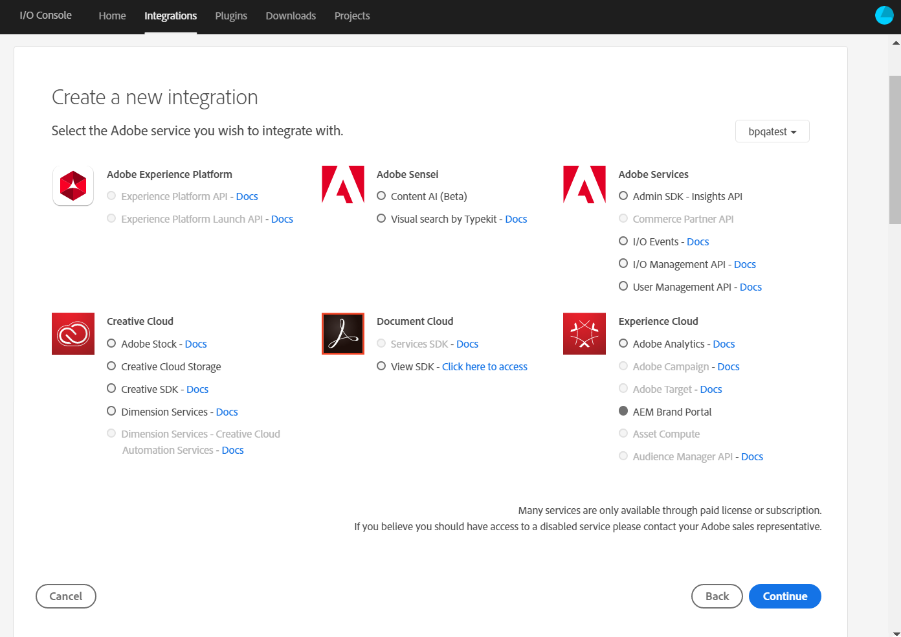

# Configurare AEM Assets con Brand Portal {#configure-aem-assets-with-brand-portal}

Adobe Experience Manager (AEM) Assets è configurato con Portale marchio tramite  Developer Console di Adobe, che fornisce un token IMS per l’autorizzazione del tenant del Brand Portal.

**Come funziona la configurazione?**

La configurazione di  AEM Assets con Brand Portal richiede configurazioni sia in  AEM Assets che  Developer Console.

1. In  AEM Assets, create un account IMS e generate un certificato pubblico (chiave pubblica).
1. In  Adobe Developer Console, crea un progetto per il tenant del Brand Portal (organizzazione).
1. Nel progetto, configura un&#39;API utilizzando la chiave pubblica per creare una connessione a un account di servizio (JWT).
1. Ottenete le credenziali dell&#39;account del servizio e le informazioni sul payload JWT.
1. In  AEM Assets, configurate l&#39;account IMS utilizzando le credenziali dell&#39;account del servizio e il payload JWT.
1. In  AEM Assets, configurate il servizio cloud Brand Portal utilizzando l&#39;account IMS e l&#39;endpoint del Brand Portal (URL organizzazione).
1. Verificate la configurazione pubblicando una risorsa da  AEM Assets al Brand Portal.

>[!NOTE]
>
>Un’istanza  AEM Assets può essere configurata solo con un tenant Brand Portal.

## Prerequisiti {#prerequisites}

Per configurare AEM Assets con Brand Portal, è necessario quanto segue:

* Un AEM Assets funzionante  come istanza di Cloud Service.
* URL tenant del Brand Portal.
* Un utente con privilegi di amministratore di sistema nell’organizzazione IMS del tenant di Brand Portal.

## Creare la configurazione {#create-new-configuration}

Effettuate i seguenti passaggi nella sequenza specificata per configurare  AEM Assets con Brand Portal.

1. [Recuperare il certificato pubblico](#public-certificate)
1. [Creare una connessione account di servizio (JWT)](#createnewintegration)
1. [Configurare l&#39;account IMS](#create-ims-account-configuration)
1. [Configurare il servizio cloud](#configure-the-cloud-service)
1. [Verificare la configurazione](#test-configuration)

### Creare la configurazione IMS {#create-ims-configuration}

La configurazione IMS autentica il tenant del Brand Portal con  AEM Assets.

La configurazione IMS prevede due passaggi:

* [Recuperare il certificato pubblico](#public-certificate)
* [Configurare l&#39;account IMS](#create-ims-account-configuration)

### Recuperare il certificato pubblico {#public-certificate}

Il certificato pubblico consente di autenticare il profilo in  Adobe Developer Console.

1. Effettuate l&#39;accesso a  AEM Assets.

1. From the **Tools**  panel, navigate to **[!UICONTROL Security]** > **[!UICONTROL Adobe IMS Configurations]**.

   

1. Nella pagina Configurazioni IMS  Adobe, fate clic su **[!UICONTROL Crea]**.

1. Viene nuovamente visualizzata la pagina Configurazione **[!UICONTROL account tecnico IMS del Adobe]** . By default, the **Certificate** tab opens.

   Selezionate la soluzione cloud **[!UICONTROL Portale]** marchio Adobe.

1. Mark the **[!UICONTROL Create new certificate]** checkbox and specify an **alias** for the certificate. L&#39;alias funge da nome del certificato.

1. Fai clic su **[!UICONTROL Crea certificato]**. Quindi, fate clic su **[!UICONTROL OK]** nella finestra di dialogo per generare il certificato pubblico.

   

1. Click **[!UICONTROL Download Public Key]** and save the certificate (.crt) file on your machine.

   Il file del certificato verrà utilizzato in seguito per configurare l&#39;API per il tenant del Brand Portal e generare le credenziali dell&#39;account di servizio in  Adobe Developer Console.

   

1. Fai clic su **[!UICONTROL Avanti]**.

   Nella scheda **Account** , viene creato l&#39;account IMS  Adobe, ma per tale scopo sarà necessario disporre delle credenziali dell&#39;account di servizio generate in  Adobe Developer Console. Per il momento tieni aperta questa pagina.

   Aprite una nuova scheda e [create una connessione account di servizio (JWT) in  Adobe Developer Console](#createnewintegration) per ottenere le credenziali e il payload JWT per configurare l&#39;account IMS.

### Creare una connessione account di servizio (JWT) {#createnewintegration}

In  Adobe Developer Console, i progetti e le API sono configurati a livello di tenant del Brand Portal (organizzazione). La configurazione di un&#39;API crea una connessione a un account di servizio (JWT) in  Adobe Developer Console. Esistono due metodi per configurare l&#39;API, generando una coppia di chiavi (chiavi private e pubbliche) o caricando una chiave pubblica. Per configurare  AEM Assets con Brand Portal, dovete generare un certificato pubblico (chiave pubblica) in  AEM Assets e creare le credenziali in  Developer Console caricando la chiave pubblica. Questa chiave pubblica viene utilizzata per configurare l&#39;API per il tenant del Portale marchio selezionato e genera le credenziali e il payload JWT per l&#39;account del servizio. Tali credenziali vengono ulteriormente utilizzate per configurare l&#39;account IMS in  AEM Assets. Una volta configurato l&#39;account IMS, potete configurare il servizio cloud Brand Portal in  AEM Assets.

Effettuate le seguenti operazioni per generare le credenziali dell&#39;account del servizio e il payload JWT:

1. Accedete a  console per sviluppatori di Adobe con privilegi di amministratore di sistema nell’organizzazione IMS (tenant Brand Portal). L’URL predefinito è

   [https://www.adobe.com/go/devs_console_ui](https://www.adobe.com/go/devs_console_ui)

   >[!NOTE]
   >
   >Accertatevi di aver selezionato l&#39;organizzazione IMS corretta (tenant Brand Portal) dall&#39;elenco a discesa (organizzazione) nell&#39;angolo superiore destro.

1. Click **[!UICONTROL Create new project]**. Viene creato un progetto vuoto per la vostra organizzazione.

   Fate clic su **[!UICONTROL Modifica progetto]** per aggiornare il Titolo **[!UICONTROL e la]** Descrizione **[!UICONTROL del]** progetto, quindi fate clic su **[!UICONTROL Salva]**.

   

1. Nella scheda Panoramica **** progetto, fate clic su **[!UICONTROL Aggiungi API]**.

   

1. Nella finestra **** Aggiungi un&#39;API, selezionate **[!UICONTROL AEM Brand Portal]** e fate clic su **[!UICONTROL Avanti]**.

   Assicuratevi di avere accesso al servizio AEM Brand Portal.

1. Nella finestra **[!UICONTROL Configura API]** , fate clic su **[!UICONTROL Carica la chiave]** pubblica. Quindi, fate clic su **[!UICONTROL Seleziona un file]** e caricate il certificato pubblico (file .crt) scaricato nella sezione [Ottieni certificato](#public-certificate) pubblico.

   Fai clic su **[!UICONTROL Avanti]**.

   

1. Verifica il certificato pubblico e fai clic su **[!UICONTROL Avanti]**.

1. Selezionate il profilo di prodotto predefinito **[!UICONTROL Assets Brand Portal]** e fate clic su **[!UICONTROL Salva API]** configurata.

   <!-- 
   In Brand Portal, a default profile is created for each organization. The Product Profiles are created in admin console for assigning users to groups (based on the roles and permissions). For configuration with Brand Portal, the OAuth token is created at organization level. Therefore, you must configure the default Product Profile for your organization. 
   -->

   

1. Con l&#39;API configurata, verrete reindirizzati alla panoramica dell&#39;API. Nel menu di navigazione a sinistra, in **[!UICONTROL Credenziali]**, fate clic su Account **[!UICONTROL servizio (JWT)]**.

   >[!NOTE]
   >
   >Potete visualizzare le credenziali ed eseguire altre azioni (generare token JWT, copiare i dettagli delle credenziali, recuperare il segreto client e così via) in base alle esigenze.

1. Dalla scheda Credenziali **** client, copiate l&#39;ID **** client.

   Click **[!UICONTROL Retrieve Client Secret]** and copy the **[!UICONTROL client secret]**.

   

1. Navigate to the **[!UICONTROL Generate JWT]** tab and copy the **[!UICONTROL JWT Payload]**.

Ora potete utilizzare l&#39;ID client (chiave API), il segreto client e il payload JWT per [configurare l&#39;account](#create-ims-account-configuration) IMS in  AEM Assets.

<!--
1. Click **[!UICONTROL Create Integration]**.

1. Select **[!UICONTROL Access an API]**, and click **[!UICONTROL Continue]**.

   

1. Create a new integration page opens. 
   
   Select your organization from the drop-down list.

   In **[!UICONTROL Experience Cloud]**, Select **[!UICONTROL AEM Brand Portal]** and click **[!UICONTROL Continue]**. 

   If the Brand Portal option is disabled for you, ensure that you have selected correct organization from the drop-down box above the **[!UICONTROL Adobe Services]** option. If you do not know your organization, contact your administrator.

   

1. Specify a name and description for the integration. Click **[!UICONTROL Select a File from your computer]** and upload the `AEM-Adobe-IMS.crt` file downloaded in the [obtain public certificates](#public-certificate) section.

1. Select the profile of your organization. 

   Or, select the default profile **[!UICONTROL Assets Brand Portal]** and click **[!UICONTROL Create Integration]**. The integration is created.

1. Click **[!UICONTROL Continue to integration details]** to view the integration information. 

   Copy the **[!UICONTROL API Key]** 
   
   Click **[!UICONTROL Retrieve Client Secret]** and copy the Client Secret key.

   

1. Navigate to **[!UICONTROL JWT]** tab, and copy the **[!UICONTROL JWT payload]**.

   The API Key, Client Secret key, and JWT payload information will be used to create IMS account configuration.

-->

### Configurare l&#39;account IMS {#create-ims-account-configuration}

Verifica di aver eseguito i seguenti passaggi:

* [Recuperare il certificato pubblico](#public-certificate)
* [Creare una connessione account di servizio (JWT)](#createnewintegration)

Effettuate le seguenti operazioni per configurare l&#39;account IMS.

1. Aprite IMS Configuration (Configurazione IMS) e passate alla scheda **[!UICONTROL Account]** . La pagina è rimasta aperta durante il [recupero del certificato](#public-certificate)pubblico.

1. Specifica un **[!UICONTROL titolo]** per l’account IMS.

   In **[!UICONTROL Server autorizzazioni]**, immetti l’URL: [https://ims-na1.adobelogin.com/](https://ims-na1.adobelogin.com/)

   Incollate la chiave **** API (ID client), il segreto **** cliente e il payload **[!UICONTROL (payload JWT) che avete copiato durante la]** creazione della connessione dell&#39;account del servizio (JWT).

   Fai clic su **[!UICONTROL Crea]**.

   L&#39;account IMS è configurato.

   

1. Select the IMS account configuration and click **[!UICONTROL Check Health]**.

   Fare clic su **[!UICONTROL Controlla]** nella finestra di dialogo. Se la configurazione è stata completata, viene visualizzato un messaggio che informa che il *token è stato recuperato* correttamente.

   

>[!CAUTION]
>
>Puoi disporre di una sola configurazione IMS.
>
>Verifica che la configurazione IMS superi il controllo di integrità. Se la configurazione non supera questa verifica, non è valida. Dovrai quindi eliminarla e creare una nuova configurazione valida.

### Configurare il servizio cloud {#configure-the-cloud-service}

Per configurare il servizio cloud Brand Portal, effettuate le seguenti operazioni:

1. Effettuate l&#39;accesso a  AEM Assets.

1. From the **Tools**  panel, navigate to **[!UICONTROL Cloud Services]** > **[!UICONTROL AEM Brand Portal]**.

1. Nella pagina Configurazioni Brand Portal, fate clic su **[!UICONTROL Crea]**.

1. Specifica un **[!UICONTROL titolo]** per la configurazione.

   Selezionate la configurazione IMS creata durante la [configurazione dell&#39;account](#create-ims-account-configuration)IMS.

   In the **[!UICONTROL Service URL]**, enter your Brand Portal tenant (organization URL).

   

1. Fai clic su **[!UICONTROL Salva e chiudi]**. Viene creata la configurazione cloud.

   L&#39;AEM Assets  come istanza di Cloud Service ora è configurato con il tenant del Brand Portal.

### Verificare la configurazione {#test-configuration}

Effettuate le seguenti operazioni per convalidare la configurazione:

1. Effettuate l&#39;accesso a  AEM Assets.

1. From the **Tools**  panel, navigate to **[!UICONTROL Deployment]** > **[!UICONTROL Distribution]**.

   

   A Brand Portal distribution agent (**[!UICONTROL bpdistributionagent0]**) is created under **[!UICONTROL Publish to Brand Portal]**.

   

   >[!NOTE]
   >
   >Per impostazione predefinita, per un tenant di Brand Portal viene creato un solo agente di distribuzione.

1. Fate clic su **[!UICONTROL Pubblica su Brand Portal]** per aprire l’agente di distribuzione.

   Potete visualizzare le code di distribuzione nella scheda **[!UICONTROL Stato]** .

   Un agente di distribuzione contiene due code:
   * **Coda di elaborazione**: per la distribuzione delle risorse in Brand Portal.

   * **Coda di errore**: per le risorse per le quali la distribuzione non è riuscita.
   >[!NOTE]
   >
   >È consigliabile esaminare gli errori e cancellare periodicamente la **coda di errore**.

   

1. Per verificare la connessione tra AEM Assets e Brand Portal, fai clic su **[!UICONTROL Prova connessione]**.

   

   A message appears at the bottom of the page that your *test package is successfully delivered*.

   >[!NOTE]
   >
   >Evita di disabilitare l’agente di distribuzione, in quanto potrebbe impedire la corretta distribuzione delle risorse (in esecuzione nella coda).

Ora puoi:

* [Pubblicare risorse da AEM Assets su Brand Portal](publish-to-brand-portal.md)
* [Pubblicare cartelle da AEM Assets su Brand Portal](publish-to-brand-portal.md#publish-folders-to-brand-portal)
* [Pubblicare raccolte da AEM Assets su Brand Portal](publish-to-brand-portal.md#publish-collections-to-brand-portal)

Oltre a quanto sopra, potete pubblicare schemi di metadati, tag, predefiniti per immagini e facet di ricerca da  AEM Assets al Brand Portal.

* [Pubblicare predefiniti, schemi e facet in Brand Portal](https://docs.adobe.com/content/help/it-IT/experience-manager-brand-portal/using/publish/publish-schema-search-facets-presets.html)
* [Pubblicare tag in Brand Portal](https://docs.adobe.com/content/help/it-IT/experience-manager-brand-portal/using/publish/brand-portal-publish-tags.html)

Per ulteriori informazioni, consulta la [documentazione di Brand Portal](https://docs.adobe.com/content/help/it-IT/experience-manager-brand-portal/using/home.html).

## Registri di distribuzione {#distribution-logs}

Potete monitorare i registri degli agenti di distribuzione per il flusso di lavoro di pubblicazione delle risorse.

Ad esempio, è stata pubblicata una risorsa da  AEM Assets al Portale del marchio per convalidare la configurazione.

1. Follow the steps (from 1 to 4) as shown in the [Test Configuration](#test-configuration) section and navigate to the distribution agent page.

1. Fai clic su **[!UICONTROL Registri]** per visualizzare i registri di distribuzione. Qui vengono visualizzati i registri di elaborazione ed errore.

   

L’agente di distribuzione genera i seguenti registri:

* INFORMAZIONI: Si tratta di un registro generato dal sistema che viene attivato alla configurazione corretta dell&#39;agente di distribuzione.
* DSTRQ1 (richiesta 1): si attiva durante la prova della connessione.

Quando viene pubblicata la risorsa, vengono generati i seguenti registri di richieste e risposte:

**Richiesta dell’agente di distribuzione**:
* DSTRQ2 (richiesta 2): viene attivata la richiesta di pubblicazione della risorsa.
* DSTRQ3 (richiesta 3): Il sistema attiva un’altra richiesta per pubblicare la  cartella AEM Assets (in cui esiste la risorsa) e replicare la cartella in Brand Portal.

**Risposta dell’agente di distribuzione**:
* queue-bpdistributionagent0 (DSTRQ2): la risorsa viene pubblicata su Brand Portal.
* queue-bpdistributionagent0 (DSTRQ3): Il sistema replica la cartella AEM Assets  (contenente la risorsa) in Brand Portal.

Nell’esempio precedente, viene attivata un’ulteriore combinazione di richiesta e risposta. Impossibile trovare la cartella principale (ad esempio Aggiungi percorso) nel Portale marchio perché la risorsa è stata pubblicata per la prima volta. Il sistema ha pertanto avviato una richiesta aggiuntiva per creare una cartella principale con lo stesso nome in Portale marchio in cui la risorsa viene pubblicata.

>[!NOTE]
>
>La richiesta aggiuntiva viene generata nel caso in cui la cartella principale non esista nel Brand Portal o sia stata modificata in  AEM Assets.

<!--

## Additional information {#additional-information}

Go to `/system/console/slingmetrics` for statistics related to the distributed content:

1. **Counter metrics**
   * sling: `mac_sync_request_failure`
   * sling: `mac_sync_request_received`
   * sling: `mac_sync_request_success`

1. **Time metrics**
   * sling: `mac_sync_distribution_duration`
   * sling: `mac_sync_enqueue_package_duration`
   * sling: `mac_sync_setup_request_duration`

-->

<!--
   Comment Type: draft

   <li> </li>
   -->

<!--
   Comment Type: draft

   <li>Step text</li>
   -->
