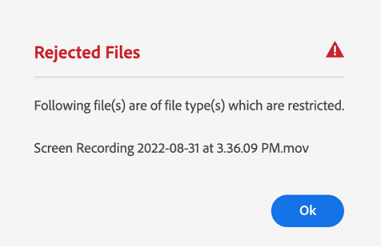

# Configurare le restrizioni di caricamento delle risorse {#configure-asset-upload-restrictions}

Puoi configurare Adobe Experience Manager Assets in modo da limitare il tipo di risorse che gli utenti possono caricare in base al tipo MIME.

>[!IMPORTANT]
>
>Per impostazione predefinita, Experience Manager Assets consente agli utenti di caricare risorse di tutti i tipi MIME. Tuttavia, puoi configurare le impostazioni in modo da limitare gli utenti al caricamento solo di file di tipi MIME specifici.

## Prerequisiti {#prerequisites-asset-upload-restrictions}

Per configurare le restrizioni di caricamento delle risorse è necessario disporre dei privilegi di amministratore.

## Applicare restrizioni per il caricamento delle risorse {#apply-restrictions-asset-uploadsssssss}

Per configurare [!DNL Experience Manager] per limitare gli utenti al caricamento di file di tipi MIME specifici:

1. Accedi a **[!UICONTROL Strumenti > Risorse > Configurazioni risorse]**.

1. Clic **[!UICONTROL Limitazioni di caricamento]**.

1. Clic **[!UICONTROL Aggiungi]** per definire i tipi MIME consentiti.

1. Specificare il tipo MIME nella casella di testo. Puoi fare clic su **[!UICONTROL Aggiungi]** per specificare altri tipi MIME consentiti. Puoi anche fare clic su  per eliminare qualsiasi tipo MIME dall&#39;elenco.

1. Fai clic su **[!UICONTROL Salva]**.

**Esempio 1: consenti il caricamento di tutte le immagini e dei file PDF in Experience Manager Assets**

Per consentire il caricamento di immagini in tutti i formati e file PDF in Experience Manager Assets, effettuare le seguenti operazioni:

`image/*` in quanto il tipo MIME consente il caricamento di immagini in tutti i formati. `application/pdf` in quanto il tipo MIME consente il caricamento di file PDF in Experience Manager Assets.

Se tenti di caricare un file non incluso nell’elenco dei tipi MIME consentiti, Experience Manager Assets visualizza il seguente messaggio di errore:

`Screen Recording 2022-08-31 at 3.36.09 PM.mov` fa riferimento a un nome di file non incluso nei tipi MIME consentiti.

**Esempio 2: consenti il caricamento di formati immagine specifici in Experience Manager Assets**

Per aggiungere formati immagine specifici ai tipi MIME consentiti e limitare il caricamento di tutti gli altri formati di risorse, effettua le seguenti impostazioni:

In base alle impostazioni illustrate nell’immagine, puoi caricare in Experience Manager Assets immagini nei formati .JPG, .PNG e .GIF.

**Consulta anche**

* [Traduci risorse](translate-assets.md)
* [API HTTP di Assets](mac-api-assets.md)
* [Formati di file supportati dalle risorse](file-format-support.md)
* [Cerca risorse](search-assets.md)
* [Risorse collegate](use-assets-across-connected-assets-instances.md)
* [Rapporti sulle risorse](asset-reports.md)
* [Schemi metadati](metadata-schemas.md)
* [Scaricare le risorse](download-assets-from-aem.md)
* [Gestire i metadati](manage-metadata.md)
* [Facet di ricerca](search-facets.md)
* [Gestire le raccolte](manage-collections.md)
* [Importazione in blocco dei metadati](metadata-import-export.md)
* [Pubblicare risorse in AEM e Dynamic Media](/help/assets/publish-assets-to-aem-and-dm.md)
