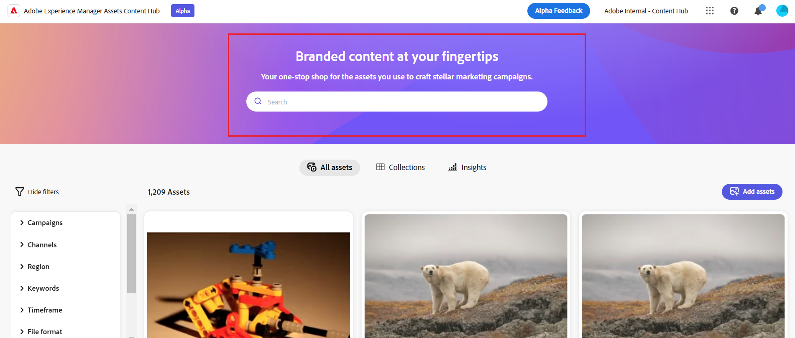

# Configurare l’interfaccia utente dell’hub di contenuti {#configure-content-hub-user-interface}

<!--  -->

Experience Manager Assets consente agli amministratori di configurare le opzioni disponibili nell’interfaccia utente di Content Hub. In base alle opzioni di configurazione selezionate dagli amministratori, gli utenti di Content Hub possono visualizzare i campi in Content Hub. Le opzioni di configurazione includono:

* Filtri disponibili per gli utenti durante la ricerca di risorse.

* Dettagli della risorsa o proprietà disponibili per ciascuna risorsa.

* Campi di metadati disponibili per gli utenti quando si aggiungono risorse a Content Hub.

* Campi di metadati delle risorse disponibili per la ricerca in Content Hub.

* Contenuti di branding da visualizzare per la tua organizzazione.

* Eventuali collegamenti personalizzati da includere su Content Hub, oltre a risorse, raccolte e informazioni.

## Prerequisiti {#prerequisites-configuration-ui}

[Amministratori Content Hub](/help/assets/deploy-content-hub.md#step-3-onboard-content-hub-administrator) può impostare le opzioni di configurazione per altri utenti all’interno della tua organizzazione.

## Accedere alle opzioni di configurazione in Content Hub {#access-configuration-options-content-hub}

Per accedere alle opzioni di configurazione in Content Hub:

1. Fai clic sull’icona utente nel riquadro a destra.

1. In **[!UICONTROL Impostazioni prodotto]** sezione, seleziona **[!UICONTROL Configurazioni]**.

   

## Gestione delle opzioni di configurazione in Content Hub {#manage-configuration-options}

Gestisci le seguenti opzioni di configurazione per i tuoi utenti:

* [Importa](#configure-import-options-content-hub)

* [Filtri](#configure-filters-content-hub)

* [Dettagli risorsa](#configure-asset-details-content-hub)

* [Ricerca](#configure-metadata-search-content-hub)

* [Branding](#configure-branding-content-hub)

* [Collegamenti personalizzati](#configure-custom-links-content-hub)

### Importa {#configure-import-options-content-hub}

Puoi configurare i campi di metadati che vengono visualizzati dagli utenti durante il caricamento o l’importazione delle risorse nel portale Content Hub, ad esempio Nome campagna, Parole chiave, Canali, Intervallo temporale, Area e così via. Per farlo, esegui le seguenti operazioni:

1. Il giorno [Configurazioni](#access-configuration-options-content-hub) interfaccia utente, fai clic su **[!UICONTROL Importa]**.

1. Clic **[!UICONTROL Aggiungi metadati]**.

1. Specifica un’etichetta per la proprietà, mapparla su una proprietà utilizzando **[!UICONTROL Metadati]** e selezionare il tipo di input per i nuovi metadati della risorsa.

1. Fai clic su **[!UICONTROL Campo obbligatorio]** attiva per rendere obbligatorio il nuovo campo di metadati da specificare per gli utenti durante il caricamento di nuove risorse.

1. Clic **[!UICONTROL Conferma]**. I nuovi metadati vengono visualizzati nell’elenco delle proprietà della risorsa esistenti.

1. Clic **[!UICONTROL Salva]** per applicare le modifiche.

Allo stesso modo, puoi fare clic su , disponibile accanto a ciascuna proprietà disponibile, per modificare le etichette, rendi questi campi obbligatori o non obbligatori per gli utenti durante il caricamento di risorse tramite **[!UICONTROL Campo obbligatorio]** o fai clic sull’icona Elimina per eliminare qualsiasi proprietà di metadati.

Fai clic su **[!UICONTROL Approvazione automatica]** attiva questa opzione se tutte le risorse aggiunte all’archivio Experience Manager Assets devono essere approvate automaticamente in modo che siano immediatamente disponibili in Content Hub. Altrimenti, gli autori o gli amministratori di DAM devono approvare manualmente le risorse per renderle disponibili su Content Hub. Per impostazione predefinita, l&#39;interruttore è impostato sullo stato Off.

Clic **[!UICONTROL Salva]** dopo aver apportato tutte le modifiche necessarie per applicare le modifiche.

I metadati sono abilitati nella visualizzazione dell’interfaccia utente di configurazione nella pagina di caricamento delle risorse:

### Filtri {#configure-filters-content-hub}

Content Hub consente agli amministratori di configurare i filtri da visualizzare durante la ricerca delle risorse. Per aggiungere un nuovo filtro, effettua le seguenti operazioni:

1. Il giorno [Configurazioni](#access-configuration-options-content-hub) interfaccia utente, fai clic su **[!UICONTROL Filtri]**.

1. Clic **[!UICONTROL Aggiungere filtri]**.

1. Specifica un’etichetta per il filtro, mappala a una proprietà utilizzando **[!UICONTROL Metadati]** e selezionare il tipo di input per il nuovo filtro.
1. Clic **[!UICONTROL Conferma]**. Il nuovo filtro viene visualizzato nell’elenco dei filtri esistenti.

1. Clic **[!UICONTROL Salva]** per applicare le modifiche in modo che il nuovo filtro venga visualizzato nella pagina Ricerca durante il filtraggio delle risorse.

   >[!NOTE]
   >
   >Il nuovo filtro viene visualizzato nella pagina di ricerca solo se nell’archivio è presente almeno una risorsa che soddisfa i criteri del filtro.

Allo stesso modo, puoi fare clic su , disponibile accanto a ciascun filtro disponibile, per modificare le etichette o fare clic sull’icona Elimina per eliminare eventuali filtri esistenti. Clic **[!UICONTROL Salva]** dopo aver apportato tutte le modifiche necessarie per applicare le modifiche.

I filtri abilitati nell’interfaccia utente di configurazione vengono visualizzati nella pagina Ricerca:

### Dettagli risorsa {#configure-asset-details-content-hub}

Puoi anche configurare le proprietà della risorsa che vengono visualizzate per ogni risorsa, ad esempio il nome del file, il titolo, il formato, la dimensione e così via. Per farlo, esegui le seguenti operazioni:

1. Il giorno [Configurazioni](#access-configuration-options-content-hub) interfaccia utente, fai clic su **[!UICONTROL Dettagli risorsa]**.

1. Clic **[!UICONTROL Aggiungi metadati]**.

1. Specifica un’etichetta per la proprietà, mapparla su una proprietà utilizzando **[!UICONTROL Metadati]** e selezionare il tipo di input per i nuovi metadati della risorsa.
1. Clic **[!UICONTROL Conferma]**. I nuovi metadati vengono visualizzati nell’elenco delle proprietà della risorsa esistenti.

1. Clic **[!UICONTROL Salva]** per applicare le modifiche in modo che la nuova proprietà venga visualizzata nella pagina dettagli risorsa.

Allo stesso modo, puoi fare clic su , disponibile accanto a ciascuna proprietà disponibile, per modificare le etichette o fare clic sull’icona Elimina per eliminare i dettagli di una risorsa esistente. Clic **[!UICONTROL Salva]** dopo aver apportato tutte le modifiche necessarie per applicare le modifiche.

Le proprietà abilitate nell’interfaccia utente di configurazione vengono visualizzate nella pagina Dettagli risorsa:

### Ricerca {#configure-metadata-search-content-hub}

Gli amministratori possono definire i campi di metadati in cui eseguire le ricerche quando un utente specifica un criterio di ricerca in Content Hub. Esegui i passaggi seguenti:

1. Il giorno [Configurazioni](#access-configuration-options-content-hub) interfaccia utente, fai clic su **[!UICONTROL Aggiungi metadati]**.

1. Specifica il campo di metadati e fai clic su **[!UICONTROL Conferma]**.

1. Clic **[!UICONTROL Salva]** per applicare le modifiche in modo che la nuova proprietà dei metadati venga visualizzata nell’elenco dei campi di metadati.

Allo stesso modo, puoi fare clic su , disponibile accanto a ciascuna proprietà di metadati disponibile, per modificare la proprietà o fai clic sull’icona Elimina per eliminare qualsiasi proprietà esistente. Clic **[!UICONTROL Salva]** dopo aver apportato tutte le modifiche necessarie per applicare le modifiche.

### Branding {#configure-branding-content-hub}

Gli amministratori possono anche personalizzare il titolo e il corpo del testo sul banner del portale Content Hub, in base ai requisiti di branding. Per farlo, esegui le seguenti operazioni:

1. Il giorno [Configurazioni](#access-configuration-options-content-hub) interfaccia utente, fai clic su **[!UICONTROL Marchio]**.

1. Specifica testo in **[!UICONTROL Testo titolo sul banner]** e **[!UICONTROL Corpo del testo sul banner]** campi.

1. Clic **[!UICONTROL Salva]** per applicare le modifiche.

Gli aggiornamenti di branding abilitati nell’interfaccia utente di configurazione vengono visualizzati sul banner del portale Content Hub:

### Collegamenti personalizzati {#configure-custom-links-content-hub}

È inoltre possibile aggiungere schede personalizzate oltre a quelle standard **[!UICONTROL Tutti Assets]**, **[!UICONTROL Raccolte]**, e **[!UICONTROL Approfondimenti]** sul portale Content Hub immediatamente sotto il banner. Per farlo, esegui le seguenti operazioni:

1. Il giorno [Configurazioni](#access-configuration-options-content-hub) interfaccia utente, fai clic su **[!UICONTROL Collegamenti personalizzati]**.

1. Clic **[!UICONTROL Aggiungi collegamento]**.

1. Specifica testo in **[!UICONTROL Etichetta]** e **[!UICONTROL URL]** campi. L’etichetta definita viene visualizzata come una scheda e quando fai clic sull’etichetta, accedi all’URL definito in **[!UICONTROL URL]** campo.

1. Clic **[!UICONTROL Conferma]**.

1. Clic **[!UICONTROL Salva]** per applicare le modifiche.

Allo stesso modo, puoi fare clic su , disponibile accanto a ciascun URL, per modificare i collegamenti o fare clic sull’icona Elimina per eliminare eventuali URL esistenti. Clic **[!UICONTROL Salva]** dopo aver apportato tutte le modifiche necessarie per applicare le modifiche.

Il collegamento personalizzato viene visualizzato come una nuova scheda accanto alla scheda Approfondimenti nella home page di Content Hub.

