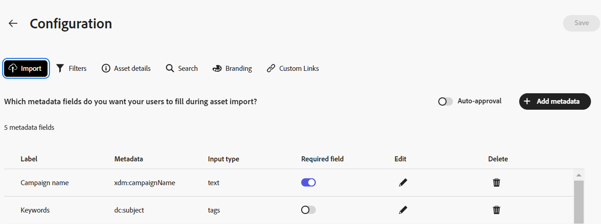
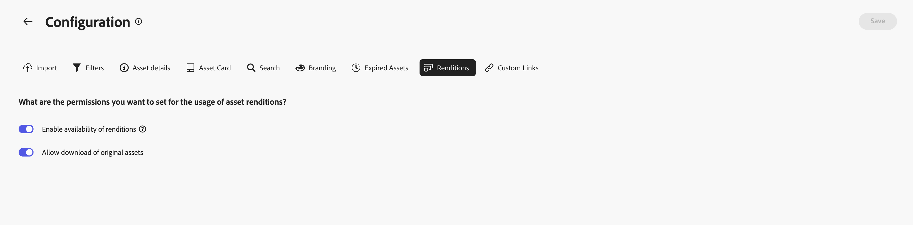

# Configurare l’interfaccia utente di Content Hub {#configure-content-hub-user-interface}

| [Best practice per la ricerca](/help/assets/search-best-practices.md) | [Best practice per i metadati](/help/assets/metadata-best-practices.md) | [Content Hub](/help/assets/product-overview.md) | [Dynamic Media con funzionalità OpenAPI](/help/assets/dynamic-media-open-apis-overview.md) | [Documentazione di AEM Assets per sviluppatori](https://developer.adobe.com/experience-cloud/experience-manager-apis/) |
| ------------- | --------------------------- |---------|----|-----|

>[!CONTEXTUALHELP]
>id="configure_content_hub"
>title="Configurare l’interfaccia utente di Content Hub"
>abstract="Experience Manager Assets consente agli amministratori di configurare le opzioni disponibili nell’interfaccia utente dell’hub di contenuti. In base alle opzioni di configurazione selezionate dagli amministratori, gli utenti dell’hub di contenuti possono visualizzare i campi su di esso. Le opzioni di configurazione includono metadati durante l’importazione di risorse, filtri, proprietà delle risorse, metadati durante la ricerca di risorse, branding personalizzato ed eventuali collegamenti personalizzati."
>additional-url="https://images-tv.adobe.com/mpcv3/4477/74a81d1c-0cfe-41f4-8a06-18ff70604e45_1732023385.854x480at800_h264.mp4" text="Guarda il video"

<!--  -->

>[!AVAILABILITY]
>
>La guida di Content Hub è ora disponibile in formato PDF. Scarica l’intera guida e utilizza l’Assistente IA di Adobe Acrobat per rispondere alle tue domande.
>
>[!BADGE Guida di Content Hub - PDF]{type=Informative url="https://helpx.adobe.com/content/dam/help/en/experience-manager/aem-assets/content-hub.pdf"}

Experience Manager Assets consente agli amministratori di configurare le opzioni disponibili nell’interfaccia utente dell’hub di contenuti. In base alle opzioni di configurazione selezionate dagli amministratori, gli utenti dell’hub di contenuti possono visualizzare i campi su di esso. Le opzioni di configurazione includono:

* Filtri disponibili per gli utenti durante la ricerca di risorse.

* Dettagli della risorsa o proprietà disponibili per ciascuna risorsa.

* Campi di metadati disponibili per gli utenti quando si aggiungono risorse a Content Hub.

* Campi di metadati delle risorse disponibili per la ricerca in Content Hub.

* Contenuti di branding da visualizzare per la tua organizzazione.

* Eventuali collegamenti personalizzati da includere su Content Hub, oltre a risorse, raccolte e informazioni.

## Prerequisiti {#prerequisites-configuration-ui}

[Gli amministratori di Content Hub](/help/assets/deploy-content-hub.md#step-3-onboard-content-hub-administrator) possono impostare le opzioni di configurazione per altri utenti all&#39;interno della tua organizzazione.

## Accedere alle opzioni di configurazione in Content Hub {#access-configuration-options-content-hub}

Per accedere alle opzioni di configurazione in Content Hub:

1. Fai clic sull’icona utente nel riquadro a destra.

1. Nella sezione **[!UICONTROL Impostazioni prodotto]**, seleziona **[!UICONTROL Configurazioni]**.

   

## Gestione delle opzioni di configurazione in Content Hub {#manage-configuration-options}

In qualità di amministratore, gestisci le seguenti opzioni di configurazione per i tuoi utenti:

* [Importa](#configure-import-options-content-hub)

* [Filtri](#configure-filters-content-hub)

* [Dettagli risorsa](#configure-asset-details-content-hub)
* [Scheda risorse](#asset-card)

* [Ricerca](#configure-metadata-search-content-hub)

* [Branding](#configure-branding-content-hub)

* [Risorse scadute](#expired-assets-content-hub)

* [Rappresentazioni](#renditions-content-hub)

* [Collegamenti personalizzati](#configure-custom-links-content-hub)

### Importa {#configure-import-options-content-hub}

Puoi configurare i campi di metadati che vengono visualizzati dagli utenti durante il caricamento o l’importazione delle risorse nel portale Content Hub, ad esempio Nome campagna, Parole chiave, Canali, Intervallo temporale, Area e così via. Per farlo, esegui le seguenti operazioni:

1. Nell&#39;interfaccia utente di [Configurations](#access-configuration-options-content-hub), fare clic su **[!UICONTROL Import]**.

1. Fare clic su **[!UICONTROL Aggiungi metadati]**.

1. Specifica un&#39;etichetta per la proprietà, mappala a una proprietà utilizzando il campo **[!UICONTROL Metadati]** e seleziona il tipo di input per i nuovi metadati della risorsa.

1. Fai clic sull&#39;interruttore **[!UICONTROL Campo obbligatorio]** per rendere obbligatorio il nuovo campo di metadati da specificare per gli utenti durante il caricamento di nuove risorse.

1. Fai clic su **[!UICONTROL Conferma]**. I nuovi metadati vengono visualizzati nell’elenco delle proprietà della risorsa esistenti.

1. Fai clic su **[!UICONTROL Salva]** per applicare le modifiche.

Allo stesso modo, puoi fare clic sull&#39;icona , disponibile accanto a ciascuna proprietà disponibile, per modificare le etichette, rendere questi campi obbligatori o non obbligatori per gli utenti durante il caricamento di risorse utilizzando l&#39;interruttore **[!UICONTROL Campo obbligatorio]**, oppure fare clic sull&#39;icona Elimina per eliminare qualsiasi proprietà di metadati.

Fai clic sull&#39;interruttore **[!UICONTROL Approvazione automatica]** se tutte le risorse aggiunte all&#39;archivio Experience Manager Assets devono essere approvate automaticamente in modo che siano immediatamente disponibili in Content Hub. Altrimenti, gli autori o gli amministratori di DAM devono approvare manualmente le risorse per renderle disponibili su Content Hub. Per impostazione predefinita, l&#39;interruttore è impostato sullo stato Off.

Fai clic su **[!UICONTROL Salva]** dopo aver apportato tutte le modifiche necessarie per applicarle.

I metadati sono abilitati nella visualizzazione dell’interfaccia utente di configurazione nella pagina di caricamento delle risorse:

### Filtri {#configure-filters-content-hub}

Content Hub consente agli amministratori di configurare i filtri da visualizzare durante la ricerca delle risorse. Per aggiungere un nuovo filtro, effettua le seguenti operazioni:

1. Nell&#39;interfaccia utente di [Configurations](#access-configuration-options-content-hub), fare clic su **[!UICONTROL Filters]**.

1. Fare clic su **[!UICONTROL Aggiungi filtri]**.

1. Specifica un&#39;etichetta per il filtro, mappalo su una proprietà utilizzando il campo **[!UICONTROL Metadati]** e seleziona il tipo di input per il nuovo filtro.
1. Fai clic su **[!UICONTROL Conferma]**. Il nuovo filtro viene visualizzato nell’elenco dei filtri esistenti.

1. Fai clic su **[!UICONTROL Salva]** per applicare le modifiche in modo che il nuovo filtro venga visualizzato nella pagina di ricerca durante il filtraggio delle risorse.

   >[!NOTE]
   >
   Il nuovo filtro viene visualizzato nella pagina di ricerca solo se nell’archivio è presente almeno una risorsa che soddisfa i criteri del filtro.

Allo stesso modo, puoi fare clic sull&#39;, disponibile accanto a ciascun filtro disponibile, per modificare le etichette o fare clic sull&#39;icona Elimina per eliminare un filtro esistente. Fai clic su **[!UICONTROL Salva]** dopo aver apportato tutte le modifiche necessarie per applicarle.

I filtri abilitati nell’interfaccia utente di configurazione vengono visualizzati nella pagina Ricerca:

### Dettagli risorsa {#configure-asset-details-content-hub}

Puoi anche configurare le proprietà della risorsa che vengono visualizzate per ogni risorsa, ad esempio il nome del file, il titolo, il formato, la dimensione e così via. Per farlo, esegui le seguenti operazioni:

1. Nell&#39;interfaccia utente delle [Configurazioni](#access-configuration-options-content-hub), fare clic su **[!UICONTROL Dettagli risorsa]**.

1. Fare clic su **[!UICONTROL Aggiungi metadati]**.

1. Specifica un&#39;etichetta per la proprietà, mappala a una proprietà utilizzando il campo **[!UICONTROL Metadati]** e seleziona il tipo di input per i nuovi metadati della risorsa.
1. Fai clic su **[!UICONTROL Conferma]**. I nuovi metadati vengono visualizzati nell’elenco delle proprietà della risorsa esistenti.

1. Fai clic su **[!UICONTROL Salva]** per applicare le modifiche in modo che la nuova proprietà venga visualizzata nella pagina dei dettagli della risorsa.

Allo stesso modo, puoi fare clic sull&#39;, disponibile accanto a ciascuna proprietà disponibile, per modificare le etichette o fare clic sull&#39;icona Elimina per eliminare i dettagli della risorsa esistente. Fai clic su **[!UICONTROL Salva]** dopo aver apportato tutte le modifiche necessarie per applicarle.

Le proprietà abilitate nell’interfaccia utente di configurazione vengono visualizzate nella pagina Dettagli risorsa:

### Scheda risorse {#asset-card}

Puoi anche configurare i campi di metadati chiave da visualizzare nella **scheda risorse** fino a un massimo di 6 campi. Per farlo, esegui le seguenti operazioni:

1. Nell&#39;interfaccia utente di [Configurations](#access-configuration-options-content-hub), fare clic su **Asset Card**.
2. Fare clic su **Aggiungi metadati**. Viene visualizzata la finestra di dialogo **Aggiungi metadati scheda risorse**.
3. Specifica il nome dei metadati nel campo **Etichetta** e seleziona una proprietà dei metadati nel campo **Metadati**.
4. Fai clic su **Conferma**, quindi su **Salva** per applicare le modifiche in modo che la nuova proprietà venga visualizzata nella pagina dei dettagli della risorsa.
   

Allo stesso modo, fai clic su  disponibile accanto a ciascuna proprietà disponibile, per apportare le modifiche necessarie, oppure fai clic su  per eliminare eventuali proprietà di metadati esistenti. Fai clic su **Salva** dopo aver apportato tutte le modifiche necessarie per applicarle.

### Ricerca {#configure-metadata-search-content-hub}

Gli amministratori possono definire i campi di metadati in cui eseguire le ricerche quando un utente specifica un criterio di ricerca in Content Hub. Esegui i passaggi seguenti:

1. Nell&#39;interfaccia utente di [Configurations](#access-configuration-options-content-hub), fare clic su **[!UICONTROL Aggiungi metadati]**.

1. Specificare il campo metadati e fare clic su **[!UICONTROL Conferma]**.

1. Fai clic su **[!UICONTROL Salva]** per applicare le modifiche in modo che la nuova proprietà dei metadati venga visualizzata nell&#39;elenco dei campi di metadati.

Allo stesso modo, puoi fare clic sull&#39;, disponibile accanto a ciascuna proprietà di metadati disponibile, per modificare la proprietà o fare clic sull&#39;icona Elimina per eliminare una proprietà esistente. Fai clic su **[!UICONTROL Salva]** dopo aver apportato tutte le modifiche necessarie per applicarle.

### Branding {#configure-branding-content-hub}

Gli amministratori possono anche personalizzare il titolo e il corpo del testo sul banner del portale Content Hub, in base ai requisiti di branding. Per farlo, esegui le seguenti operazioni:

1. Nell&#39;interfaccia utente delle [Configurazioni](#access-configuration-options-content-hub), fare clic su **[!UICONTROL Branding]**.

1. Specifica il testo nei campi **[!UICONTROL Testo titolo nel banner]** e **[!UICONTROL Testo corpo nel banner]**.

1. Fai clic su **[!UICONTROL Salva]** per applicare le modifiche.

Gli aggiornamenti di branding abilitati nell’interfaccia utente di configurazione vengono visualizzati sul banner del portale Content Hub:

### Risorse scadute{#expired-assets-content-hub}

Gli amministratori possono controllare se le risorse scadute devono essere visibili in Content Hub. Inoltre, se le risorse scadute vengono rese visibili, possono definire se gli utenti potranno scaricarle.

Per impostazione predefinita, le risorse scadute non vengono visualizzate in Content Hub.

Per farlo, esegui le seguenti operazioni:

1. Nell&#39;interfaccia utente di [Configurations](#access-configuration-options-content-hub), fare clic su **[!UICONTROL Expired Assets]**.

1. Nella sezione **[!UICONTROL Visibile]**, abilita l&#39;interruttore **[!UICONTROL Consenti agli utenti di visualizzare le risorse scadute]** per rendere visibili in Content Hub tutte le risorse scadute.

1. Dopo aver abilitato la visibilità delle risorse, puoi abilitare o disabilitare la possibilità di scaricare risorse scadute utilizzando l&#39;interruttore **[!UICONTROL Consenti agli utenti di scaricare risorse scadute]**.

1. Fai clic su **[!UICONTROL Salva]** per applicare le modifiche.

   

Dopo aver abilitato la visibilità delle risorse, puoi visualizzare le risorse scadute su Content Hub, come illustrato nell’immagine seguente:

Se l’amministratore ha abilitato il download, gli utenti di Content Hub possono anche scaricarlo, come evidenziato nell’immagine.

Se è abilitata la visibilità delle risorse scadute, Content Hub evidenzia anche le risorse che scadono nei successivi 15 giorni utilizzando il messaggio `Expiring in n days` nella scheda delle risorse.

### Rappresentazioni {#renditions-content-hub}

Le rappresentazioni sono versioni personalizzate delle risorse digitali, ad esempio immagini, documenti e così via, progettate per diversi dispositivi e piattaforme per garantire prestazioni ottimali. Ulteriori informazioni sulle [copie trasformate in Adobe Experience Manager Assets](https://experienceleague.adobe.com/en/docs/experience-manager-cloud-service/content/assets/assets-view/renditions).

Content Hub consente di scaricare le rappresentazioni statiche. Le rappresentazioni statiche sono rappresentazioni diverse del file originale di una risorsa, generate in modo nativo. Alcuni esempi includono le miniature o le rappresentazioni ottimizzate per i dispositivi mobili. Gli amministratori possono gestire e controllare la disponibilità delle rappresentazioni delle risorse e decidere se scaricare o meno le risorse originali.

Per farlo, esegui le seguenti operazioni:

Nell&#39;interfaccia utente delle [Configurazioni](#access-configuration-options-content-hub), fare clic su **[!UICONTROL Rappresentazioni]**. Sono disponibili le seguenti opzioni:

* Abilita l&#39;interruttore [!UICONTROL Abilita la disponibilità delle rappresentazioni statiche] per rendere visibili tutte le rappresentazioni statiche in Content Hub.

* Abilita o disabilita **[!UICONTROL Consenti agli utenti di scaricare risorse originali]** per controllare la disponibilità del download di risorse originali.

  

Per informazioni su come visualizzare e scaricare le rappresentazioni statiche in Content Hub, vedi [scaricare risorse in Content Hub](/help/assets/download-assets-content-hub.md).

### Collegamenti personalizzati {#configure-custom-links-content-hub}

Puoi anche aggiungere schede personalizzate in aggiunta alle schede standard **[!UICONTROL Tutte le schede Assets]**, **[!UICONTROL Raccolte]** e **[!UICONTROL Informazioni]** sul portale Content Hub immediatamente sotto il banner. Per farlo, esegui le seguenti operazioni:

1. Nell&#39;interfaccia utente delle [Configurazioni](#access-configuration-options-content-hub), fare clic su **[!UICONTROL Collegamenti personalizzati]**.

1. Fare clic su **[!UICONTROL Aggiungi collegamento]**.

1. Specifica il testo nei campi **[!UICONTROL Etichetta]** e **[!UICONTROL URL]**. L&#39;etichetta definita viene visualizzata come scheda e quando si fa clic sull&#39;etichetta, si passa all&#39;URL definito nel campo **[!UICONTROL URL]**.

1. Fai clic su **[!UICONTROL Conferma]**.

1. Fai clic su **[!UICONTROL Salva]** per applicare le modifiche.

Allo stesso modo, puoi fare clic sull&#39;, disponibile accanto a ciascun URL, per modificare i collegamenti o fare clic sull&#39;icona Elimina per eliminare eventuali URL esistenti. Fai clic su **[!UICONTROL Salva]** dopo aver apportato tutte le modifiche necessarie per applicarle.

Il collegamento personalizzato viene visualizzato come una nuova scheda accanto alla scheda Approfondimenti nella home page di Content Hub.

