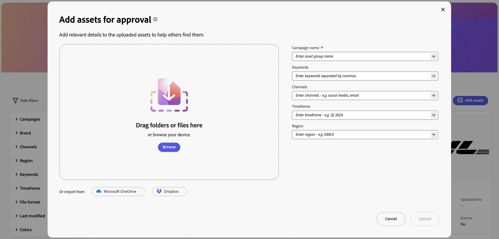

# Configurare l’interfaccia utente di Content Hub {#configure-content-hub-user-interface}

>[!CONTEXTUALHELP]
>id="configure_content_hub"
>title="Configurare l’interfaccia utente di Content Hub"
>abstract="Experience Manager Assets consente agli amministratori di configurare le opzioni disponibili nell’interfaccia utente dell’hub di contenuti. In base alle opzioni di configurazione selezionate dagli amministratori, gli utenti dell’hub di contenuti possono visualizzare i campi su di esso. Le opzioni di configurazione includono metadati durante l’importazione di risorse, filtri, proprietà delle risorse, metadati durante la ricerca di risorse, branding personalizzato ed eventuali collegamenti personalizzati."
>additional-url="https://images-tv.adobe.com/mpcv3/4477/74a81d1c-0cfe-41f4-8a06-18ff70604e45_1732023385.854x480at800_h264.mp4" text="Guarda il video"

<!--  -->

Experience Manager Assets consente agli amministratori di configurare le opzioni disponibili nell’interfaccia utente dell’hub di contenuti. In base alle opzioni di configurazione selezionate dagli amministratori, gli utenti dell’hub di contenuti possono visualizzare i campi su di esso. Le opzioni di configurazione includono:

* Filtri disponibili per gli utenti durante la ricerca di risorse.

* Dettagli della risorsa o proprietà disponibili per ciascuna risorsa.

* Campi di metadati disponibili per gli utenti quando si aggiungono risorse a Content Hub.

* Campi di metadati delle risorse disponibili per la ricerca in Content Hub.

* Contenuti di branding da visualizzare per la tua organizzazione.

* Eventuali collegamenti personalizzati da includere su Content Hub, oltre a risorse, raccolte e informazioni.

## Prerequisiti {#prerequisites-configuration-ui}

[Gli amministratori di Content Hub](/help/assets/deploy-content-hub.md#step-3-onboard-content-hub-administrator) possono impostare le opzioni di configurazione per altri utenti all&#39;interno della tua organizzazione.

## Accedere alle opzioni di configurazione in Content Hub {#access-configuration-options-content-hub}

Per accedere alle opzioni di configurazione in Content Hub:

1. Fai clic sull’icona utente nel riquadro a destra.

1. Nella sezione **[!UICONTROL Impostazioni prodotto]**, seleziona **[!UICONTROL Configurazioni]**.

   

## Gestione delle opzioni di configurazione in Content Hub {#manage-configuration-options}

In qualità di amministratore, gestisci le seguenti opzioni di configurazione per i tuoi utenti:

* [Importa](#configure-import-options-content-hub)

* [Filtri](#configure-filters-content-hub)

* [Dettagli risorsa](#configure-asset-details-content-hub)
* [Scheda risorse](#asset-card)

* [Ricerca](#configure-metadata-search-content-hub)

* [Branding](#configure-branding-content-hub)

* [Risorse scadute](#expired-assets-content-hub)

* [Rappresentazioni](#renditions-content-hub)

* [Collegamenti personalizzati](#configure-custom-links-content-hub)

* [Raccolte e condivisione](#configure-collections-content-hub)

<!--* [Enable public link sharing](#enable-public-link-sharing)-->

### Importa {#configure-import-options-content-hub}

Puoi configurare i campi di metadati che vengono visualizzati dagli utenti durante il caricamento o l’importazione delle risorse nel portale Content Hub, ad esempio Nome campagna, Parole chiave, Canali, Intervallo temporale, Area e così via. Per farlo, esegui le seguenti operazioni:

1. Nell&#39;interfaccia utente di [Configurations](#access-configuration-options-content-hub), fare clic su **[!UICONTROL Import]**.

1. Fare clic su **[!UICONTROL Aggiungi metadati]**.

1. Specifica un&#39;etichetta per la proprietà, mappala a una proprietà utilizzando il campo **[!UICONTROL Metadati]** e seleziona il tipo di input per i nuovi metadati della risorsa.

1. Fai clic sull&#39;interruttore **[!UICONTROL Campo obbligatorio]** per rendere obbligatorio il nuovo campo di metadati da specificare per gli utenti durante il caricamento di nuove risorse.

1. Fai clic su **[!UICONTROL Conferma]**. I nuovi metadati vengono visualizzati nell’elenco delle proprietà della risorsa esistenti.

1. Fai clic su **[!UICONTROL Salva]** per applicare le modifiche.

Allo stesso modo, puoi fare clic sull&#39; disponibile accanto a ciascuna proprietà disponibile per modificare le etichette, rendere questi campi obbligatori o non obbligatori per gli utenti durante il caricamento di risorse utilizzando l&#39;interruttore **[!UICONTROL Campo obbligatorio]**, oppure fare clic sull&#39;icona Elimina per eliminare qualsiasi proprietà di metadati.

Fai clic sull&#39;interruttore **[!UICONTROL Approvazione automatica]** se tutte le risorse aggiunte all&#39;archivio Experience Manager Assets devono essere approvate automaticamente in modo che siano immediatamente disponibili in Content Hub. Altrimenti, gli autori o gli amministratori di DAM devono approvare manualmente le risorse per renderle disponibili su Content Hub. Per impostazione predefinita, l&#39;interruttore è impostato sullo stato Off.

Fai clic su **[!UICONTROL Salva]** dopo aver apportato tutte le modifiche necessarie per applicarle.

I metadati sono abilitati nella visualizzazione dell’interfaccia utente di configurazione nella pagina di caricamento delle risorse:

### Filtri {#configure-filters-content-hub}

Content Hub consente agli amministratori di configurare i filtri da visualizzare durante la ricerca delle risorse. Per aggiungere un nuovo filtro, effettua le seguenti operazioni:

1. Nell&#39;interfaccia utente di [Configurations](#access-configuration-options-content-hub), fare clic su **[!UICONTROL Filters]**.

1. Fare clic su **[!UICONTROL Aggiungi filtri]**.

1. Specifica un&#39;etichetta per il filtro, mappalo su una proprietà utilizzando il campo **[!UICONTROL Metadati]** e seleziona il tipo di input per il nuovo filtro.
1. Fai clic su **[!UICONTROL Conferma]**. Il nuovo filtro viene visualizzato nell’elenco dei filtri esistenti.

1. Fai clic su **[!UICONTROL Salva]** per applicare le modifiche in modo che il nuovo filtro venga visualizzato nella pagina di ricerca durante il filtraggio delle risorse.

   >[!NOTE]
   >
   >Il nuovo filtro viene visualizzato nella pagina di ricerca solo se nell’archivio è presente almeno una risorsa che soddisfa i criteri del filtro.

Allo stesso modo, puoi fare clic sull&#39;, disponibile accanto a ciascun filtro disponibile, per modificare le etichette o fare clic sull&#39;icona Elimina per eliminare un filtro esistente. Fai clic su **[!UICONTROL Salva]** dopo aver apportato tutte le modifiche necessarie per applicarle.

I filtri abilitati nell’interfaccia utente di configurazione vengono visualizzati nella pagina Ricerca:

#### Ricerca in blocco {#bulk-search-configuration}

Per abilitare la ricerca di più risorse contemporaneamente in [!DNL Content Hub], eseguire i passaggi seguenti:

1. Nell&#39;interfaccia utente di [Configurations](#access-configuration-options-content-hub), fare clic su **[!UICONTROL Filters]**.

1. Fai clic sull&#39;accanto a ciascun filtro disponibile.

1. Attiva/disattiva **[!UICONTROL Ricerca in blocco]**. I delimitatori predefiniti `[ , | \t | \r\n | \r | \n ]` vengono visualizzati automaticamente. Inoltre, puoi anche aggiungere altri delimitatori. A questo scopo, specifica i delimitatori nella casella di input separati da `pipe symbol (|)`.

   

1. Fai clic su **[!UICONTROL Conferma]** per salvare le modifiche. Vedere [Ricerca in blocco in Content Hub](search-assets-content-hub.md#bulk-search) in azione.

### Dettagli risorsa {#configure-asset-details-content-hub}

Puoi anche configurare le proprietà della risorsa che vengono visualizzate per ogni risorsa, ad esempio il nome del file, il titolo, il formato, la dimensione e così via. Per farlo, esegui le seguenti operazioni:

1. Nell&#39;interfaccia utente delle [Configurazioni](#access-configuration-options-content-hub), fare clic su **[!UICONTROL Dettagli risorsa]**.

1. Fare clic su **[!UICONTROL Aggiungi metadati]**.

1. Specifica un&#39;etichetta per la proprietà, mappala a una proprietà utilizzando il campo **[!UICONTROL Metadati]** e seleziona il tipo di input per i nuovi metadati della risorsa.
1. Fai clic su **[!UICONTROL Conferma]**. I nuovi metadati vengono visualizzati nell’elenco delle proprietà della risorsa esistenti.

1. Fai clic su **[!UICONTROL Salva]** per applicare le modifiche in modo che la nuova proprietà venga visualizzata nella pagina dei dettagli della risorsa.

Allo stesso modo, puoi fare clic sull&#39;, disponibile accanto a ciascuna proprietà disponibile, per modificare le etichette o fare clic sull&#39;icona Elimina per eliminare i dettagli della risorsa esistente. Fai clic su **[!UICONTROL Salva]** dopo aver apportato tutte le modifiche necessarie per applicarle.

Le proprietà abilitate nell’interfaccia utente di configurazione vengono visualizzate nella pagina Dettagli risorsa:

### Scheda risorse {#asset-card}

Puoi anche configurare le proprietà dei metadati chiave da visualizzare nella **scheda risorse** fino a un massimo di 6 campi.

Esegui i seguenti passaggi per configurare le proprietà dei metadati in modo che vengano visualizzate nella **[!UICONTROL scheda delle risorse]**:

1. Nell&#39;interfaccia utente di [Configurations](#access-configuration-options-content-hub), fare clic su **Asset Card**.
2. Fare clic su **Aggiungi metadati**. Viene visualizzata la finestra di dialogo **Aggiungi metadati scheda risorse**.
3. Specifica il nome dei metadati nel campo **Etichetta** e seleziona una proprietà dei metadati nel campo **Metadati**.
4. Fai clic su **Conferma**, quindi su **Salva** per applicare le modifiche in modo che la nuova proprietà venga visualizzata nella pagina dei dettagli della risorsa.
   
Allo stesso modo, fai clic su  disponibile accanto a ciascuna proprietà disponibile, per apportare le modifiche necessarie, oppure fai clic su  per eliminare eventuali proprietà di metadati esistenti. Fai clic su **Salva** dopo aver apportato tutte le modifiche necessarie per applicarle.

### Ricerca {#configure-metadata-search-content-hub}

Gli amministratori possono definire i campi di metadati in cui eseguire le ricerche quando un utente specifica un criterio di ricerca in Content Hub. Esegui i passaggi seguenti:

1. Nell&#39;interfaccia utente di [Configurations](#access-configuration-options-content-hub), fare clic su **[!UICONTROL Aggiungi metadati]**.

1. Specificare il campo metadati e fare clic su **[!UICONTROL Conferma]**.

1. Fai clic su **[!UICONTROL Salva]** per applicare le modifiche in modo che la nuova proprietà dei metadati venga visualizzata nell&#39;elenco dei campi di metadati.

Allo stesso modo, puoi fare clic sull&#39;, disponibile accanto a ciascuna proprietà di metadati disponibile, per modificare la proprietà o fare clic sull&#39;icona Elimina per eliminare una proprietà esistente. Fai clic su **[!UICONTROL Salva]** dopo aver apportato tutte le modifiche necessarie per applicarle.

### Branding {#configure-branding-content-hub}

In qualità di amministratore, personalizzare il portale [!DNL Content Hub] per soddisfare i requisiti di branding.

Nella pagina  **[!UICONTROL Branding]** utilizza **[!UICONTROL Banner]**, **[!UICONTROL Colori]** e **[!UICONTROL Immagine banner]** per eseguire le seguenti personalizzazioni:

1. [Modifica l&#39;immagine del logo dalla sezione [!UICONTROL Immagine logo]](#Change-the-logo-image)
1. [Modifica l&#39;immagine del banner dalla sezione [!UICONTROL Immagine del banner]](#Change-the-banner-image)
1. [Aggiorna il titolo e il corpo del testo nel banner e cambia il colore del testo dalla sezione [!UICONTROL Banner]](#Add-title-and-body-text-to-your-banner-and-change-the-text-color)
1. [Modifica il colore primario e secondario dalla sezione [!UICONTROL Colori] per applicare una combinazione di colori che sia allineata al tema del tuo marchio](#Change-the-primary-and-secondary-color)

Seleziona l&#39;opzione **[!UICONTROL Reimposta valori predefiniti]** per ripristinare le modifiche e il tema predefinito.

#### Modificare l&#39;immagine del logo{#change-the-logo-image}

Nella pagina  **[!UICONTROL Branding]**, esegui i seguenti passaggi per modificare l&#39;immagine del logo della distribuzione di [!DNL Content Hub]:

1. Fai clic su  **[!UICONTROL Seleziona immagine]** per selezionare un&#39;immagine logo utilizzando la finestra di dialogo del selettore risorse. Il selettore risorse visualizza solo le immagini approvate.
1. Seleziona l&#39;immagine, fai clic su **[!UICONTROL Seleziona]**, quindi fai clic su **[!UICONTROL Salva]** per visualizzarla come immagine del logo della distribuzione di [!DNL Content Hub].
   

#### Modificare l&#39;immagine del banner{#Change-the-banner-image}

Nella pagina  **[!UICONTROL Branding]**, esegui i seguenti passaggi per modificare l&#39;immagine del banner della distribuzione di [!DNL Content Hub]:

1. Fai clic su  **[!UICONTROL Seleziona dalla raccolta]** per selezionare un&#39;immagine del banner utilizzando la finestra di dialogo del selettore risorse. Il selettore risorse visualizza solo le immagini approvate.
1. Seleziona l&#39;immagine, fai clic su **[!UICONTROL Seleziona]** e quindi su **[!UICONTROL Salva]** per visualizzarla come immagine del banner della distribuzione di [!DNL Content Hub].
   

>[!NOTE]
>
> * Le dimensioni consigliate per **Immagine banner** sono `height = 200 to 450px` e `width = 1920 to 2560px`.
> * Le dimensioni consigliate per **Immagine logo** sono `height = 80 to 120px` e `width = 120 to 200px`.
> * I **tipi MIME supportati** per le immagini del banner e del logo sono `'JPG', value: 'image/jpeg'`, `'PNG', value: 'image/png'`, `'WEBP', value: 'image/webp'`, `'TIFF', value: 'image/tiff'`, `'SVG', value: 'image/svg+xml'`, `'GIF', value: 'image/gif'`.

#### Aggiungere titolo e corpo del testo al banner e modificare il colore del testo{#Add-title-and-body-text-to-your-banner-and-change-the-text-color}

Nella pagina  **[!UICONTROL Branding]**, utilizza i rispettivi campi nella sezione **[!UICONTROL Banner]** per aggiungere il titolo e il corpo del testo al banner.
Fare clic sulla casella quadrata accanto al **[!UICONTROL colore del testo del banner]** per selezionare un colore del testo dal selettore del colore per il testo del banner o specificare il codice esadecimale del colore nel campo accanto alla casella quadrata del selettore del colore.

#### Modificare il colore primario e secondario{#Change-the-primary-and-secondary-color}

Nella pagina  **[!UICONTROL Branding]**, utilizza la sezione **[!UICONTROL Colori]** per impostare i colori primari e secondari selezionandoli tramite il selettore colore o definendo il codice esadecimale del colore. Questi colori consentono di impostare i colori dello sfondo, del testo e delle icone degli elementi dell&#39;interfaccia utente in modo da allineare l&#39;interfaccia utente di [!DNL Content Hub] al tema del tuo marchio.

**[!UICONTROL Colore primario]:** La combinazione di colori principale si applica alle azioni di selezione, agli elementi interattivi quali caselle di controllo, barre di ricerca e agli interruttori tra [!DNL Content Hub], inclusi [!DNL Content Hub] home page e [!UICONTROL Configurazione] pagina. Si applica anche alle opzioni di azione disponibili sulle interfacce primarie [!DNL Content Hub], ad esempio le opzioni disponibili su **[!UICONTROL Tutte le pagine Assets]** e **[!UICONTROL Raccolte]**.

**[!UICONTROL Colore secondario]:** Nella home page di [!DNL Content Hub], la combinazione di colori secondaria si applica alle opzioni dell&#39;interfaccia utente e ai campi di input disponibili nelle finestre di dialogo. Si applica a tutte le opzioni del menu di configurazione disponibili nella pagina [!UICONTROL Configurazione], ad eccezione delle azioni di selezione, delle caselle di controllo, delle barre di ricerca e dei pulsanti di attivazione/disattivazione.

### Visibilità risorsa{#asset-visibility-content-hub}

Gli amministratori possono controllare se le risorse scadute devono essere visibili in Content Hub. Inoltre, se le risorse scadute vengono rese visibili, possono definire se gli utenti potranno scaricarle.

Per impostazione predefinita, le risorse scadute non vengono visualizzate in Content Hub.

Per farlo, esegui le seguenti operazioni:

1. Nell&#39;interfaccia utente delle [Configurazioni](#access-configuration-options-content-hub), fare clic su **[!UICONTROL Visibilità risorsa]**.

1. Nella sezione **[!UICONTROL Visibile]**, abilita l&#39;interruttore **[!UICONTROL Consenti agli utenti di visualizzare le risorse scadute]** per rendere visibili in Content Hub tutte le risorse scadute.

1. Dopo aver abilitato la visibilità delle risorse, puoi abilitare o disabilitare la possibilità di scaricare risorse scadute utilizzando l&#39;interruttore **[!UICONTROL Consenti agli utenti di scaricare risorse scadute]**.
1. Abilita l&#39;opzione **[!UICONTROL Consenti agli utenti di visualizzare le risorse approvate per la consegna]** per visualizzare tutte le risorse approvate per la consegna in Content Hub.
1. Fai clic su **[!UICONTROL Salva]** per applicare le modifiche.

   

Dopo aver abilitato la visibilità delle risorse, puoi visualizzare le risorse scadute su Content Hub, come illustrato nell’immagine seguente:

Se l’amministratore ha abilitato il download, gli utenti di Content Hub possono anche scaricarlo, come evidenziato nell’immagine.

Se è abilitata la visibilità delle risorse scadute, Content Hub evidenzia anche le risorse che scadono nei successivi 15 giorni utilizzando il messaggio `Expiring in n days` nella scheda delle risorse.

### Rappresentazioni {#renditions-content-hub}

Le rappresentazioni sono versioni personalizzate delle risorse digitali, ad esempio immagini, documenti e così via, progettate per diversi dispositivi e piattaforme per garantire prestazioni ottimali. Ulteriori informazioni sulle [copie trasformate in Adobe Experience Manager Assets](https://experienceleague.adobe.com/en/docs/experience-manager-cloud-service/content/assets/assets-view/renditions).

Per farlo, esegui le seguenti operazioni:

Nell&#39;interfaccia utente delle [Configurazioni](#access-configuration-options-content-hub), fare clic su **[!UICONTROL Rappresentazioni]**. Sono disponibili le seguenti opzioni:

* Attiva l&#39;interruttore [!UICONTROL Attiva disponibilità copie trasformate] per rendere visibili tutte le copie trasformate in Content Hub.

* Abilita o disabilita **[!UICONTROL Consenti agli utenti di scaricare risorse originali]** per controllare la disponibilità del download di risorse originali.

  

Per informazioni su come visualizzare e scaricare le rappresentazioni in Content Hub, vedi [scaricare risorse in Content Hub](/help/assets/download-assets-content-hub.md).

### Collegamenti personalizzati {#configure-custom-links-content-hub}

Puoi anche aggiungere schede personalizzate in aggiunta alle schede standard **[!UICONTROL Tutte le schede Assets]**, **[!UICONTROL Raccolte]** e **[!UICONTROL Informazioni]** sul portale Content Hub immediatamente sotto il banner. Per farlo, esegui le seguenti operazioni:

1. Nell&#39;interfaccia utente delle [Configurazioni](#access-configuration-options-content-hub), fare clic su **[!UICONTROL Collegamenti personalizzati]**.

1. Fare clic su **[!UICONTROL Aggiungi collegamento]**.

1. Specifica il testo nei campi **[!UICONTROL Etichetta]** e **[!UICONTROL URL]**. L&#39;etichetta definita viene visualizzata come scheda e quando si fa clic sull&#39;etichetta, si passa all&#39;URL definito nel campo **[!UICONTROL URL]**.

1. Fai clic su **[!UICONTROL Conferma]**.

1. Fai clic su **[!UICONTROL Salva]** per applicare le modifiche.

Allo stesso modo, puoi fare clic sull&#39;, disponibile accanto a ciascun URL, per modificare i collegamenti o fare clic sull&#39;icona Elimina per eliminare eventuali URL esistenti. Fai clic su **[!UICONTROL Salva]** dopo aver apportato tutte le modifiche necessarie per applicarle.

Il collegamento personalizzato viene visualizzato come una nuova scheda accanto alla scheda Approfondimenti nella home page di Content Hub.

### Raccolte e condivisione {#configure-collections-content-hub}

Gli amministratori possono definire le autorizzazioni utente durante la creazione delle raccolte. Per abilitare queste impostazioni, effettua le seguenti operazioni:

1. Nell&#39;interfaccia utente delle [Configurazioni](#access-configuration-options-content-hub), fare clic su **[!UICONTROL Raccolte]**.

1. Abilita l&#39;interruttore **[!UICONTROL Abilita collegamento pubblico]** per consentire la creazione di collegamenti pubblici che gli utenti esterni possono utilizzare per accedere e scaricare risorse senza effettuare l&#39;accesso a Content Hub.

1. Attiva l&#39;opzione **[!UICONTROL Visualizza solo raccolte]** per consentire raccolte accessibili a tutti ma modificabili solo dall&#39;autore e dall&#39;amministratore.

1. Attiva l&#39;opzione **[!UICONTROL Raccolte pubbliche]** per consentire a tutti gli utenti di accedere e modificare le raccolte. Se le opzioni **[!UICONTROL Visualizza solo raccolte]** e **[!UICONTROL Raccolte pubbliche]** sono disabilitate, per impostazione predefinita gli utenti non amministratori possono creare solo raccolte private.

1. Fai clic su **[!UICONTROL Salva]** per applicare le modifiche.

   

<!--
### Enable public link sharing {#enable-public-link-sharing}

Enable the following setting on the Configurations user interface to allow Content Hub users to generate a public link:

1. On the [Configurations](#access-configuration-options-content-hub) user interface, click **[!UICONTROL Collections and Sharing]**.

1. Enable the **[!UICONTROL Enable Public Link]** toggle and click **[!UICONTROL Save]** to apply the changes.

    

-->

Ulteriori informazioni sulla condivisione di [risorse in [!DNL Content Hub]](share-assets-content-hub.md).

