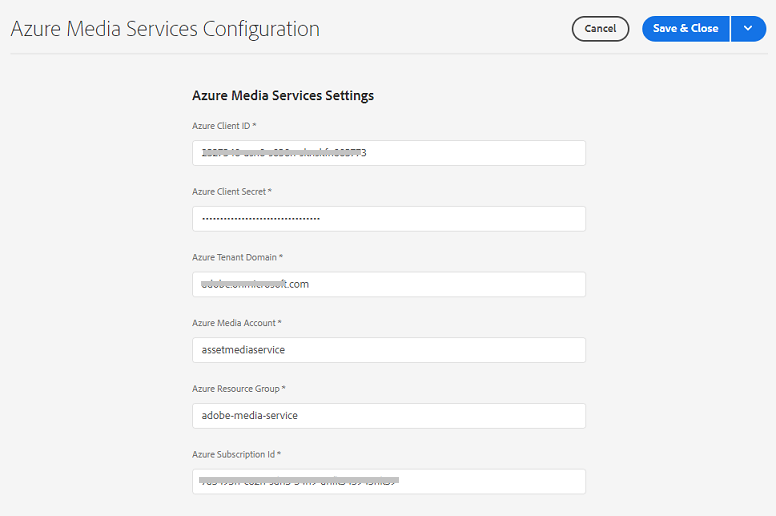

# Configura la trascrizione in [!DNL Experience Manager Assets] {#configure-transcription-service}

La trascrizione è il processo di traduzione dell&#39;audio da un file audio o video in testo (da un discorso al testo) utilizzando la tecnologia di riconoscimento vocale.
[!DNL Adobe Experience Manager Assets] è configurato con [!DNL Azure Media Services] che genera automaticamente la trascrizione testuale della lingua parlata in un file audio o video supportato in formato WebVTT (.vtt). Quando una risorsa audio o video viene elaborata in [!DNL Experience Manager Assets], il servizio di trascrizione genera automaticamente il rendering della trascrizione testuale della risorsa audio o video e la memorizza nella stessa posizione all’interno dell’archivio Assets in cui risiede la risorsa originale. La [!DNL Experience Manager Assets] Il servizio di trascrizione consente agli addetti al marketing di gestire in modo efficace i contenuti audio e video con l’aggiunta della possibilità di individuare i contenuti testuali e di aumentare il ROI di tali risorse, sostenendo l’accessibilità e la localizzazione.

Le trascrizioni sono versioni testuali del contenuto parlato; un esempio è un filmato che visualizzi su qualsiasi piattaforma OTT e che spesso include didascalie o sottotitoli per facilitarne l’accessibilità o per consumarne il contenuto in altre lingue. O qualsiasi file audio o video utilizzato per scopi di marketing, apprendimento o intrattenimento. Queste esperienze iniziano con una trascrizione che viene quindi formattata o tradotta come appropriato. La trascrizione di audio o video è un processo che richiede molto tempo ed è soggetto a errori quando viene eseguito manualmente. È anche una sfida scalare il processo manuale, data la crescente necessità di contenuti audio-video. [!DNL Experience Manager Assets] utilizza la trascrizione basata sull’intelligenza artificiale di Azure che consente l’elaborazione su larga scala delle risorse audio e video e genera le trascrizioni di testo (file .vtt) insieme ai dettagli delle marche temporali. Oltre alle risorse, la funzione di trascrizione è supportata anche con Dynamic Media.

La funzione di trascrizione è disponibile senza alcun costo in [!DNL Experience Manager Assets]. Tuttavia, gli amministratori richiedono le credenziali di Azure dell’utente per configurare il servizio di trascrizione in [!DNL Experience Manager Assets]. È inoltre possibile [ottenere le credenziali di prova](https://azure.microsoft.com/en-us/pricing/details/media-services/) direttamente da Microsoft® per scoprire la funzione di trascrizione audio o video in Assets.

## Prerequisiti per la trascrizione {#prerequisites}

1. Un&#39;operazione in corso [!DNL Experience Manager Assets as a Cloud Service] istanza.
1. Le seguenti credenziali di Azure sono necessarie per la configurazione in [!DNL Experience Manager Assets]:

   * ID client (chiave API)
   * Chiave segreto client
   * Endpoint tenant (dominio)
   * Account multimediale
   * Gruppo risorse
   * ID sottoscrizione

   Vedi [Documentazione di Azure](https://docs.microsoft.com/en-us/azure/media-services/latest/access-api-howto?tabs=portal) per ottenere le credenziali per accedere all’API di Azure Media Services.

1. Assicurati che l’account Azure disponga di crediti sufficienti per elaborare le nuove richieste.

## Configura la trascrizione in [!DNL Experience Manager Assets] {#configure-transcription}

Di seguito sono riportate le configurazioni necessarie per abilitare la funzione di trascrizione in [!DNL Experience Manager Assets]:

1. [Configurare Azure Media Services](#configure-azure-media-service)
1. [Configurare il profilo di elaborazione per la trascrizione audio/video](#configure-processing-profile-for-transcription)

### Configurare Azure Media Services {#configure-azure-media-services}

[!DNL Experience Manager Assets] utilizza [!DNL Azure Media Services] che genera automaticamente le trascrizioni testuali della lingua parlata in un [file audio o video supportati](#supported-file-formats-for-transcription) nel formato WebVTT (.vtt). Gli amministratori possono configurare [!DNL Azure Media Services] in [!DNL Experience Manager Assets] utilizzo delle credenziali di Azure. La [prerequisiti per la trascrizione](#transcription-prerequisites) elencare [!DNL Azure] credenziali necessarie per la configurazione. Se non hai [!DNL Azure] account e credenziali, vedi [Documentazione di Azure Media Services](https://azure.microsoft.com/en-us/pricing/details/media-services/) per ottenere le credenziali di prova.

Vai a **[!UICONTROL Strumenti]** > **[!UICONTROL Cloud Services]** > **[!UICONTROL Configurazione di Azure Media Services]**. Seleziona una cartella (posizione) dalla barra a sinistra e fai clic sul [!UICONTROL Crea] per configurare la connessione con il [!DNL Azure] conto. Questa cartella è il percorso in cui [!DNL Azure] la configurazione cloud è memorizzata in Experience Manager Assets. Inserisci il [!DNL Azure] credenziali e fai clic su **[!UICONTROL Salva e chiudi]**.

### Configura il profilo di elaborazione per la trascrizione {#configure-processing-profile}

Una volta che [!DNL Azure Media Services] In Experience Manager Assets, il passaggio successivo consiste nel creare un profilo di elaborazione delle risorse per generare la trascrizione basata sull’intelligenza artificiale delle risorse audio e video. Il profilo di elaborazione basato sull’intelligenza artificiale genera le trascrizioni del [risorsa audio o video supportata](#supported-file-formats-for-transcription) come rendering in Experience Manager Assets e memorizza la trascrizione (file .vtt) nella stessa cartella in cui si trova la risorsa originale. Pertanto, è più facile per gli utenti cercare e individuare la risorsa e il suo rendering di trascrizione.

Vai a **[!UICONTROL Strumenti]** > **[!UICONTROL Risorse]** > **[!UICONTROL Profili di elaborazione]** e fai clic su **[!UICONTROL Crea]** per creare un profilo di elaborazione basato sull’intelligenza artificiale per generare la trascrizione dei file audio e video. Per impostazione predefinita, la pagina del profilo di elaborazione presenta solo tre schede (Immagine, Video e Personalizzato). Tuttavia, un **[!UICONTROL Content AI]** se hai configurato [!DNL Azure Media Services] nel tuo [!DNL Experience Manager Assets] istanza. Verifica la tua [!DNL Azure] se non visualizzi le **[!UICONTROL Content AI]** durante la creazione di un profilo di elaborazione.

In **[!UICONTROL Content AI]** , fai clic su **[!UICONTROL Aggiungi nuovo]** per configurare la trascrizione. In questo caso è possibile includere ed escludere i formati di file (tipi MIME) per la generazione delle trascrizioni selezionando i tipi di file dall’elenco a discesa. Nell’illustrazione seguente, tutti i file audio e video supportati sono inclusi e i file di testo sono esclusi.

Abilita la **[!UICONTROL Creare una trascrizione VTT nella stessa directory]** per creare e memorizzare il rendering della trascrizione (file .vtt) nella stessa cartella in cui si trova la risorsa originale. Le altre rappresentazioni vengono generate anche dal flusso di lavoro di elaborazione delle risorse DAM predefinito, indipendentemente da questa impostazione.

La figura seguente descrive un profilo video personalizzato creato in Experience Manager Assets.

Il profilo video contiene anche le seguenti configurazioni personalizzate. Vedi [documentazione del profilo di elaborazione](/help/assets/asset-microservices-configure-and-use.md) per informazioni dettagliate su come creare un profilo di elaborazione personalizzato.

Ora configuriamo la trascrizione in questo profilo video. Passa a **[!UICONTROL Content AI]** e fai clic su **[!UICONTROL Aggiungi nuovo]** pulsante . Includi tutti i file audio e video ed escludi i file di immagine e di applicazione. Abilita la **[!UICONTROL Creare una trascrizione VTT nella stessa directory]** attiva e salva la configurazione.

Una volta configurato il profilo di elaborazione per la trascrizione di file audio e video, puoi applicare questo profilo di elaborazione alle cartelle utilizzando uno dei seguenti metodi:

* Seleziona una definizione di profilo di elaborazione in **[!UICONTROL Strumenti]** > **[!UICONTROL Risorse]** > **[!UICONTROL Profili di elaborazione]** e utilizza **[!UICONTROL Applica profilo a cartelle]** azione. Il browser del contenuto ti consente di passare a una cartella specifica, di selezionare una cartella e di confermare l’applicazione del profilo.
* Seleziona una cartella nell’interfaccia utente Assets e fai clic su **[!UICONTROL Proprietà]** per aprire le proprietà della cartella. Fai clic sul pulsante **[!UICONTROL Elaborazione delle risorse]** e seleziona il profilo di elaborazione appropriato per la cartella dalla scheda **[!UICONTROL Profilo di elaborazione]** elenco. Per salvare le modifiche, fai clic su **[!UICONTROL Salva e chiudi]**.

   

* Per applicare un profilo di elaborazione, gli utenti possono selezionare cartelle o risorse specifiche nell’interfaccia utente di Assets, quindi selezionare **[!UICONTROL Rielaborazione delle risorse]** tra le opzioni disponibili nella parte superiore.

>[!TIP]
>A una cartella può essere applicato un solo profilo di elaborazione.
>
>Dopo aver applicato un profilo di elaborazione a una cartella, tutte le nuove risorse caricate (o aggiornate) in questa cartella o in una delle sue sottocartelle vengono elaborate utilizzando il profilo di elaborazione aggiuntivo configurato. Questa elaborazione si aggiunge al profilo predefinito standard.

>[!NOTE]
>
>Un profilo di elaborazione applicato a una cartella funziona per l’intera struttura, tuttavia, può essere sostituito con un altro profilo applicato a una sottocartella.
>
>Quando le risorse vengono caricate in una cartella, Experience Manager comunica con le proprietà della cartella contenitore per identificare il profilo di elaborazione. Se non viene applicata alcuna applicazione, viene controllata una cartella padre nella gerarchia per verificare la presenza di un profilo di elaborazione da applicare.

## Generare la trascrizione delle risorse audio o video {#generate-transcription}

Quando si elabora una risorsa video, la [Profilo di elaborazione basato sull’intelligenza artificiale](#configure-processing-profile-for-transcription) genera automaticamente la trascrizione (file .vtt) come copia trasformata insieme alla risorsa originale nella stessa cartella.

Puoi anche vedere il rendering della trascrizione accedendo alle rappresentazioni della risorsa video originale. Per accedere al **[!UICONTROL Rendering]** seleziona la risorsa video originale e apri la barra a sinistra. Puoi vedere che il rendering della trascrizione (file .vtt) è visibile sotto il **[!UICONTROL TRANSCRIPTVTT]** testa.

Puoi scaricare la trascrizione (file di testo .vtt) direttamente dalla cartella come una rappresentazione separata della risorsa o dall’interno della **[!UICONTROL Rendering]** pannello della risorsa originale scaricando tutte le rappresentazioni della risorsa.

Attualmente, Experience Manager non supporta l’anteprima full text o la modifica nativa di file VTT. Tuttavia, puoi scaricare il rendering della trascrizione e utilizzare qualsiasi editor di testo per modificare o verificare la trascrizione. La trascrizione riflette la lingua parlata come testo alla data e ora nel video con il punteggio di affidabilità (precisione) della trascrizione.

## Utilizzo della trascrizione in Dynamic Media {#using-transcription-in-dynamic-media}

Se [Dynamic Media configurato](/help/assets/dynamic-media/config-dm.md) nell’istanza di Experience Manager Assets, puoi pubblicare la risorsa (file audio o video) e la relativa trascrizione (file .vtt) in Dynamic Media. In questo modo, la risorsa originale (file audio o video) e il relativo rendering trascritto (file .vtt) vengono pubblicati in Dynamic Media nella stessa cartella. L’amministratore di Dynamic Media può [abilita esperienza con CC Closed Caption](/help/assets/dynamic-media/video.md#adding-captions-to-video) per il file audio o video che utilizza il rendering della trascrizione (file .vtt).

Consulta anche:

* [Video tutorial su come aggiungere sottotitoli codificati CC a video Dynamic Media](https://experienceleague.adobe.com/docs/experience-manager-learn/assets/dynamic-media/dynamic-media-overview-feature-video-use.html#add-cc-closed-captioning-to-dynamic-media-video)
* [Pubblicare video Dynamic Media in YouTube](/help/assets/dynamic-media/video.md#publishing-videos-to-youtube)

Nell’illustrazione seguente, l’URL riflette la parte della didascalia che fa riferimento alla trascrizione (file .vtt). Il video riflette la lingua parlata (testo trascritto) come **[!UICONTROL Didascalia chiusa]** alla data e ora specificate nel video. L’utente può abilitare o disabilitare la didascalia utilizzando la variabile **[!UICONTROL CC]** pulsante .

## Formati di file supportati per la trascrizione {#supported-file-format}

La trascrizione supporta i seguenti formati di file audio e video:

| Formati audio/video supportati | Estensioni |
|----|----|
| FLV (con codec H.264 e AAC) | (.flv) |
| MXF | (.mxf) |
| MPEG2-PS, MPEG2-TS, 3GP | (.ts, .ps, .3gp, .3gpp, .mpg) |
| Windows Media Video (WMV)/ASF | (.wmv, .asf) |
| AVI (non compresso 8 bit/10 bit) | (.avi) |
| MP4 | (.mp4, .m4a, .m4v) |
| Registrazione video digitale Microsoft® (DVR-MS) | (.dvr-ms) |
| Matroska/WebM | (.mkv) |
| WAVE/WAV | (.wav) |
| QuickTime | (.mov) |

>[!NOTE]
>
>Le risorse (file audio o video) di tipo applicazione non sono supportate per la trascrizione.

## Limitazioni note {#known-limitations}

* La funzione di trascrizione è supportata per video di durata fino a 10 minuti.
* La lunghezza del titolo del video deve essere inferiore a 80 caratteri.
* La dimensione del file supportato è fino a 15 GB.
* La durata massima di elaborazione supportata è di 60 minuti.
* In un pagamento [!DNL Azure] account, puoi caricare fino a 50 filmati al minuto. Tuttavia, in un account di prova puoi caricare fino a cinque filmati al minuto.

## Suggerimenti per la risoluzione dei problemi {#troubleshooting}

Accedi al tuo [!DNL Azure Media Services] account con le stesse credenziali (utilizzate per la configurazione) per verificare lo stato della richiesta. Contatto [!DNL Azure] supporto se la richiesta non viene elaborata correttamente.

