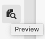

# Anteprima - Rappresentazione JSON {#preview-json-representation}

Durante lo sviluppo di modelli per frammenti di contenuto come parte dell’implementazione AEM headless, potrebbe essere utile visualizzare un output JSON di esempio per un frammento di contenuto, in base a un modello. Ad esempio, per avere un’idea dell’aspetto dell’output finale. Questo potrebbe essere utile durante la convalida della struttura JSON del modello, con contenuto di esempio predefinito per tipo di dati.

>[!NOTE]
>
>I frammenti di contenuto sono una funzione di Sites, ma vengono memorizzati come **Risorse**.
>
>Esistono due editor per l’authoring dei frammenti di contenuto; anche se la funzionalità di base è la stessa, esistono alcune differenze. Questa sezione tratta l&#39;editor originale, a cui si accede principalmente dalla console **Assets**. Per informazioni dettagliate sul nuovo editor, a cui si accede principalmente dalla console [Frammenti di contenuto](/help/sites-cloud/administering/content-fragments/authoring.md), consulta la documentazione di Sites **Frammenti di contenuto - Authoring**.

Utilizzo dell’icona **Anteprima**:

Puoi visualizzare la rappresentazione JSON del frammento corrente. Esempio:

<!--
**Copy URL** lets you copy to clipboard the URL for either author or publish.
-->