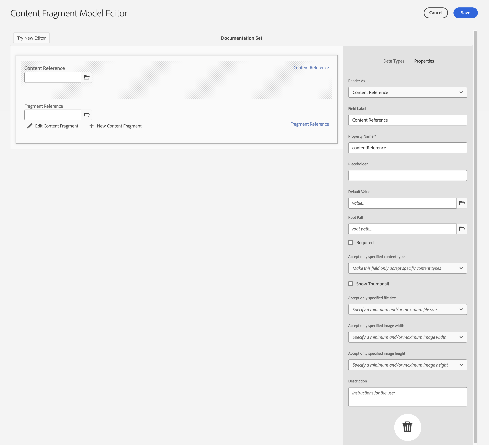

# Modelli per frammenti di contenuto {#content-fragment-models}

>[!CAUTION]
>
>L&#39;API AEM GraphQL per la distribuzione dei frammenti di contenuto è disponibile su richiesta.
>
>Per abilitare l&#39;API per il AEM come programma di Cloud Service, contattate il supporto di [ Adobe](https://experienceleague.adobe.com/?lang=en&amp;support-solution=General#support).

I modelli di frammenti di contenuto definiscono la struttura del contenuto per i [frammenti di contenuto](/help/assets/content-fragments/content-fragments.md).

Per utilizzare i modelli di frammenti di contenuto, effettuare le seguenti operazioni:

1. [Abilitare la funzionalità del modello di frammento di contenuto per l’istanza](/help/assets/content-fragments/content-fragments-configuration-browser.md)
1. [Creare](#creating-a-content-fragment-model) e  [configurare](#defining-your-content-fragment-model) i modelli di frammenti di contenuto
1. [Abilitare i ](#enabling-disabling-a-content-fragment-model) modelli di frammenti di contenuto per la creazione di frammenti di contenuto da utilizzare durante la creazione di frammenti di contenuto

## Creazione di un modello di frammento di contenuto {#creating-a-content-fragment-model}

1. Andate a **Strumenti**, **Risorse**, quindi aprite **Modelli di frammenti di contenuto**.
1. Andate alla cartella appropriata per la [configurazione](/help/assets/content-fragments/content-fragments-configuration-browser.md).
1. Utilizzare **Create** per aprire la procedura guidata.

   >[!CAUTION]
   >
   >Se l&#39;utilizzo di [modelli di frammento di contenuto non è stato abilitato](/help/assets/content-fragments/content-fragments-configuration-browser.md), l&#39;opzione **Crea** non sarà disponibile.

1. Specifica il **Titolo modello**. È inoltre possibile aggiungere **Tag** e **Descrizione** se necessario.

   

1. Utilizzare **Create** per salvare il modello vuoto. Un messaggio indica l&#39;esito positivo dell&#39;azione, è possibile selezionare **Apri** per modificare immediatamente il modello, oppure **Fine** per tornare alla console.

## Definizione del modello di frammento di contenuto {#defining-your-content-fragment-model}

Il modello di frammento di contenuto definisce in modo efficace la struttura dei frammenti di contenuto risultanti utilizzando una selezione di **[Tipi di dati](#data-types)**. Utilizzando l&#39;editor modelli è possibile aggiungere istanze dei tipi di dati, quindi configurarle per creare i campi richiesti:

>[!CAUTION]
>
>La modifica di un modello di frammento di contenuto esistente può avere un impatto sui frammenti dipendenti.

1. Andate a **Strumenti**, **Risorse**, quindi aprite **Modelli di frammenti di contenuto**.

1. Individuate la cartella che contiene il modello di frammento di contenuto.
1. Aprire il modello richiesto per **Edit**; utilizzare l&#39;azione rapida oppure selezionare il modello e quindi l&#39;azione dalla barra degli strumenti.

   Una volta aperto l&#39;editor modelli mostra:

   * left: campi già definiti
   * A destra: **Tipi di dati** disponibili per la creazione di campi, oltre alle **Proprietà** da utilizzare dopo la creazione.

   >[!NOTE]
   >
   >Quando un campo è **obbligatorio**, l’**Etichetta** indicata nel riquadro a sinistra sarà contrassegnata con un asterisco (*****).

1. **Aggiunta di un campo**

   * Trascinare un tipo di dati richiesto nella posizione desiderata per un campo.

   * Una volta aggiunto un campo al modello, il pannello a destra mostrerà le **Proprietà** che possono essere definite per quel particolare tipo di dati. Qui è possibile definire i requisiti necessari per tale campo.
Molte proprietà sono autoesplicative, per ulteriori dettagli vedere [Proprietà](#properties).

1. **Rimozione di un campo**

   Selezionate il campo desiderato, quindi toccate o fate clic sull&#39;icona del cestino. Viene richiesto di confermare l’operazione.

1. Aggiungete tutti i campi obbligatori e definite le relative proprietà, a seconda delle necessità.

1. Selezionare **Save** per mantenere la definizione.

<!--
## Defining your Content Fragment Model {#defining-your-content-fragment-model}

The content fragment model effectively defines the structure of the resulting content fragments using a selection of **[Data Types](#data-types)**. Using the model editor you can add instances of the data types, then configure them to create the required fields:

>[!CAUTION]
>
>Editing an existing content fragment model can impact dependent fragments.

1. Navigate to **Tools**, **Assets**, then open **Content Fragment Models**.

1. Navigate to the folder holding your content fragment model.
1. Open the required model for **Edit**; use either the quick action, or select the model and then the action from the toolbar.

   Once open the model editor shows:

    * left: fields already defined
    * right: **Data Types** available for creating fields (and **Properties** for use once fields have been created)

   >[!NOTE]
   >
   >When a field as **Required**, the **Label** indicated in the left pane will be marked with an asterix (**&#42;**).

   

1. **To Add a Field**

    * Drag a required data type to the required location for a field:

      

    * Once a field has been added to the model, the right panel will show the **Properties** that can be defined for that particular data type. Here you can define what is required for that field. 
      Many properties are self-explanatory, for additional details see [Properties](#properties).
      For example:

      

1. **To Remove a Field**

   Select the required field, then click/tap the trash-can icon. You will be asked to confirm the action.

   

1. Add all required fields, and define the related properties, as required. For example:

   

1. Select **Save** to persist the definition.
-->

## Tipi di dati {#data-types}

È disponibile una selezione di tipi di dati per definire il modello:

* **Testo su riga singola**
   * aggiungere uno o più campi di una singola riga di testo; la lunghezza massima può essere definita
* **Testo su più righe**
   * Un&#39;area di testo che può essere RTF, Testo normale o Marcatura
* **Numero**
   * Aggiungere uno o più campi numerici
* **Booleano**
   * Aggiungi una casella di controllo booleana
* **Data e ora**
   * Aggiungere una data e/o un’ora
* **Enumerazione**
   * Aggiungere un set di caselle di controllo, pulsanti di scelta o campi a discesa
* **Tag**
   * Consente agli autori dei frammenti di accedere e selezionare le aree dei tag
* **Riferimento contenuto**
   * riferimenti ad altri contenuti di qualsiasi tipo; può essere utilizzato per [creare contenuto nidificato](#using-references-to-form-nested-content)

<!--
* **Fragment Reference**
  * References other content fragments; can be used to [create nested content](#using-references-to-form-nested-content)
  * The data type can be configured to allow fragment authors to:
    * Edit the referenced fragment directly.
    * Create a new content fragment, based on the appropriate model  
* **JSON Object**
  * Allows the content fragment author to enter JSON syntax into the corresponding elements of a fragment. 
    * To allow AEM to store direct JSON that you have copy/pasted from another service.
    * The JSON will be passed through, and output as JSON in GraphQL.
    * Includes JSON syntax-highlighting, auto-complete and error-highlighting in the content fragment editor.
-->

## Proprietà {#properties}

Molte proprietà sono auto-esplicative, per alcune proprietà ulteriori dettagli sono di seguito:

* **Rendering**
con nome: varie opzioni per realizzare/eseguire il rendering del campo in un frammento. Spesso questo consente di definire se l’autore visualizzerà una singola istanza del campo o se potrà creare più istanze.

* **Etichetta**
campoImmissione di un 
**L&#39;** etichetta campo genererà automaticamente un nome **** proprietà, che potrà quindi essere aggiornato manualmente, se necessario.

* **La convalida**
ValidationBasic è disponibile tramite meccanismi quali la proprietà  **** Requiredproperty. Alcuni tipi di dati dispongono di campi di convalida aggiuntivi. Per ulteriori informazioni, vedere [Convalida](#validation).

* Per il tipo di dati **Testo su più righe** è possibile definire il **Tipo predefinito** come:

   * **Formato RTF**
   * **Markdown**
   * **Testo normale**

   Se non viene specificato, per questo campo viene utilizzato il valore predefinito **Rich Text**.

   La modifica del **Tipo predefinito** in un modello per frammenti di contenuto avrà effetto solo su un frammento esistente correlato, una volta che il frammento è stato aperto nell’editor e successivamente salvato.

<!--
* **Translatable**
  Checking the "Translatable" checkbox on a field in CF model editor will

  * Ensure the field's property name is added in translation config, context `/content/dam/<tenant>`, if not already present. 
  * For GraphQL: set a `<translatable>` property on the Content Fragment field to `yes`, to allow GraphQL query filter for JSON output with only translatable content.

* See **[Fragment Reference (Nested Fragments)](#fragment-reference-nested-fragments)** for more details about that specific data type and its properties.
-->

## Convalida {#validation}

Diversi tipi di dati ora includono la possibilità di definire i requisiti di convalida per l&#39;immissione di contenuto nel frammento risultante:

* **Testo su riga singola**
   * Confrontate con un regex predefinito.
* **Numero**
   * Verificate la presenza di valori specifici.

<!--
* **Content Reference**
  * Test for specific types of content.
  * Only images within a predefined range of width and height (in pixels) can be referenced. 
  * Only assets of specified file size or smaller can be referenced. 
  * Only predefined file types can be referenced.
  * No more than the predefined number of assets can be referenced. 
  * No more than the predefined number of fragments can be referenced.
* **Fragment Reference**
  * Test for a specific content fragment model.
-->

<!--
## Using References to form Nested Content {#using-references-to-form-nested-content}

Content Fragments can form nested content, using either of the following data types:

* **[Content Reference](#content-reference)**
  * Provides a simple reference to other content; of any type.
  * Can be configured for a one or multiple references (in the resulting fragment).

* **[Fragment Reference](#fragment-reference-nested-fragments)** (Nested Fragments)
  * References other fragments, dependent on the specific models specified.
  * Allows you to include/retrieve structured data.
    >[!NOTE]
    >
    >This method is of particular interest in conjunction with [Headless Content Delivery using Content Fragments with GraphQL](/help/assets/content-fragments/content-fragments-graphql.md).
  * Can be configured for one or multiple references (in the resulting fragment)..

>[!NOTE]
>
>AEM has a recurrence protection for:
>
>* Content References
>  This prevents the user from adding a reference to the current fragment. This may lead to an empty Fragment Reference picker dialog.
>
>* Fragment References in GraphQL 
>  If you create a deep query that returns multiple Content Fragments referenced by each another, it will return null at first occurence.

### Content Reference {#content-reference}

The Content Reference allows you to render content from another source; for example, image or content fragment.

In addition to standard properties you can specify:

* The **Root Path** for any referenced content.
* The content types that can be referenced.
* Limitations for file sizes.
* Image restraints.
-->

<!-- Check screenshot - might need update

   
-->

<!--
### Fragment Reference (Nested Fragments) {#fragment-reference-nested-fragments}

The Fragment Reference references one, or more, content fragments. This feature of particular interest when retrieving content for use in your app, as it allows you to retrieve structured data with multiple layers.

For example:

* A model defining details for an employee; these include:
  * A reference to the model that defines the employer (company)

```xml
type EmployeeModel {
    name: String
    firstName: String
    company: CompanyModel
}

type CompanyModel {
    name: String
    street: String
    city: String
}
```

>[!NOTE]
>
>This is of particular interest in conjunction with [Headless Content Delivery using Content Fragments with GraphQL](/help/assets/content-fragments/content-fragments-graphql.md).

In addition to standard properties you can define:

* **Render As**:

  * **multifield** - the fragment author can create multiple, individual, references

  * **fragmentreference** - allows the fragment author to select a single reference to a fragment

* **Model Type**
  Multiple models can be selected. When authoring the Content Fragment any referenced fragments must have been created using these models.

* **Root Path**
  This specifies a root path for any fragments referenced.

* **Allow Fragment Creation**

  This will allow the fragment author to create a new fragment based on the appropriate model.
-->

<!--
  * **fragmentreferencecomposite** - allows the fragment author to build a composite, by selecting multiple fragments
-->

<!-- Check screenshot - might need update

   
-->

<!--
>[!NOTE]
>
>A recurrence protection mechanism is in place. It prohibits the user from selecting the current Content Fragment in the Fragment Reference. This may lead to an empty Fragment Reference picker dialog.
>
>There is also a recurrence protection for Fragment References in GraphQL. If you create a deep query across two Content Fragments that reference each other, it will return null.
-->

## Abilitazione o disattivazione di un modello di frammento di contenuto {#enabling-disabling-a-content-fragment-model}

Per il controllo completo sull’utilizzo dei modelli di frammenti di contenuto, è possibile impostare uno stato.

### Abilitazione di un modello di frammento di contenuto {#enabling-a-content-fragment-model}

Una volta creato, il modello deve essere abilitato in modo che:

* È disponibile per la selezione quando si crea un nuovo frammento di contenuto.
* È possibile fare riferimento all&#39;interno di un modello di frammento di contenuto.
* È disponibile per GraphQL; in modo che lo schema venga generato.

Per abilitare un modello contrassegnato come:

* **Bozza** : mew (mai attivato).
* **Disattivato** : è stato specificamente disabilitato.

È possibile utilizzare l&#39;opzione **Abilita** da:

* La barra degli strumenti superiore, quando è selezionato il modello richiesto.
* Azione rapida corrispondente (posizionamento del mouse sul modello richiesto).


### Disattivazione di un modello di frammento di contenuto {#disabling-a-content-fragment-model}

È inoltre possibile disattivare un modello in modo che:

* Il modello non è più disponibile come base per la creazione di *nuovi frammenti di contenuto*.
* However:
   * Lo schema GraphQL continua a essere generato ed è ancora interrogabile (per evitare di influenzare l&#39;API JSON).
   * Eventuali frammenti di contenuto basati sul modello possono ancora essere interrogati e restituiti dall&#39;endpoint GraphQL.
* Non è più possibile fare riferimento al modello, ma i riferimenti esistenti vengono mantenuti invariati e possono comunque essere interrogati e restituiti dall&#39;endpoint GraphQL.

Per disabilitare un modello contrassegnato come **Abilitato**, utilizzare l&#39;opzione **Disattiva** da:

* La barra degli strumenti superiore, quando è selezionato il modello richiesto.
* Azione rapida corrispondente (posizionamento del mouse sul modello richiesto).


## Eliminazione di un modello di frammento di contenuto {#deleting-a-content-fragment-model}

>[!CAUTION]
L&#39;eliminazione di un modello di frammento di contenuto può avere un impatto sui frammenti dipendenti.

Per eliminare un modello di frammento di contenuto:

1. Andate a **Strumenti**, **Risorse**, quindi aprite **Modelli di frammenti di contenuto**.

1. Individuate la cartella che contiene il modello di frammento di contenuto.
1. Selezionare il modello, seguito da **Elimina** dalla barra degli strumenti.

   >[!NOTE]
   Se al modello viene fatto riferimento, verrà visualizzato un avviso. Adottare le misure appropriate.

## Pubblicazione di un modello di frammento di contenuto {#publishing-a-content-fragment-model}

I modelli di frammenti di contenuto devono essere pubblicati quando/prima che vengano pubblicati eventuali frammenti di contenuto dipendenti.

Per pubblicare un modello di frammento di contenuto:

1. Andate a **Strumenti**, **Risorse**, quindi aprite **Modelli di frammenti di contenuto**.

1. Individuate la cartella che contiene il modello di frammento di contenuto.
1. Selezionate il modello, seguito da **Pubblica** dalla barra degli strumenti.
Lo stato di pubblicazione verrà indicato nella console.

   >[!NOTE]
   Se si pubblica un frammento di contenuto per il quale il modello non è ancora stato pubblicato, verrà visualizzato un elenco di selezione e il modello verrà pubblicato insieme al frammento.

## Annullamento della pubblicazione di un modello di frammento di contenuto {#unpublishing-a-content-fragment-model}

È possibile annullare la pubblicazione dei modelli di frammento di contenuto se non vi fanno riferimento alcun frammento.

Per annullare la pubblicazione di un modello di frammento di contenuto:

1. Andate a **Strumenti**, **Risorse**, quindi aprite **Modelli di frammenti di contenuto**.

1. Individuate la cartella che contiene il modello di frammento di contenuto.
1. Selezionate il modello, seguito da **Annulla pubblicazione** dalla barra degli strumenti.
Lo stato di pubblicazione verrà indicato nella console.
