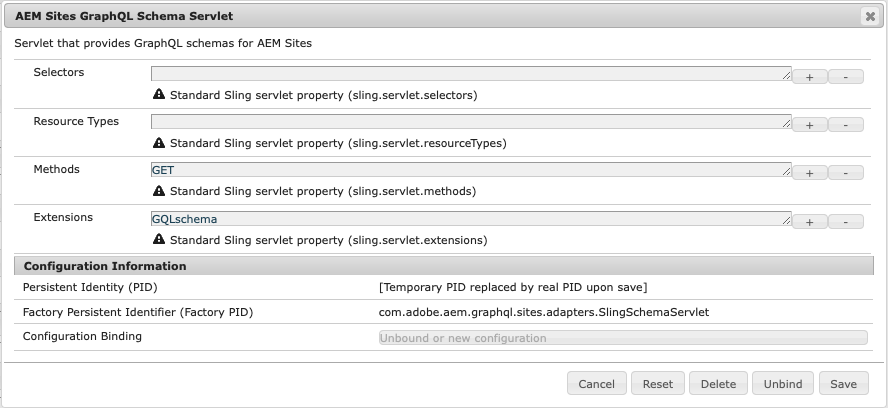

# AEM GraphQL API per l&#39;utilizzo con frammenti di contenuto {#graphql-api-for-use-with-content-fragments}

>[!CAUTION]
>
>L&#39;API AEM GraphQL, per la distribuzione dei frammenti di contenuto, verrà rilasciata all&#39;inizio del 2021.
>
>La documentazione correlata è già disponibile a scopo di anteprima.

L&#39;API Adobe Experience Manager come Cloud Service (AEM) GraphQL utilizzata con i frammenti di contenuto è fortemente basata sull&#39;API GraphQL standard open source.

L&#39;utilizzo dell&#39;API GraphQL in AEM consente la distribuzione efficiente di frammenti di contenuto ai client JavaScript nelle implementazioni CMS headless:

* Evitare richieste API iterative come con REST,
* garantire che la consegna sia limitata ai requisiti specifici,
* Consentire la consegna in massa di esattamente ciò che è necessario per il rendering come risposta a una singola query API.

## API GraphQL {#graphql-api}

*&quot;GraphQL è un linguaggio e una specifica di query di dati sviluppati internamente da Facebook nel 2012 prima di essere pubblicamente aperti in origine nel 2015. Offre un&#39;alternativa alle architetture basate su REST allo scopo di aumentare la produttività degli sviluppatori e ridurre al minimo le quantità di dati trasferiti. GraphQL viene utilizzato nella produzione da centinaia di organizzazioni di tutte le dimensioni...&quot;* Vedere [GraphQL Foundation](https://foundation.graphql.org/).

Per ulteriori informazioni sull&#39;API GraphQL, consultate le seguenti sezioni (tra cui molte altre risorse):

* A [graphql.org](https://graphql.org):

   * [Introduzione a GraphQL](https://graphql.org/learn)

   * [Specifica GraphQL](http://spec.graphql.org/)

* A [graphql.com](https://graphql.com):

   * [Guide](https://www.graphql.com/guides/)

   * [Esercitazioni](https://www.graphql.com/tutorials/)

   * [Case study](https://www.graphql.com/case-studies/)

GraphQL per AEM implementazione si basa sulla libreria Java GraphQL standard. Consulta:

* [graphQL.org - Java](https://graphql.org/code/#java)

* [GraphQL Java a GitHub](https://github.com/graphql-java)

## Interfaccia GraphiQL {#graphiql-interface}

AEM Graph API include un&#39;implementazione dell&#39;interfaccia standard [GraphiQL](https://graphql.org/learn/serving-over-http/#graphiql). Questo consente di inserire e testare direttamente le query.

Esempio:

* `http://localhost:4502/content/graphiql.html`

Questo fornisce funzioni come evidenziazione della sintassi, completamento automatico, suggerimento automatico, insieme a una cronologia e alla documentazione online:


## Casi di utilizzo per ambienti di creazione e pubblicazione {#use-cases-author-publish-environments}

I casi di utilizzo possono dipendere dal tipo di AEM come ambiente di Cloud Service:

* Ambiente di pubblicazione; utilizzato per:
   * Dati query per l&#39;applicazione JS (caso d&#39;uso standard)

* Ambiente di authoring; utilizzato per:
   * Dati query per &quot;scopi di gestione del contenuto&quot;:
      * GraphQL in AEM come Cloud Service è attualmente un&#39;API di sola lettura.
      * L&#39;API REST può essere utilizzata per le operazioni CR(u)D.

## Generazione schema {#schema-generation}

GraphQL è un&#39;API fortemente tipizzata, il che significa che i dati devono essere chiaramente strutturati e organizzati per tipo.

La specifica GraphQL fornisce una serie di linee guida su come creare un&#39;API affidabile per l&#39;interrogazione dei dati su una determinata istanza. A tal fine, un client deve recuperare il [Schema](#schema-generation), che contiene tutti i tipi necessari per una query.

Per i frammenti di contenuto, gli schemi GraphQL (struttura e tipi) si basano su [Modelli di frammenti di contenuto](/help/assets/content-fragments/content-fragments-models.md) e i relativi tipi di dati.

Ad esempio, se un utente ha creato un modello di frammento di contenuto denominato `Article`, AEM genera l&#39;oggetto `article` di tipo `ArticleModel`. I campi all&#39;interno di questo tipo corrispondono ai campi e ai tipi di dati definiti nel modello.

1. Un Modello Di Frammento Di Contenuto:

   

1. Lo schema GraphQL corrispondente (output dalla documentazione automatica GraphiQL):
   

   Questo indica che il tipo generato `ArticleModel` contiene diversi [campi](#fields).

   * Tre di essi sono stati controllati dall&#39;utente: `author`, `main` e `linked_article`.

   * Gli altri campi sono stati aggiunti automaticamente da AEM e rappresentano utili metodi per fornire informazioni su un determinato frammento di contenuto; in questo esempio, `_path`, `_metadata`, `_variations`. Questi [campi helper](#helper-fields) sono contrassegnati con un `_` precedente per distinguere tra ciò che è stato definito dall&#39;utente e ciò che è stato generato automaticamente.

1. Dopo che un utente crea un frammento di contenuto basato sul modello Articolo, può essere interrogato tramite GraphQL. Ad esempio, vedere [Query di esempio](/help/assets/content-fragments/content-fragments-graphql-samples.md#graphql-sample-queries) (basate su una struttura di frammenti di contenuto di esempio da utilizzare con GraphQL](/help/assets/content-fragments/content-fragments-graphql-samples.md#content-fragment-structure-graphql)).[

In GraphQL per AEM, lo schema è flessibile. Questo significa che viene generato automaticamente ogni volta che viene creato, aggiornato o eliminato un modello di frammento di contenuto. Le cache dello schema dati vengono aggiornate anche quando si aggiorna un modello di frammento di contenuto.

Il servizio Sites GraphQL ascolta (in background) le modifiche apportate a un modello di frammento di contenuto. Quando vengono rilevati aggiornamenti, solo la parte dello schema viene rigenerata. Questa ottimizzazione consente di risparmiare tempo e stabilità.

Ad esempio, se:

1. Installare un pacchetto contenente `Content-Fragment-Model-1` e `Content-Fragment-Model-2`:

   1. Verranno generati i tipi GraphQL per `Model-1` e `Model-2`.

1. Quindi modificare `Content-Fragment-Model-2`:

   1. Viene aggiornato solo il tipo `Model-2` GraphQL.

   1. Mentre `Model-1` rimarrà uguale.

>[!NOTE]
>
>Questo è importante da notare nel caso in cui si desidera eseguire aggiornamenti in blocco sui modelli di frammenti di contenuto tramite l&#39;API REST, o in altro modo.

Lo schema viene distribuito attraverso lo stesso endpoint delle query GraphQL, con il client che gestisce il fatto che lo schema viene chiamato con l&#39;estensione `GQLschema`. Ad esempio, eseguendo una semplice richiesta `GET` su `/content/graphql/endpoint.GQLschema` si ottiene l&#39;output dello schema con il tipo di contenuto: `text/x-graphql-schema;charset=iso-8859-1`.

## espandibili {#fields}

Nello schema sono presenti singoli campi, di due categorie di base:

* Campi generati.

   Una selezione di [Tipi di campo](#field-types) viene utilizzata per creare campi in base alla modalità di configurazione del modello di frammento di contenuto. I nomi dei campi sono ricavati dal campo **Nome proprietà** del **Tipo di dati**.

   * È inoltre disponibile la proprietà **Rendering come**, in quanto gli utenti possono configurare alcuni tipi di dati; ad esempio, come testo a riga singola o multicampo.

* GraphQL per AEM genera anche un numero di [campi helper](#helper-fields).

   Questi vengono utilizzati per identificare un frammento di contenuto o per ottenere ulteriori informazioni su un frammento di contenuto.

### Tipi di campi {#field-types}

GraphQL per AEM supporta un elenco di tipi. Sono rappresentati tutti i tipi di dati supportati per i modelli di frammento di contenuto e i tipi di GraphQL corrispondenti:

| Modello frammento di contenuto - Tipo di dati | GraphQL Type | Descrizione |
|--- |--- |--- |
| Testo su riga singola | String, [String] |  Utilizzata per stringhe semplici come nomi di autore, nomi di posizione ecc. |
| Testo su più righe | Stringa |  Utilizzato per l&#39;output di testo, ad esempio il corpo di un articolo |
| Numero |  Mobile, [Mobile] | Utilizzato per visualizzare il numero a virgola mobile e i numeri regolari |
| Booleano |  Booleano |  Utilizzato per visualizzare le caselle di controllo → semplici istruzioni true/false |
| Data e ora | Calendario |  Utilizzato per visualizzare data e ora in formato ISO 8086 |
| Enumerazione |  Stringa |  Utilizzato per visualizzare un&#39;opzione da un elenco di opzioni definite durante la creazione del modello |
|  Tag |  [Stringa] |  Utilizzato per visualizzare un elenco di stringhe che rappresentano i tag utilizzati in AEM |
| Riferimento contenuto |  Stringa |  Utilizzato per visualizzare il percorso verso un&#39;altra risorsa in AEM |
| Riferimento frammento |  *Tipo di modello* |  Utilizzato per fare riferimento a un altro frammento di contenuto di un certo tipo di modello, definito al momento della creazione del modello |

### Campi helper {#helper-fields}

Oltre ai tipi di dati per i campi generati dall&#39;utente, GraphQL per AEM genera anche un numero di campi *helper* per facilitare l&#39;identificazione di un frammento di contenuto o per fornire ulteriori informazioni su un frammento di contenuto.

#### Percorso {#path}

Il campo percorso viene utilizzato come identificatore in GraphQL. Rappresenta il percorso della risorsa Frammento di contenuto all&#39;interno dell&#39;archivio AEM. È stato scelto come identificatore di un frammento di contenuto, in quanto:

* è univoco all&#39;interno di AEM,
* può essere facilmente recuperato.

Nel codice seguente vengono visualizzati i percorsi di tutti i frammenti di contenuto creati in base al modello di frammento di contenuto `Person`.

```xml
{
  persons {
    items {
      _path
    }
  }
}
```

Per recuperare un singolo frammento di contenuto di un tipo specifico, è necessario anche determinarne prima il percorso. ad esempio:

```xml
{
    person(_path="/content/dam/path/to/fragment/john-doe") {
        _path
        name
        first-name
    }
}
```

Vedere [Esempio di query - Un frammento di città singola](/help/assets/content-fragments/content-fragments-graphql-samples.md#sample-single-city-fragment).

#### Metadati {#metadata}

Tramite GraphQL, AEM anche esporre i metadati di un frammento di contenuto. Per metadati si intendono le informazioni che descrivono un frammento di contenuto, ad esempio il titolo di un frammento di contenuto, il percorso delle miniature, la descrizione di un frammento di contenuto, la data di creazione, tra l’altro.

Poiché i metadati vengono generati tramite l&#39;Editor schema e in quanto tali non dispongono di una struttura specifica, il tipo `TypedMetaData` GraphQL è stato implementato per esporre i metadati di un frammento di contenuto. `TypedMetaData` espone le informazioni raggruppate dai seguenti tipi di scala:

| Campo |
|--- |
| `stringMetadata:[StringMetadata]!` |
| `stringArrayMetadata:[StringArrayMetadata]!` |
| `intMetadata:[IntMetadata]!` |
| `intArrayMetadata:[IntArrayMetadata]!` |
| `floatMetadata:[FloatMetadata]!` |
| `floatArrayMetadata:[FloatArrayMetadata]!` |
| `booleanMetadata:[BooleanMetadata]!` |
| `booleanArrayMetadata:[booleanArrayMetadata]!`  |
| `calendarMetadata:[CalendarMetadata]!` |
| `calendarArrayMetadata:[CalendarArrayMetadata]!` |

Ogni tipo di scala rappresenta una coppia nome-valore singola o un array di coppie nome-valore, dove il valore di quella coppia è del tipo in cui è stata raggruppata.

Ad esempio, se desiderate recuperare il titolo di un frammento di contenuto, sappiamo che questa proprietà è una proprietà String, quindi eseguiamo una query per tutti i metadati stringa:

Per eseguire una query per i metadati:

```xml
{
  person(_path: "/content/dam/path/to/fragment/john-doe") {
    _path
    _metadata {
      stringMetadata {
        name
        value
      }
    }
  }
}
```

È possibile visualizzare tutti i tipi di metadati GraphQL se si visualizza lo schema Generated GraphQL. Tutti i tipi di modello hanno lo stesso `TypedMetaData`.

>[!NOTE]
>
>**Differenza tra metadati normali e metadati array**
>Tenere presente che `StringMetadata` e `StringArrayMetadata` si riferiscono entrambi a ciò che è memorizzato nella directory archivio, non a come viene recuperato.
>
>Ad esempio, chiamando il campo `stringMetadata` si riceverà un array di tutti i metadati memorizzati nell&#39;archivio come `String`, e se si chiama `stringArrayMetadata` si riceverà un array di tutti i metadati memorizzati nell&#39;archivio come `String[]`.

Consultate [Esempio di query per metadati - Elenco dei metadati per i premi denominati GB](/help/assets/content-fragments/content-fragments-graphql-samples.md#sample-metadata-awards-gb).

#### Varianti {#variations}

Il campo `_variations` è stato implementato per semplificare la query delle varianti di un frammento di contenuto. Esempio:

```xml
{
  person(_path: "/content/dam/path/to/fragment/john-doe") {
    _variations
  }
}
```

Vedere [Esempio di query - Tutte le città con una variante denominata](/help/assets/content-fragments/content-fragments-graphql-samples.md#sample-cities-named-variation).

<!--
## Security Considerations {#security-considerations}
-->

## Variabili GraphQL {#graphql-variables}

GraphQL consente di inserire le variabili nella query. Per ulteriori informazioni, consulta la documentazione di [GraphQL per GraphiQL](https://graphql.org/learn/queries/#variables).

Ad esempio, per ottenere tutti i frammenti di contenuto di tipo `Article` con una specifica variante, è possibile specificare la variabile `variation` in GraphiQL:


```xml
### query
query GetArticlesByVariation($variation: String!) {
    articles(variation: $variation) {
        items {
            _path
            author
        }
    }
}
 
### in query variables
{
    "variation": "uk"
}
```

## Direttive GraphQL {#graphql-directives}

In GraphQL è possibile modificare la query in base alle variabili, denominate Direttive GraphQL.

Ad esempio, è possibile includere il campo `adventurePrice` in una query per tutti i `AdventureModels`, in base a una variabile `includePrice`.


```xml
query getAdventureByType($includePrice: Boolean!) {
  adventures {
    items {
      adventureType
      adventurePrice @include(if: $includePrice)
    }
  }
}
 
### in query variables
{
    "includePrice": true
}
```

## Query persistenti (memorizzazione nella cache) {#persisted-queries-caching}

Dopo aver preparato una query con una richiesta di POST, può essere eseguita con una richiesta di GET che può essere memorizzata nella cache dalle cache HTTP o da una CDN.

Questo è richiesto perché le query POST in genere non sono memorizzate nella cache e se si utilizza GET con la query come parametro, esiste un rischio significativo che il parametro diventi troppo grande per i servizi HTTP e gli intermediari.

Di seguito sono riportati i passaggi necessari per mantenere una determinata query:

>[!NOTE]
>Prima di questo, è necessario abilitare le **Query di persistenza GraphQL** per la configurazione appropriata. Per ulteriori informazioni, vedere [Abilitare la funzionalità dei frammenti di contenuto nel browser di configurazione](/help/assets/content-fragments/content-fragments-configuration-browser.md#enable-content-fragment-functionality-in-configuration-browser).

1. Preparate la query inserendola nel nuovo URL dell&#39;endpoint `/graphql/persist.json/<config>/<persisted-label>`.

   Ad esempio, create una query persistente:

   ```xml
   $ curl -X PUT \
       -H 'authorization: Basic YWRtaW46YWRtaW4=' \
       -H "Content-Type: application/json" \
       "http://localhost:4502/graphql/persist.json/wknd/plain-article-query" \
       -d \
   '{
     articleList {
       items{
           _path
           author
           main {
               json
           }
       }
     }
   }'
   ```

1. A questo punto, controllate la risposta.

   Ad esempio, verificate che l&#39;esito sia positivo:

   ```xml
   {
     "action": "create",
     "configurationName": "wknd",
     "name": "plain-article-query",
     "shortPath": "/wknd/plain-article-query",
     "path": "/conf/wknd/settings/graphql/persistentQueries/plain-article-query"
   }
   ```

1. Potete quindi riprodurre nuovamente la query persistente utilizzando GETing l&#39;URL `/graphql/execute.json/<shortPath>`.

   Ad esempio, utilizzate la query persistente:

   ```xml
   $ curl -X GET \
       http://localhost:4502/graphql/execute.json/wknd/plain-article-query
   ```

1. Aggiornare una query persistente tramite POSTing a un percorso di query già esistente.

   Ad esempio, utilizzate la query persistente:

   ```xml
   $ curl -X POST \
       -H 'authorization: Basic YWRtaW46YWRtaW4=' \
       -H "Content-Type: application/json" \
       "http://localhost:4502/graphql/persist.json/wknd/plain-article-query" \
       -d \
   '{
     articleList {
       items{
           _path
           author
           main {
               json
           }
         referencearticle {
           _path
         }
       }
     }
   }'
   ```

1. Create una query normale con wrapping.

   Esempio:

   ```xml
   $ curl -X PUT \
       -H 'authorization: Basic YWRtaW46YWRtaW4=' \
       -H "Content-Type: application/json" \
       "http://localhost:4502/graphql/persist.json/wknd/plain-article-query-wrapped" \
       -d \
   '{ "query": "{articleList { items { _path author main { json } referencearticle { _path } } } }"}'
   ```

1. Create una query normale con wrapping con il controllo della cache.

   Esempio:

   ```xml
   $ curl -X PUT \
       -H 'authorization: Basic YWRtaW46YWRtaW4=' \
       -H "Content-Type: application/json" \
       "http://localhost:4502/graphql/persist.json/wknd/plain-article-query-max-age" \
       -d \
   '{ "query": "{articleList { items { _path author main { json } referencearticle { _path } } } }", "cache-control": { "max-age": 300 }}'
   ```

1. Crea una query persistente con parametri:

   Esempio:

   ```xml
   $ curl -X PUT \
       -H 'authorization: Basic YWRtaW46YWRtaW4=' \
       -H "Content-Type: application/json" \
       "http://localhost:4502/graphql/persist.json/wknd/plain-article-query-parameters" \
       -d \
   'query GetAsGraphqlModelTestByPath($apath: String!, $withReference: Boolean = true) {
     articleByPath(_path: $apath) {
       item {
         _path
           author
           main {
           plaintext
           }
           referencearticle @include(if: $withReference) {
           _path
           }
         }
       }
     }'
   ```

1. Esecuzione di una query con parametri.

   Esempio:

   ```xml
   $ curl -X POST \
       -H 'authorization: Basic YWRtaW46YWRtaW4=' \
       -H "Content-Type: application/json" \
       "http://localhost:4502/graphql/execute.json/wknd/plain-article-query-parameters;apath=%2fcontent2fdam2fwknd2fen2fmagazine2falaska-adventure2falaskan-adventures;withReference=false"
   
   $ curl -X GET \
       "http://localhost:4502/graphql/execute.json/wknd/plain-article-query-parameters;apath=%2fcontent2fdam2fwknd2fen2fmagazine2falaska-adventure2falaskan-adventures;withReference=false"
   ```

1. Per eseguire la query al momento della pubblicazione, la struttura ad albero persistente correlata deve essere replicata

   * Utilizzo di un POST per la replica:

      ```xml
      $curl -X POST   http://localhost:4502/bin/replicate.json \
        -H 'authorization: Basic YWRtaW46YWRtaW4=' \
        -F path=/conf/wknd/settings/graphql/persistentQueries/plain-article-query \
        -F cmd=activate
      ```

   * Utilizzo di un pacchetto:
      1. Create una nuova definizione di pacchetto.
      1. Includete la configurazione (ad esempio, `/conf/wknd/settings/graphql/persistentQueries`).
      1. Create il pacchetto.
      1. Replicate il pacchetto.
   * Utilizzo dello strumento di replica/distribuzione.
      1. Passate allo strumento di distribuzione.
      1. Selezionate l&#39;attivazione della struttura per la configurazione (ad esempio, `/conf/wknd/settings/graphql/persistentQueries`).
   * Utilizzo di un flusso di lavoro (tramite la configurazione di avvio del flusso di lavoro):
      1. Definite una regola di avvio del flusso di lavoro per eseguire un modello di workflow che replichi la configurazione su eventi diversi (ad esempio, create, modificate, tra gli altri).


1. Una volta che la configurazione della query è stata pubblicata, si applicano gli stessi principi, utilizzando solo l&#39;endpoint di pubblicazione.

   >[!NOTE]
   >
   >Per l&#39;accesso anonimo, il sistema presuppone che l&#39;ACL consenta a &quot;tutti&quot; di accedere alla configurazione della query.
   >
   >In caso contrario, non potrà essere eseguito.

   >[!NOTE]
   >
   >Eventuali punti e virgola (&quot;;&quot;) negli URL devono essere codificati.
   >
   >Ad esempio, come nella richiesta per eseguire una query persistente:
   >
   >
   ```xml
   >curl -X GET \ "http://localhost:4502/graphql/execute.json/wknd/plain-article-query-parameters%3bapath=%2fcontent2fdam2fwknd2fen2fmagazine2falaska-adventure2falaskan-adventures;withReference=false"
   >```

## Query dell&#39;endpoint GraphQL da un sito Web esterno {#query-graphql-endpoint-from-external-website}

>[!NOTE]
>
>Per una panoramica dettagliata del criterio di condivisione delle risorse CORS, vedere [Comprendere la condivisione delle risorse tra le origini (CORS)](https://experienceleague.adobe.com/docs/experience-manager-learn/foundation/security/understand-cross-origin-resource-sharing.html?lang=en#understand-cross-origin-resource-sharing-(cors)).

Per consentire a un sito Web di terze parti di utilizzare l&#39;output JSON, è necessario configurare un criterio CORS nell&#39;archivio Git del cliente. A questo scopo, aggiungete un file di configurazione OSGi CORS appropriato per l’endpoint desiderato. Questa configurazione deve specificare un nome di sito Web attendibile (regex) per il quale concedere l&#39;accesso.

* Accesso all’endpoint GraphQL:

   * alloworigin: [il vostro dominio] o alloworiginregexp: [il dominio regex]
   * metodi supportati: [POST]
   * Percorsi consentiti: [&quot;/apps/graphql-enablement/content/endpoint.gql(/persisted)?&quot;]

* Accesso all&#39;endpoint di query persistenti GraphQL:

   * alloworigin: [il vostro dominio] o alloworiginregexp: [il dominio regex]
   * metodi supportati: [GET]
   * Percorsi consentiti: [&quot;/graphql/execute.json/.*&quot;]

>[!CAUTION]
>
>Resta responsabilità del cliente:
>
>* concedere solo l&#39;accesso ai domini trusted
>* non utilizzare la sintassi con carattere jolly [*]; che esporrà gli endpoint GraphQL a tutto il mondo.


## Filtro {#filtering}

Potete inoltre utilizzare il filtro nelle query GraphQL per restituire dati specifici.

Il filtro utilizza una sintassi basata su operatori logici ed espressioni.

Per esempi, vedete:

* dettagli di [GraphQL per AEM estensioni](/help/assets/content-fragments/content-fragments-graphql-samples.md#graphql-some-extensions)

* [Contenuto di esempio e struttura ](/help/assets/content-fragments/content-fragments-graphql-samples.md#content-fragment-structure-graphql) preparate per l’uso nelle query di esempio

* [Query di esempio con questo contenuto e struttura di esempio](/help/assets/content-fragments/content-fragments-graphql-samples.md#graphql-sample-queries-sample-content-fragment-structure)

* [Query di esempio basate sul progetto WKND](/help/assets/content-fragments/content-fragments-graphql-samples.md#sample-queries-using-wknd-project)

## Autorizzazioni  {#permission}

Le autorizzazioni sono quelle necessarie per accedere alle risorse.

<!-- to be addressed later -->

<!-- 
## Authentication {#authentication}
-->

<!-- to be addressed later -->

<!-- 
## Caching {#caching}
-->

<!-- to be addressed later -->

<!--
## Sorting {#sorting}
-->

<!-- to be addressed later -->

<!--
## Paging {#paging}
-->

## Punti finali {#end-points}

L’endpoint è il percorso utilizzato per accedere a GraphQL per AEM. Utilizzando questo percorso (o la vostra app) potete:

* accedere allo schema GraphQL,
* invia le tue query GraphQL,
* ricevere le risposte (alle query GraphQL).

Per poter accedere ai servlet GraphQL in AEM è necessario configurare un endpoint. Sono incluse anche due configurazioni OSGi.

1. Il servlet dello schema Sling che risponde alle richieste di recupero dello schema GraphQL:

   

   * **I selettori** (`sling.servlet.selectors`) devono essere lasciati vuoti.

   * **Tipi**  di risorse(`sling.servlet.resourceTypes`) Definire il tipo di risorsa che il servlet GraphQL deve ascoltare.
Esempio:
      `graphql-enablement/components/endpoint`.

   * **Metodi** (`sling.servlet.methods^)

      Il metodo HTTP che il servlet deve ascoltare; in genere `GET`.

   * **Estensioni** (`sling.servlet.extensions`)

      Specificare l&#39;estensione a cui il servlet schema deve rispondere. In questo caso è `GQLschema`, per essere compatibile con le specifiche GraphQL.

2. Il servlet che risponde alle richieste graphql:

   

   * **I selettori** (`sling.servlet.selectors`) devono essere lasciati vuoti.

   * **Tipo**  risorsa(`sling.servlet.resourceTypes`) Il tipo di risorsa a cui deve rispondere il servlet GraphQL.
Esempio, `graphql-enablement/components/endpoint`.

   * **Metodi** (`sling.servlet.methods`) I metodi HTTP a cui il servlet GraphQL deve rispondere, in genere  `GET` e  `POST`.

   * **Estensioni** (`sling.servlet.extensions`) L&#39;estensione per ascoltare le richieste GraphQL, in genere  `gql`.

3. È ora necessario creare un endpoint, un nodo di sling:resourceType definito in queste configurazioni.
Ad esempio, per creare un endpoint per il recupero dello schema GraphQL, creare un nuovo nodo in `/apps/<my-site>/graphql`:

   * Nome: `endpoint`
   * Tipo principale: `nt:unstructured`
   * sling:resourceType: `graphql-enablement/components/endpoint`

## Domande frequenti {#faqs}

Domande sorte:

1. **D**: &quot;*In che modo l&#39;API GraphQL per AEM è diversa dall&#39;API di Query Builder?*&quot;

   * **A**: &quot;*L&#39;API AEM GraphQL offre il controllo totale sull&#39;output JSON ed è uno standard di settore per l&#39;esecuzione di query sui contenuti.
In futuro, AEM intende investire nell&#39;API AEM GraphQL.*&quot;

## Esercitazione - Guida introduttiva a AEM headless e GraphQL {#tutorial}

Stai cercando un&#39;esercitazione pratica? Scoprite la [Guida introduttiva AEM headless e l&#39;esercitazione end-to-end di GraphQL](https://experienceleague.adobe.com/docs/experience-manager-learn/getting-started-with-aem-headless/graphql/overview.html) che illustra come creare ed esporre contenuti utilizzando le API GraphQL di AEM e utilizzati da un&#39;app esterna, in uno scenario CMS headless.