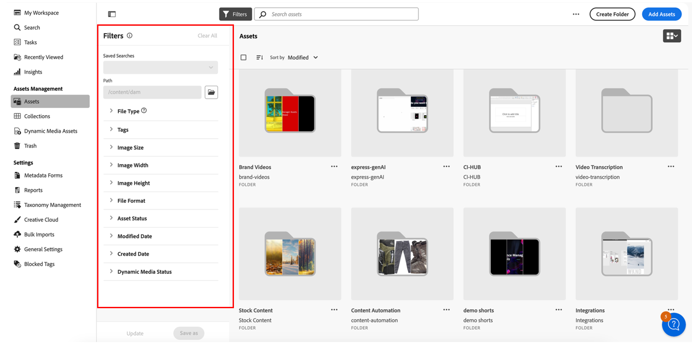

# Personalizzare i filtri di ricerca {#customize-search-filters}

I filtri di ricerca consentono di perfezionare i risultati della ricerca in base a vari parametri, ad esempio data, tipo di file, tag e rilevanza, migliorando la precisione delle query di ricerca. Applicando i filtri, puoi esaminare rapidamente i risultati più rilevanti in modo efficiente. Questo consente non solo di risparmiare tempo, ma anche di migliorare l’esperienza complessiva di ricerca adattando i risultati a preferenze ed esigenze specifiche.
Ulteriori informazioni su [search](search-assets-view.md).

Personalizza filtri di ricerca AEM Assets può essere mappato solo alle voci nell’indice delle proprietà ricercabili. Assicurati di includere tutti i metadati personalizzati prima di configurare l’esperienza di filtro personalizzata. [!DNL Assets view] consente di personalizzare i filtri di ricerca per semplificare il processo di ricerca. Per personalizzare i filtri di ricerca personalizzati di AEM Assets, esegui i seguenti passaggi:

1. Passa a **[!UICONTROL Impostazioni]** > **[!UICONTROL Impostazioni generali]** > **[!UICONTROL Ricerca]**.

   <!--1. Go to the **[!UICONTROL Search]** tab. Click **[!UICONTROL Customize]** to configure your search form.-->

   

1. Nella sezione **[!UICONTROL Filtri]** è possibile configurare i seguenti elementi:

   * **[!UICONTROL File]:** La configurazione dei file richiede tipi di file, formati di file, stato delle risorse, dimensioni del file, dimensioni dell&#39;immagine, data di creazione, data di modifica e così via.
   * **[!UICONTROL Cartelle]:** La configurazione delle cartelle richiede la data di creazione, la data di eliminazione, l&#39;eliminazione di e così via.
   * **[!UICONTROL Raccolte]:** La configurazione delle raccolte implica la visibilità della raccolta, il tipo di raccolta, la data di creazione e così via.

1. È possibile visualizzare in anteprima il modulo **[!UICONTROL Filtri predefiniti]** disponibile per file, cartelle o raccolte. Non è invece possibile personalizzare o eliminare questo modulo preesistente. In alternativa, per creare un modulo filtri personalizzato, fare clic su **[!UICONTROL Aggiungi nuovo modulo]**.

   >[!NOTE]
   >
   >È possibile creare un solo modulo filtro personalizzato per categoria (File, Cartella o Raccolta).

1. Fai clic su **[!UICONTROL Salva]** per salvare le modifiche.

## Azioni su un modulo configurato {#Actions-on-configured-form}

In un modulo di filtri configurato è possibile utilizzare le azioni seguenti:

* **[!UICONTROL Personalizza]:** Fare clic per aggiungere o modificare il modulo. Puoi eliminare gli elementi filtro dai [filtri personalizzati](#available-custom-filters) nell&#39;area di lavoro o riordinarli, se necessario.

* **[!UICONTROL Anteprima]:** Fare clic per rivedere le modifiche.

* **[!UICONTROL Imposta come predefinito]:** Fare clic per impostare il modulo selezionato come predefinito.

* **[!UICONTROL Elimina modulo]:** Fai clic su altre opzioni  e seleziona **[!UICONTROL Elimina modulo]** per eliminare il modulo dei filtri selezionato.

* **[!UICONTROL Modifica etichette modulo]:** Fai clic su altre opzioni  e aggiungi una nuova etichetta e descrizione al modulo dei filtri personalizzato.

  

## Filtri personalizzati disponibili {#available-custom-filters}

La vista Assets fornisce i seguenti filtri personalizzati riconfigurabili in base al requisito:

* [Filtra elementi](#filter-elements)
* [Filtri preconfigurati](#preconfigured-filters)

### Filtra elementi {#filter-elements}

Filtri personalizzati AEM Assets consente di utilizzare una raccolta di elementi di filtro nell’area di lavoro dei filtri di ricerca personalizzati. Questi elementi possono essere riconfigurati in base all’usabilità degli attributi delle proprietà di ricerca. Tuttavia, puoi personalizzare le [proprietà filtro](#filter-properties) in base alle tue esigenze. I seguenti elementi del filtro sono disponibili in [!DNL Assets view]:

<table>
    <tr>
        <th>Filtra elementi</th>
        <th>Descrizione</th>
        <th>Proprietà</th>
    </tr>
    <tr>
        <td>Testo</td>
        <td>Un campo di testo è un'area di input in cui è possibile digitare informazioni relative al filtro.</td>
        <td>
            <ul>
                <li>Etichetta
                <li>Metadati
                <li>Valori
                <li>Descrizione
            </ul>
        </td>
    </tr>
    <tr>
        <td>Opzioni</td>
        <td>Le opzioni si riferiscono alle alternative disponibili per selezionare un elemento preferito da un elenco.</td>
        <td>
            <ul>
                <li>Etichetta
                <li>Metadati
                <li>Valori
                <li>Opzioni
                <li>Descrizione
            </ul>
        </td>
    </tr>
    <tr>
        <td>Booleano</td>
        <td>Un valore booleano rappresenta un valore reale. Può essere utilizzato dove desideri essere specifico per scegliere un’opzione tra le altre.</td>
        <td>
            <ul>
                <li>Etichetta
                <li>Metadati
                <li>Descrizione
            </ul>
        </td>
    </tr>
    <tr>
        <td>Numero</td>
        <td>Utilizza questo elemento filtro per rappresentare un valore numerico.</td>
        <td>
            <ul>
                <li>Etichetta
                <li>Metadati
                <li>Tipo di selezione
                <li>Stepper
                <li>Valore stepper
                <li>Descrizione
            </ul>
        </td>
    </tr>
    <tr>
        <td>A discesa</td>
        <td>Per scegliere tra le varie opzioni visualizzate in un elenco di opzioni.</td>
        <td>
            <ul>
                <li>Etichetta
                <li>Metadati
                <li>Opzioni
                <li>Valori
                <li>Descrizione
            </ul>
        </td>
    </tr>
    <tr>
        <td>Data</td>
        <td>Utilizzato per specificare la data.</td>
        <td>
            <ul>
                <li>Etichetta
                <li>Metadati
                <li>Tipo di selezione
                <li>Descrizione
            </ul>
        </td>
    </tr>
    <tr>
        <td>Browser percorsi</td>
        <td>Utilizzato per spostarsi tra i file o le cartelle nell’archivio di Experience Manager.</td>
        <td>
            <ul>
                <li>Etichetta
                <li>Metadati
                <li>Esplora percorsi
                <li>Descrizione
            </ul>
        </td>
    </tr>
    <tr>
        <td>Tag</td>
        <td>Utilizzato per selezionare i tag dalle opzioni disponibili. I tag forniscono informazioni più specifiche sulle risorse e ne migliorano la reperibilità. I tag già applicati alle risorse selezionate vengono visualizzati nel pannello <b>Proprietà</b>. Se memorizzi i tag su una proprietà di metadati personalizzata e utilizzi il percorso principale per limitarlo a una gerarchia, puoi sfruttare la stessa configurazione nei filtri di ricerca. Se non riesci a trovare i tag rilevanti, creali e assegnali alle risorse selezionate. Consulta <a href = "tagging-management-assets-view.md"> Gestire i tag nella vista Assets </a> per informazioni dettagliate sulla creazione e l'assegnazione di tag alle risorse.</td>
        <td>
            <ul>
                <li>Etichetta
                <li>Metadati
                <li>Selettore tag
                <li>Descrizione
            </ul>
        </td>
    </tr>
    <tr>
        <td>User</td>
        <td>Utilizzato per specificare il tipo di utente tra amministratori, utenti standard e consumer.</td>
        <td>
            <ul>
                <li>Etichetta
                <li>Metadati
                <li>Descrizione
            </ul>
        </td>
    </tr>
</table>

### Filtri preconfigurati {#preconfigured-filters}

I filtri preconfigurati sono impostazioni preconfigurate che ti consentono di utilizzarli direttamente nell’area di lavoro. Tuttavia, puoi personalizzare le [proprietà filtro](#filter-properties) in base alle tue esigenze. I filtri seguenti sono preconfigurati in [!DNL Assets view]:

<table>
    <tr>
        <th>Filtri preconfigurati</th>
        <th>Descrizione</th>
        <th>Proprietà</th>
    </tr>
    <tr>
        <td>Tipo di file</td>
        <td>Filtra i risultati della ricerca in base ai tipi di file supportati come "Immagini", "Documenti" e "Video".</td>
        <td>
            <ul>
                <li>Etichetta
                <li>Metadati
                <li>Tipo di selezione
                <li>Opzioni
                <li>Valori
                <li>Descrizione
            </ul>
        </td>
    </tr>
    <tr>
        <td>Formato file</td>
        <td>La vista Assets supporta qualsiasi formato di file binario con servizi di base quali archiviazione, caricamento, copia, spostamento, eliminazione e aggiunta di metadati.</td>
        <td>
            <ul>
                <li>Etichetta
                <li>Metadati
                <li>Tipo di selezione
                <li>Descrizione
            </ul>
        </td>
    </tr>
    <tr>
        <td>Dimensione immagine</td>
        <td>Fornisci una o più dimensioni minima e massima per filtrare le immagini. Le dimensioni vengono fornite in pixel e non corrispondono alle dimensioni del file delle immagini.</td>
        <td>
            <ul>
                <li>Etichetta
                <li>Metadati
                <li>Tipo di selezione
                <li>Stepper
                <li>Valore stepper
                <li>Descrizione
            </ul>
        </td>
    </tr>
    <tr>
        <td>Larghezza immagine</td>
        <td>Dimensioni verticali di un'immagine.</td>
        <td>
            <ul>
                <li>Etichetta
                <li>Metadati
                <li>Tipo di selezione
                <li>Stepper
                <li>Valore stepper
                <li>Descrizione
            </ul>
        </td>
    </tr>
    <tr>
        <td>Altezza immagine</td>
        <td>Dimensioni orizzontali di un'immagine.</td>
        <td>
            <ul>
                <li>Etichetta
                <li>Metadati
                <li>Tipo di selezione
                <li>Stepper
                <li>Valore stepper
                <li>Descrizione
            </ul>
        </td>
    </tr>
    <tr>
        <td>Data di creazione</td>
        <td>Intervallo di date in cui sono state create le risorse.</td>
        <td>
            <ul>
                <li>Etichetta
                <li>Metadati
                <li>Tipo di selezione
                <li>Descrizione
            </ul>
        </td>
    </tr>
    <tr>
        <td>Data modifica</td>
        <td>Intervallo di date in cui le risorse sono state modificate.</td>
        <td>
            <ul>
                <li>Etichetta
                <li>Metadati
                <li>Tipo di selezione
                <li>Descrizione
            </ul>
        </td>
    </tr>
    <tr>
        <td>Stato risorsa</td>
        <td>La vista Assets consente di impostare lo stato delle risorse disponibili nell’archivio. Imposta lo stato di una risorsa per gestire meglio il consumo a valle di risorse digitali. Scegli tra <b>Approvato, Rifiutato o Nessuno stato</b>.</td>
        <td>
            <ul>
                <li>Etichetta
                <li>Metadati
                <li>Tipo di selezione
                <li>Descrizione
            </ul>
        </td>
    </tr>
    <tr>
        <td>Tag avanzati</td>
        <td>Filtra le risorse utilizzando i tag avanzati aggiunti nell’archivio Experience Manager.</td>
        <td>
            <ul>
                <li>Etichetta
                <li>Metadati
                <li>Tipo di selezione
                <li>Supporto delimitatore
                <li>Descrizione
            </ul>
        </td>
    </tr>
    <tr>
        <td>Stato elemento multimediale dinamico</td>
        <td>Scegli lo stato di una risorsa tra pubblicato o non pubblicato.</td>
        <td>
            <ul>
                <li>Etichetta
                <li>Metadati
                <li>Tipo di selezione
                <li>Opzioni
                <li>Valori
                <li>Descrizione
            </ul>
        </td>
    </tr>
    <tr>
        <td>Data scadenza</td>
        <td>Filtra le risorse specificando un intervallo di date dopo il quale le risorse non sono più valide o necessarie. </td>
        <td>
            <ul>
                <li>Etichetta
                <li>Metadati
                <li>Tipo di selezione
                <li>Descrizione
            </ul>
        </td>
    </tr>
    <tr>
        <td>Tag (tassonomia)</td>
        <td>Si tratta di un sistema di organizzazione e classificazione delle risorse digitali mediante l’uso di tag, che consiste essenzialmente nella creazione di una struttura gerarchica di parole chiave che consente agli utenti di cercare e trovare facilmente contenuti pertinenti applicando tag specifici a ciascuna risorsa, </td>
        <td>
            <ul>
                <li>Etichetta
                <li>Metadati
                <li>Selettore tag
                <li>Descrizione
            </ul>
        </td>
    </tr>
</table>

#### Proprietà filtro {#filter-properties}

Ogni elemento filtro è associato a un set di proprietà. I filtri di ricerca personalizzati di AEM Assets utilizzano le seguenti proprietà nel filtro e negli elementi preconfigurati:

<table>
    <tr>
        <th>Proprietà</th>
        <th>Valori</th>
        <th>Descrizione</th>
    </tr>
    <tr>
        <td>Etichetta</td>
        <td>Testo</td>
        <td>È un identificatore del filtro in uso.</td>
    </tr>
    <tr>
        <td>Metadati</td>
        <td>Elenchi a discesa</td>
        <td>La proprietà dei metadati viene utilizzata per mappare i metadati approvati dall’archivio di Adobe Experience Manager Assets. Puoi scegliere il valore dei metadati dal menu a discesa che deve essere mappato con l’elemento filtro. </td>
    </tr>
    <tr>
        <td>Tipo di selezione</td> 
        <td>Singolo, multiplo, esatto o intervallo </td>
        <td>
            <ul>
                <li><b>Selezione singola</b> consente di scegliere un elemento alla volta, ideale per scelte distinte.
                <li><b>Selezione multipla</b> consente di scegliere più elementi contemporaneamente, utile per selezionare più opzioni. 
                <li><b>Selezione esatta</b> consente di scegliere un singolo elemento preciso tra varie opzioni.
                <li><b>Selezione intervallo</b> consente di scegliere un insieme continuo di valori all'interno di un intervallo definito, utile per selezionare un intervallo di date o valori numerici.
            </ul>
        </td>   
    </tr>
    <tr>
        <td>Opzioni</td>
        <td>Caricamento manuale, percorso JSON o CSV</td>
        <td>
            <ul>
                <li>Scegliere <b>Manuale</b> per aggiungere le opzioni manualmente. 
                <li>Scegli <b>Percorso JSON</b> per aggiungere opzioni dal file JSON. 
                <li>Scegliere <b>Caricamento CSV</b> per importare un file CSV contenente i valori da aggiungere nelle opzioni.
            </ul>
        </td>
    </tr>
    <tr>
       <td>Valori</td>
        <td>Aggiungi o modifica</td>
        <td>
        <ul>
        <li>Fai clic su <b>aggiungi</b> per aggiungere un nuovo valore. 
        <li>Fai clic su ✎ per modificare l'etichetta. 
        <li>Fare clic su ?? per eliminare il valore dell'opzione. 
        <li>Fai clic su <b>Modifica</b> per modificare le opzioni di modifica. 
        <li>Potete anche modificare la sequenza di opzioni tenendole per mano.
        </td>
    </tr>
    <tr>
        <td>Supporto delimitatore</td>
        <td>Attiva o disattiva</td>
        <td>Un delimitatore è un simbolo utilizzato per separare elementi distinti nel testo. Ad esempio virgole, spazi o punti e virgola.</td>
    </tr>
    <tr>
        <td>Stepper</td>
        <td>Valore</td>
        <td>Abilita il pulsante Stepper nel campo numerico per incrementare o diminuire il valore su ogni clic. </td>
    </tr>
    <tr>
        <td>Valore stepper </td>
        <td>Numero</td>
        <td>Indica il valore di incremento/decremento quando si utilizza il pulsante stepper. Viene visualizzato quando la funzione stepper è abilitata.</td>
    </tr>
    <tr>
        <td>Descrizione</td>
        <td>Testo</td>
        <td>Aggiungi una spiegazione dettagliata per fornire informazioni aggiuntive sull’elemento filtro.</td>
    </tr>
</table>

>[!VIDEO](https://video.tv.adobe.com/v/3443080)

## Eliminare un elemento filtro {#delete-a-filter-element}

Per eliminare un filtro di ricerca, effettua le seguenti operazioni:

1. Passa a **[!UICONTROL Impostazioni]** > **[!UICONTROL Impostazioni generali]**.
1. Passa alla scheda **[!UICONTROL Ricerca]**. Fai clic su **[!UICONTROL Personalizza]** per configurare il modulo di ricerca.
1. Viene visualizzato il modulo [!UICONTROL Configura filtri]. Assicurati di essere in modalità Modifica in modo da poter apportare modifiche al modello.
1. Seleziona l’elemento filtro da eliminare. Selezionare ad esempio **[!UICONTROL Altezza immagine]**.
1. Fare clic su **[!UICONTROL Elimina categoria]** per eliminare l&#39;elemento filtro. L&#39;elemento **[!UICONTROL Altezza immagine]** è stato rimosso dall&#39;area di lavoro.
1. Fai clic su **[!UICONTROL Conferma]** per salvare il modulo.

## Utilizzo di filtri di ricerca personalizzati{#using-custom-search-filters}

Dopo aver configurato i filtri di ricerca, puoi utilizzarli per cercare le risorse all’interno dell’archivio.

>[!MORELIKETHIS]
>
>* [Cercare risorse](search-assets-view.md)
