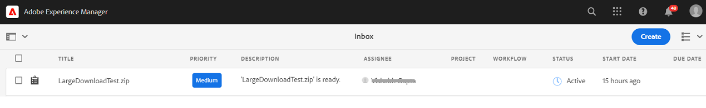

# Scaricare le risorse da [!DNL Adobe Experience Manager] {#download-assets-from-aem}

Puoi scaricare le risorse, compresi i rendering statici e dinamici. In alternativa, puoi inviare e-mail con collegamenti alle risorse direttamente da [!DNL Adobe Experience Manager Assets]. Le risorse scaricate sono raggruppate in un file ZIP. <!-- The compressed ZIP file has a maximum file size of 1 GB for the export job. A maximum of 500 total assets per export job are allowed. -->

<!--
>[!NOTE]
>
>Recipients of emails must be members of the `dam-users` group to access the ZIP download link in the email message. To be able to download the assets, the members must have permissions to launch workflows that trigger downloading of assets.
-->

Non è possibile scaricare i tipi di risorse Set immagini, Set 360 gradi, Set di file multimediali diversi e Set carosello.

Per scaricare le risorse di Experience Manager, utilizza i seguenti metodi:

<!-- * [Link Share](#link-share-download) -->

* [Interfaccia utente di Experience Manager](#download-assets)
* [Asset Share Commons](https://adobe-marketing-cloud.github.io/asset-share-commons/)
* [Brand Portal](https://experienceleague.adobe.com/docs/experience-manager-brand-portal/using/introduction/brand-portal.html)
* [App desktop](https://experienceleague.adobe.com/docs/experience-manager-desktop-app/using/using.html#download-assets)

## Scaricare le risorse utilizzando [!DNL Experience Manager] interfaccia {#download-assets}

Il servizio di download asincrono fornisce un framework per il download senza soluzione di continuità delle risorse di grandi dimensioni. Il download consente di archiviare file di dimensioni superiori a 100 GB in più archivi zip con dimensioni massime di 100 GB ciascuno. Questi possono essere scaricati singolarmente. I file più piccoli vengono scaricati dall’interfaccia utente in tempo reale. [!DNL Experience Manager] non archivia i download di singole risorse in cui viene scaricato il file originale. Questa funzionalità consente download più rapidi.

Per impostazione predefinita, [!DNL Experience Manager] attiva una notifica al completamento del flusso di lavoro di download. La notifica di download viene visualizzata nella  [[!DNL Experience Manager] Inbox](/help/sites-cloud/authoring/getting-started/inbox.md).



<!--
The large files are downloaded asynchronously and [!DNL Experience Manager] notifies of the completion via notifications in the Inbox. See [understand [!DNL Experience Manager] Inbox](/help/sites-cloud/authoring/getting-started/inbox.md).


*Figure: Download notification via [!DNL Experience Manager] Inbox.*

Asynchronous downloads are triggered in either of the following case:

* If there are more than 10 assets or more than 100 MB to be downloaded.
* If the download takes more than 30 seconds to prepare.
-->


<!-- Go live is on 27th Jan 2022
### Enable email notifications for large downloads {#enable-emails-for-large-downloads}

>[!NOTE]
>
>This functionality is available in the Experience Manager prerelease channel.

Asynchronous downloads are triggered in any of the following cases:

* If there are more than ten assets 
* If the download size is more than 100 MB
* If the download takes more than 30 seconds to prepare

While the asynchronous download runs at the backend, the user can continue to explore and work further in Experience Manager. An out-of-the-box mechanism is required to notify the user upon completion of the download process. To achieve this objective, the administrators can configure email service by setting up an SMTP server. See [configure Mail Service](https://experienceleague.adobe.com/docs/experience-manager-cloud-service/content/implementing/developing/development-guidelines.html#sending-email).

Once the email service is configured, the administrators and users can enable email notifications from the Experience Manager interface. 

To enable email notifications:

1. Log in to [!DNL Experience Manager Assets].
1. Click the user icon from the upper-right corner and then click **[!UICONTROL My Preferences]**. The User Preferences window opens.
1. Select the **[!UICONTROL Asset Download email notifications]** check box and click **[!UICONTROL Accept]**.

   

-->

Per scaricare le risorse, effettua le seguenti operazioni:

1. In [!DNL Experience Manager] interfaccia utente, fai clic su **[!UICONTROL Risorse]** > **[!UICONTROL File]**.
1. Passa alle risorse da scaricare. Seleziona la cartella o seleziona una o più risorse all’interno della cartella. Sulla barra degli strumenti, fai clic su **[!UICONTROL Scarica]**.

   ![Opzioni disponibili durante il download delle risorse da [!DNL Experience Manager Assets]](/help/assets/assets/asset-download1.png)

1. Nella finestra di dialogo scarica selezionare le opzioni di download desiderate.

   | Opzione di download | Descrizione |
   |---|---|
   | **[!UICONTROL Crea una cartella separata per ogni risorsa]** | Seleziona questa opzione per includere ogni risorsa scaricata, incluse le risorse in cartelle secondarie nidificate sotto la cartella padre della risorsa, in un’unica cartella sul computer locale. Quando questa opzione è *not* seleziona, per impostazione predefinita, la gerarchia delle cartelle viene ignorata e tutte le risorse vengono scaricate in una cartella del computer locale. |
   | **[!UICONTROL E-mail]** | Seleziona questa opzione per inviare una notifica e-mail (contenente un collegamento al download) a un altro utente. L&#39;utente destinatario deve essere membro del gruppo `dam-users` gruppo. I modelli e-mail standard sono disponibili nelle seguenti posizioni:<ul><li>`/libs/settings/dam/workflow/notification/email/downloadasset`.</li><li>`/libs/settings/dam/workflow/notification/email/transientworkflowcompleted`.</li></ul> I modelli personalizzati durante la distribuzione sono disponibili nelle seguenti posizioni: <ul><li>`/apps/settings/dam/workflow/notification/email/downloadasset`.</li><li>`/apps/settings/dam/workflow/notification/email/transientworkflowcompleted`.</li></ul>È possibile archiviare modelli personalizzati specifici per il tenant nelle seguenti posizioni:<ul><li>`/conf/<tenant_specific_config_root>/settings/dam/workflow/notification/email/downloadasset`.</li><li>`/conf/<tenant_specific_config_root>/settings/dam/workflow/notification/email/transientworkflowcompleted`.</li></ul> |
   | **[!UICONTROL Risorsa/e]** | Seleziona questa opzione per scaricare la risorsa nel modulo originale senza rendering.<br>L’opzione Risorse secondarie è disponibile se la risorsa originale include risorse secondarie. |
   | **[!UICONTROL Rappresentazione/i]** | Rappresentazione binaria di una risorsa. Le risorse hanno una rappresentazione principale, ossia quella del file caricato. Possono avere diverse rappresentazioni. <br> Con questa opzione, puoi selezionare le rappresentazioni da scaricare. Le rappresentazioni disponibili dipendono dalla risorsa selezionata. |
   | **[!UICONTROL Ritagli avanzati]** | Seleziona questa opzione per scaricare tutte le rappresentazioni di ritaglio avanzato della risorsa selezionata dall’interno di [!DNL Experience Manager]. Viene creato e scaricato nel computer locale un file zip con le rappresentazioni di ritaglio avanzato. |
   | **[!UICONTROL Rappresentazioni dinamiche]** | Seleziona questa opzione per generare una serie di rappresentazioni alternative in tempo reale. Quando selezioni questa opzione, selezioni anche le rappresentazioni che desideri creare in modo dinamico selezionando dalla [Predefinito immagine](/help/assets/dynamic-media/image-presets.md) elenco. <br>È inoltre possibile selezionare le dimensioni e l&#39;unità di misura, il formato, lo spazio colore, la risoluzione e qualsiasi modificatore di immagine opzionale, ad esempio l&#39;inversione dell&#39;immagine. L’opzione è disponibile solo se è disponibile [!DNL Dynamic Media] abilitato. |

1. Nella finestra di dialogo, fai clic su **[!UICONTROL Scarica]**.

   Se la notifica e-mail è abilitata per i download di grandi dimensioni, nella casella in entrata viene visualizzato un messaggio e-mail contenente l’URL di download della cartella zip archiviata. Fai clic sul collegamento di download dall&#39;e-mail per scaricare la cartella zip.

   

   Puoi anche visualizzare la notifica nel tuo [!DNL Experience Manager] Casella in entrata.

   

## Scaricare le risorse condivise tramite la condivisione dei collegamenti {#link-share-download}

<!--
>[!NOTE]
>
>This functionality is available in the Experience Manager prerelease channel.
-->

La condivisione di risorse tramite un collegamento è un modo conveniente per renderle disponibili alle persone interessate senza che queste debbano accedere a [!DNL Assets]. Vedi [Funzionalità Condivisione collegamenti](/help/assets/share-assets.md#sharelink).

Quando gli utenti scaricano risorse dai collegamenti condivisi, [!DNL Assets] utilizza un servizio asincrono che offre download più rapidi e ininterrotti. Le risorse da scaricare vengono messe in coda in background in una casella in entrata in archivi ZIP di dimensioni file gestibili. Per i download di grandi dimensioni, il download viene suddiviso in file di dimensioni pari a 100 GB.

La [!UICONTROL Scarica casella in entrata] visualizza lo stato di elaborazione di ciascun archivio. Una volta completata l’elaborazione, puoi scaricare gli archivi dalla casella in entrata.


## Abilita il servlet di download delle risorse {#enable-asset-download-servlet}

Il servlet predefinito in [!DNL Experience Manager] consente agli utenti autenticati di emettere richieste di download simultanee di grandi dimensioni arbitrarie per creare file ZIP di risorse. La preparazione del download può avere implicazioni di prestazioni o può anche sovraccaricare il server e la rete. Per attenuare tali rischi potenziali simili a quelli di DoS causati da questa funzione, `AssetDownloadServlet` Il componente OSGi è disabilitato per le istanze di pubblicazione. Se non hai bisogno della funzione di download sulle istanze dell&#39;autore, disattiva il servlet sull&#39;autore.

Per consentire il download delle risorse dal tuo DAM, ad esempio quando utilizzi qualcosa come Asset Share Commons o un’altra implementazione simile a un portale, abilita manualmente il servlet tramite una configurazione OSGi. L’Adobe consiglia di impostare la dimensione del download consentito il più possibile bassa senza influire sui requisiti di download giornalieri. Un valore elevato può influire sulle prestazioni.

1. Crea una cartella con una convenzione di denominazione che esegue il targeting della modalità di esecuzione di pubblicazione, ovvero `config.publish`:

   `/apps/<your-app-name>/config.publish`

1. Nella cartella di configurazione, crea un nuovo file di tipo `nt:file` denominato `com.day.cq.dam.core.impl.servlet.AssetDownloadServlet.config`.
1. Popolare `com.day.cq.dam.core.impl.servlet.AssetDownloadServlet.config` con le seguenti caratteristiche. Imposta una dimensione massima (in byte) per il download come valore di `asset.download.prezip.maxcontentsize`. L&#39;esempio seguente configura la dimensione massima del download ZIP in modo che non superi 100 kB.

   ```java
   enabled=B"true"
   asset.download.prezip.maxcontentsize=I"102400"
   ```

## Disattiva il servlet di download delle risorse {#disable-asset-download-servlet}

Se non hai bisogno della funzionalità di download, disattiva il servlet per evitare rischi simili a quelli di DoS. La `Asset Download Servlet` può essere disabilitato su un [!DNL Experience Manager] crea e pubblica le istanze aggiornando la configurazione del dispatcher per bloccare eventuali richieste di download delle risorse. Il servlet può anche essere disabilitato manualmente tramite la console OSGi direttamente.

1. Per bloccare le richieste di download delle risorse tramite una configurazione del dispatcher, modifica la `dispatcher.any` e aggiungi una nuova regola al [sezione filtro](https://experienceleague.adobe.com/docs/experience-manager-dispatcher/using/configuring/dispatcher-configuration.html#configuring).

   `/0100 { /type "deny" /url "*.assetdownload.zip/assets.zip*" }`

## Suggerimenti e limitazioni {#tips-limitations}

* Se si scarica una cartella vuota, [!DNL Experience Manager] trasmette un messaggio di successo sulla creazione di un archivio ZIP, ma l’archivio non viene creato.

>[!MORELIKETHIS]
>
>* [Scaricare risorse protette DRM](drm.md)
>* [Scaricare risorse utilizzando l’app desktop Experience Manager su desktop Win o Mac](https://experienceleague.adobe.com/docs/experience-manager-desktop-app/using/using.html)
>* [Scaricare le risorse utilizzando il collegamento Risorse di Adobe dalle app Adobe Creative Cloud supportate](https://helpx.adobe.com/it/enterprise/using/manage-assets-using-adobe-asset-link.html)

