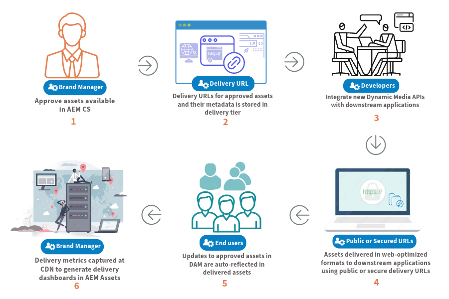
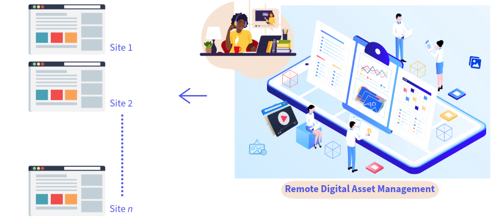

# Dynamic Media con funzionalità OpenAPI {#new-dynaminc-media-apis-overview}

Nel mondo digitale odierno in rapida evoluzione, è fondamentale sfruttare appieno il potenziale delle risorse digitali del tuo brand per battere la concorrenza. Una soluzione DAM (Digital Assets Management) olistica facilita la governance delle risorse, promuove la coerenza del brand e accelera la distribuzione dei contenuti, garantendo al contempo l’integrità del brand ed esperienze cliente eccezionali.

Dynamic Media con funzionalità OpenAPI pone DAM al centro di un ecosistema agile ed efficiente della catena di fornitura dei contenuti per garantire la governance e la distribuzione delle risorse.

## Perché utilizzare Dynamic Media con funzionalità OpenAPI? {#dynamic-media-open-api-features}

Dynamic Media con funzionalità OpenAPI offre i seguenti vantaggi chiave:

* **Integrazioni dirette**: Dynamic Media con funzionalità OpenAPI offre un set completo di API di ricerca e consegna. Consente agli sviluppatori di [integrare facilmente la consegna delle risorse con le applicazioni](/help/assets/integrate-dynamic-media-open-apis.md). Le applicazioni includono sia quelle di Adobe che quelle di terze parti. Fornisce un’[interfaccia utente del selettore delle risorse di micro front-end](/help/assets/overview-asset-selector.md) per cercare e selezionare le risorse approvate. Il selettore può essere integrato facilmente con qualsiasi applicazione basata su framework JavaScript come React JS, Angular JS e Vanilla JS.

* **Gestione centralizzata delle risorse digitali**: DAM è l’unica fonte di verità per tutte le risorse digitali. Le risorse digitali vengono gestite centralmente in AEM Assets e distribuite alle applicazioni di consumo mediante riferimento utilizzando gli URL di consegna, senza copiare i file binari delle risorse.

* **Aggiornamenti in tempo reale**: qualsiasi modifica apportata alle risorse approvate in DAM, inclusi gli aggiornamenti della versione e le modifiche ai metadati, viene automaticamente riportata negli URL di consegna. Con un valore TTL (Time-to-Live) breve di 10 minuti configurato per Dynamic Media con funzionalità OpenAPI tramite CDN, gli aggiornamenti diventano visibili in meno di 10 minuti su tutte le interfacce di authoring e pubblicazione.

* **Coerenza del brand**: solo le [risorse approvate dal brand](/help/assets/approve-assets.md) sono esposte alle applicazioni a valle. [I responsabili del brand e i marketer mantengono uno stretto controllo sulle risorse del brand](/help/assets/restrict-assets-delivery.md). È disponibile per l’uso solo la versione approvata e più recente della risorsa, che garantisce la coerenza del brand su tutti i canali e le applicazioni.

* **Consegna ottimizzata per il web**: le risorse digitali vengono consegnate in formati ottimizzati per il web in modo da migliorare i web vitals di base delle esperienze digitali. Ciò include il supporto per le rappresentazioni WebP per le immagini, lo streaming adattivo tramite protocolli HLS o DASH per i video e le rappresentazioni originali per i documenti.

* [Trasformazione dinamica delle risorse](https://developer.adobe.com/experience-cloud/experience-manager-apis): il sistema consente la trasformazione immediata delle immagini utilizzando i parametri URL noti come modificatori di immagini. Ad esempio, larghezza, altezza, rotazione, capovolgimento, qualità, ritaglio, formato e ritaglio avanzato. Le rappresentazioni trasformate vengono generate dinamicamente e consegnate senza problemi tramite la rete CDN.

* **Consegna sicura delle risorse**: Dynamic Media con funzionalità OpenAPI offre un meccanismo per controllare l’accesso alle risorse digitali. Puoi specificare ruoli o gruppi di utenti come metadati per le risorse da proteggere e impostare un intervallo di tempo predefinito durante il quale [solo gli utenti autorizzati possono accedere a tali risorse](/help/assets/restrict-assets-delivery.md). Gli URL di consegna per le risorse protette non vengono risolti per gli utenti non autorizzati durante il periodo limitato.

* **Informazioni sui dati per prendere decisioni informate (in arrivo)**: oltre alla gestione e alla consegna delle risorse, acquisisce informazioni approfondite sulla consegna dei dati nelle consegne di risorse in CDN, consentendo ai responsabili del brand di tenere traccia delle metriche di consegna tra i canali. Consente loro di prendere decisioni basate sui dati per ottimizzare continuamente la governance delle risorse e le strategie di consegna.

## Prerequisiti per accedere a Dynamic Media con funzionalità OpenAPI {#prerequisites-dynaminc-media-open-apis}

Per accedere a Dynamic Media con funzionalità OpenAPI, è necessario disporre di licenze per:

* AEM Assets as a Cloud Service

* AEM Dynamic Media

## In che modo abilitare Dynamic Media con le funzionalità OpenAPI? {#enable-dynamic-media-open-apis}

Prima di inviare una richiesta per abilitare Dynamic Media con funzionalità OpenAPI su AEM as a Cloud Service, accertati che non sia già abilitato.

Una volta soddisfatti i [prerequisiti](#prerequisites-dynaminc-media-open-apis) e se Dynamic Media con funzionalità OpenAPI è abilitato nell’istanza AEM as a Cloud Service, è disponibile un URL di consegna per ogni risorsa approvata nell’archivio. Per informazioni su come copiare l’URL di consegna, consulta [Copiare l’URL di consegna per le risorse approvate](approve-assets.md#copy-delivery-url-approved-assets). Adobe consiglia di utilizzare questo metodo per verificare che Dynamic Media con funzionalità OpenAPI sia abilitato su AEM as a Cloud Service prima di inviare un ticket di supporto per abilitarlo.

Per abilitare Dynamic Media con funzionalità OpenAPI su AEM as a Cloud Service, invia un ticket di supporto Adobe con i seguenti dettagli:

* Programma Cloud Service e ID ambiente

* Dettagli del caso d’uso da risolvere con Dynamic Media con l’integrazione delle funzionalità OpenAPI.

* Dettagli delle applicazioni a valle da integrare con Dynamic Media con funzionalità OpenAPI.

  >[!NOTE]
  >
  > Per l’integrazione con un’applicazione non Adobe, fornisci i nomi di dominio per fornire l’elenco consentiti in cui è ospitata l’applicazione.

* Dettagli dei contatti chiave della clientela coinvolta nel progetto di integrazione.

* Elenco dei membri chiave del team Adobe Account (e-mail).

Dopo aver inviato il ticket di supporto, Adobe abilita Dynamic Media con funzionalità OpenAPI nell’ambiente dei Servizi cloud e condivide i dettagli, come l’ID client IMS, per consentire all’utente di procedere con l’integrazione.

>[!NOTE]
>
>Escludi `/conf/global/settings/dam/assets-configurations/assetdelivery` da qualsiasi pacchetto di contenuti, per evitare la disattivazione di Dynamic Media con funzionalità OpenAPI.

## Approfondire le funzionalità chiave {#learn-more-key-capabilities}

<table>
<td>
   
   

      <a href="/help/assets/approve-assets.md"> <strong>Approvare risorse in Experience Manager Assets</strong> </a>
   

   

      <em>Approva le risorse in AEM Assets per semplificare la gestione delle risorse, garantendo un processo controllato ed efficiente per la gestione delle risorse.</em>
   

</td>
<td>
   
   

      <a href="/help/assets/integrate-dynamic-media-open-apis.md"> <strong>Integrare AEM Assets con le applicazioni a valle</strong> </a>
   

   

      <em>Integra la tua interfaccia utente personalizzata con l’archivio di Experience Manager Assets utilizzando le API di ricerca e consegna oppure utilizza il selettore delle risorse micro front-end di Adobe.</em>
   

</td>
<td>
   
   

      <a href="/help/assets/overview-asset-selector.md"> <strong>Selettore risorse micro front-end di Adobe</strong> </a>
   

   

      <em>Interfaccia utente che interagisce con l’archivio di AEM Assets per cercare le risorse e utilizzarle nell’esperienza di authoring dell’applicazione.</em>
   

</td>
</table>
<table>

<table>
<td>
   
   

      <a href="/help/assets/search-assets-api.md"> <strong>Cercare risorse nell’archivio di Experience Manager Assets</strong> </a>
   

   

      <em>Cerca le risorse nell’archivio di AEM Assets in modo che possano essere consegnate alle applicazioni a valle.</em>
   

</td>
<td>
   
   

      <a href="/help/assets/deliver-assets-apis.md"> <strong>Consegnare risorse alle applicazioni a valle</strong> </a>
   

   

      <em>Consegna le risorse alle applicazioni a valle integrate utilizzando un URL di consegna.</em>
   

</td>
<td>
   
   

      <a href="/help/assets/restrict-assets-delivery.md"> <strong>Limitare l’accesso alle risorse in Experience Manager</strong> </a>
   

   

      <em>L’amministratore DAM o i responsabili del brand limitano l’accesso configurando i ruoli per le risorse approvate nell’istanza di authoring di AEM as a Cloud Service.</em>
   

</td>

</table>
<table>
<td>
   
   

      <a href="/help/assets/integrate-remote-approved-assets-with-sites.md"> <strong>Integrare AEM Assets remoto con AEM Sites</strong> </a>
   

   

      <em>Scopri come integrare AEM Assets remoto con l’ambiente AEM Sites. </em>
   

</td>
<td>
   
   

      <a href="/help/assets/dynamic-media-open-apis-faqs.md"> <strong>Domande frequenti su Dynamic Media con funzionalità OpenAPI</strong> </a>
   

   

      <em>Ottieni una risposta alle domande più frequenti su Dynamic Media con funzionalità OpenAPI.</em>
   

</td>
<td>
   
   

      <a href="/help/assets/configure-custom-domain.md"> <strong>Configurare domini personalizzati</strong> </a>
   

   

      <em>Se AEM as a Cloud Service viene fornito con un dominio predefinito, puoi personalizzarlo in base alle tue esigenze.</em>
   

</td>

</table>
