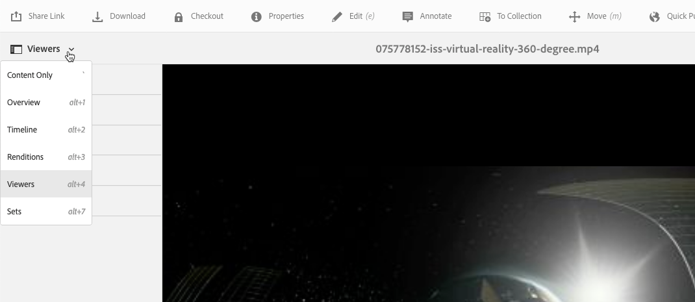

# 360/VR Video {#vr-video}

I video a 360 gradi registrano contemporaneamente una vista in ogni direzione. Le riprese vengono effettuate utilizzando una telecamera omnidirezionale o una raccolta di telecamere. Durante la riproduzione su un display piatto, l&#39;utente ha il controllo dell&#39;angolo di visione; la riproduzione su dispositivi mobili solitamente utilizza i controlli giroscopici incorporati.

Dynamic Media include il supporto nativo per la distribuzione di 360 risorse video. Per impostazione predefinita, non è necessaria alcuna configurazione aggiuntiva per la visualizzazione o la riproduzione. Potete distribuire video a 360 gradi utilizzando estensioni video standard come .mp4, .mkv e .mov. Il codec più comune è H.264.

Questa sezione descrive come utilizzare il visualizzatore video 360/VR per riprodurre video equirettangolari per un’esperienza di visualizzazione coinvolgente di una stanza, una proprietà, un luogo, un paesaggio, una procedura medica e così via.

L&#39;audio spaziale non è attualmente supportato; se l&#39;audio è mixato in stereo, il bilanciamento (L/R) non cambia quando il cliente cambia l&#39;angolo di visione della telecamera.

Consultate [Utilizzo di video Dynamic Media 360 e Miniatura video personalizzata con Risorse](https://docs.adobe.com/content/help/en/experience-manager-learn/assets/dynamic-media/dynamic-media-360-video-custom-thumbnail-feature-video-use.html)AEM.

See also [Managing Viewer Presets](/help/assets/dynamic-media/managing-viewer-presets.md).

## 360 Video in azione {#video-in-action}

Toccate [Space Station 360](http://mobiletest.scene7.com/s7viewers/html5/Video360Viewer.html?asset=Viewers/space_station_360-AVS) per aprire una finestra del browser e guardate un video a 360 gradi. Durante la riproduzione del video, trascinate il puntatore del mouse in una nuova posizione per cambiare l’angolo di visualizzazione.

*Fotogramma video da Space Station 360*

## Video 360/VR e Adobe Premiere Pro {#vr-video-and-adobe-premiere-pro}

Potete utilizzare Adobe Premiere Pro per visualizzare e modificare il metraggio 360/VR. Ad esempio, potete inserire correttamente logo e testo in una scena e applicare effetti e transizioni progettati specificamente per i supporti equirettangolari.

Consultate [Modificare video](https://helpx.adobe.com/premiere-pro/how-to/edit-360-vr-video.html)360/VR.

## Caricamento delle risorse per l’uso con il visualizzatore video 360 {#uploading-assets-for-use-with-the-video-viewer}

360 risorse video caricate in AEM sono etichettate come **Multimedia** su una pagina di risorse, in modo simile alla normale risorsa video.

*Una risorsa video 360 caricata visibile nella vista a schede. La risorsa è etichettata come Multimedia.*

**Per caricare le risorse da usare con il visualizzatore video 360:**

1. È stata creata una cartella dedicata alla risorsa video 360.
1. [Applicate un profilo video adattivo alla cartella](/help/assets/dynamic-media/video-profiles.md#applying-a-video-profile-to-folders).

   Il rendering di contenuti video a 360° pone requisiti più elevati per la risoluzione video sorgente e per la risoluzione delle rappresentazioni codificate rispetto al contenuto video standard non 360.

   Potete usare il profilo video adattivo fornito con i file multimediali dinamici. Tuttavia, tenete presente che la qualità video risulterà notevolmente inferiore a 360 rispetto a quella ottenuta per video non codificati con 360 impostazioni con le stesse impostazioni sottoposte a rendering con un visualizzatore video non 360. Pertanto, se è richiesto un video di alta qualità 360, effettuate le seguenti operazioni:

   * È consigliabile che il contenuto video originale a 360 abbia una delle seguenti risoluzioni:

      * 1080p - 1920 x 1080, noto come risoluzione Full HD o FHD oppure
      * 2160p - 3840 x 2160, noto come risoluzione 4K, UHD o Ultra HD. Questa grande risoluzione del display si trova spesso sui televisori e monitor per computer premium. La risoluzione 2160p è spesso denominata &quot;4K&quot; perché la larghezza è vicina a 4000 pixel. In altre parole, offre quattro volte i pixel di 1080p.
   * [Create un profilo](/help/assets/dynamic-media/video-profiles.md#creating-a-video-encoding-profile-for-adaptive-streaming) video adattivo personalizzato con rappresentazioni di qualità superiore. Ad esempio, potete creare un profilo video adattivo che contenga le seguenti tre impostazioni:

      * width=auto; height=720; bitrate=2500 kbps
      * width=auto; height=1080; bitrate=5000 kbps
      * width=auto; height=1440; bitrate=6600 kbps
   * Elaborate contenuti video 360 in una cartella dedicata esclusivamente a 360 risorse video.

   Questo approccio comporterà anche maggiori esigenze per la rete e la CPU dell&#39;utente finale.

1. [Caricate il video nella cartella](/help/assets/manage-video-assets.md#upload-and-preview-video-assets).

<!--

## Overriding the default aspect ratio of 360 videos  {#overriding-the-default-aspect-ratio-of-videos}

For an uploaded asset to qualify as a 360 video that you intend to use with the 360 Video viewer, the asset must have an aspect ratio of 2.

By default, AEM detects video as "360" if its aspect ratio (width/height) is 2.0. If you are an Administrator, you can override the default aspect ratio setting of 2 by setting the optional `s7video360AR` property in CRXDE Lite at the following:

* `/conf/global/settings/cloudconfigs/dmscene7/jcr:content`

  * **Property type**: Double
  * **Value**: floating-point aspect ratio, default 2.0.

After you set this property, it takes effect immediately on both existing videos and newly uploaded videos.

The aspect ratio applies to 360 video assets for the asset details page and the [Video 360 Media WCM component](/help/assets/dynamic-media/adding-dynamic-media-assets-to-pages.md#dynamic-media-components).

Start by uploading 360 Videos.

-->

## Previewing 360 Video {#previewing-video}

Potete usare Anteprima per vedere l’aspetto del video 360 per i clienti e per assicurarvi che funzioni come previsto.

Consultate anche [Modifica dei predefiniti](/help/assets/dynamic-media/managing-viewer-presets.md#editing-viewer-presets)per visualizzatori.

Quando siete soddisfatti del video 360, potete pubblicarlo.

See [Embedding the Video or Image Viewer on a Web Page](/help/assets/dynamic-media/embed-code.md).
See [Linking URLs to your web application](/help/assets/dynamic-media/linking-urls-to-yourwebapplication.md). Il metodo di collegamento basato su URL non è possibile se il contenuto interattivo contiene collegamenti con URL relativi, in particolare con collegamenti alle pagine AEM Sites.
See [Adding Dynamic Media Assets to pages.](/help/assets/dynamic-media/adding-dynamic-media-assets-to-pages.md)

**Per visualizzare in anteprima 360 video**

1. In **[!UICONTROL Risorse]**, passa a un video 360 esistente creato. Toccate la risorsa video 360 per aprirla in modalità di anteprima.

   

   Toccate la risorsa video 360 per visualizzare l’anteprima del video.

1. Nella pagina di anteprima, nell’angolo in alto a sinistra della pagina, toccate l’elenco a discesa, quindi selezionate **[!UICONTROL Visualizzatori]**.

   

   Nell’elenco Visualizzatori, toccate **[!UICONTROL Video360_social]**, quindi effettuate una delle seguenti operazioni:

   * Trascinate il puntatore del mouse sul video per modificare l’angolo di visualizzazione della scena statica.
   * Toccate il pulsante **[!UICONTROL Riproduci]** del video per iniziare la riproduzione; durante la riproduzione del video, trascinate il puntatore del mouse sul video per modificare l’angolo di visualizzazione.

   *socialA 360 screenshot video.*

   * Dall’elenco Visualizzatori, toccate **[!UICONTROL Video360VR]**.

      Il video Virtual Reality (VR) è un contenuto video coinvolgente a cui si accede attraverso l’utilizzo di cuffie per realtà virtuale. Come per i normali video, puoi creare video VR all’inizio quando un video viene registrato o acquisito con telecamere a 360 gradi.
   
   *Schermata video 360 VR.*

1. Near the upper-right of the preview page, tap **[!UICONTROL Close]**.

## Pubblicazione di video 360 {#publishing-video}

Per poter utilizzare il video 360, è necessario pubblicarlo. Quando si pubblica un video 360, vengono attivati l’URL e il codice da incorporare. Pubblica anche il video 360 su Dynamic Media Cloud, integrato con un CDN per una distribuzione scalabile e performante.

Consultate [Pubblicazione di risorse](/help/assets/dynamic-media/publishing-dynamicmedia-assets.md) multimediali dinamiche per informazioni dettagliate sulla pubblicazione di video 360.
See also [Embedding the Video or Image Viewer on a Web Page](/help/assets/dynamic-media/embed-code.md).
See also [Linking URLs to your web application](/help/assets/dynamic-media/linking-urls-to-yourwebapplication.md). Il metodo di collegamento basato su URL non è possibile se il contenuto interattivo contiene collegamenti con URL relativi, in particolare con collegamenti alle pagine AEM Sites.
See also [Adding Dynamic Media Assets to pages.](/help/assets/dynamic-media/adding-dynamic-media-assets-to-pages.md)
