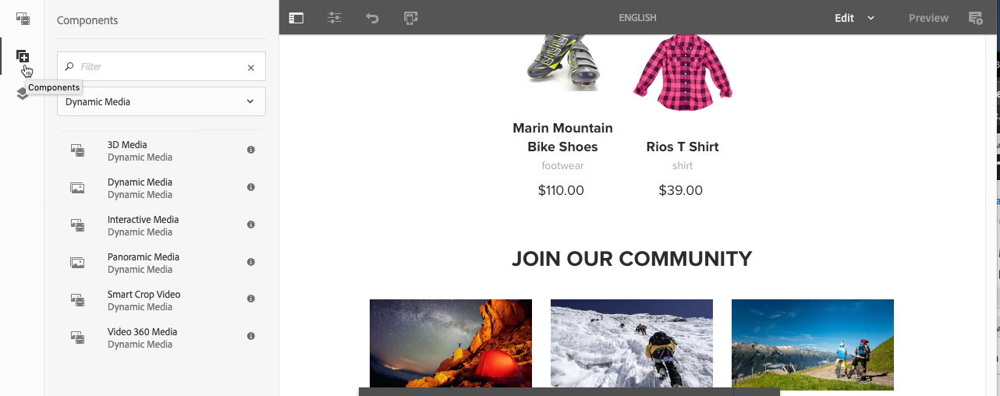

# Aggiunta di risorse Dynamic Media alle pagine{#adding-dynamic-media-assets-to-pages}

Per aggiungere la funzionalità Dynamic Media alle risorse utilizzate sui siti web, puoi inserire direttamente nella pagina il componente **Dynamic Media**, **File multimediali interattivi**, **Elemento multimediale panoramico** o **File multimediali video 360**. A tale scopo, entra in modalità Layout e attiva i componenti Dynamic Media. Quindi, potrai aggiungere questi componenti alla pagina e fornire così risorse al componente. I componenti Dynamic Media sono intelligenti: rilevano l’aggiunta di un’immagine o di un video, dunque le opzioni di configurazione disponibili cambiano di conseguenza.

Se utilizzi AEM come WCM, puoi aggiungere direttamente alla pagina le risorse Dynamic Media. Se ti avvali di una terza parte per WCM, puoi [collegare](/help/assets/dynamic-media/linking-urls-to-yourwebapplication.md) o [incorporare](/help/assets/dynamic-media/embed-code.md) le risorse. Per un sito web dinamico di terze parti, consulta la sezione [Distribuzione di immagini ottimizzate in un sito dinamico](/help/assets/dynamic-media/responsive-site.md).

>[!NOTE]
>
>È necessario pubblicare le risorse prima di aggiungerle alle pagine in AEM. See [Publishing Dynamic Media Assets](/help/assets/dynamic-media/publishing-dynamicmedia-assets.md).

## Adding a Dynamic Media component to a page {#adding-a-dynamic-media-component-to-a-page}

L’aggiunta di un componente per contenuti multimediali dinamici, contenuti multimediali interattivi, file multimediali panoramici o video 360 a una pagina equivale all’aggiunta di un componente a una pagina. I componenti per contenuti multimediali dinamici sono descritti nelle sezioni seguenti.

**Aggiunta di un componente per contenuti multimediali dinamici a una pagina**

1. In AEM, apri la pagina in cui desideri aggiungere il Componente elementi multimediali dinamici.
1. Nel riquadro a sinistra, toccate l’icona **[!UICONTROL Componenti]** , quindi filtrate gli elementi multimediali dinamici.

   Se non sono disponibili componenti per contenuti multimediali dinamici, è necessario attivare o disattivare i componenti per contenuti multimediali dinamici. Per ulteriori informazioni, consulta [Modifica di modelli - Autori](/help/sites-cloud/authoring/features/templates.md) di modelli.

   

1. Trascinate un componente **[!UICONTROL Contenuti multimediali]** dinamici e rilasciatelo nella posizione desiderata sulla pagina.

   Nell’esempio di seguito, viene utilizzato il componente **[!UICONTROL Video 360 Media]** .

   

1. Passate il puntatore del mouse direttamente sul componente. Quando il componente è circondato da una casella blu, toccate una volta per visualizzare la barra degli strumenti del componente. Toccate l&#39;icona **[!UICONTROL Configurazione (chiave inglese)]** .

   

1. A seconda del componente Contenuti multimediali dinamici rilasciato sulla pagina, si apre una finestra di dialogo di configurazione. [Impostate le opzioni](/help/assets/dynamic-media/adding-dynamic-media-assets-to-pages.md#dynamic-media-components) del componente come necessario.

   L’esempio seguente mostra la finestra di dialogo del componente **[!UICONTROL Video 360 per contenuti multimediali]** dinamici e le opzioni disponibili nell’elenco a discesa Predefinito visualizzatore.

   

   Componente Video multimediale dinamico 360.

1. Al termine, nell’angolo superiore destro della finestra di dialogo toccate il segno di spunta per salvare le modifiche.

## Localizzazione dei componenti per contenuti multimediali dinamici {#localizing-dynamic-media-components}

Potete localizzare i componenti per contenuti multimediali dinamici in uno dei due modi seguenti:

* In una pagina web di Sites, apri **[!UICONTROL Proprietà]** e seleziona la scheda **[!UICONTROL Avanzate]**. Scegli la lingua desiderata per la localizzazione.

   

* Dal selettore del sito, selezionate la pagina o il gruppo di pagine desiderato. Toccate **[!UICONTROL Proprietà]** e selezionate la scheda **[!UICONTROL Avanzate]** . Scegli la lingua desiderata per la localizzazione.

   >[!NOTE]
   >
   >Al momento non tutte le lingue disponibili nel menu **[!UICONTROL Lingua]** dispongono di token.

## Componenti per contenuti multimediali dinamici disponibili {#dynamic-media-components}

I componenti per contenuti multimediali dinamici sono disponibili quando toccate l’icona **[!UICONTROL Componenti]** e quindi applicate un filtro a Contenuti multimediali **[!UICONTROL dinamici]**.

I componenti per contenuti multimediali dinamici disponibili sono i seguenti:

* **[!UICONTROL Dynamic Media]**: da utilizzare per risorse quali immagini, video, eCatalog e set 360 gradi.
* **[!UICONTROL Contenuti multimediali]** interattivi - Utilizzate per qualsiasi risorsa interattiva, ad esempio video interattivi, immagini interattive o set di caroselli.
* **[!UICONTROL Supporti]** panoramici - Utilizzati per immagini panoramiche o risorse di immagini VR panoramiche.
* **[!UICONTROL Video 360 Media]** - Utilizzate per risorse video 360 e 360 VR.

>[!NOTE]
>
>Questi componenti non sono disponibili per impostazione predefinita e devono essere resi disponibili dall’editor modelli prima di utilizzarli. Una volta resi disponibili nell’editor modelli, potete aggiungere i componenti alla pagina come qualsiasi altro componente AEM.

### Componente: Elemento multimediale dinamico {#dynamic-media-component}

Il componente Contenuti multimediali dinamici è elegante. A seconda se aggiungete un’immagine o un video, avete a disposizione diverse opzioni. Il componente supporta i predefiniti per immagini e i visualizzatori basati su immagini, come set di immagini, set di rotazione, set di file multimediali diversi e video. Inoltre, il visualizzatore è reattivo: le dimensioni dello schermo cambiano automaticamente in base alle dimensioni dello schermo. Tutti i visualizzatori sono visualizzatori HTML5.

>[!NOTE]
>
>Se la pagina Web ha i seguenti elementi:
>
>* Più istanze del componente Contenuti multimediali dinamici in uso sulla stessa pagina.
>* Ogni istanza utilizza lo stesso tipo di risorsa.
>
>
L’assegnazione di un predefinito per visualizzatori diverso a ciascun componente per contenuti multimediali dinamici nella pagina non è supportata.
>
>Tuttavia, potete usare lo stesso predefinito per visualizzatori per tutti i componenti per contenuti multimediali dinamici che utilizzano risorse dello stesso tipo, all’interno della pagina.

Quando aggiungi il Componente elementi multimediali dinamici e le **[!UICONTROL Impostazioni elemento multimediale dinamico]** sono vuote o non è possibile aggiungere correttamente una risorsa, controlla quanto segue:

* L&#39;immagine è in formato TIFF piramidale. Le immagini importate prima dell&#39;attivazione dell’elemento multimediale dinamico non hanno un file TIFF piramidale.

#### Quando si lavora con le immagini {#when-working-with-images}

Il componente elementi multimediali dinamici consente di aggiungere immagini dinamiche, compresi set di immagini, set di rotazione e set di file multimediali diversi. È possibile ingrandire, ridurre e, se applicabile, ruotare un&#39;immagine all&#39;interno di un set 360 gradi, o selezionare un&#39;immagine da un altro tipo di set.

È possibile anche configurare il predefinito visualizzatore, il predefinito immagine o il formato immagine direttamente nel componente. Per rendere un&#39;immagine reattiva è possibile impostare i punti di interruzione o applicare un predefinito immagine reattiva.

You can edit the following Dynamic Media Settings by tapping the **[!UICONTROL Edit]** icon in the component and then **[!UICONTROL Dynamic Media Settings]**.

>[!NOTE]
>
>Per impostazione predefinita, il componente immagine Dynamic Media è adattivo. Se vuoi impostarne una dimensione fissa, lo puoi fare nella scheda **[!UICONTROL Avanzate]** del componente, alle voci **[!UICONTROL Larghezza]** e **[!UICONTROL Altezza]**.

* **[!UICONTROL Predefinito]** visualizzatore - Selezionate un predefinito esistente dal menu a discesa. Se il predefinito per visualizzatori che cerchi non è visibile, potrebbe essere necessario renderlo visibile. Consulta Gestione dei predefiniti per visualizzatori. Non è possibile selezionare un predefinito per visualizzatori se si utilizza un predefinito per immagini, e viceversa.

   Questa è l&#39;unica opzione disponibile se stai visualizzando set di immagini, set di rotazione o set di file multimediali diversi. Anche i predefiniti per visualizzatori sono avanzati: vengono visualizzati solo i predefiniti per visualizzatori pertinenti.

* **[!UICONTROL Modificatori]** visualizzatore - I modificatori visualizzatore assumono la forma di coppia nome=valore con un carattere di delimitazione &amp; e consentono di modificare i visualizzatori come indicato nella guida di riferimento dei visualizzatori. Un esempio di modificatore del visualizzatore è `posterimage=img.jpg&caption=text.vtt,1` che imposta un’immagine diversa per la miniatura del video e associa un file di sottotitoli/sottotitoli codificati al video.

* **[!UICONTROL Predefinito]** immagine - Selezionate un predefinito per immagini esistente dal menu a discesa. Se il predefinito per immagini che cerchi non è visibile, potrebbe essere necessario renderlo visibile. Consulta Gestione dei predefiniti per immagini. Non è possibile selezionare un predefinito per visualizzatori se si utilizza un predefinito per immagini, e viceversa.

   Questa è l&#39;unica opzione disponibile se stai visualizzando set di immagini, set di rotazione o set di file multimediali diversi.

* **[!UICONTROL Modificatori]** immagini - Potete applicare effetti immagine fornendo ulteriori comandi immagine. Questi sono descritti nei predefiniti per immagini e nel riferimento al comando Image Server.

   Questa è l&#39;unica opzione disponibile se stai visualizzando set di immagini, set di rotazione o set di file multimediali diversi.

* **[!UICONTROL Punti di interruzione]**: se utilizzi questa risorsa in un sito reattivo, devi aggiungere i punti di interruzione immagine. I punti di interruzione immagine devono essere separati da virgole (,). Questa opzione funziona quando non è stata definita alcuna altezza o larghezza in un predefinito immagine.

   Questa è l&#39;unica opzione disponibile se stai visualizzando set di immagini, set di rotazione o set di file multimediali diversi.

   You can edit the following Advanced Settings by tapping **[!UICONTROL Edit]** in the component.

* **[!UICONTROL Titolo]**(Title) - Consente di modificare il titolo dell&#39;immagine.

* **[!UICONTROL Testo]** Alt (Alt Text) - Aggiungete un titolo all&#39;immagine per gli utenti che hanno disattivato la grafica.

   Questa è l&#39;unica opzione disponibile se stai visualizzando set di immagini, set di rotazione o set di file multimediali diversi.

* **[!UICONTROL URL, Apri in]**(Open in) - Potete impostare una risorsa per aprire un collegamento. Imposta l’URL e in Apri in indica se desideri aprirlo nella stessa finestra o in una nuova finestra.

   Questa è l&#39;unica opzione disponibile se stai visualizzando set di immagini, set di rotazione o set di file multimediali diversi.

* **[!UICONTROL Larghezza]**(Width) - Immettete il valore in pixel se desiderate che l&#39;immagine sia di dimensione fissa. Se questo valore viene lasciato vuoto, la risorsa diventa adattiva.

* **[!UICONTROL Altezza]**(Height) - Immettete il valore in pixel se desiderate che l&#39;immagine sia di dimensione fissa. Se questo valore viene lasciato vuoto, la risorsa diventa adattiva.

#### Quando esegui operazioni con i Video {#when-working-with-video}

Usate il componente Contenuti multimediali dinamici per aggiungere video dinamici alle pagine Web. Quando modifichi il componente puoi scegliere di usare un predefinito visualizzatore video predefinita per la riproduzione del video nella pagina.

You can edit the following Dynamic Media Settings by clicking **[!UICONTROL Edit]** in the component.

>[!NOTE]
>
>Per impostazione predefinita, il componente video elementi multimediali dinamici è adattivo. If you want to make it a fixed size, set it in the component with the **[!UICONTROL Width]** and **[!UICONTROL Height]** in the **[!UICONTROL Advanced]** tab.

* **[!Predefinito** per visualizzatori UICONTROL - Selezionate un predefinito per visualizzatori video esistente dal menu a discesa. Se il predefinito per visualizzatori che cerchi non è visibile, potrebbe essere necessario renderlo visibile. Consulta Gestione dei predefiniti per visualizzatori. 

* **[!Modificatori** visualizzatore UICONTROL: i modificatori di visualizzatori assumono la forma di coppia nome=valore con un carattere di delimitazione &amp; e consentono di modificare i visualizzatori come indicato nella Guida di riferimento dei visualizzatori Adobe. Un esempio di modificatore visualizzatore è `posterimage=img.jpg&caption=text.vtt,1`

   I modificatori del visualizzatore consentono, ad esempio, di effettuare le seguenti operazioni:

   * Associare un file di sottotitoli a un video: [caption](https://docs.adobe.com/content/help/en/dynamic-media-developer-resources/library/viewers-aem-assets-dmc/video/command-reference-url-video/r-html5-video-viewer-url-caption.html)
   * Associare un file di navigazione a un video: [navigazione](https://docs.adobe.com/content/help/en/dynamic-media-developer-resources/library/viewers-aem-assets-dmc/video/command-reference-url-video/r-html5-video-viewer-url-navigation.html)
   You can edit the following Advanced Settings by clicking **[!UICONTROL Edit]** in the component.

* **[!UICONTROL Title**- Modifica il titolo del video.

* **[!UICONTROL Larghezza]**(Width) - Immettete il valore in pixel se desiderate che l&#39;immagine sia di dimensione fissa. Se questo valore viene lasciato vuoto, la risorsa diventa adattiva.

* **[!UICONTROL Altezza]**(Height) - Immettete il valore in pixel se desiderate che l&#39;immagine sia di dimensione fissa. Se questo valore viene lasciato vuoto, la risorsa diventa adattiva.

#### Quando si lavora con Smart Crop {#when-working-with-smart-crop}

Usate il componente Contenuti multimediali dinamici per aggiungere le risorse di immagine Ritaglio avanzato alle pagine Web. Quando modifichi il componente puoi scegliere di usare un predefinito visualizzatore video predefinita per la riproduzione del video nella pagina.

Consultate [Utilizzo di Smart Crop con AEM Assets Dynamic Media](https://docs.adobe.com/content/help/en/experience-manager-learn/assets/dynamic-media/smart-crop-feature-video-use.html)

Consultate anche Profili [immagine](/help/assets/dynamic-media/image-profiles.md).

You can edit the following Dynamic Media Setting by clicking **[!UICONTROL Edit]** in the component.

>[!NOTE]
>
>Per impostazione predefinita, il componente immagine Dynamic Media è adattivo. Se vuoi impostarne una dimensione fissa, lo puoi fare nella scheda **[!UICONTROL Avanzate]** del componente, alle voci **[!UICONTROL Larghezza]** e **[!UICONTROL Altezza]**.

* **[!UICONTROL Modificatori]** immagini - Potete applicare effetti immagine fornendo ulteriori comandi immagine. Questi sono descritti nei predefiniti per immagini e nel riferimento al comando Image Server.

   Questa è l&#39;unica opzione disponibile se stai visualizzando set di immagini, set di rotazione o set di file multimediali diversi.

   You can edit the following Advanced Settings by clicking **[!UICONTROL Edit]** in the component.

* **[!UICONTROL Abilita corrispondenza]** proporzioni - Selezionate questa opzione per consentire a Contenuti multimediali dinamici di scegliere una rappresentazione di ritaglio avanzato con proporzioni che meglio corrispondono alle proporzioni dell&#39;immagine originale.

* **[!UICONTROL Titolo]**(Title) - Consente di modificare il titolo dell&#39;immagine SmartCrop.

* **[!UICONTROL Testo]** Alt (Alt Text) - Aggiungete un titolo all&#39;immagine di ritaglio avanzato per gli utenti che hanno disattivato la grafica.

   Questa è l&#39;unica opzione disponibile se stai visualizzando set di immagini, set di rotazione o set di file multimediali diversi.

* **[!UICONTROL URL, Apri in]**(Open in) - Potete impostare una risorsa per aprire un collegamento. Imposta l’URL e in Apri in indica se desideri aprirlo nella stessa finestra o in una nuova finestra.

   Questa è l&#39;unica opzione disponibile se stai visualizzando set di immagini, set di rotazione o set di file multimediali diversi.

* **[!UICONTROL Larghezza]**(Width) - Immettete il valore in pixel se desiderate che l&#39;immagine sia di dimensione fissa. Se questo valore viene lasciato vuoto, la risorsa diventa adattiva.

* **[!UICONTROL Altezza]**(Height) - Immettete il valore in pixel se desiderate che l&#39;immagine sia di dimensione fissa. Se questo valore viene lasciato vuoto, la risorsa diventa adattiva.

### Componente: Contenuti multimediali interattivi {#interactive-media-component}

Il Componente File multimediali interattivi è adatto per le risorse che dispongono di interattività, come punti attivi o mappe immagine. Se disponi di un&#39;immagine, un video interattivo o un banner carosello, utilizza il componente **[!UICONTROL File multimediali interattivi]**.

Il componente Contenuti multimediali interattivi è avanzato. A seconda se aggiungete un’immagine o un video, avete a disposizione diverse opzioni. Inoltre, il visualizzatore è reattivo: le dimensioni dello schermo cambiano automaticamente in base alle dimensioni dello schermo. Tutti i visualizzatori sono visualizzatori HTML5.

>[!NOTE]
>
>Se la pagina Web ha i seguenti elementi:
>
>* Più istanze del componente Supporto interattivo in uso sulla stessa pagina.
>* Ogni istanza utilizza lo stesso tipo di risorsa.
>
>
Tenete presente che l’assegnazione di un predefinito per visualizzatori diverso a ciascun componente per contenuti multimediali interattivi in quella pagina non è supportata.
>
>Tuttavia, potete usare lo stesso predefinito per visualizzatori per tutti i componenti per contenuti multimediali interattivi che utilizzano risorse dello stesso tipo, all’interno della pagina.

You can edit the following **[!UICONTROL General]** settings by tapping **[!UICONTROL Edit]** in the component.

* **[!UICONTROL Predefinito]** visualizzatore - Selezionate un predefinito esistente dal menu a discesa. Se il predefinito per visualizzatori che cerchi non è visibile, potrebbe essere necessario renderlo visibile. I predefiniti per visualizzatori devono essere pubblicati prima di poter essere utilizzati. Consulta Gestione dei predefiniti per visualizzatori. 

* **[!UICONTROL Titolo]**(Title) - Consente di modificare il titolo del video.

* **[!UICONTROL Larghezza]**(Width) - Immettete il valore in pixel se desiderate che l&#39;immagine sia di dimensione fissa. Se questo valore viene lasciato vuoto, la risorsa diventa adattiva.

* **[!UICONTROL Altezza]**(Height) - Immettete il valore in pixel se desiderate che l&#39;immagine sia di dimensione fissa. Se questo valore viene lasciato vuoto, la risorsa diventa adattiva.

   È possibile modificare le seguenti impostazioni **[!UICONTROL Aggiungi al carrello]**, facendo clic su **[!UICONTROL Modifica]** nel componente.

* **[!UICONTROL Mostra risorsa]** prodotto: per impostazione predefinita, questo valore è selezionato. La risorsa di prodotto mostra un&#39;immagine del prodotto in base a quanto definito nel modulo Commerce. Rimuovi il segno di spunta per non visualizzare la risorsa di prodotto.

* **[!UICONTROL Mostra prezzo]** prodotto: per impostazione predefinita, questo valore è selezionato. Prezzo del prodotto mostra il prezzo dell&#39;elemento in base a quanto definito nel modulo Commerce. Rimuovi il segno di spunta per non visualizzare il prezzo del prodotto.

* **[!UICONTROL Mostra modulo]** prodotto - Per impostazione predefinita, questo valore non è selezionato. Il Modulo del prodotto include tutte le varianti del prodotto, come la dimensione e il colore. Rimuovi il segno di spunta per non visualizzare le varianti prodotto.

### Componente: Supporti panoramici {#panoramic-media-component}

Il componente Contenuti multimediali panoramici è destinato alle risorse che sono immagini panoramiche sferiche. Tali immagini forniscono un&#39;esperienza di visualizzazione a 360° di una stanza, una proprietà, una posizione o un paesaggio. Affinché un’immagine possa essere definita come panorama sferico, deve avere una O entrambe le caratteristiche seguenti:

* Proporzioni di 2:1.
* Tag con le parole chiave `equirectangular` o (`spherical` + `panorama`) o (`spherical` + `panoramic`). Consultate [Utilizzo dei tag](/help/sites-cloud/authoring/features/tags.md).

Sia le proporzioni che i criteri delle parole chiave si applicano alle risorse panoramiche della pagina dettagli risorsa e al componente WCM per **[!UICONTROL elementi multimediali panoramici]**.

>[!NOTE]
>
>Se la pagina Web ha i seguenti elementi:
>
>* Nella stessa pagina vengono utilizzate più istanze del componente **[!UICONTROL Panoramic Media]** .
>* Ogni istanza utilizza lo stesso tipo di risorsa.
>
>
Non è supportata l’assegnazione di un predefinito visualizzatore diverso a ciascun componente **[!UICONTROL Elemento multimediale panoramico]** di quella pagina.
>
>Tuttavia, potete usare lo stesso predefinito per visualizzatori per tutti i componenti per file multimediali panoramici che utilizzano risorse dello stesso tipo, all’interno della pagina.

Per modificare la seguente impostazione, tocca **[!UICONTROL Configura]** nel componente.

* **[!UICONTROL Predefinito]** visualizzatore - Selezionate un visualizzatore esistente dal menu a discesa Predefinito visualizzatore.

Se il predefinito per visualizzatori ricercato non è visibile, accertatevi che sia pubblicato. Per poter usare i predefiniti per visualizzatori, dovete pubblicarli. Consulta [Gestione dei predefiniti per visualizzatori](/help/assets/dynamic-media/managing-viewer-presets.md). 

### Componente: Video 360 Media {#video-media-component}

Usate il componente **[!UICONTROL Video 360 Media]** per riprodurre video equirettangolari sulla pagina Web per un’esperienza di visualizzazione coinvolgente di una stanza, una proprietà, un luogo, un paesaggio o una procedura medica.

Durante la riproduzione su un display piatto, l&#39;utente ha il controllo dell&#39;angolo di visione; la riproduzione su dispositivi mobili solitamente utilizza i controlli giroscopici incorporati.

Il visualizzatore include il supporto nativo per la distribuzione di 360 risorse video. Per impostazione predefinita, non è necessaria alcuna configurazione aggiuntiva per la visualizzazione o la riproduzione. Potete distribuire video a 360 gradi utilizzando estensioni video standard come .mp4, .mkv e .mov. Il codec più comune è H.264.

Per modificare la seguente impostazione, tocca **[!UICONTROL Configura]** nel componente.

* **[!UICONTROL Predefinito]** visualizzatore - Selezionate un visualizzatore esistente dal menu a discesa Predefinito visualizzatore. Utilizzate Video360VR per gli utenti finali che utilizzano occhiali di realtà virtuale. Include controlli di riproduzione video di base e funzioni per social media. Utilizzate Video360_social che include controlli di riproduzione video di base. Il rendering video viene eseguito in modalità stereo. Il controllo manuale del punto di vista è disattivato ma il controllo giroscopico è attivato. Non esistono funzioni per social media.

Se il predefinito per visualizzatori ricercato non è visibile, accertatevi che sia pubblicato. Per poter usare i predefiniti per visualizzatori, dovete pubblicarli. Consulta [Gestione dei predefiniti per visualizzatori](/help/assets/dynamic-media/managing-viewer-presets.md). 

### Utilizzo di HTTP/2 per la distribuzione di risorse multimediali dinamiche {#using-http-to-delivery-dynamic-media-assets}

HTTP/2 è il nuovo protocollo Web aggiornato che migliora il modo in cui i browser e i server comunicano. Fornisce un trasferimento più rapido delle informazioni e riduce la quantità di potenza di elaborazione necessaria. La distribuzione delle risorse Dynamic Media ora può avvenire tramite HTTP/2, migliorando la risposta e i tempi di caricamento.

Per informazioni dettagliate sull’utilizzo di HTTP/2 con l’account per contenuti multimediali dinamici, consultate Consegna di contenuti  HTTP2.

>[!MORELIKETHIS]
>
>* [Utilizzo del lettore video in AEM Dynamic Media](https://docs.adobe.com/content/help/en/experience-manager-learn/assets/dynamic-media/dynamic-media-video-player-feature-video-use.html)
>* [Utilizzo di video interattivi con AEM Dynamic Media](https://docs.adobe.com/content/help/en/experience-manager-learn/assets/dynamic-media/dynamic-media-interactive-video-feature-video-use.html)
>* [Il visualizzatore delle risorse con AEM Dynamic Media](https://docs.adobe.com/content/help/en/experience-manager-learn/assets/dynamic-media/dynamic-media-viewer-feature-video-understand.html)
>* [Utilizzo della miniatura video personalizzata con AEM Dynamic Media](https://docs.adobe.com/content/help/en/experience-manager-learn/assets/dynamic-media/dynamic-media-video-thumbnails-feature-video-use.html)
>* [Gestione del colore con AEM Dynamic Media](https://docs.adobe.com/content/help/en/experience-manager-learn/assets/dynamic-media/dynamic-media-color-management-technical-video-setup.html)
>* [Utilizzo della nitidezza delle immagini con AEM Dynamic Media](https://docs.adobe.com/content/help/en/experience-manager-learn/assets/dynamic-media/dynamic-media-image-sharpening-feature-video-use.html)

