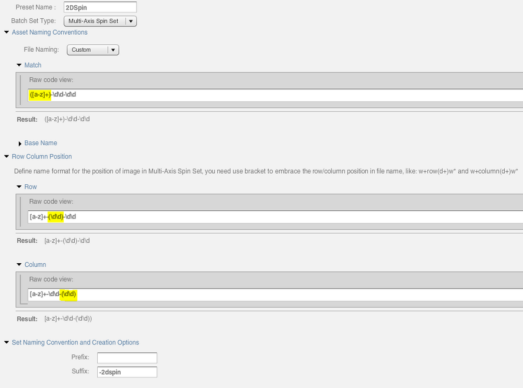
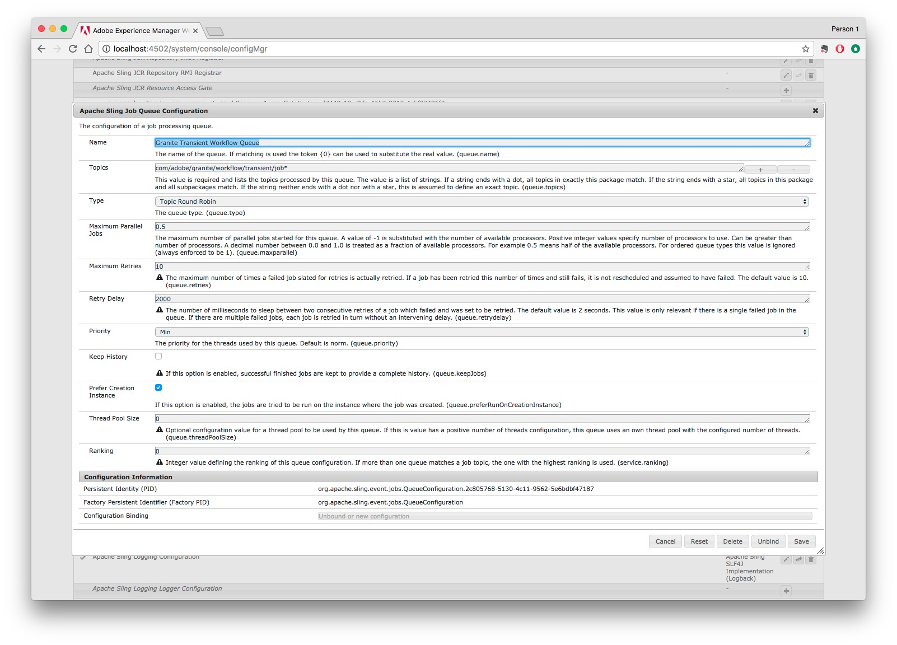

# Informazioni sulla configurazione di Dynamic Media Cloud Service {#configuring-dynamic-media-scene-mode}

Se utilizzi Adobe Experience Manager impostato per ambienti diversi, ad esempio uno per lo sviluppo, uno per l’area di pubblicazione per la verifica e uno per la produzione live, devi configurare i servizi Dynamic Media Cloud per ciascuno di questi ambienti.

## Diagramma dell&#39;architettura di Dynamic Media {#architecture-diagram-of-dynamic-media-scene-mode}

Nel diagramma di architettura seguente viene descritto il funzionamento di Dynamic Media.

Con la nuova architettura, AEM è responsabile delle risorse principali e delle sincronizzazioni con Dynamic Media per l’elaborazione e la pubblicazione delle risorse:

1. Quando la risorsa principale viene caricata in AEM, viene replicata in Contenuti multimediali dinamici. A questo punto, Dynamic Media gestisce l’elaborazione e la generazione di rappresentazioni di tutte le risorse, ad esempio la codifica video e le varianti dinamiche di un’immagine.
1. Dopo la generazione delle rappresentazioni, AEM può accedere e visualizzare in modo sicuro le rappresentazioni remote per file multimediali dinamici (non vengono più inviati binari all’istanza di AEM).
1. Quando il contenuto è pronto per essere pubblicato e approvato, attiva il servizio Contenuti multimediali dinamici per inviare contenuti ai server di distribuzione e memorizzare il contenuto nella cache del CDN.


<!-- OBSOLETE CONTENT

## (Optional) Migrating Dynamic Media presets and configurations from 6.3 to 6.5 Zero Downtime {#optional-migrating-dynamic-media-presets-and-configurations-from-to-zero-downtime}

If you are upgrading AEM Dynamic Media from 6.3 to 6.4 or 6.5 (which now includes the ability for zero downtime deployments), you are required to run the following curl command to migrate all your presets and configurations from `/etc` to `/conf` in CRXDE Lite.

>[!NOTE]
>
>If you run your AEM instance in compatibility mode--that is, you have the compatibility packaged installed--you do not need to run these commands.

For all upgrades, either with or without the compatibility package, you can copy the default, out-of-the-box viewer presets that originally came with Dynamic Media by running the following Linux curl command:

`curl -u admin:admin -X POST https://<server_address>:<server_port>/libs/settings/dam/dm/presets/viewer.pushviewerpresets.json`

To migrate any custom viewer presets and configurations that you have created from `/etc` to `/conf`, run the following Linux curl command:

`curl -u admin:admin -X POST https://<server_address>:<server_port>/libs/settings/dam/dm/presets.migratedmcontent.json`

-->

## Configurazione del servizio Dynamic Media Cloud {#configuring-dynamic-media-cloud-services}

**Prima di configurare il servizio** Dynamic Media Cloud: Dopo aver ricevuto il messaggio e-mail di provisioning con le credenziali per gli elementi multimediali dinamici, dovete [accedere](https://www.adobe.com/marketing-cloud/experience-manager/scene7-login.html) a Dynamic Media Classic per cambiare la password. La password fornita nel messaggio e-mail di provisioning è generata dal sistema e deve essere solo una password temporanea. È importante aggiornare la password in modo che Dynamic Media Cloud Service sia configurato con le credenziali corrette.

Per configurare i servizi cloud per contenuti multimediali dinamici:

1. In AEM, toccate il logo AEM per accedere alla console di navigazione globale.
1. Sul lato sinistro della console, sotto l’intestazione **[!UICONTROL Strumenti]**, tocca **[!UICONTROL Cloud Services > Configurazione elemento multimediale dinamico]**.
1. Nella pagina del Browser configurazioni Dynamic Media, seleziona il riquadro a sinistra e tocca **[!UICONTROL global (globale)]** (non toccare o selezionare l’icona della cartella a sinistra di **[!UICONTROL global]**), quindi tocca **[!UICONTROL Crea]**.
1. Nella pagina Crea configurazione elemento multimediale dinamico, immetti un titolo, l’indirizzo e-mail dell’account elemento multimediale dinamico, la password, quindi seleziona la tua area geografica. Questi vengono forniti da Adobe nel messaggio e-mail di provisioning. Se non avete ricevuto questa richiesta, contattate l&#39;assistenza.
1. Click **[!UICONTROL Connect to Dynamic Media]**.

   >[!NOTE]
   >
   >Dopo aver ricevuto il messaggio e-mail di provisioning con le credenziali per i contenuti multimediali dinamici, [accedete](https://www.adobe.com/marketing-cloud/experience-manager/scene7-login.html) a Dynamic Media Classic per cambiare la password. La password fornita nel messaggio e-mail di provisioning è generata dal sistema e deve essere solo una password temporanea. È importante aggiornare la password in modo che il servizio Dynamic Media Cloud sia configurato con le credenziali corrette.

1. Quando la connessione ha esito positivo, potete impostare quanto segue:

   * **[!UICONTROL Company]** - il nome dell&#39;account Dynamic Media. È possibile che si disponga di più account Dynamic Media per diversi marchi secondari, divisioni o diversi ambienti di produzione/staging.

   * **[!UICONTROL Percorso cartella principale della società]**

   * **[!UICONTROL Pubblicazione delle risorse]** - Potete scegliere tra le tre opzioni seguenti:
      * **[!UICONTROL Immediatamente]** significa che quando le risorse vengono caricate, il sistema le raccoglie e fornisce l’URL/Incorpora immediatamente. Non è necessario alcun intervento da parte degli utenti per pubblicare le risorse.
      * **[!UICONTROL Al momento dell’attivazione]** , è necessario pubblicare la risorsa in modo esplicito prima di fornire un collegamento URL/Incorpora.
      * **[!UICONTROL La pubblicazione]** selettiva consente di pubblicare automaticamente le risorse solo per l’anteprima protetta e di pubblicarle esplicitamente in AEM senza pubblicarle in DMS7 per la distribuzione nel dominio pubblico. In futuro, Adobe migliorerà questa opzione per pubblicare le risorse in AEM e pubblicarle in Contenuti multimediali dinamici, escludendosi a vicenda. In altre parole, potete pubblicare le risorse su DMS7 in modo da poter utilizzare funzioni quali SmartCrop o rappresentazioni dinamiche. Oppure, potete pubblicare le risorse esclusivamente in AEM per la visualizzazione in anteprima; le stesse risorse non vengono pubblicate in DMS7 per la distribuzione nel dominio pubblico.
   * **[!UICONTROL Server]** di anteprima protetto: consente di specificare il percorso URL del server di anteprima delle rappresentazioni protette. In altre parole, dopo la generazione delle rappresentazioni, AEM può accedere e visualizzare in modo sicuro le rappresentazioni per contenuti multimediali dinamici remoti (non viene inviato alcun file binario all’istanza di AEM).
A meno che non disponiate di una disposizione speciale per utilizzare il server della vostra società o un server speciale, Adobe Systems consiglia di lasciare questa impostazione come specificato.

   * **[!UICONTROL Sincronizza tutto il contenuto]** - Selezionato per impostazione predefinita. Deselezionate questa opzione se desiderate includere o escludere selettivamente le risorse dalla sincronizzazione a elementi multimediali dinamici. Deselezionando questa opzione, potete scegliere tra le due seguenti modalità di sincronizzazione per elementi multimediali dinamici:

   * **[!UICONTROL Modalità di sincronizzazione elementi Dynamic Media]**
      * **[!UICONTROL Abilitata per impostazione predefinita]** : la configurazione viene applicata a tutte le cartelle per impostazione predefinita, a meno che non venga contrassegnata una cartella specifica per l&#39;esclusione. <!-- you can then deselect the folders that you do not want the configuration applied to.-->
      * **[!UICONTROL Disabilitata per impostazione predefinita]** : la configurazione non viene applicata ad alcuna cartella finché non si contrassegna in modo esplicito una cartella selezionata per la sincronizzazione con gli elementi multimediali dinamici.
Per contrassegnare una cartella selezionata per la sincronizzazione con Dynamic Media, apri la pagina Proprietà della cartella risorse. Tap the **[!UICONTROL Details]** tab, then from the **[!UICONTROL Dynamic Media sync mode]** drop-down list, choose from the following three options, then save tap **[!UICONTROL Save]**.
         * **[!UICONTROL Ereditato]** - Nessun valore di sincronizzazione esplicito sulla cartella; invece, la cartella eredita il valore di sincronizzazione da una delle cartelle antenate o dalla modalità predefinita nella configurazione cloud. Lo stato dettagliato per le presentazioni ereditate viene visualizzato tramite una descrizione comandi.
         * **[!UICONTROL Abilita per le sottocartelle]** - Includi tutto ciò che si trova in questo sottoalbero per la sincronizzazione con gli elementi multimediali dinamici. Le impostazioni specifiche per la cartella sostituiscono la modalità predefinita nella configurazione cloud.
         * **[!UICONTROL Disattivato per le sottocartelle]** - Escludete tutti gli elementi di questo sottoalbero dalla sincronizzazione a Contenuti multimediali dinamici.

   >[!NOTE]
   >
   >In Dynamic Media non è supportato il controllo delle versioni. Inoltre, l’attivazione ritardata si applica solo se l’opzione **[!UICONTROL Pubblica risorse]** della pagina Modifica configurazione Dynamic Media è impostata su **[!UICONTROL All’attivazione]** e soltanto fino alla prima attivazione della risorsa.
   >
   >
   >Dopo l’attivazione di una risorsa, tutti gli aggiornamenti vengono immediatamente pubblicati in diretta su S7 Delivery.

   

1. Toccate **[!UICONTROL Salva]**.
1. Per visualizzare in modo sicuro l’anteprima del contenuto multimediale dinamico prima di pubblicarlo, è necessario &quot;inserire in una whitelist&quot; l’istanza di creazione di AEM per collegarsi a Contenuti multimediali dinamici:

   * Accedete al vostro account Dynamic Media Classic: [https://www.adobe.com/marketing-cloud/experience-manager/scene7-login.html](https://www.adobe.com/marketing-cloud/experience-manager/scene7-login.html). Le credenziali e l&#39;accesso sono stati forniti da Adobe al momento del provisioning. Se non disponete di tali informazioni, contattate il supporto tecnico.
   * Nella barra di navigazione in alto a destra della pagina, fate clic su **[!UICONTROL Configurazione > Impostazione applicazione > Impostazione pubblicazione > Server]** immagini.

   * Nella pagina Pubblica su Image Server, nell’elenco a discesa Contesto di pubblicazione, selezionate **[!UICONTROL Prova server]** immagini.
   * Per Filtro indirizzi client, toccate **[!UICONTROL Aggiungi]**.
   * Selezionate la casella di controllo per attivare l&#39;indirizzo, quindi immettete l&#39;indirizzo IP dell&#39;istanza di AEM Author (non l&#39;IP del dispatcher).
   * Fai clic su **[!UICONTROL Salva]**.

Ora hai finito con la configurazione di base; è possibile utilizzare gli elementi multimediali dinamici.

Se desiderate personalizzare ulteriormente la configurazione, potete eventualmente completare qualsiasi attività in [Configurazione delle impostazioni avanzate in Contenuti multimediali](#optional-configuring-advanced-settings-in-dynamic-media-scene-mode)dinamici.

## (Facoltativo) Configurazione delle impostazioni avanzate per gli elementi multimediali dinamici{#optional-configuring-advanced-settings-in-dynamic-media-scene-mode}

Per personalizzare ulteriormente la configurazione e l’impostazione di Dynamic Media o ottimizzarne le prestazioni, potete completare una o più delle seguenti attività *facoltative* :

* [Configurazione e configurazione delle impostazioni per contenuti multimediali dinamici](#optional-setup-and-configuration-of-dynamic-media-scene-mode-settings)
* [(Facoltativo) Ottimizzazione delle prestazioni di Dynamic Media](#optional-tuning-the-performance-of-dynamic-media-scene-mode)

<!--

* [(Optional) Filtering assets for replication](#optional-filtering-assets-for-replication)

-->

### (Facoltativo) Configurazione e configurazione delle impostazioni per contenuti multimediali dinamici {#optional-setup-and-configuration-of-dynamic-media-scene-mode-settings}

Usate l’interfaccia utente di Dynamic Media Classic (Scene7) per modificare le impostazioni di Dynamic Media.

Per alcune delle operazioni di cui sopra è necessario accedere a Dynamic Media Classic (Scene7), effettuate le seguenti operazioni: [https://www.adobe.com/marketing-cloud/experience-manager/scene7-login.html](https://www.adobe.com/marketing-cloud/experience-manager/scene7-login.html)

Le attività di configurazione e configurazione includono:

* [Configurazione pubblicazione per Image Server](#publishing-setup-for-image-server)
* [Configurazione delle impostazioni generali dell’applicazione](#configuring-application-general-settings)
* [Configurazione della gestione del colore](#configuring-color-management)
* [Configurazione dell’elaborazione delle risorse](#configuring-asset-processing)
* [Aggiunta di tipi MIME personalizzati per i formati non supportati](#adding-custom-mime-types-for-unsupported-formats)
* [Creazione di predefiniti per set di batch per generare automaticamente set di immagini e set 360 gradi](#creating-batch-set-presets-to-auto-generate-image-sets-and-spin-sets)

#### Configurazione pubblicazione per Image Server {#publishing-setup-for-image-server}

Le impostazioni Impostazione pubblicazione specificano il modo in cui le risorse vengono distribuite per impostazione predefinita dai file multimediali dinamici. Se non viene specificata alcuna impostazione, Dynamic Media distribuisce una risorsa in base alle impostazioni predefinite definite in Impostazione pubblicazione. Ad esempio, una richiesta di invio di un&#39;immagine che non include un attributo di risoluzione produce un&#39;immagine con l&#39;impostazione Risoluzione oggetto predefinita.

Per configurare Impostazione pubblicazione: in Dynamic Media Classic, fate clic su **[!UICONTROL Configurazione > Impostazione applicazione > Impostazione pubblicazione > Server]** immagini.

La schermata Server immagini stabilisce le impostazioni predefinite per la distribuzione delle immagini. Consultate la schermata dell’interfaccia utente per una descrizione di ciascuna impostazione.

* **[!UICONTROL Attributi]** richiesta - Queste impostazioni impongono limiti alle immagini che possono essere distribuite dal server.
* **[!UICONTROL Attributi]** richiesta predefiniti - Queste impostazioni interessano l&#39;aspetto predefinito delle immagini.
* **[!UICONTROL Attributi]** comuni delle miniature: queste impostazioni interessano l’aspetto predefinito delle immagini in miniatura.
* **[!UICONTROL Valori predefiniti per i campi]** catalogo: queste impostazioni interessano la risoluzione e il tipo predefinito di miniatura delle immagini.
* **[!UICONTROL Attributi]** di gestione del colore: queste impostazioni determinano quali profili colore ICC vengono utilizzati.
* **[!UICONTROL Attributi]** di compatibilità - Questa impostazione consente ai paragrafi iniziali e finali nei livelli di testo di essere trattati come nella versione 3.6 per garantire la compatibilità con le versioni precedenti.
* **[!UICONTROL Supporto]** per la localizzazione - Queste impostazioni consentono di gestire più attributi di lingua. Consente inoltre di specificare una stringa di mappa lingua in modo da definire le lingue da supportare per le varie descrizioni comandi nei visualizzatori. Per ulteriori informazioni sull’impostazione del supporto per la **localizzazione]**, consultate [Considerazioni per l’impostazione della localizzazione delle risorse](https://help.adobe.com/en_US/scene7/using/WS997f1dc4cb0179f034e07dc31412799d19a-8000.html).

#### Configurazione delle impostazioni generali dell’applicazione {#configuring-application-general-settings}

Per aprire la pagina Impostazioni generali applicazione, nella barra di navigazione globale di Dynamic Media Classic fate clic su **[!UICONTROL Configurazione > Impostazione applicazione > Impostazioni]** generali.

* **[!UICONTROL Server]** - Al momento del provisioning dell&#39;account, Dynamic Media fornisce automaticamente i server assegnati alla società. Questi server vengono utilizzati per creare stringhe URL per il sito Web e le applicazioni. Queste chiamate URL sono specifiche per il vostro account. Non modificate i nomi dei server, a meno che il supporto di AEM non vi fornisca istruzioni specifiche in tal senso.

* **[!UICONTROL Sovrascrivi immagini]** - Contenuti multimediali dinamici non consentono a due file di avere lo stesso nome. L’ID URL di ogni elemento (il nome del file senza l’estensione) deve essere univoco. Queste opzioni specificano la modalità di caricamento delle risorse sostitutive: se sostituiscono l’originale o diventano duplicati. Le risorse duplicate vengono rinominate con il suffisso &quot;-1&quot; (ad esempio, sedia.tif viene rinominato sedia-1.tif). Queste opzioni interessano le risorse caricate in una cartella diversa dall’originale o le risorse con un’estensione file diversa dall’originale (ad esempio, JPG, TIF o PNG).

* **[!UICONTROL Sovrascrivi in cartella corrente, nome/estensione]** immagine base - Questa opzione è la regola più restrittiva per la sostituzione. Richiede che l’immagine sostitutiva venga caricata nella stessa cartella dell’originale e che abbia la stessa estensione del nome file dell’originale. Se questi requisiti non sono soddisfatti, viene creato un duplicato.

   >[!NOTE]
   >
   >Per mantenere la coerenza con AEM, scegli sempre questa impostazione: **Sovrascrivi in cartella corrente, nome/estensione come base**

* **[!UICONTROL Sovrascrivi in qualsiasi cartella, nome/estensione]** della risorsa base - Richiede che l’immagine sostitutiva abbia la stessa estensione del nome file dell’immagine originale (ad esempio, sedia.jpg deve sostituire sedia.jpg, non sedia.tif). Tuttavia, potete caricare l’immagine sostitutiva in una cartella diversa da quella dell’originale. L’immagine aggiornata si trova nella nuova cartella; il file non può più essere trovato nella posizione originale
* **[!UICONTROL Sovrascrivi in qualsiasi cartella, nome della stessa risorsa base indipendentemente dall’estensione]** . Questa opzione è la regola di sostituzione più inclusiva. Potete caricare un’immagine sostitutiva in una cartella diversa da quella dell’originale, caricare un file con un’estensione diversa e sostituire il file originale. Se il file originale si trova in un’altra cartella, l’immagine sostitutiva si trova nella nuova cartella in cui è stata caricata.

* **[!UICONTROL Profili]** colore predefiniti - Per ulteriori informazioni, consultate [Configurazione della gestione](#configuring-color-management) del colore.

>[!NOTE]
>
>Per impostazione predefinita, il sistema mostra 15 rappresentazioni quando selezioni **[!UICONTROL Rappresentazioni]** e 15 predefiniti visualizzatore quando fai clic su **[!UICONTROL Visualizzatori]** nella vista Dettaglio della risorsa. Puoi aumentare questo limite. Consulta la sezione [Aumento o riduzione del numero di predefiniti immagine da visualizzare](/help/assets/dynamic-media/managing-image-presets.md#increasing-or-decreasing-the-number-of-image-presets-that-display) o [Aumento o riduzione del numero di predefiniti visualizzatore da mostrare](/help/assets/dynamic-media/managing-viewer-presets.md#increasing-the-number-of-viewer-presets-that-display).


#### Configurazione della gestione del colore {#configuring-color-management}

La gestione dinamica del colore dei contenuti multimediali consente di colorare le risorse corrette. Con la correzione del colore, le risorse inserite mantengono lo spazio colore (RGB, CMYK, Grigio) e il profilo colore incorporato. Quando si richiede una rappresentazione dinamica, il colore dell&#39;immagine viene corretto nello spazio colore di destinazione utilizzando l&#39;output CMYK, RGB o Grigio. See [Configuring Image Presets](/help/assets/dynamic-media/managing-image-presets.md).

Per configurare le proprietà colore predefinite per attivare la correzione colore durante la richiesta delle immagini:

1. [Accedete a Dynamic Media Classic](https://www.adobe.com/marketing-cloud/experience-manager/scene7-login.html) utilizzando le credenziali fornite durante il provisioning. Selezionate **[!UICONTROL Configurazione > Impostazione]** applicazione.
1. Espandi l’area **[!UICONTROL Publish Setup (Impostazione pubblicazione)]** e seleziona **[!UICONTROL Image Server]**. Per le istanze di pubblicazione, imposta **[!UICONTROL Contesto di pubblicazione]** su **[!UICONTROL Image Server]**.
1. Scorrete fino alla proprietà da modificare, ad esempio una proprietà nell’area Attributi **[!UICONTROL di gestione]** colore.

   Potete impostare le seguenti proprietà di correzione del colore:

   * **[!UICONTROL Spazio]** colore predefinito CMYK - Nome del profilo colore CMYK predefinito
   * **[!UICONTROL Scala di grigio Spazio]** colore predefinito - Nome del profilo colore grigio predefinito
   * **[!UICONTROL Spazio]** colore predefinito RGB - Nome del profilo colore RGB predefinito
   * **[!UICONTROL Intento]** di rendering conversione colore - Specifica l&#39;intento di rendering. Acceptable values are: **[!UICONTROL perceptual]**, **[!UICONTROL relative colometric]**, **[!UICONTROL saturation]**, **[!UICONTROL absolute colometric]**. Adobe recommends **[!UICONTROL relative]]**as the default.

1. Toccate **[!UICONTROL Salva]**.

Ad esempio, puoi impostare **[!UICONTROL Spazio colore predefinito RGB]** su *sRGB* e **[!UICONTROL Spazio colore predefinito CMYK]** su *WebCoated*.

In questo modo si effettua quanto segue:

* Attiva la correzione del colore per le immagini RGB e CMYK.
* Si presume che nello spazio colore *sRGB* siano presenti immagini RGB che non hanno un profilo colore.
* Si presume che le immagini CMYK che non hanno un profilo colore siano nello spazio colore *WebCoated* .
* Le rappresentazioni dinamiche che restituiscono l&#39;output RGB, lo restituiranno nello spazio colore *sRGB *s.
* Rappresentazioni dinamiche che restituiscono l’output CMYK, lo restituiranno nello spazio colore *WebCoated* .

#### Configurazione dell’elaborazione delle risorse {#configuring-asset-processing}

Potete definire i tipi di risorse che devono essere elaborati da Dynamic Media e personalizzare i parametri di elaborazione avanzati delle risorse. Ad esempio, potete specificare i parametri di elaborazione delle risorse per effettuare le seguenti operazioni:

* Convertite un file Adobe PDF in una risorsa eCatalog.
* Convertite un documento Adobe Photoshop (.PSD) in una risorsa modello banner per la personalizzazione.
* Rasterizzate un file Adobe Illustrator (.AI) o un file PostScript codificato di Adobe Photoshop (.EPS).
* Nota: I profili video e i profili immagine possono essere utilizzati rispettivamente per definire l’elaborazione di video e immagini.

Consulta [Caricamento delle risorse](/help/assets/add-assets.md).

**Per configurare l’elaborazione delle risorse**

1. In AEM, fai clic sul logo AEM per accedere alla console di navigazione globale, quindi fai clic su **[!UICONTROL Generale > CRXDE Lite]**.
1. Nella barra a sinistra, andate a:

   `/conf/global/settings/cloudconfigs/dmscene7/jcr:content/mimeTypes`

   

1. Sotto la cartella mimeTypes, selezionate un tipo mime.
1. Sul lato destro della pagina CRXDE Lite, nella parte inferiore:

   * fare doppio clic sul campo **[!UICONTROL abilitato]** . Per impostazione predefinita, tutti i tipi di mime delle risorse sono attivati (impostati su **[!UICONTROL true]**), il che significa che le risorse verranno sincronizzate su Contenuti multimediali dinamici per l’elaborazione. Se desiderate escludere l’elaborazione di questo tipo di mime della risorsa, modificate questa impostazione in **[!UICONTROL false]**.

   * fare doppio clic su **[!UICONTROL jobParam]** per aprire il campo di testo associato. Consultate Tipi [mime](/help/assets/file-format-support.md) supportati per un elenco dei valori di parametri di elaborazione consentiti per un determinato tipo mime.

1. Effettua una delle operazioni seguenti:

   * Ripetete i passaggi da 3 a 4 per modificare altri tipi di mime.
   * Nella barra dei menu della pagina CRXDE Lite, fate clic su **[!UICONTROL Salva tutto]**.

1. Nell’angolo in alto a sinistra della pagina, toccate **[!UICONTROL CRXDE Lite]** per tornare ad AEM.

#### Aggiunta di tipi MIME personalizzati per i formati non supportati {#adding-custom-mime-types-for-unsupported-formats}

All’interno di AEM Assets puoi aggiungere tipi MIME personalizzati per i formati non supportati. Per assicurarti che AEM non elimini eventuali nuovi nodi che aggiungi in CRXDE Lite, devi accertarti di spostare il tipo MIME prima di `image_` e che il suo valore abilitato sia impostato su **[!UICONTROL false]**.

**Aggiunta di tipi MIME personalizzati per i formati non supportati**

1. From AEM, tap **[!UICONTROL Tools > Operations > Web Console]**.

   

1. Viene visualizzata una nuova scheda del browser nella pagina Configurazione **[!UICONTROL console Web di]** Adobe Experience Manager.

   

1. Nella pagina, scorri verso il basso fino al nome *Adobe CQ Scene7 Asset MIME type Service*, come illustrato nella schermata successiva. A destra del nome, tocca **[!UICONTROL Modifica i valori di configurazione]** (icona a forma di matita).

   

1. Nella pagina **Adobe CQ Scene7 Asset MIME type Service** , fate clic sull’icona con il segno più &lt;+>. La posizione nella tabella in cui si fa clic sul segno più per aggiungere il nuovo tipo mime è insignificante.

   

1. Digitare `DWG=image/vnd.dwg` il campo di testo vuoto appena aggiunto.

   L&#39;esempio `DWG=image/vnd.dwg` è solo a scopo illustrativo. Il tipo MIME aggiunto qui può essere qualsiasi altro formato non supportato.

   

1. In the lower-right corner of the page, tap **[!UICONTROL Save]**.

   A questo punto, puoi chiudere la scheda del browser contenente la pagina di configurazione della console Web di Adobe Experience Manager aperta.

1. Tornate alla scheda del browser con la console AEM aperta.
1. From AEM, tap **[!UICONTROL Tools > General > CRXDE Lite]**.

   

1. Nella barra a sinistra, andate a:

   `conf/global/settings/cloudconfigs/dmscene7/jcr:content/mimeTypes`

1. Trascinate il tipo mime `image_vnd.dwg` e rilasciatelo direttamente sopra `image_` nella struttura ad albero, come mostrato nella schermata seguente.

   

1. Con il tipo mime `image_vnd.dwg` ancora selezionato, nella scheda **[!UICONTROL Proprietà]** della riga **[!UICONTROL abilitata]**, seleziona l’intestazione della colonna **[!UICONTROL Valore]** e fai doppio clic sul valore per aprire l’elenco a discesa **[!UICONTROL Valore]**.
1. Digitare `false` il campo o selezionare **[!UICONTROL false]** dall&#39;elenco a discesa.

   

1. Nell’angolo in alto a sinistra della pagina CRXDE Lite, fare clic su **[!UICONTROL Salva tutto]**.

#### Creazione di predefiniti per set di batch per generare automaticamente set di immagini e set 360 gradi {#creating-batch-set-presets-to-auto-generate-image-sets-and-spin-sets}

Usate i predefiniti per set di batch per automatizzare la creazione di set di immagini o set 360 gradi durante il caricamento delle risorse su elementi multimediali dinamici.

In primo luogo, definite la convenzione di denominazione in base alla quale le risorse devono essere raggruppate in un set. Potete quindi creare un predefinito per set di batch con un nome univoco e un set autonomo di istruzioni che definisca come creare il set utilizzando immagini che corrispondono alle convenzioni di denominazione definite nella definizione del predefinito.

Quando caricate dei file, Dynamic Media crea automaticamente un set con tutti i file che corrispondono alla convenzione di denominazione definita nei predefiniti attivi.

**Configurazione della denominazione predefinita**

Create una convenzione di denominazione predefinita da usare in qualsiasi predefinito per set di batch. La convenzione di denominazione predefinita selezionata nella definizione del predefinito per set di batch può essere l’unica impostazione effettivamente necessaria per generare i set in batch per la società. Per usare la convenzione di denominazione predefinita, viene creato un predefinito per set di batch. Potete creare tutti i predefiniti per set di batch con convenzioni di denominazione alternative e personalizzate necessarie per un particolare set di contenuti, nei casi in cui esiste un’eccezione alla denominazione predefinita definita dalla società.

Sebbene l’impostazione di una convenzione di denominazione predefinita non sia necessaria per utilizzare le funzionalità dei predefiniti per set di batch, è comunque consigliabile utilizzare la convenzione di denominazione predefinita per definire tutti gli elementi di denominazione da raggruppare in un set, semplificando così la creazione dei set di batch.

In alternativa, è possibile utilizzare **[!UICONTROL Visualizza codice]** senza campi modulo. In questa visualizzazione potete creare definizioni complete delle convenzioni di denominazione utilizzando espressioni regolari.

Sono disponibili due elementi per la definizione, Corrispondenza e Nome base. Questi campi consentono di definire tutti gli elementi di una convenzione di denominazione e identificare la parte della convenzione utilizzata per denominare il set in cui sono contenuti. Una convenzione di denominazione individuale di una società può utilizzare una o più righe di definizione per ciascuno di questi elementi. Potete usare tutte le righe necessarie per creare una definizione univoca e raggrupparle in elementi distinti, ad esempio per l’immagine principale, l’elemento colore, l’elemento visualizzazione alternativa e l’elemento campione.

**Per configurare la denominazione predefinita**

1. Accedete al vostro account Dynamic Media Classic (Scene7): [https://www.adobe.com/marketing-cloud/experience-manager/scene7-login.html](https://www.adobe.com/marketing-cloud/experience-manager/scene7-login.html)

   Le credenziali e l&#39;accesso sono stati forniti da Adobe al momento del provisioning. Se non disponete di tali informazioni, contattate il supporto tecnico.

1. Nella barra di navigazione accanto alla parte superiore della pagina, toccate **[!UICONTROL Configurazione > Impostazione applicazione > Predefiniti set di batch > Denominazione]** predefinita.
1. Per specificare come visualizzare e immettere le informazioni di ciascun elemento, seleziona **[!UICONTROL Visualizza modulo]** o **[!UICONTROL Visualizza codice]**.

   È possibile selezionare la casella di controllo **[!UICONTROL Visualizza codice]** per visualizzare il valore dell&#39;espressione regolare che viene generato insieme alle selezioni del modulo. Potete immettere o modificare questi valori per definire meglio gli elementi della convenzione di denominazione, se la visualizzazione modulo vi limita per qualsiasi motivo. Se i valori non possono essere analizzati nella visualizzazione modulo, i campi del modulo diventano inattivi.

   >[!NOTE]
   >
   >I campi del modulo disattivati non eseguono alcuna convalida relativa alla correttezza delle espressioni regolari. Vengono visualizzati i risultati dell&#39;espressione regolare che si sta creando per ogni elemento dopo la riga Risultato. L&#39;espressione regolare completa è visibile nella parte inferiore della pagina.

1. Espandete ciascun elemento come necessario e inserite le convenzioni di denominazione da utilizzare.
1. Se necessario, effettuate una delle seguenti operazioni:

   * Toccate **[!UICONTROL Aggiungi]** per aggiungere un’altra convenzione di denominazione a un elemento.
   * Toccate **[!UICONTROL Rimuovi]** per eliminare una convenzione di denominazione per un elemento.

1. Effettua una delle operazioni seguenti:

   * Toccate **[!UICONTROL Salva con nome]** e digitate un nome per il predefinito.
   * Toccate **[!UICONTROL Salva]** se state modificando un predefinito esistente.

**Creazione di un predefinito per set di batch**

Dynamic Media utilizza i predefiniti per set di batch per organizzare le risorse in set di immagini (immagini alternative, opzioni colore, 360 rotazioni) da visualizzare nei visualizzatori. I predefiniti per set di batch vengono eseguiti automaticamente insieme ai processi di caricamento delle risorse in Contenuti multimediali dinamici.

Potete creare, modificare e gestire i predefiniti per set di batch. Esistono due moduli per le definizioni dei predefiniti per set di batch: uno per una convenzione di denominazione eventualmente configurata e uno per convenzioni di denominazione generate al momento.

Potete definire un predefinito per set di batch con i campi modulo o con il metodo del codice, che consente di usare espressioni regolari. Come in Denominazione predefinita, potete scegliere Visualizza codice nello stesso momento che state definendo nella vista Modulo e utilizzare espressioni regolari per creare le vostre definizioni. In alternativa, è possibile deselezionare una delle due visualizzazioni per utilizzare esclusivamente l&#39;una o l&#39;altra.

**Per creare un predefinito per set di batch**

1. Accedete al vostro account Dynamic Media Classic (Scene7): [https://www.adobe.com/marketing-cloud/experience-manager/scene7-login.html](https://www.adobe.com/marketing-cloud/experience-manager/scene7-login.html)

   Le credenziali e l&#39;accesso sono stati forniti da Adobe al momento del provisioning. Se non disponete di tali informazioni, contattate il supporto tecnico.

1. Nella barra di navigazione accanto alla parte superiore della pagina, toccate **[!UICONTROL Configurazione > Impostazione applicazione > Predefiniti set di batch > Predefinito]** set di batch.

   Tenere presente che **[!UICONTROL Visualizza modulo]**, come impostato nell’angolo superiore destro della pagina Dettagli, è la visualizzazione predefinita.

1. Nel pannello Elenco predefiniti, toccate **[!UICONTROL Aggiungi]** per attivare i campi delle definizioni nel pannello Dettagli, a destra della schermata.
1. Nel pannello Dettagli, nel campo Nome predefinito, digitate un nome per il predefinito.
1. Nel menu a discesa Tipo set di batch, selezionate un tipo di predefinito.
1. Effettua una delle operazioni seguenti:

   * If you are using a default naming convention that you previously set up under **[!UICONTROL Application Setup > Batch Set Presets > Default Naming]**, expand **[!UICONTROL Asset Naming Conventions]**, and then in the File Naming drop-down list, tap **[!UICONTROL Default]**.

   * To define a new naming convention as you set up the preset, expand **[!UICONTROL Asset Naming Conventions]**, and then in the File Naming drop-down list, click **[!UICONTROL Custom]**.

1. Per l’ordine della sequenza, definite l’ordine in cui le immagini vengono visualizzate dopo che il set è stato raggruppato in Contenuti multimediali dinamici.

   Per impostazione predefinita, le risorse sono ordinate in ordine alfabetico. Tuttavia, potete definire l’ordine utilizzando un elenco separato da virgole di espressioni regolari.

1. Per Imposta convenzione di denominazione e creazione, specificate il suffisso o il prefisso per il nome di base definito nella convenzione di denominazione delle risorse. Inoltre, definite la posizione in cui verrà creato il set nella struttura di cartelle per gli elementi multimediali dinamici.

   Se definite un numero elevato di set, potete preferire tenerli separati dalle cartelle contenenti le risorse stesse. Ad esempio, potete creare una cartella per i set di immagini e inserire qui i set generati.

1. Nel pannello Dettagli, toccate **[!UICONTROL Salva]**.
1. Toccate **[!UICONTROL Attivo]** accanto al nuovo nome del predefinito.

   Quando attivate il predefinito, al momento di caricare le risorse su Contenuti multimediali dinamici viene applicato il predefinito per set di batch.

**Creazione di un predefinito per set di batch per la generazione automatica di un set 360 gradi 2D**

Potete usare il tipo di set di batch Set 360 gradi con asse **[!UICONTROL multiplo]** per creare una ricetta che automatizza la generazione di set 360 gradi 2D. Il raggruppamento di immagini utilizza espressioni regolari Riga e Colonna per allineare correttamente le risorse di immagine nella posizione corrispondente nell’array multidimensionale. Non esiste un numero minimo o massimo di righe o colonne da includere in un set 360 gradi con più assi.

Ad esempio, se desiderate creare un set 360 gradi con più assi denominato `spin-2dspin`. Sono disponibili una serie di immagini per set 360 gradi contenenti tre righe, con 12 immagini per riga. Le immagini sono denominate come segue:

```
spin-01-01
 spin-01-02
 …
 spin-01-12
 spin-02-01
 …
 spin-03-12
```

Con queste informazioni, la ricetta Tipo set di batch potrebbe essere creata come segue:



Il raggruppamento per la parte del nome della risorsa condivisa del set 360 gradi viene aggiunto al campo **Match (Corrispondenza)** (come evidenziato). La parte variabile del nome della risorsa, contenente la riga e la colonna, viene aggiunta rispettivamente ai campi **Riga** e **Colonna**.

Quando il set 360 gradi viene caricato e pubblicato, puoi attivare il nome della definizione del set 360 gradi 2D che è riportato in **Predefiniti set di batch**, nella finestra di dialogo **Opzioni processo di caricamento**.

**Per creare un predefinito per set di batch per la generazione automatica di un set 360 gradi 2D**

1. Accedete al vostro account Dynamic Media Classic (Scene7): [https://www.adobe.com/marketing-cloud/experience-manager/scene7-login.html](https://www.adobe.com/marketing-cloud/experience-manager/scene7-login.html)

   Le credenziali e l&#39;accesso sono stati forniti da Adobe al momento del provisioning. Se non disponete di tali informazioni, contattate il supporto tecnico.

1. Nella barra di navigazione accanto alla parte superiore della pagina, fate clic su **[!UICONTROL Setup (Configurazione controllo) > Impostazione applicazione > Predefiniti set di batch > Predefinito** set di batch.

   Tenere presente che **[!UICONTROL Visualizza modulo]**, come impostato nell’angolo superiore destro della pagina Dettagli, è la visualizzazione predefinita.

1. Nel pannello Elenco predefiniti, fate clic su **[!UICONTROL Aggiungi]** per attivare i campi delle definizioni nel pannello Dettagli, a destra della schermata.
1. Nel pannello Dettagli, nel campo Nome predefinito, digitate un nome per il predefinito.
1. Nel menu a discesa Tipo set di batch, seleziona **[!UICONTROL Set risorse]**.
1. Nell’elenco a discesa Sottotipo, selezionate Set 360 gradi con asse **[!UICONTROL multiplo]**.
1. Espandete Convenzioni **[!UICONTROL di denominazione delle]** risorse e, nell’elenco a discesa Denominazione file, fate clic su **[!UICONTROL Personalizzato]**.
1. Utilizza gli attributi **[!UICONTROL Match (Corrispondenza)]** e, facoltativamente, **[!UICONTROL Nome base]** per definire un’espressione regolare per la denominazione delle risorse dell’immagine che compongono il raggruppamento.

   Ad esempio, l&#39;espressione regolare letterale Corrispondenza potrebbe essere simile a quella riportata di seguito:

   `(w+)-w+-w+`

1. Espandete Posizione **[!UICONTROL colonna]** riga e definite il formato del nome per la posizione della risorsa immagine all’interno dell’array di set 360 gradi 2D.

   Utilizzare le parentesi per racchiudere la posizione di riga o colonna nel nome del file.

   Ad esempio, per l&#39;espressione regolare riga, potrebbe essere simile a quella riportata di seguito:

   `\w+-R([0-9]+)-\w+`

   o

   `\w+-(\d+)-\w+`

   Per l&#39;espressione regolare della colonna, potrebbe essere simile a quella riportata di seguito:

   `\w+-\w+-C([0-9]+)`

   o

   `\w+-\w+-C(\d+)`

   Ricorda che questi sono solo esempi. Potete creare le espressioni regolari in base alle vostre esigenze.

   >[!NOTE]
   >
   >Se la combinazione di espressioni regolari per riga e colonna non è in grado di determinare la posizione della risorsa all’interno dell’array di set 360 gradi multidimensionale, la risorsa non viene aggiunta al set e viene registrato un errore.

1. Per Imposta convenzione di denominazione e creazione, specificate il suffisso o il prefisso per il nome di base definito nella convenzione di denominazione delle risorse.

   Inoltre, definite la posizione in cui verrà creato il set 360 gradi nella struttura di cartelle di Dynamic Media Classic.

   Se definite un numero elevato di set, potete preferire tenerli separati dalle cartelle contenenti le risorse stesse. Ad esempio, create una cartella Set 360 gradi in cui inserire i set generati.

1. Nel pannello Dettagli, fate clic su **[!UICONTROL Salva]**.
1. Fate clic su **[!UICONTROL Attivo]** accanto al nuovo nome del predefinito.

   Quando attivate il predefinito, al momento di caricare le risorse su Contenuti multimediali dinamici viene applicato il predefinito per set di batch.

### (Facoltativo) Ottimizzazione delle prestazioni di Dynamic Media {#optional-tuning-the-performance-of-dynamic-media-scene-mode}

Per mantenere Dynamic Media <!--(with `dynamicmedia_scene7` run mode)--> in esecuzione senza problemi, Adobe consiglia i seguenti suggerimenti per l&#39;ottimizzazione delle prestazioni/della scalabilità di sincronizzazione:

* Aggiornamento dei parametri di processo predefiniti per l’elaborazione di diversi formati di file.
* Aggiornamento dei thread di lavoro predefiniti per il flusso di lavoro Granite (risorse video) in coda.
* Aggiornamento dei thread di lavoro transitori Granite (immagini e risorse non video) predefiniti per il flusso di lavoro in coda.
* Aggiornamento delle connessioni di caricamento massime nel server Dynamic Media Classic.

#### Aggiornamento dei parametri di processo predefiniti per l’elaborazione di diversi formati di file

Potete ottimizzare i parametri di processo per velocizzare l’elaborazione quando caricate i file. Ad esempio, se caricate file PSD ma non desiderate elaborarli come modelli, potete impostare l’estrazione dei livelli su false (disattivato). In tal caso, il parametro di processo sintonizzato apparirebbe come `process=None&createTemplate=false`.

Adobe consiglia di utilizzare i seguenti parametri di processo &quot;sintonizzati&quot; per i file PDF, PostScript e PSD:

| Tipo di file | Parametri di processo consigliati |
| ---| ---|
| PDF | `pdfprocess=Rasterize&resolution=150&colorspace=Auto&pdfbrochure=false&keywords=false&links=false` |
| PostScript | `psprocess=Rasterize&psresolution=150&pscolorspace=Auto&psalpha=false&psextractsearchwords=false&aiprocess=Rasterize&airesolution=150&aicolorspace=Auto&aialpha=false` |
| PSD | `process=None&layerNaming=Layername&anchor=Center&createTemplate=false&extractText=false&extendLayers=false` |

Per aggiornare uno di questi parametri, segui i passaggi descritti in [Abilitazione del supporto](#enabling-mime-type-based-assets-scene-upload-job-parameter-support)dei parametri di caricamento per i processi di caricamento di risorse/file multimediali dinamici basati su tipo MIME.

#### Aggiornamento della coda del flusso di lavoro transitorio Granite {#updating-the-granite-transient-workflow-queue}

La coda del flusso di lavoro di transito Granite viene utilizzata per il flusso di lavoro **[!UICONTROL DAM Update Asset]** . In Contenuti multimediali dinamici, vengono utilizzati per l’assimilazione e l’elaborazione delle immagini.

**Per aggiornare la coda del flusso di lavoro transitorio Granite**

1. Andate a [https://&lt;server>/system/console/configMgr](https://localhost:4502/system/console/configMgr) e cercate **Coda: Granite Transient Workflow Queue (Coda** flusso di lavoro transitoria).

   >[!NOTE]
   >
   >È necessaria una ricerca di testo invece di un URL diretto, perché il PID OSGi viene generato in modo dinamico.

1. Nel campo Processi **[!UICONTROL paralleli]** massimi, impostate il numero sul valore desiderato.

   Per impostazione predefinita, il numero massimo di processi paralleli dipende dal numero di core CPU disponibili. Ad esempio, su un server di 4 core assegna 2 thread di lavoro. (Un valore compreso tra 0,0 e 1,0 è basato sul rapporto, altrimenti qualsiasi numero maggiore di 1 assegnerà il numero di thread di lavoro.)

   Adobe consiglia di configurare 32 Processi **[!UICONTROL paralleli]** massimi per supportare in modo adeguato il caricamento di file in Dynamic Media Classic (Scene7).

   

1. Toccate **[!UICONTROL Salva]**.

#### Aggiornamento della coda del flusso di lavoro Granite {#updating-the-granite-workflow-queue}

La coda Flusso di lavoro Granite viene utilizzata per i flussi di lavoro non transitori. In Contenuti multimediali dinamici, veniva utilizzato per elaborare i video con il flusso di lavoro Codifica video **[!UICONTROL per file multimediali]** dinamici.

**Per aggiornare la coda del flusso di lavoro Granite**

1. Andate a `https://<server>/system/console/configMgr` e cercate **Coda: Coda** flusso di lavoro Granite.

   >[!NOTE]
   >
   >È necessaria una ricerca di testo invece di un URL diretto, perché il PID OSGi viene generato in modo dinamico.

1. Nel campo Processi **[!UICONTROL paralleli]** massimi, impostate il numero sul valore desiderato.

   Per impostazione predefinita, il numero massimo di processi paralleli dipende dal numero di core CPU disponibili. Ad esempio, su un server di 4 core assegna 2 thread di lavoro. (Un valore compreso tra 0,0 e 1,0 è basato sul rapporto, altrimenti qualsiasi numero maggiore di 1 assegnerà il numero di thread di lavoro.)

   Per la maggior parte dei casi di utilizzo, l&#39;impostazione predefinita 0.5 è sufficiente.

   

1. Toccate **[!UICONTROL Salva]**.

#### Aggiornamento della connessione di caricamento di Scene7 {#updating-the-scene-upload-connection}

L’impostazione Connessione caricamento di Scene7 consente di sincronizzare le risorse AEM con i server Dynamic Media Classic.

**Per aggiornare la connessione di caricamento di Scene7**

1. Accedi a `https://<server>/system/console/configMgr/com.day.cq.dam.scene7.impl.Scene7UploadServiceImpl`
1. Nel campo **[!UICONTROL Numero di connessioni]** e/o nel campo Timeout **[!UICONTROL processo]** attivo, modificare il numero come desiderato.

   L’impostazione **[!UICONTROL Numero di connessioni]** controlla il numero massimo di connessioni HTTP consentite da AEM a Dynamic Media Upload; in genere, il valore predefinito di 10 connessioni è sufficiente.

   L’impostazione Timeout **[!UICONTROL processo]** attivo determina il tempo di attesa per le risorse multimediali dinamiche caricate da pubblicare nel server di distribuzione. Per impostazione predefinita, questo valore è di 2100 secondi o 35 minuti.

   Per la maggior parte dei casi di utilizzo, è sufficiente impostare 2100.

   

1. Toccate **[!UICONTROL Salva]**.

<!-- NOTE - OBSOLETE that customisations to replication agents to transform content are no longer used; the following content is obsolete now 

### (Optional) Filtering assets for replication {#optional-filtering-assets-for-replication}

In non-Dynamic Media deployments, you replicate *all* assets (both images and video) from your AEM author environment to the AEM publish node. This workflow is necessary because the AEM publish servers also deliver the assets.

However, in Dynamic Media deployments, because assets are delivered by way of the cloud service, there is no need to replicate those same assets to AEM publish nodes. Such a "hybrid publishing" workflow avoids extra storage costs and longer processing times to replicate assets. Other content, such as Site pages, continue to be served from the AEM publish nodes.

The filters provide a way for you to *exclude* assets from being replicated to the AEM publish node.

#### Using default asset filters for replication {#using-default-asset-filters-for-replication}

If you are using Dynamic Media for imaging and/or video, then you can use the default filters that we provide as-is. The following filters are active by default:

<table>
 <tbody>
  <tr>
   <td> </td>
   <td><strong>Filter</strong></td>
   <td><strong>Mimetype</strong></td>
   <td><strong>Renditions</strong></td>
  </tr>
  <tr>
   <td>Dynamic Media Image Delivery</td>
   <td><p>filter-images</p> <p>filter-sets</p> <p> </p> </td>
   <td><p>Starts with <strong>image/</strong></p> <p>Contains <strong>application/</strong> and ends with <strong>set</strong>.</p> </td>
   <td>The out-of-the-box "filter-images" (applies to single images assets, including interactive images) and "filter-sets" (applies to Spin Sets, Image Sets, Mixed Media Sets, and Carousel Sets) will:
    <ul>
     <li>Exclude from replication the original image and static image renditions.</li>
    </ul> </td>
  </tr>
  <tr>
   <td>Dynamic Media Video Delivery</td>
   <td>filter-video</td>
   <td>Starts with <strong>video/</strong></td>
   <td>The out-of-the-box "filter-video" will:
    <ul>
     <li>Exclude from replication the original video and static thumbnail renditions.<br /> <br /> </li>
    </ul> </td>
  </tr>
 </tbody>
</table>

>[!NOTE]
>
>Filters apply to mime types and cannot be path specific.

#### Customizing asset filters for replication {#customizing-asset-filters-for-replication}

1. In AEM, tap the AEM logo to access the global navigation console and tap the **[!UICONTROL Tools > General > CRXDE Lite]**.
1. In the left folder tree, navigate to `/etc/replication/agents.author/publish/jcr:content/damRenditionFilters` to review the filters.

   

1. To define the Mime Type for the filter, you can locate the Mime Type as follows:

   In the left rail, expand `content > dam > <locate_your_asset> > jcr:content > metadata`, and then in the table, locate `dc:format`.

   The following graphic is an example of an asset's path to `dc:format`.

   

   Notice that the `dc:format` for the asset `Fiji Red.jpg` is `image/jpeg`.

   To have this filter apply to all images, regardless of their format, set the value to `image/*` where `*` is a regular expression that is applied to all images of any format.

   To have the filter apply only to images of the type JPEG, enter a value of `image/jpeg`.

1. Define what renditions you want to include or exclude from replication.

   Characters that you can use to filter for replication include the following:

<table>
 <tbody>
  <tr>
   <td><strong>Character to use</strong></td>
   <td><strong>How it filters assets for replication</strong></td>
  </tr>
  <tr>
   <td>*</td>
   <td>Wildcard character<br /> </td>
  </tr>
  <tr>
   <td>+</td>
   <td>Includes assets for replication.</td>
  </tr>
  <tr>
   <td>-</td>
   <td>Excludes assets from replication.</td>
  </tr>
 </tbody>
</table>

   Navigate to `content/dam/<locate your asset>/jcr:content/renditions`.

   The following graphic is an example of an asset's renditions.

   

   If you only wanted to replicate the original, then you would enter `+original`.

   -->

