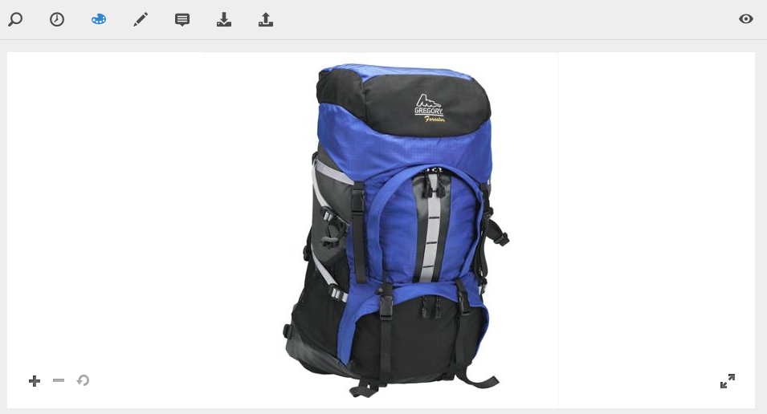

# Utilizzare Dynamic Media {#working-with-dynamic-media}

[Dynamic Media](https://business.adobe.com/it/products/experience-manager/assets/dynamic-media.html) consente di fornire risorse di marketing e merchandising visive avanzate su richiesta, scalabili automaticamente per l&#39;utilizzo su siti Web, mobili e social. Grazie a un insieme di risorse di origine primarie, Dynamic Media genera e distribuisce in tempo reale più varianti di rich content attraverso una rete globale, scalabile e ottimizzata per le prestazioni.

Dynamic Media offre esperienze di visualizzazione interattiva, tra cui zoom, 360° rotazione e video. Dynamic Media incorpora in modo univoco i flussi di lavoro della soluzione Adobe Experience Manager di gestione delle risorse digitali (Assets) per semplificare e semplificare il processo di gestione delle campagne digitali.

<!-- 
>[!NOTE]
>
>A Community article is available on [Working with Adobe Experience Manager and Dynamic Media](https://helpx.adobe.com/experience-manager/using/aem_dynamic_media.html). 
-->

## Cos’è Dynamic Media?

Dynamic Media in Adobe Experience Manager (AEM) as a Cloud Service è una soluzione potente progettata per aiutarti a gestire, distribuire e ottimizzare risorse rich media come immagini e video sulle piattaforme digitali. Trasforma i supporti statici in esperienze dinamiche e coinvolgenti, consentendo modifiche in tempo reale, come il ridimensionamento, il ritaglio e la regolazione della qualità in base al dispositivo o alle dimensioni dello schermo dell’utente. Con Dynamic Media, le risorse si adattano automaticamente per fornire la migliore esperienza visiva, su desktop, dispositivi mobili o tablet.

Uno dei principali vantaggi di Dynamic Media è la capacità di semplificare la gestione dei supporti. Non è necessario creare più versioni di immagini o video: Dynamic Media gestisce tutto fornendo il formato più appropriato per ogni situazione. Ad esempio, le aziende di e-commerce possono sfruttare le visualizzazioni di prodotto a 360 gradi o le immagini ingrandite per creare esperienze interattive, mentre i siti web ricchi di contenuti possono garantire uno streaming video veloce e di alta qualità. Ciò si traduce in tempi di caricamento più rapidi e in esperienze utente più coinvolgenti, che in ultima analisi portano a una maggiore soddisfazione dei clienti e a tassi di conversione migliori.

Dynamic Media si integra perfettamente con il sistema di gestione delle risorse digitali (DAM) in AEM, offrendo un’unica piattaforma per archiviare, organizzare e distribuire i contenuti multimediali. Questo approccio centralizzato semplifica la collaborazione tra i team e fornisce informazioni in tempo reale sulle prestazioni delle risorse. Sia che si tratti di produrre immagini accattivanti o di migliorare le interazioni degli utenti basate sui file multimediali, Dynamic Media contribuisce a ottimizzare i contenuti per qualsiasi canale, rivelandosi uno strumento essenziale per le aziende che desiderano migliorare la propria presenza digitale.

## Operazioni possibili con Dynamic Media {#what-you-can-do-with-dynamic-media}

Dynamic Media consente di gestire le risorse prima di pubblicarle. Le modalità di utilizzo delle risorse in generale sono descritte in dettaglio in [Utilizzo di Digital Assets](/help/assets/manage-digital-assets.md). Gli argomenti generali includono il caricamento, il download, la modifica e la pubblicazione delle risorse, la visualizzazione e la modifica delle proprietà e la ricerca delle risorse.

Le funzioni disponibili solo in Dynamic Media sono le seguenti:

* [Banner a carosello](carousel-banners.md)
* [Set di immagini](image-sets.md)
* [Immagini interattive](interactive-images.md)
* [Video interattivi](interactive-videos.md)
* [Set di file multimediali diversi](mixed-media-sets.md)
* [Immagini panoramiche](panoramic-images.md)
* [Set 360 gradi](spin-sets.md)
* [Video](video.md)
* [Distribuzione di Dynamic Media Assets](delivering-dynamic-media-assets.md)
* [Gestione di Assets](managing-assets.md)
* [Utilizzo delle visualizzazioni rapide per creare finestre popup personalizzate](custom-pop-ups.md)

Vedi anche [Configurare Dynamic Media](administering-dynamic-media.md).

<!-- 

OBSOLETE UNTIL INTEGRATING SCENE7 TOPIC GETS A MAJOR UPDATE
>[!NOTE]
>
>To understand the differences between using Dynamic Media and integrating Dynamic Media Classic with AEM, see [Dynamic Media Classic integration versus Dynamic Media](/help/sites-cloud/administering/integrating-scene7.md#aem-scene-integration-versus-dynamic-media).

-->

## Dynamic Media abilitato e Dynamic Media disabilitato {#dynamic-media-on-versus-dynamic-media-off}

Puoi verificare se Dynamic Media è abilitato (attivato) in base alle seguenti caratteristiche:

* Le rappresentazioni dinamiche sono disponibili quando si scaricano o si visualizzano in anteprima le risorse.
* Sono disponibili set di immagini, set 360 gradi, set di file multimediali diversi.
* Vengono creati rendering PTIFF.

Quando fai clic su una risorsa di immagine, la visualizzazione della risorsa cambia quando è attivato Dynamic Media. Dynamic Media utilizza i visualizzatori HTML5 on-demand.

### Rappresentazioni dinamiche {#dynamic-renditions}

Le rappresentazioni dinamiche, come i predefiniti immagine e visualizzatore (in **[!UICONTROL Dynamic]**), sono disponibili quando Dynamic Media è abilitato.

### Set di immagini Dynamic Media, set 360 gradi, set di file multimediali diversi {#image-sets-spins-sets-mixed-media-sets}

Se Dynamic Media è abilitato, sono disponibili set di immagini, set 360 gradi e set di file multimediali diversi.

### Rappresentazioni PTIFF abilitate per Dynamic Media {#ptiff-renditions}

Le risorse abilitate per Dynamic Media includono `pyramid.tiffs`.

### Modifica delle visualizzazioni delle risorse Dynamic Media {#asset-views-change}

Con Dynamic Media abilitato, è possibile eseguire lo zoom avanti e indietro facendo clic sui pulsanti `+` e `-`. È inoltre possibile selezionare di eseguire lo zoom in un&#39;area specifica. Ripristina consente di tornare alla versione originale e di visualizzare l&#39;immagine a schermo intero facendo clic sulle frecce diagonali. Dynamic Media abilitato viene visualizzato come segue:

Con Dynamic Media disabilitato è possibile eseguire lo zoom avanti e indietro e ripristinare le dimensioni originali:

