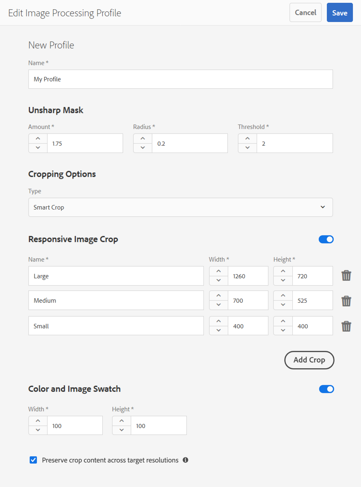

# Profili immagine di Dynamic Media {#image-profiles}

Quando caricate le immagini, potete ritagliare automaticamente l’immagine al momento del caricamento applicando un profilo immagine alla cartella.

>[!IMPORTANT]
>
>I profili immagine non sono applicabili ai file PDF.

## Crop options {#crop-options}

<!-- CQDOC-16069 for the paragraph directly below -->

Le coordinate di ritaglio avanzato dipendono dalle proporzioni. Vale a dire, per le diverse impostazioni di ritaglio avanzato in un profilo immagine, se le proporzioni sono le stesse per le dimensioni aggiunte nel profilo immagine, le stesse proporzioni vengono inviate agli elementi multimediali dinamici. Per questo motivo, Adobe consiglia di utilizzare la stessa area di ritaglio. In questo modo non si verificherà alcun impatto sulle diverse dimensioni utilizzate nel profilo immagine.

Tenete presente che ogni generazione di Smart Crop creata richiede un’elaborazione aggiuntiva. Ad esempio, l’aggiunta di più di cinque proporzioni di SmartCrop può determinare una lenta velocità di assimilazione delle risorse. Può anche causare un maggiore carico sui sistemi. Poiché potete applicare Smart Crop a livello di cartella, Adobe consiglia di usarlo nelle cartelle *solo* dove è necessario.

Potete scegliere tra due opzioni di ritaglio immagine. Potete anche automatizzare la creazione di campioni di colore e immagini.

<table>
 <tbody>
  <tr>
   <td><strong>Opzione</strong></td>
   <td><strong>Quando utilizzare</strong></td>
   <td><strong>Descrizione</strong></td>
  </tr>
  <tr>
   <td>Ritaglio pixel</td>
   <td>Ritagliate in massa le immagini in base solo alle dimensioni.</td>
   <td>
Per utilizzare questa opzione, selezionate Ritaglio <strong></strong> pixel dall’elenco a discesa Opzioni di ritaglio.
 
Per ritagliare dai lati di un’immagine, immettete il numero di pixel da ritagliare da ogni lato o da ciascun lato dell’immagine. La quantità di immagine che viene ritagliata dipende dall’impostazione ppi (pixel per pollice) nel file immagine.
 
Il ritaglio di pixel di un profilo immagine viene eseguito nel modo seguente:  

    <ul>
     <li>I valori sono In alto, In basso, A sinistra e A destra.</li>
     <li>In alto a sinistra viene considerato 0,0 e il ritaglio pixel viene calcolato da tale punto.</li>
     <li>Punto di partenza del ritaglio: A sinistra è X e In alto è Y</li>
     <li>Calcolo orizzontale: dimensione in pixel orizzontale dell’immagine originale meno sinistra e quindi meno destra.</li>
     <li>Calcolo verticale: altezza in pixel verticale meno in alto, quindi meno in basso in basso.</li>
    </ul> 
Ad esempio, supponete di avere un’immagine da 4000 x 3000 pixel. Vengono utilizzati i valori: Top=250, Bottom=500, Left=300, Right=700.
 
Dall’alto a sinistra (300.250) ritagliare utilizzando lo spazio di riempimento di (4000-300-700, 3000-250-500 o 3000.2250).
 </td>
  </tr>
  <tr>
   <td>Ritaglio avanzato</td>
   <td>Ritagliare in massa le immagini in base al loro punto focale visivo.</td>
   <td>
Smart Crop utilizza l'intelligenza artificiale di Adobe Sensei per automatizzare rapidamente il ritaglio delle immagini in massa. Smart Crop rileva e ritaglia automaticamente il punto focale di qualsiasi immagine per catturare il punto di interesse desiderato, indipendentemente dalle dimensioni dello schermo.
 
Per utilizzare Smart Crop, selezionate <strong>Smart Crop</strong> (Ritaglioavanzato) dall’elenco a discesa Opzioni di ritaglio, quindi a destra di Responsive Image Crop, attivate (attivate) la funzione.
 
Le dimensioni predefinite dei punti di interruzione, grandi, medi e piccoli, coprono in genere l’intera gamma di dimensioni che la maggior parte delle immagini vengono utilizzate su dispositivi mobili e tablet, desktop e banner. Se necessario, potete modificare i nomi predefiniti di Large, Medium e Small.
 
Per aggiungere altri punti di interruzione, fate clic su <strong>Aggiungi ritaglio</strong>; per eliminare un ritaglio, fate clic sull’icona Garbage Can.
 </td>
  </tr>
  <tr>
   <td>Campione immagine e colore</td>
   <td>Generare in massa un campione immagine per ciascuna immagine.</td>
   <td>
<strong>Nota</strong>: Lo Smart Swatch non è supportato in Dynamic Media Classic.
 
Individuate e generate automaticamente campioni di alta qualità dalle immagini di prodotto che mostrano colore o texture.
 
Per usare Campioni colore e immagine, selezionate <strong>Ritaglio</strong> avanzato dall’elenco a discesa Opzioni di ritaglio, quindi attivate la funzione a destra di Colore e Campione immagine. Immettete un valore in pixel nelle caselle di testo Larghezza e Altezza.
 
Anche se tutti i ritagli immagine sono disponibili dalla barra Rendering, i campioni vengono utilizzati solo tramite la funzione Copia URL. Per eseguire il rendering del campione sul sito, dovete usare un componente di visualizzazione personalizzato. (L’eccezione a questo è rappresentata dai banner carosello. Dynamic Media fornisce il componente di visualizzazione per il campione usato nei banner del carosello.
 
<strong>Utilizzo dei campioni immagine</strong>
 
L’URL per i campioni immagine è semplice. Ovvero:
 
<code>/is/image/company/&lt;asset_name&gt;:Swatch</code>
 
dove <code>:Swatch</code> viene aggiunta alla richiesta della risorsa.
 
<strong>Utilizzo dei campioni colore</strong>
 
Per usare i campioni colore, effettuate una <code>req=userdata</code> richiesta con le seguenti opzioni:
 
<code>/is/image/&lt;company_name&gt;/&lt;swatch_asset_name&gt;:Swatch?req=userdata</code>
 
Ad esempio, di seguito è riportata una risorsa campione in Dynamic Media Classic (Scene7):
 
<code>https://my.company.com:8080/is/image/DemoCo/Sleek:Swatch</code>
 
ed ecco l' <code>req=userdata</code> URL corrispondente della risorsa campione:
 
<code>https://my.company.com:8080/is/image/DemoCo/Sleek:Swatch?req=userdata</code>
 
La <code>req=userdata</code> risposta è la seguente:
 
<code class="code">SmartCropDef=Swatch
       SmartCropHeight=200.0
       SmartCropRect=0.421671,0.389815,0.0848564,0.0592593,200,200
       SmartCropType=Swatch
       SmartCropWidth=200.0
       SmartSwatchColor=0xA56DB2</code>
 
Potete anche richiedere una <code>req=userdata</code> risposta in formato XML o JSON, come negli esempi URL seguenti:
 
<code>https://my.company.com:8080/is/image/DemoCo/Sleek:Swatch?req=userdata,xml</code>

<code>SmartSwatchColor</code>

</td></tr></tbody></table>

## Maschera di contrasto {#unsharp-mask}

Usa **[!UICONTROL Maschera definizione dettagli]** per regolare con precisione un effetto filtro di nitidezza sull’immagine ricampionata verso il basso finale. Puoi controllare l’intensità dell’effetto, il raggio in pixel e una soglia di contrasto da ignorare. L’effetto utilizza le stesse opzioni del filtro “Maschera definizione dettagli” di Adobe Photoshop.

>[!NOTE]
>
>La maschera di contrasto viene applicata solo alle rappresentazioni ridimensionate nel PTIFF (piramide tiff) con downsampling superiore al 50%. Ciò significa che le rappresentazioni di grandi dimensioni all’interno del font non vengono influenzate da una maschera di contrasto, mentre le rappresentazioni di dimensioni più piccole, come le miniature, vengono modificate (e mostreranno la maschera di contrasto).

In Maschera **[!UICONTROL di contrasto]**, sono disponibili le seguenti opzioni di filtro:

<table>
 <tbody>
  <tr>
   <td><strong>Opzione</strong></td>
   <td><strong>Descrizione</strong></td>
  </tr>
  <tr>
   <td>Quantità</td>
   <td>Controlla la quantità di contrasto applicata ai pixel lungo i bordi. Il valore predefinito è 1,75. Per le immagini ad alta risoluzione, è possibile aumentare la risoluzione fino a 5. Considerate l'importo come una misura dell'intensità del filtro. L'intervallo è 0-5.</td>
  </tr>
  <tr>
   <td>Raggio</td>
   <td>Determina quanti pixel attorno al bordo vengono interessati dalla nitidezza. Per le immagini ad alta risoluzione, inserite un valore da 1 a 2. Un valore basso agisce solo sui pixel del bordo; un valore più elevato agisce su una fascia più ampia di pixel. Il valore adatto dipende dalle dimensioni dell'immagine. Il valore predefinito è 0.2. L'intervallo è compreso tra 0 e 250.</td>
  </tr>
  <tr>
   <td>Soglia</td>
   <td>
Determina l’intervallo di contrasto da ignorare quando viene applicato il filtro maschera di contrasto. In altre parole, questa opzione determina la differenza tra i pixel da rendere più nitidi rispetto all’area circostante, prima che vengano considerati pixel di un bordo e quindi resi più nitidi. Per evitare di introdurre disturbo, provate con valori compresi tra 0 e 255.
 </td>
  </tr>
 </tbody>
</table>

La nitidezza è descritta in [Immagini]di nitidezza (/help/assets/dynamic-media/assets/s7_sharpening_images.pdf).

## Creating Dynamic Media Image Profiles {#creating-image-profiles}

Per definire parametri di elaborazione avanzati per altri tipi di risorse, consulta [Configurazione dell’elaborazione](config-dm.md#configuring-asset-processing)delle risorse.

Consultate [Profili per elaborazione di metadati, immagini e video](/help/assets/dynamic-media/processing-profiles.md).

Consultate anche [Best practice per l’organizzazione delle risorse digitali per l’utilizzo dei profili](/help/assets/dynamic-media/best-practices-for-file-management.md)di elaborazione.

**Per creare profili immagine per file multimediali dinamici**

1. Tap the AEM logo and navigate to **[!UICONTROL Tools > Assets > Image Profiles]**.
1. Toccate **[!UICONTROL Crea]** per aggiungere un nuovo profilo immagine.
1. Immettete un nome di profilo e valori per maschera di contrasto, ritaglio o campione oppure per entrambi.

   Potrebbe essere utile utilizzare un nome di profilo specifico per lo scopo previsto. Ad esempio, se desiderate creare un profilo che genera solo i campioni, vale a dire se la funzione Smart Crop è disabilitata (disattivata) e se è attivata (attivata) l’opzione Colore e campione immagine, potete usare il nome di profilo &quot;Smart Swatches&quot;.

   Consulta anche la sezione [Opzioni di ritaglio avanzato e campione avanzato](#crop-options) e [Maschera definizione dettagli](#unsharp-mask).

   

1. Toccate **[!UICONTROL Salva]**. Il nuovo profilo creato viene visualizzato nell’elenco dei profili disponibili.

## Modifica o eliminazione di profili immagine per file multimediali dinamici {#editing-or-deleting-image-profiles}

1. Tap the AEM logo and navigate to **[!UICONTROL Tools > Assets > Image Profiles]**.
1. Selezionate il profilo immagine da modificare o rimuovere. Per modificarlo, selezionare **[!UICONTROL Modifica profilo]** elaborazione immagine. Per rimuoverlo, selezionate **[!UICONTROL Elimina profilo]** elaborazione immagine.

   

1. In caso di modifica, salvate le modifiche. Se eliminate, confermate che desiderate rimuovere il profilo.

## Applicazione di un profilo immagine per file multimediali dinamici alle cartelle {#applying-an-image-profile-to-folders}

Quando assegnate un profilo immagine a una cartella, tutte le sottocartelle ereditano automaticamente il profilo dalla cartella principale. Potete quindi assegnare un solo profilo immagine a una cartella. Considerate quindi attentamente la struttura delle cartelle in cui caricare, memorizzare, usare e archiviare le risorse.

Se a una cartella è stato assegnato un profilo immagine diverso, il nuovo profilo sostituisce quello precedente. Le risorse di cartella esistenti in precedenza restano invariate. Il nuovo profilo viene applicato alle risorse aggiunte successivamente alla cartella.

Le cartelle a cui è assegnato un profilo sono indicate nell&#39;interfaccia utente in base al nome del profilo visualizzato nella scheda.

<!-- When you add smart crop to an existing image profile, you need to re-trigger the [DAM Update Asset workflow](assets-workflow.md) if you want to generate crops for existing assets in your asset repository. -->

Potete applicare i profili immagine a cartelle specifiche o globalmente a tutte le risorse.

Potete rielaborare le risorse in una cartella che dispone già di un profilo immagine esistente modificato in seguito. Consulta [Rielaborazione delle risorse in una cartella dopo la modifica del profilo di elaborazione](/help/assets/dynamic-media/processing-profiles.md#reprocessing-assets).

### Applicazione dei profili immagine per elementi multimediali dinamici a cartelle specifiche {#applying-image-profiles-to-specific-folders}

Puoi applicare un profilo immagine a una cartella direttamente dal menu **[!UICONTROL Strumenti]** oppure, se ti trovi nella cartella, da **[!UICONTROL Proprietà]**. Questa sezione descrive come applicare i profili immagine alle cartelle con entrambe le soluzioni.

Le cartelle a cui è già stato assegnato un profilo sono indicate dalla visualizzazione del nome del profilo che è posto direttamente sotto il nome della cartella.

Potete rielaborare le risorse in una cartella che dispone già di un profilo video esistente modificato in seguito. Consulta [Rielaborazione delle risorse in una cartella dopo la modifica del profilo di elaborazione](/help/assets/dynamic-media/processing-profiles.md#reprocessing-assets).

#### Applicazione dei profili immagine per elementi multimediali dinamici alle cartelle dall’interfaccia utente Profili {#applying-image-profiles-to-folders-from-profiles-user-interface}

1. Tap the AEM logo and navigate to **[!UICONTROL Tools > Assets > Image Profiles]**.
1. Selezionate il profilo immagine da applicare a una o più cartelle.

   

1. Tap **[!UICONTROL Apply Processing Profile to Folder(s)]** and select the folder or multiple folders you want use to receive the newly uploaded assets and tap/click **[!UICONTROL Apply]**. Le cartelle a cui è già stato assegnato un profilo sono indicate dalla visualizzazione del nome del profilo che è posto direttamente sotto il nome della cartella.

#### Applicazione dei profili immagine per elementi multimediali dinamici alle cartelle da Proprietà {#applying-image-profiles-to-folders-from-properties}

1. Toccate il logo AEM e andate a **[!UICONTROL Risorse]** , quindi alla cartella a cui desiderate applicare un profilo immagine.
1. Sulla cartella, toccate il segno di spunta per selezionarlo, quindi toccate **[!UICONTROL Proprietà]**.
1. Tocca la scheda **[!UICONTROL Profili immagine]**. Seleziona il profilo dall’elenco a discesa **[!UICONTROL Nome profilo]**, quindi tocca **[!UICONTROL Salva e chiudi]**. Le cartelle a cui è già stato assegnato un profilo sono indicate dalla visualizzazione del nome del profilo che è posto direttamente sotto il nome della cartella.

   

### Applicazione di un profilo immagine per elementi multimediali dinamici a livello globale {#applying-an-image-profile-globally}

Oltre ad applicare un profilo a una cartella, puoi applicarne uno a livello globale in modo che a qualsiasi contenuto caricato in risorse AEM in qualsiasi cartella sia applicato il profilo selezionato.

Potete rielaborare le risorse in una cartella che dispone già di un profilo video esistente modificato in seguito. Consulta [Rielaborazione delle risorse in una cartella dopo la modifica del profilo di elaborazione](/help/assets/dynamic-media/processing-profiles.md#reprocessing-assets).

**Per applicare a livello globale** un profilo immagine per elementi multimediali dinamici:

1. Effettua una delle operazioni seguenti:

   * Individuate `https://&lt;AEM server&gt;/mnt/overlay/dam/gui/content/assets/foldersharewizard.html/content/dam` e applicate il profilo appropriato e toccate **[!UICONTROL Salva]**.

      

   * Passa a CRXDE Lite al seguente nodo: `/content/dam/jcr:content`.

      Aggiungete la proprietà `imageProfile:/conf/global/settings/dam/adminui-extension/imageprofile/<name of image profile>` e toccate **[!UICONTROL Salva tutto]**.

      

## Modifica del ritaglio avanzato o del campione avanzato di una singola immagine {#editing-the-smart-crop-or-smart-swatch-of-a-single-image}

Potete riallineare o ridimensionare manualmente la finestra di ritaglio avanzato di un’immagine per perfezionarne ulteriormente il punto focale.

Dopo aver modificato e salvato un ritaglio avanzato, la modifica viene propagata ovunque si utilizzi il ritaglio per le immagini specifiche.

Se necessario, potete eseguire nuovamente il ritaglio avanzato per generare di nuovo il raccolto aggiuntivo.

Consultate anche [Modifica del campione avanzato o avanzato di più immagini](#editing-the-smart-crop-or-smart-swatch-of-multiple-images).

**Per modificare il ritaglio avanzato o il campione avanzato di una singola immagine**:

1. Toccate il logo AEM e andate a **[!UICONTROL Risorse]**, quindi alla cartella a cui è stato applicato un profilo immagine di ritaglio avanzato o di campione avanzato.

1. Toccate la cartella per aprirne il contenuto.
1. Toccate l’immagine di cui desiderate regolare il ritaglio avanzato o il campione avanzato.
1. Nella barra degli strumenti, toccate **[!UICONTROL Smart Crop]**.

1. Effettua una delle operazioni seguenti:

   * Nell’angolo superiore destro della pagina, trascinate la barra di scorrimento verso sinistra o destra per aumentare o diminuire rispettivamente la visualizzazione dell’immagine.
   * Sull’immagine, trascinate una maniglia d’angolo per regolare la dimensione dell’area visibile del ritaglio o del campione.
   * Sull’immagine, trascinate la casella o il campione in una nuova posizione. Potete modificare solo i campioni immagine; i campioni colore sono statici.
   * Sopra l’immagine, toccate **[!UICONTROL Ripristina]** per annullare tutte le modifiche e ripristinare il ritaglio o il campione originale.

1. Nell’angolo superiore destro della pagina, toccate **[!UICONTROL Salva]**, quindi toccate **[!UICONTROL Chiudi]** per tornare alla cartella delle risorse.

## Modifica del ritaglio avanzato o del campione avanzato di più immagini {#editing-the-smart-crop-or-smart-swatch-of-multiple-images}

Dopo aver applicato a una cartella un profilo immagine contenente lo Smart Crop, a tutte le immagini in quella cartella viene applicato un ritaglio. Se necessario, potete riallineare o ridimensionare *manualmente* la finestra di ritaglio avanzato in più immagini per perfezionarne ulteriormente il punto focale.

Dopo aver modificato e salvato un ritaglio avanzato, la modifica viene propagata ovunque si utilizzi il ritaglio per le immagini specifiche.

Se necessario, potete eseguire nuovamente il ritaglio avanzato per generare di nuovo il raccolto aggiuntivo.

**Per modificare il ritaglio avanzato o il campione avanzato di più immagini**:

1. Toccate il logo AEM e andate a **[!UICONTROL Risorse]**, quindi a una cartella a cui è applicato un profilo immagine di ritaglio avanzato o campione avanzato.
1. Nella cartella, toccate l&#39;icona **[!UICONTROL Altre azioni]** (...), quindi toccate **[!UICONTROL Smart Crop]**.

1. Nella pagina **[!UICONTROL Modifica ritaglio]** avanzato, effettuate una delle seguenti operazioni:

   * Regolate le dimensioni di visualizzazione delle immagini sulla pagina.

      A destra dell’elenco a discesa del nome del punto di interruzione, trascinate la barra di scorrimento verso sinistra o destra per modificare le dimensioni della visualizzazione dell’immagine visualizzabile.

      

   * Filtrare l’elenco di immagini visualizzabili in base ai nomi dei punti di interruzione. Nell’esempio seguente, le immagini vengono filtrate sul nome del punto di interruzione &quot;Medium&quot;.

      Nell’angolo superiore destro della pagina, dall’elenco a discesa, selezionate un nome per punto di interruzione per filtrare le immagini visualizzate. (Vedete l’immagine qui sopra).

      

   * Ridimensionate la casella di ritaglio avanzato. Effettuate una delle seguenti operazioni:

      * Se l’immagine dispone solo di un ritaglio avanzato o di un campione avanzato, trascinate sull’immagine la maniglia d’angolo della casella di ritaglio per regolare le dimensioni dell’area visibile del ritaglio.
      * Se l’immagine dispone sia di un ritaglio avanzato che di un campione avanzato, trascinate sull’immagine la maniglia d’angolo della casella di ritaglio per regolare le dimensioni dell’area visibile del ritaglio. Oppure, toccate o fate clic sul campione avanzato sotto l’immagine (i campioni colore sono statici), quindi trascinate la maniglia d’angolo della casella di ritaglio per regolare la dimensione dell’area visibile del campione.
      

   * Spostate la casella di ritaglio avanzato. Effettuate una delle seguenti operazioni:

      * Se l’immagine dispone solo di un ritaglio avanzato o di un campione avanzato, trascinate la casella di ritaglio in una nuova posizione.
      * Se l’immagine dispone sia di un ritaglio avanzato che di un campione avanzato, trascinate la casella di ritaglio avanzato in una nuova posizione. Oppure, toccate o fate clic sul campione avanzato sotto l’immagine (i campioni colore sono statici), quindi trascinate la casella di ritaglio campione avanzato in una nuova posizione.
      

   * Annullate tutte le modifiche e ripristinate il ritaglio avanzato o il campione avanzato originale (applicabile solo alla sessione di modifica corrente).

      Toccate **[!UICONTROL Ripristina]** sopra l’immagine.

      

1. Near the upper-right corner of the page, tap **[!UICONTROL Save]**. quindi toccate **[!UICONTROL Chiudi]** per tornare alla cartella delle risorse.

## Rimozione di un profilo immagine dalle cartelle {#removing-an-image-profile-from-folders}

Quando rimuovete un profilo immagine da una cartella, tutte le sottocartelle ereditano automaticamente la rimozione del profilo dalla cartella principale. Tuttavia, l&#39;elaborazione dei file che si è verificata all&#39;interno delle cartelle rimane intatta.

Puoi rimuovere un profilo immagine da una cartella direttamente dal menu **[!UICONTROL Strumenti]** oppure, se ti trovi nella cartella, da **[!UICONTROL Proprietà]**. Questa sezione descrive come rimuovere i profili immagine dalle cartelle con entrambe le soluzioni.

### Rimozione dei profili immagine per elementi multimediali dinamici dalle cartelle tramite l’interfaccia utente Profili {#removing-image-profiles-from-folders-via-profiles-user-interface}

1. Tap the AEM logo and navigate to **[!UICONTROL Tools > Assets > Image Profiles]**.
1. Selezionate il profilo immagine da rimuovere da una o più cartelle.
1. Tocca **[!UICONTROL Rimuovi profilo elaborazione da cartelle]** e seleziona una o più cartelle da cui vuoi rimuovere il profilo, infine tocca **[!UICONTROL Rimuovi]**.

   Potete confermare che il profilo immagine non viene più applicato a una cartella perché il nome non viene più visualizzato sotto il nome della cartella.

### Rimozione dei profili immagine per elementi multimediali dinamici dalle cartelle tramite Proprietà {#removing-image-profiles-from-folders-via-properties}

1. Toccate il logo AEM, individuate le **[!UICONTROL risorse]** e quindi la cartella da cui desiderate rimuovere un profilo immagine.
1. Sulla cartella, toccate il segno di spunta per selezionarlo, quindi toccate **[!UICONTROL Proprietà]**.
1. Select the **[!UICONTROL Image Profiles]** tab.
1. From the **[!UICONTROL Profile Name]** drop-down list, select **[!UICONTROL None]**, then tap **[!UICONTROL Save &amp; Close]**.

   Le cartelle a cui è già stato assegnato un profilo sono indicate dalla visualizzazione del nome del profilo che è posto direttamente sotto il nome della cartella.
