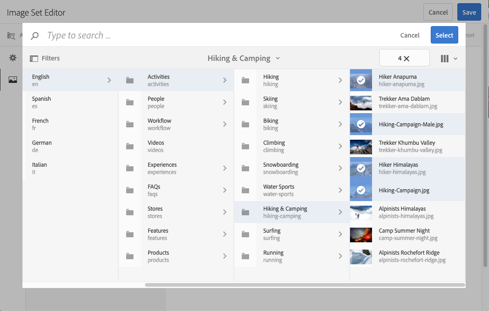

# Set di immagini {#image-sets}

I set di immagini offrono agli utenti un’esperienza di visualizzazione integrata, in cui gli utenti possono vedere diverse viste di un elemento facendo clic su una miniatura. I set di immagini consentono di presentare viste alternative di un elemento e il visualizzatore offre strumenti di zoom per esaminare attentamente le immagini.

I set di immagini sono indicati da un banner con la parola `IMAGESET`. Inoltre, se il set di immagini è pubblicato, la data di pubblicazione, indicata dall’icona **[!UICONTROL Mondo]**, è riportata sul banner. Inoltre, viene visualizzata l&#39;ultima data di modifica, indicata dall&#39;icona **[!UICONTROL Matita]**.

All’interno del set di immagini, puoi anche creare campioni creando un set di immagini e aggiungendo miniature.

Questa applicazione è utile quando si desidera mostrare un elemento con un colore, un motivo o una finitura diversi. Per creare un set di immagini con campioni di colore, è necessaria un’immagine per ogni colore, motivo o finitura diversi che si desidera presentare agli utenti. È inoltre necessario un campione di colore, motivo o finitura per ciascun colore, motivo o finitura.

Supponiamo, ad esempio, di voler presentare immagini di tappi con distinte di colore diverse; le bollette sono rosse, verdi e blu. In questo caso, sono necessarie tre riprese dello stesso cappello. Hai bisogno di un colpo con un rosso, uno con un verde, e uno con una bolletta blu. È inoltre necessario un campione di colore rosso, verde e blu. I campioni colore fungono da miniature su cui gli utenti possono fare clic nel visualizzatore dei set di campioni per visualizzare il tappo rosso, verde o blu-bollito.

>[!NOTE]
>
>Per informazioni sull’interfaccia utente Assets, consulta [Gestione delle risorse con l’interfaccia Touch](/help/assets/manage-digital-assets.md).

## Avvio rapido: Set di immagini {#quick-start-image-sets}

Per farti iniziare a lavorare velocemente:

1. Facoltativo. [Crea un ](/help/assets/dynamic-media/batch-set-presets-dm.md) predefinito per set di batch e applicalo a una nuova cartella in cui vengono caricate le immagini del set 360 gradi.

   Un Batch Set Preset può essere utile per automatizzare la creazione del set di immagini.

   >[!IMPORTANT]
   >
   >I set di batch vengono creati dall’IPS (Image Production System) come parte dell’inserimento delle risorse.

1. [Carica le immagini sorgente principali per più visualizzazioni.](#uploading-assets-in-image-sets)

   Carica le immagini per i set di immagini. Gli utenti possono ingrandire le immagini nel visualizzatore di set di immagini. Scegli le tue immagini con attenzione. Verifica che le immagini abbiano una dimensione maggiore che sia di almeno 2000 pixel. Experience Manager Assets supporta molti formati di file immagine, ma si consiglia di utilizzare immagini TIFF, PNG ed EPS senza perdita di dati.

1. [Crea set di immagini.](#creating-image-sets)

   In Set immagini, gli utenti fanno clic su miniature nel visualizzatore di set di immagini.

   Per creare un set di immagini in Assets, tocca o fai clic su **[!UICONTROL Crea > Set di immagini]**. Quindi, aggiungi le immagini e fai clic su **[!UICONTROL Salva]**.

   Consulta [Preparazione delle risorse dei set di immagini per il caricamento e il caricamento dei file](#uploading-assets-in-image-sets).

   Vedere [Uso dei selettori.](/help/assets/dynamic-media/working-with-selectors.md)

1. Aggiungi [predefiniti visualizzatore set di immagini](/help/assets/dynamic-media/managing-viewer-presets.md), a seconda delle esigenze.

   Gli amministratori possono creare o modificare i predefiniti visualizzatore di set di immagini. Per visualizzare il set di immagini con un predefinito visualizzatore, seleziona il set di immagini e, nell’elenco a discesa della barra a sinistra, seleziona **[!UICONTROL Visualizzatori]**.

   Per creare o modificare i predefiniti visualizzatore, consulta **[!UICONTROL Strumenti > Risorse > Predefiniti visualizzatore]**.

1. (Facoltativo) [Visualizzazione dei set di immagini](/help/assets/dynamic-media/image-sets.md#viewing-image-sets) creati utilizzando i predefiniti per set di batch.
1. [Anteprima set di immagini.](/help/assets/dynamic-media/previewing-assets.md)

   Seleziona il set di immagini e puoi visualizzarlo in anteprima. Per esaminare il set di immagini nel visualizzatore selezionato, tocca le icone delle miniature. Puoi scegliere diversi visualizzatori dal menu **[!UICONTROL Visualizzatori]**, disponibile dall’elenco a discesa della barra a sinistra.

1. [Pubblica set di immagini.](/help/assets/dynamic-media/publishing-dynamicmedia-assets.md)

   La pubblicazione di un set di immagini attiva l’URL e la stringa di incorporamento. Inoltre, devi [pubblicare qualsiasi predefinito visualizzatore personalizzato](/help/assets/dynamic-media/managing-viewer-presets.md) che hai creato. I predefiniti per visualizzatori sono già stati pubblicati.

1. [Collega gli URL all’](/help/assets/dynamic-media/linking-urls-to-yourwebapplication.md) applicazione Web o  [incorpora il visualizzatore](/help/assets/dynamic-media/embed-code.md) video o immagini.

   Experience Manager Assets crea chiamate URL per i set di immagini e li attiva dopo la pubblicazione dei set di immagini. Puoi copiare questi URL quando visualizzi l’anteprima delle risorse. In alternativa, puoi incorporarli sul tuo sito web.

   Seleziona il set di immagini, quindi seleziona **[!UICONTROL Visualizzatori]** dall’elenco a discesa della barra a sinistra.

   Consulta le sezioni [Collegamento di un set di immagini a una pagina web](/help/assets/dynamic-media/linking-urls-to-yourwebapplication.md) e [Incorporamento di un visualizzatore di video o immagini](/help/assets/dynamic-media/embed-code.md).

Per modificare i set di immagini, vedere [modifica dei set di immagini.](#editing-image-sets) Inoltre, puoi visualizzare e modificare le proprietà del set di  [immagini](/help/assets/manage-digital-assets.md#editing-properties).

In caso di problemi durante la creazione dei set, consulta Immagini e set in [Risoluzione dei problemi Dynamic Media](/help/assets/dynamic-media/troubleshoot-dm.md#images-and-sets).

## Caricamento delle risorse per i set di immagini {#uploading-assets-in-image-sets}

Per iniziare, carica le risorse immagine per i set di immagini. Gli utenti possono ingrandire le immagini nel visualizzatore di set di immagini. Scegli le tue immagini con attenzione. Assicurati che le immagini abbiano una dimensione massima di almeno 2000 pixel, per ottenere dettagli di zoom ottimali. Dynamic Media può eseguire il rendering delle immagini fino a 25 megapixel ciascuna. Ad esempio, è possibile utilizzare un&#39;immagine da 5000 x 5000 megapixel o qualsiasi altra combinazione di dimensioni fino a 25 megapixel.

I set di immagini supportano molti formati di file immagine, ma si consiglia di utilizzare immagini TIFF, PNG ed EPS senza perdita di dati.

È possibile caricare le immagini per i set di immagini come si farebbe [per caricare qualsiasi altra risorsa in Assets](/help/assets/manage-digital-assets.md#uploading-assets).

### Preparazione delle risorse del set di immagini per il caricamento {#preparing-image-set-assets-for-upload}

Prima di creare i set di immagini, accertati che le immagini siano delle dimensioni e del formato corretti.

Per creare un set di immagini a più visualizzazioni, è necessario che le immagini mostrino un elemento da diversi punti di vista o che mostrino diversi aspetti dello stesso elemento. L’obiettivo è quello di evidenziare le funzioni importanti di un elemento in modo che i visualizzatori abbiano un’immagine completa dell’aspetto o del funzionamento dell’elemento.

Poiché gli utenti possono eseguire lo zoom delle immagini in Set di immagini, accertati che le immagini abbiano una dimensione maggiore di almeno 2000 pixel. Experience Manager Assets supporta molti formati di file immagine, ma si consiglia di utilizzare immagini TIFF, PNG ed EPS senza perdita di dati.

>[!NOTE]
>
>Se usi le miniature per indicare i campioni di prodotto, procedi come segue:
>
>Crea vignette o diverse immagini della stessa immagine che la mostrano in diversi colori, motivi o finiture. È inoltre necessario disporre di file di miniatura corrispondenti ai diversi colori, motivi o finiture. Ad esempio, per presentare le miniature con un set di immagini che mostra la stessa giacca in nero, marrone e verde, è necessario:
>
>* Un colpo nero, marrone e verde della stessa giacca.
>* Miniatura di colore nero, marrone e verde.

## Creazione di set di immagini {#creating-image-sets}

Puoi creare i set di immagini tramite l’interfaccia utente o tramite l’API.

>[!NOTE]
>
>È inoltre possibile creare automaticamente i set di immagini tramite [predefiniti per set di batch](/help/assets/dynamic-media/batch-set-presets-dm.md).
>**Importante:** i set di batch vengono creati dall’IPS (Image Production System) come parte dell’inserimento delle risorse.

Quando aggiungi delle risorse al set, queste vengono aggiunte automaticamente in ordine alfanumerico. Puoi riordinare o ordinare manualmente le risorse dopo averle aggiunte.

>[!NOTE]
>
>I set di immagini non sono supportati per le risorse con &quot;,&quot; (virgola) nel nome file.

**Per creare un set di immagini**

1. In Adobe Experience Manager, tocca il logo Experience Manager per accedere alla console di navigazione globale.
1. Tocca **[!UICONTROL Navigazione > Risorse]**. Vai nel punto in cui vuoi creare un set di immagini, quindi tocca **[!UICONTROL Crea > Set di immagini]** per aprire la pagina Editor set di immagini.

   Puoi anche creare il set dall’interno di una cartella contenente le risorse.

   

1. Nella pagina Editor set di immagini, immetti un nome per il set di immagini nel campo **[!UICONTROL Titolo]** . Il nome viene visualizzato nel banner lungo il set di immagini. Facoltativamente, immetti una descrizione.

   

1. Effettua una delle seguenti operazioni:

   * Nell’angolo in alto a sinistra della pagina Editor set di immagini, tocca **[!UICONTROL Aggiungi risorsa]**.

   * Al centro della pagina Editor set di immagini, tocca **[!UICONTROL Tocca per aprire Selettore risorse]**.
   Tocca per selezionare le risorse da includere nel set di immagini. Le risorse selezionate dispongono di un’icona a forma di segno di spunta. Al termine, vicino all’angolo superiore destro della pagina, tocca **[!UICONTROL Seleziona]**.

   Con il Selettore risorse, puoi cercare le risorse digitando una parola chiave e toccando o facendo clic su **[!UICONTROL Invio]**. Per perfezionare i risultati della ricerca, puoi anche applicare i filtri. Puoi filtrare in base a percorso, raccolta, tipo di file e tag. Seleziona il filtro e tocca l’icona **[!UICONTROL Filtro]** nella barra degli strumenti. Per modificare la visualizzazione, tocca l’icona Visualizza e fai clic su **[!UICONTROL Vista a colonne]**, **[!UICONTROL Vista a schede]** o **[!UICONTROL Vista a elenco]**.

   Vedere [Uso dei selettori.](/help/assets/dynamic-media/working-with-selectors.md)

   

1. Quando aggiungi delle risorse al set, queste vengono aggiunte automaticamente in ordine alfanumerico. Puoi riordinare o ordinare manualmente le risorse dopo averle aggiunte.

   Se necessario, trascina l’icona Riordina di una risorsa a destra del nome del file della risorsa per riordinare le immagini verso l’alto o verso il basso nell’elenco dei set.

   

   Per modificare una miniatura o un campione, fai clic sull’icona **+** **miniatura** accanto all’immagine e individua la miniatura o il campione desiderato. Dopo aver selezionato tutte le immagini, fai clic su **[!UICONTROL Salva]**.

1. (Facoltativo) Effettua una delle seguenti operazioni:

   * Per eliminare un’immagine, selezionala e tocca **[!UICONTROL Elimina risorsa]**.

   * Per applicare un predefinito, tocca **[!UICONTROL Predefinito]** nell’angolo superiore destro della pagina, quindi seleziona un predefinito da applicare a tutte le risorse contemporaneamente.
   >[!NOTE]
   >
   >Quando crei il set di immagini, puoi modificare la miniatura del set di immagini. Oppure, puoi lasciare che l’Experience Manager selezioni automaticamente la miniatura in base alle risorse nel set di immagini. Per selezionare una miniatura, tocca **[!UICONTROL Cambia miniatura]** sopra il campo Titolo nella pagina Editor set di immagini. Quindi, seleziona un’immagine (puoi passare ad altre cartelle per trovare anche le immagini). Se hai selezionato una miniatura, quindi decidi di generare una miniatura dal set di immagini, seleziona **[!UICONTROL Passa a]** **[!UICONTROL Miniatura automatica]**.

1. Fai clic su **[!UICONTROL Salva]**. Il set di immagini appena creato viene visualizzato nella cartella in cui è stato creato.

## Visualizzazione dei set di immagini {#viewing-image-sets}

È possibile creare i set di immagini nell&#39;interfaccia utente o automaticamente utilizzando [predefiniti per set di batch](/help/assets/dynamic-media/batch-set-presets-dm.md).

>[!IMPORTANT]
>
>I set di batch vengono creati dall’IPS [Image Production System] come parte dell’inserimento delle risorse.

Tuttavia, i set creati utilizzando i predefiniti per set di batch, *not* vengono visualizzati nell&#39;interfaccia utente. Puoi visualizzare questi set in tre modi diversi. Questi metodi sono disponibili anche se hai creato i set di immagini nell’interfaccia utente di .

* Apri le proprietà di una risorsa. Le proprietà indicano le impostazioni di riferimento della risorsa selezionata o di un membro. Per visualizzare l’intero set, tocca il nome del set.

   

* Da un’immagine inclusa in un qualsiasi set. Seleziona il menu **[!UICONTROL Set]** per visualizzare i set di cui fa parte la risorsa.

   

* Dalla ricerca, puoi selezionare **[!UICONTROL Filtro]**, quindi espandere **[!UICONTROL Dynamic Media]** e selezionare **[!UICONTROL Set]**.

   La ricerca restituisce i set corrispondenti creati manualmente nell’interfaccia utente o automaticamente tramite i predefiniti per set di batch. Per i set automatizzati, la query di ricerca viene eseguita utilizzando &quot;Starts with&quot;. Questo criterio di ricerca è diverso dall’Experience Manager basato sull’utilizzo di &quot;Contains&quot;. L&#39;impostazione del filtro su **[!UICONTROL Set]** è l&#39;unico modo per cercare i set automatizzati.

   

>[!NOTE]
>
>Puoi visualizzare i set tramite l’interfaccia utente descritta in [Modifica dei set di immagini](#editing-image-sets).

## Modifica dei set di immagini {#editing-image-sets}

È possibile eseguire varie attività di modifica sui set di immagini, ad esempio:

* Aggiungi immagini al set di immagini.
* Riordinare le immagini nel set di immagini.
* Elimina le risorse nel set di immagini.
* Applica i predefiniti visualizzatore.
* Elimina il set di immagini.

**Per modificare i set di immagini**

1. Effettua una delle seguenti operazioni:

   * Passa il puntatore del mouse su una risorsa del set di immagini, quindi tocca **[!UICONTROL Modifica]** (icona a forma di matita).
   * Passa il puntatore del mouse su una risorsa del set di immagini, tocca **[!UICONTROL Seleziona]** (icona a forma di segno di spunta), quindi tocca **[!UICONTROL Modifica]** nella barra degli strumenti.
   * Tocca una risorsa Set di immagini, quindi tocca **[!UICONTROL Modifica]** (icona a forma di matita) nella barra degli strumenti.

1. Per modificare le immagini nel set di immagini, effettuate una delle seguenti operazioni:

   * Per riordinare le risorse, trascinate un’immagine in una nuova posizione (selezionate l’icona di riordino per spostare gli elementi).
   * Per ordinare gli elementi in ordine crescente o decrescente, fai clic sull’intestazione della colonna.
   * Per aggiungere una risorsa o aggiornare una risorsa esistente, fai clic su **[!UICONTROL Aggiungi risorsa]**. Passa a una risorsa, selezionala, quindi tocca **[!UICONTROL Seleziona]** vicino all’angolo in alto a destra della pagina.

      >[!NOTE]
      >
      >Se elimini l&#39;immagine utilizzata dall&#39;Experience Manager per la miniatura sostituendola con un&#39;altra immagine, viene comunque visualizzata la risorsa originale.
   * Per eliminare una risorsa, selezionala e tocca o fai clic su **[!UICONTROL Elimina risorsa]**.
   * Per applicare un predefinito, tocca **[!UICONTROL Predefinito]** nell’angolo superiore destro della pagina, quindi seleziona un predefinito visualizzatore.
   * Per aggiungere o modificare una miniatura, seleziona l’icona della miniatura accanto alla parte destra della risorsa. Passa alla nuova miniatura o alla risorsa campione, selezionala, quindi tocca **[!UICONTROL Seleziona]**.
   * Per eliminare un intero set di immagini, accedi al set di immagini, selezionalo e tocca **[!UICONTROL Elimina]**.

   >[!NOTE]
   >
   >È possibile modificare le immagini in un set di immagini. Passa al set e tocca **[!UICONTROL Membri set]** nella barra a sinistra. Per aprire la finestra di modifica, tocca l’icona a forma di matita su una risorsa.

1. Al termine della modifica, tocca **[!UICONTROL Salva]** .

## Anteprima dei set di immagini {#previewing-image-sets}

Consulta [Anteprima delle risorse](/help/assets/dynamic-media/previewing-assets.md).

## Pubblicazione dei set di immagini {#publishing-image-sets}

Consulta [Pubblicazione di risorse](/help/assets/dynamic-media/publishing-dynamicmedia-assets.md).
